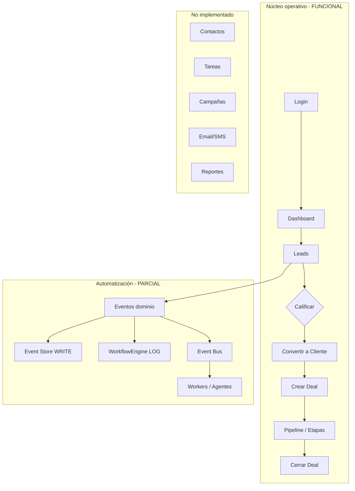

# Análisis premium de procesos — AutonomusFlow (AutonomusCRM)

| Campo | Valor |
|-------|-------|
| **Producto analizado** | **AutonomusFlow** (implementación: **AutonomusCRM**) |
| **Fecha** | 2026-05-27 |
| **Modo** | Solo análisis — sin cambios de código, BD ni migraciones |
| **Stack** | .NET 9, Razor Pages (UI humana), REST API + JWT, PostgreSQL, Redis opcional, RabbitMQ opcional, Worker separado |
| **Fuentes** | Código fuente, configuración, documentación interna (`ANALISIS_OPERACIONAL_REAL_CRM.md`, `PRODUCTION_FINAL_READINESS.md`), exploración estructural |
| **Alcance funcional** | Procesos de negocio CRM/automatización de punta a punta |

---

## 1. Resumen ejecutivo

**AutonomusFlow (AutonomusCRM)** es un CRM B2B multi-tenant con un **núcleo comercial operativo real**: login, leads, clientes, oportunidades (deals), usuarios, importación masiva, dashboard con datos de BD y API REST parcial. Un usuario de ventas **puede trabajar el día a día** creando prospectos, calificándolos, convirtiéndolos en clientes, abriendo deals y cerrándolos.

Sin embargo, **no cumple aún la promesa completa de “CRM + automatización autónoma”** para usuarios reales exigentes:

| Área | Madurez | Comentario |
|------|---------|------------|
| **CRM transaccional** (Lead → Cliente → Deal) | **Alta** | Flujo principal implementado y trazable vía eventos de dominio |
| **Usuarios y roles** | **Media-Alta** | CRUD real; matriz de permisos en UI incompleta; botón “Gestionar roles” engañoso |
| **Automatización (workflows, políticas, agentes)** | **Baja-Media** | Definiciones en BD; motor de acciones vacío; agentes en proceso separado |
| **Contactos, tareas, campañas** | **No existe / mínimo** | Sin módulo Contact; sin Tasks; campañas solo como enum de fuente |
| **Comunicaciones** | **No funcional** | Agente Communication solo registra logs |
| **Reportes** | **Parcial** | Dashboard + export JSON; sin módulo de reportes; métricas API sin UI |
| **Auditoría** | **Parcial** | Escritura en Event Store real; lectura en UI rota (deserialización) |
| **UX usuario no técnico** | **Media** | Mejora reciente AdminLTE; sigue vocabulario CRM/IA denso |

### Veredicto anticipado (detalle en §15)

**GO condicionado** — Apto para **piloto interno, demo comercial y staging** con el flujo Lead–Cliente–Deal. **No GO** para producción SaaS multi-tenant estricta ni para venta como “plataforma autónoma completa” sin completar auditoría, automatización y módulos faltantes.

---

## 2. Objetivo del análisis

Determinar si la aplicación permite ejecutar **procesos completos de CRM y automatización**, desde el ingreso del usuario hasta la gestión de clientes, oportunidades, seguimiento, automatizaciones, reportes y cierre — con trazabilidad, validaciones y experiencia comprensible para usuarios no técnicos.

Este documento evalúa **procesos y flujos reales de negocio**, no solo pantallas o cobertura de código.

---

## 3. Alcance revisado

### Incluido

- 43 páginas Razor y rutas asociadas
- 9 controladores API REST
- Dominio: Tenant, User, Lead, Customer, Deal + Workflow/Policy (capa aplicación)
- Worker `AutonomusCRM.Workers` y 7 agentes
- Event Store, Event Bus (InMemory / RabbitMQ), WorkflowEngine, PolicyEngine, DecisionEngine
- RBAC: 5 roles, middleware comercial, políticas ASP.NET Core
- Seed demo y configuración Development/Production
- Documentación previa de E2E y readiness

### Excluido (por reglas del encargo)

- Modificación de código o base de datos
- Ejecución formal de batería E2E en esta sesión (se referencia evidencia previa)
- Infraestructura VPS salvo impacto en procesos

### Nomenclatura

En mercado/documentación se usa **AutonomusFlow**; el repositorio y ensamblados se llaman **AutonomusCRM**. Son el mismo producto en este análisis.

---

## 4. Mapa general de módulos

### 4.1 Arquitectura (lenguaje de negocio)

```text
Usuario (navegador)
    → AutonomusCRM.API (páginas web + API)
        → Lógica de negocio (Application)
        → PostgreSQL (datos + eventos)
        → Event Bus → AutonomusCRM.Workers (agentes en segundo plano, si RabbitMQ + Worker activo)
```

### 4.2 Módulos existentes — qué es cada uno

| Módulo | Ruta(s) principal(es) | Para qué sirve (usuario no técnico) | Estado conexión al negocio |
|--------|------------------------|-------------------------------------|----------------------------|
| **Inicio de sesión** | `/Account/Login`, `/Account/Logout` | Entrar y salir del sistema de forma segura | **Conectado** |
| **Dashboard** | `/` (`Index`) | Ver resumen: leads, conversión, pipeline, acciones sugeridas | **Conectado** (datos reales) |
| **Dashboard legacy** | `/Dashboard` | Pantalla antigua no enlazada en menú | **Huérfana** |
| **Leads / Prospectos** | `/Leads`, `/Leads/Create`, `Details`, `Edit`, `Import`, `BulkActions` | Gestionar personas interesadas antes de ser clientes | **Conectado** |
| **Clientes** | `/Customers`, subpáginas | Gestionar empresas/personas ya convertidas | **Conectado** |
| **Pipeline / Oportunidades** | `/Deals`, subpáginas | Oportunidades de venta por etapas hasta cierre | **Conectado** |
| **Usuarios** | `/Users`, `Create`, `Edit`, `Roles`, `Import`, `BulkActions` | Quién puede usar el sistema y con qué rol | **Conectado** (Roles: solo consulta) |
| **Workflows** | `/Workflows`, `Create`, `Edit`, `Import` | Reglas “si pasa X, haz Y” (definición) | **Parcial** — no ejecuta acciones |
| **Políticas** | `/Policies`, subpáginas | Límites y reglas de negocio (definición) | **Desconectado** del runtime |
| **Agentes IA** | `/Agents` | Configurar automatización inteligente | **Parcial** — UI vs Worker desacoplados |
| **Auditoría** | `/Audit` | Ver historial de lo ocurrido en el sistema | **Parcial** — lectura rota |
| **Configuración** | `/Settings` | Ajustes del tenant (Admin/Manager) | **Conectado** |
| **Soporte / Salud** | `/Support` | Ver si BD, bus de eventos y caché responden | **Conectado** (técnico) |
| **API REST** | `/api/*`, Swagger (dev) | Integraciones externas | **Parcial** |
| **Worker** | Proceso `AutonomusCRM.Workers` | Tareas automáticas al crear leads/clientes/deals | **Condicional** (infra) |

### 4.3 Módulos de negocio **no existentes** (solicitados en alcance)

| Proceso esperado en CRM maduro | En AutonomusFlow |
|-------------------------------|------------------|
| **Contactos** (personas dentro de cuentas) | **No** — datos de contacto en Lead/Customer |
| **Tareas / actividades / recordatorios** | **No** — solo menciones en UI y TODOs |
| **Campañas de marketing** | **No** — solo `LeadSource.EmailCampaign` |
| **Comunicaciones** (email/SMS salientes) | **No** — logs únicamente |
| **Reportes analíticos** | **No** — dashboard + export puntuales |
| **Tickets de soporte al cliente** | **No** — página Support es health check |

---

## 5. Mapa de roles y permisos

### 5.1 Roles del sistema

| Rol | Perfil típico | Intención de negocio |
|-----|---------------|----------------------|
| **Admin** | TI / dueño del tenant | Control total, usuarios, configuración, tenants (API) |
| **Manager** | Jefe comercial | Gestión de equipo, configuración, escritura comercial |
| **Sales** | Ejecutivo de ventas | CRUD comercial diario |
| **Support** | Soporte | Lectura; bloqueado en POST comercial |
| **Viewer** | Dirección / auditoría lectura | Solo consulta; bloqueado en POST comercial |

**Credenciales demo (seed):** `{rol}@autonomuscrm.local` / `{Rol}123!` (ej. `Admin123!`).

### 5.2 Mecanismos de autorización

| Mecanismo | Qué hace | Limitación |
|-----------|----------|------------|
| `AuthorizeFolder("/")` | Exige login en casi todas las páginas | No diferencia lectura/escritura por módulo |
| `[Authorize(Roles = "Admin,Manager")]` | Users, Settings | OK en esas rutas |
| `[Authorize(Roles = "Admin,Manager,Sales")]` | Algunos POST de Leads | Parcial |
| **`CommercialWriteAuthorizationMiddleware`** | Bloquea POST en `/Leads`, `/Customers`, `/Deals`, `/Workflows`, `/Policies` si rol ∉ {Admin, Manager, Sales} | **Mitigación importante** |
| API `RequireAdmin` | Crear tenant/usuario vía API | OK |
| `RequireSameTenant` | Aislamiento por tenant | **Incompleto** — no compara recurso (`SameTenantHandler.cs` L19-24) |

### 5.3 Matriz resumida (efectiva hoy)

| Acción | Admin | Manager | Sales | Support | Viewer |
|--------|-------|---------|-------|---------|--------|
| Ver dashboard, listas | Sí | Sí | Sí | Sí | Sí |
| Crear/editar Lead, Cliente, Deal (POST) | Sí | Sí | Sí | **No** | **No** |
| Usuarios / Settings | Sí | Sí | No* | No | No |
| Workflows/Policies POST | Sí | Sí | Sí | No | No |
| Auditoría / Agentes (lectura) | Sí | Sí | Sí | Sí | Sí |

\*Sales no tiene atributo en Users/Settings pero tampoco acceso de negocio habitual.

### 5.4 Hallazgo crítico de permisos (mitigado parcialmente)

Antes del middleware comercial, Viewer podía POST si conocía URLs. Hoy el middleware reduce el riesgo en rutas comerciales. Persisten riesgos en **API REST** sin validación tenant-recurso estricta y en **multi-tenant** si hay varios tenants en la misma instancia.

---

## 6. Mapa de procesos principales



| # | Proceso | Estado global |
|---|---------|---------------|
| P01 | Inicio de sesión y navegación | **Completo** |
| P02 | Gestión de usuarios y roles | **Parcial** |
| P03 | Gestión de clientes/empresas | **Completo** |
| P04 | Gestión de contactos | **No funcional** (sin módulo) |
| P05 | Gestión de leads | **Completo** |
| P06 | Conversión lead → cliente / oportunidad | **Completo** |
| P07 | Gestión de oportunidades | **Completo** |
| P08 | Tareas y seguimiento | **No funcional** |
| P09 | Campañas / automatizaciones | **Parcial** |
| P10 | Comunicaciones | **No funcional** |
| P11 | Reportes y dashboards | **Parcial** |
| P12 | Configuración general | **Parcial** |
| P13 | Auditoría y seguridad | **Parcial** |
| P14 | Flujo diario usuario operativo (Sales) | **Parcial-Alto** |
| P15 | Flujo diario administrador | **Parcial-Alto** |

---

## 7. Análisis detallado por proceso

> Plantilla aplicada a cada proceso. Evidencia en rutas y archivos citados.

---

### P01 — Inicio de sesión y navegación inicial

| Campo | Detalle |
|-------|---------|
| **Objetivo** | Acceder al CRM de forma segura y llegar al panel principal |
| **Rol** | Todos |
| **Pantallas** | `/Account/Login`, `/Account/Logout`, `/Account/AccessDenied`, `/` |
| **Paso a paso esperado** | 1) Abrir login 2) Ingresar tenant/email/password 3) Entrar al dashboard 4) Navegar por menú lateral |
| **Paso a paso encontrado** | Igual; login vía `LoginCommand`; cookie HttpOnly; redirección a `/Index`; menú en `_Layout.cshtml` |
| **Datos** | TenantId, Email, Password — **C** en login |
| **Resultado esperado** | Sesión válida, tenant en claims |
| **Resultado real** | **Cumple**; MFA bloquea UI con mensaje “usar API verify-mfa” |
| **Validaciones existentes** | Credenciales, usuario activo, tenant |
| **Validaciones faltantes** | MFA en UI; recordar tenant en multi-tenant real |
| **Errores/riesgos** | Usuario debe pegar Tenant ID manualmente en demo |
| **Impacto** | Medio en SaaS multi-tenant |
| **Recomendación** | Autocompletar tenant por subdominio o email único global |
| **Prioridad** | Media |
| **Estado** | **Completo** (sin MFA UI) |

---

### P02 — Gestión de usuarios y roles

| Campo | Detalle |
|-------|---------|
| **Objetivo** | Dar de alta usuarios, asignar roles, controlar acceso |
| **Rol** | Admin, Manager |
| **Pantallas** | `/Users`, `/Users/Create`, `/Users/Edit/{id}`, `/Users/Roles`, Import, BulkActions |
| **Esperado** | CRUD usuarios; matriz permisos; cambio de roles |
| **Encontrado** | CRUD **real** (`UsersController`, page handlers); `/Users/Roles` **solo lectura** (conteos); botón “Gestionar roles” en `Users.cshtml` L227 → `alert('próximamente')` aunque existe `/Users/Roles` |
| **Datos** | Email, nombre, roles, activo — **C/R/U**; eliminación según handlers |
| **Trazabilidad** | Eventos de usuario si se disparan en comandos |
| **Riesgos** | Tabla “permisos por rol” decorativa; confusión UX |
| **Recomendación** | Enlazar botón a `/Users/Roles`; permitir editar roles desde Edit |
| **Prioridad** | Media |
| **Estado** | **Parcial** |

---

### P03 — Gestión de clientes (empresas/cuentas)

| Campo | Detalle |
|-------|---------|
| **Objetivo** | Mantener cartera de clientes activos con datos de contacto y riesgo |
| **Rol** | Admin, Manager, Sales (escritura); Support, Viewer (lectura) |
| **Pantallas** | `/Customers`, Create, Edit, Details, Import, BulkActions |
| **Esperado** | Alta, edición, búsqueda, segmentación, acciones IA |
| **Encontrado** | CRUD + import CSV/JSON + bulk status **real**; `RecordContact` en Details; botones “Segmentar” y “Aplicar acciones IA” → **alert placeholder** (`Customers.cshtml` L183-184) |
| **Datos** | Nombre, email, teléfono, empresa, estado, LTV, riesgo — **C/R/U/D** |
| **Cierre** | Cliente permanece en cartera; contacto registrado vía `LastContactAt` |
| **Estado** | **Completo** (sin segmentación/IA) |

---

### P04 — Gestión de contactos

| Campo | Detalle |
|-------|---------|
| **Objetivo** | Varias personas por cuenta, historial por contacto |
| **Encontrado** | **No hay entidad Contact ni rutas**; email/teléfono en Lead y Customer |
| **Estado** | **No funcional** |
| **Prioridad** | Alta (si el negocio es B2B con múltiples interlocutores) |
| **Recomendación** | Modelo Contact vinculado a Customer + UI en Details |

---

### P05 — Gestión de leads / prospectos

| Campo | Detalle |
|-------|---------|
| **Objetivo** | Captar, filtrar, calificar y priorizar prospectos |
| **Rol** | Admin, Manager, Sales |
| **Pantallas** | `/Leads` (+ subpáginas) |
| **Esperado** | Lista, filtros, score, calificación manual/automática |
| **Encontrado** | Lista con filtros; qualify vía Details POST y API `POST /api/leads/{id}/qualify`; score actualizado por **LeadIntelligenceAgent** en Worker (no en UI manual) |
| **Datos** | Lead — **C/R/U/D**; estados enum `New…Unqualified` |
| **Botones rotos** | “Aprobar acciones IA” era alert (removido en UI reciente en parte); export JSON **real** |
| **Estado** | **Completo** |

---

### P06 — Conversión lead → cliente u oportunidad

| Campo | Detalle |
|-------|---------|
| **Objetivo** | Pasar prospecto calificado a cliente y abrir oportunidad |
| **Rol** | Admin, Manager, Sales |
| **Pantallas** | `/Leads/Details/{id}` |
| **Esperado** | Un clic convierte; deal opcional; trazabilidad |
| **Encontrado** | `OnPostConvertToCustomerAsync` crea Customer + `ConvertToCustomer` en lead → redirect `/Customers/Details/{id}`; `OnPostCreateDealAsync` crea customer si falta + deal → `/Deals/Details/{id}` — **real** (`Details.cshtml.cs` L68-157) |
| **Eventos** | `LeadConvertedToCustomerEvent`, `CustomerCreatedEvent`, `DealCreatedEvent` |
| **Gap** | Convertir no exige estado Qualified (regla de negocio opcional) |
| **Estado** | **Completo** |

---

### P07 — Gestión de oportunidades comerciales (deals)

| Campo | Detalle |
|-------|---------|
| **Objetivo** | Gestionar pipeline hasta ganar/perder |
| **Rol** | Admin, Manager, Sales |
| **Pantallas** | `/Deals`, Details, Edit, Import, BulkActions |
| **Esperado** | Etapas, probabilidad, cierre, simulación IA |
| **Encontrado** | Update stage/probability/close **real** en Details; API `PUT stage`, `POST close`; botones “Simular escenarios” y “Aprobar acciones” → **alert** (`Deals.cshtml` L244-245) |
| **Datos** | Deal — **C/R/U**; cierre con `CloseDealCommand` / `LoseDeal` |
| **Estado** | **Completo** (sin simulación IA) |

---

### P08 — Tareas, actividades y recordatorios

| Campo | Detalle |
|-------|---------|
| **Objetivo** | Seguimiento diario: llamar, enviar propuesta, reunión |
| **Encontrado** | Sin entidad Task/Activity; workflow action `CreateTask` = TODO en `WorkflowEngine.cs` L90-92 |
| **Estado** | **No funcional** |
| **Prioridad** | **Crítica** para adopción CRM clásica |
| **Recomendación** | Módulo Activities con vencimiento y asignación a usuario |

---

### P09 — Campañas y automatizaciones

| Campo | Detalle |
|-------|---------|
| **Objetivo** | Campañas marketing y reglas automáticas |
| **Encontrado** | **Workflows**: CRUD + triggers en JSON; ejecución incrementa contador pero **acciones vacías**; **Policies**: CRUD sin `PolicyEngine` invocado; **Agentes**: config guardada; ejecución requiere Worker+RabbitMQ |
| **Estado** | **Parcial** |
| **Prioridad** | Alta para posicionamiento “Autonomus” |

---

### P10 — Comunicaciones e integraciones

| Campo | Detalle |
|-------|---------|
| **Objetivo** | Emails/SMS automáticos al crear lead/cliente |
| **Encontrado** | `CommunicationAgent` solo `_logger` + TODOs; sin SMTP/SendGrid |
| **Estado** | **No funcional** |
| **Prioridad** | Alta si promesa comercial incluye outreach |

---

### P11 — Reportes, métricas y dashboards

| Campo | Detalle |
|-------|---------|
| **Objetivo** | KPIs, reportes exportables, series temporales |
| **Encontrado** | `/Index` KPIs **reales**; `/Dashboard` **huérfano** y estático; `/Audit` “Generar reporte” → alert; API `MetricsController` sin UI Razor |
| **Estado** | **Parcial** |
| **Prioridad** | Media |

---

### P12 — Configuración general del sistema

| Campo | Detalle |
|-------|---------|
| **Objetivo** | Parámetros del tenant, export/import configuración |
| **Rol** | Admin, Manager |
| **Pantallas** | `/Settings` |
| **Encontrado** | Guardado settings JSON **real**; “Gestionar tenant” → alert (`Settings.cshtml` L224) |
| **Estado** | **Parcial** |

---

### P13 — Auditoría, trazabilidad y seguridad

| Campo | Detalle |
|-------|---------|
| **Objetivo** | Ver quién hizo qué y cuándo; cumplimiento |
| **Encontrado** | **Escritura**: `EventStore.SaveEventAsync` en cada dispatch — **OK**; **Lectura**: `DeserializeEvents` retorna lista vacía (`EventStore.cs` L101-117); UI con KPIs hardcodeados y fila demo siempre visible (`Audit.cshtml`); export puede generar `[]` |
| **Seguridad adicional** | Rate limit 200 req/min; headers seguridad; JWT + cookies |
| **Estado** | **Parcial** (grave en lectura) |
| **Prioridad** | **Crítica** para compliance |

---

### P14 — Flujo diario usuario operativo (Sales)

| Paso | Acción | ¿Funciona? |
|------|--------|------------|
| 1 | Login como `sales@…` | Sí |
| 2 | Ver dashboard y prioridades | Sí (datos reales) |
| 3 | Crear lead | Sí |
| 4 | Calificar lead | Sí (Details → Calificar) |
| 5 | Convertir a cliente | Sí |
| 6 | Crear deal y mover etapas | Sí |
| 7 | Cerrar deal ganado | Sí |
| 8 | Registrar tarea de seguimiento | **No** |
| 9 | Enviar email automático | **No** |
| 10 | Ver auditoría del día | **No** (lista vacía) |

**Estado:** **Parcial** — núcleo ventas OK; seguimiento/comunicación/auditoría no.

---

### P15 — Flujo diario administrador

| Paso | Acción | ¿Funciona? |
|------|--------|------------|
| 1 | Login Admin | Sí |
| 2 | Crear usuario Sales | Sí |
| 3 | Revisar roles | Solo lectura en `/Users/Roles` |
| 4 | Configurar agentes | Guarda config; estado “activo” no verifica Worker |
| 5 | Definir workflow | Guarda; no ejecuta acciones |
| 6 | Revisar auditoría global | UI no muestra eventos reales |
| 7 | Exportar configuración | Sí (Settings/Audit export parcial) |

**Estado:** **Parcial**

---

## 8. Flujos funcionales de punta a punta

### 8.1 Flujo comercial dorado (implementado)

```text
Login → Dashboard (/Index)
  → Crear Lead (/Leads/Create)           [LeadCreatedEvent]
  → Calificar (/Leads/Details?handler=Qualify) [LeadQualifiedEvent]
  → Convertir a Cliente (POST Convert)   [LeadConverted + CustomerCreated]
  → Crear Deal (modal o /Deals/Create)   [DealCreatedEvent]
  → Cambiar etapa/probabilidad (Details) [DealStageChanged / ProbabilityUpdated]
  → Cerrar deal (POST Close)             [DealClosedEvent]
```

**Trazabilidad:** eventos persistidos en tabla `DomainEvents` (JSON). **Lectura humana** en `/Audit` falla por deserialización.

### 8.2 Flujo de automatización (diseñado vs real)

```text
Evento dominio
  → DomainEventDispatcher
      → EventStore.Save          ✅
      → WorkflowEngine.Execute   ⚠️ (sin acciones)
      → PolicyEngine             ❌ (no invocado)
      → EventBus.Publish         ✅/⚠️ (InMemory en dev = no llega a Workers)
  → Worker (si RabbitMQ)
      → LeadIntelligenceAgent    ✅ score
      → CustomerRiskAgent        ✅ risk
      → DealStrategyAgent        ⚠️ metadata
      → CommunicationAgent       ❌ logs
```

### 8.3 Flujo de importación masiva

Rutas: `/Leads/Import`, `/Customers/Import`, `/Deals/Import`, etc. — **funcional** según handlers y pruebas E2E previas (CSV/JSON). Cierra con listado actualizado y mensajes TempData.

---

## 9. Brechas funcionales detectadas

| ID | Brecha | Módulo | Prioridad |
|----|--------|--------|-----------|
| B01 | Sin módulo Contactos | CRM | Alta |
| B02 | Sin tareas/actividades | Seguimiento | Crítica |
| B03 | Workflow acciones no ejecutan | Automatización | Crítica |
| B04 | PolicyEngine desconectado | Gobernanza | Alta |
| B05 | DecisionEngine sin uso | IA | Media |
| B06 | Auditoría UI no lista eventos | Compliance | Crítica |
| B07 | Agentes requieren Worker+RabbitMQ; dev InMemory | Infra | Alta |
| B08 | UI Agentes muestra estado no verificado | Confianza | Media |
| B09 | Comunicaciones no implementadas | Ventas | Alta |
| B10 | Sin campañas | Marketing | Alta |
| B11 | Reportes dedicados ausentes | Dirección | Media |
| B12 | `/Dashboard` huérfano | UX | Baja |
| B13 | Botones `alert('próximamente')` en 6+ pantallas | UX | Media |
| B14 | API GET by id stub (Leads, Deals, Users) | Integraciones | Media |
| B15 | SameTenant no compara recurso | Seguridad multi-tenant | Crítica |
| B16 | MFA solo API, no UI | Seguridad | Media |

---

## 10. Riesgos operativos

| Riesgo | Descripción | Probabilidad | Impacto |
|--------|-------------|--------------|---------|
| Usuario confía en “IA activa” | UI Agents dice activo sin Worker | Alta | Medio |
| Auditoría vacía en incidente | No se puede investigar | Media | Alto |
| Ventas sin recordatorios | Oportunidades se enfrían | Alta | Alto |
| Demo con un solo tenant | Falsa sensación multi-tenant | Media | Medio |
| Importación masiva sin validación fuerte | Datos basura en CRM | Media | Medio |

---

## 11. Riesgos técnicos

| Riesgo | Evidencia |
|--------|-----------|
| Deserialización Event Store | `EventStore.cs` TODO |
| Event bus split brain | API InMemory vs Worker RabbitMQ |
| Sin optimistic concurrency | Última escritura gana |
| Workers no desplegados | Docker compose VPS puede omitir build workers |
| GlobalTypeMapper Npgsql obsolete | Warning compilación |

---

## 12. Riesgos de experiencia de usuario

| Audiencia | Riesgo |
|-----------|--------|
| **Usuario no técnico** | Términos: Lead, Deal, Workflow, Tenant ID, MFA |
| **Todos** | Botones que muestran alert en lugar de acción |
| **Admin** | Auditoría con números falsos + fila demo |
| **Ventas** | Demasiada información IA en pantallas legacy no migradas (Customers/Deals aún con paneles laterales densos) |

**Nota:** Dashboard y Leads recientes mejoraron jerarquía visual (AdminLTE, secciones colapsables).

---

## 13. Recomendaciones priorizadas

### Críticas (antes de producción SaaS)

1. **Implementar deserialización de eventos** y limpiar UI Audit (quitar stats hardcodeados y fila demo).
2. **Completar SameTenant** comparando tenant del recurso en API y queries.
3. **Ejecutar acciones mínimas en WorkflowEngine** (UpdateStatus, Assign) o ocultar módulo hasta que existan.
4. **Módulo de tareas** o integración calendario básica.

### Altas (30-60 días)

5. Conectar **PolicyEngine** al dispatcher o documentar como “solo definición”.
6. Documentar y automatizar despliegue **API + Worker + RabbitMQ** unificado.
7. **Contactos** por customer.
8. Eliminar o implementar **todos los botones placeholder**.
9. Canal de **comunicación** (email transaccional mínimo).

### Medias

10. Reportes exportables (PDF/Excel) desde dashboard.
11. MFA en Razor Pages.
12. Completar API GET by id.
13. Eliminar `/Dashboard` o redirigir a `/Index`.

### Bajas

14. Métricas time-series en UI.
15. DecisionEngine: integrar o remover del DI.

---

## 14. Checklist de producción

| Ítem | ¿Listo? |
|------|---------|
| Login/logout estable | ✅ |
| RBAC escritura comercial (middleware) | ✅ |
| Tenant en claim (PageModelTenantExtensions) | ✅ |
| CRUD Lead/Customer/Deal | ✅ |
| Conversión lead → cliente → deal | ✅ |
| Importación masiva | ✅ |
| HTTPS / HSTS producción | ✅ (config) |
| Seed deshabilitado en prod | ✅ |
| Worker + RabbitMQ en prod | ⚠️ Verificar deploy |
| Auditoría consultable | ❌ |
| Workflows ejecutan acciones | ❌ |
| Contactos / Tareas | ❌ |
| Email/SMS | ❌ |
| Multi-tenant aislamiento estricto | ❌ |
| MFA UI | ❌ |
| Documentación usuario final | ❌ |
| Pruebas E2E P0 | ✅ (evidencia previa local) |

---

## 15. Veredicto final

### **GO condicionado**

| Escenario | Veredicto |
|-----------|-----------|
| Piloto interno ventas B2B (1 tenant, flujo lead-deal) | **GO** |
| Demo inversor / cliente (núcleo CRM) | **GO** con script guiado |
| Producción SaaS multi-tenant + compliance | **NO GO** hasta B06, B15, B03 |
| Producto “automatización autónoma completa” | **NO GO** hasta Workers, workflows, comunicaciones |

**Condiciones del GO:**

1. Desplegar **Worker** con **RabbitMQ** si se prometen agentes.
2. No prometer **auditoría visual**, **campañas**, **tareas** ni **email** hasta implementados.
3. Usar roles **Sales/Manager** con guía de 1 página.
4. Un solo tenant productivo hasta cerrar SameTenant.

---

## 16. Plan de acción para estabilizar la aplicación

### Fase 1 — Confianza operativa (2-3 semanas)

| # | Acción | Entregable |
|---|--------|------------|
| 1.1 | Arreglar `DeserializeEvents` + pruebas con 10 eventos reales | Audit lista y export con datos |
| 1.2 | Quitar placeholders `alert()` o enlazar rutas reales | Lista en §9 B13 cerrada |
| 1.3 | Completar `SameTenantHandler` en API | Test cross-tenant negativo |
| 1.4 | Documentar “cómo arrancar API+Worker” | `DESARROLLO_VISUAL_STUDIO.md` ampliado |

### Fase 2 — CRM completo (4-6 semanas)

| # | Acción | Entregable |
|---|--------|------------|
| 2.1 | Entidad **Activity/Task** + UI en Lead/Deal/Customer Details | Seguimiento diario |
| 2.2 | Entidad **Contact** opcional | B2B multi-persona |
| 2.3 | Workflow: implementar `UpdateStatus` y `Assign` | Automatización creíble |
| 2.4 | Invocar **PolicyEngine** en dispatch | Políticas con efecto |

### Fase 3 — Autonomía y comunicación (6-8 semanas)

| # | Acción | Entregable |
|---|--------|------------|
| 3.1 | Email provider (SMTP/SendGrid) + CommunicationAgent | Bienvenida lead/cliente |
| 3.2 | Health Agentes ↔ Worker heartbeat en `/Agents` | Estado real |
| 3.3 | Reportes CSV desde dashboard | Dirección comercial |
| 3.4 | MFA en UI o deshabilitar flag en demo | Sin callejón MFA |

### Fase 4 — Producción SaaS (continuo)

| # | Acción |
|---|--------|
| 4.1 | Tests multi-tenant (2 tenants, 2 admins) |
| 4.2 | RowVersion en agregados críticos |
| 4.3 | Pen test API JWT |
| 4.4 | Runbook VPS + backup PostgreSQL |

---

## Anexo A — Inventario de rutas Razor (43)

`Index`, `Dashboard`, `Leads` (+6), `Customers` (+6), `Deals` (+6), `Users` (+6), `Workflows` (+4), `Policies` (+4), `Agents`, `Audit`, `Settings`, `Support`, `Account` (3), `Error`.

## Anexo B — API REST resumida

| Prefijo | Operaciones reales | Stubs |
|---------|-------------------|-------|
| `api/Auth` | login, verify-mfa, refresh | — |
| `api/Leads` | POST, GET list, POST qualify | GET `{id}` |
| `api/Customers` | POST, GET, PUT status | — |
| `api/Deals` | POST, GET, PUT stage, POST close | GET `{id}` |
| `api/Users` | POST (admin), POST enable-mfa | GET `{id}` |
| `api/Tenants` | POST, GET | — |
| `api/Workflows` | GET list, GET id | — |
| `api/Metrics` | timeseries | sin UI |
| `api/Health` | health, metrics | — |

## Anexo C — Botones sin funcionalidad (evidencia `alert`)

| Pantalla | Archivo | Texto aproximado |
|----------|---------|------------------|
| Workflows | `Workflows.cshtml` | historial, optimizaciones |
| Policies | `Policies.cshtml` | historial |
| Deals | `Deals.cshtml` | simular, aprobar |
| Customers | `Customers.cshtml` | segmentar, acciones IA |
| Users | `Users.cshtml` | gestionar roles |
| Settings | `Settings.cshtml` | gestionar tenant |
| Audit | `Audit.cshtml` | generar reporte, ver detalle |

## Anexo D — Referencias de código clave

| Tema | Archivo |
|------|---------|
| Workflow sin acciones | `AutonomusCRM.Infrastructure/Automation/WorkflowEngine.cs` |
| Eventos no deserializados | `AutonomusCRM.Infrastructure/Persistence/EventStore/EventStore.cs` |
| SameTenant incompleto | `AutonomusCRM.Application/Authorization/Handlers/SameTenantHandler.cs` |
| Middleware comercial | `AutonomusCRM.API/Middleware/CommercialWriteAuthorizationMiddleware.cs` |
| Tenant en páginas | `AutonomusCRM.API/Infrastructure/PageModelTenantExtensions.cs` |
| Conversión lead | `AutonomusCRM.API/Pages/Leads/Details.cshtml.cs` |
| Seed demo | `AutonomusCRM.Infrastructure/Persistence/Seed/DatabaseSeeder.cs` |

---

*Documento generado por análisis estático y revisión arquitectónica. No sustituye prueba de regresión en el entorno objetivo del cliente. Para evidencia de ejecución reciente ver `PRODUCTION_FINAL_READINESS.md` y `RESULTADOS_PRUEBAS_E2E_FINAL.md`.*
