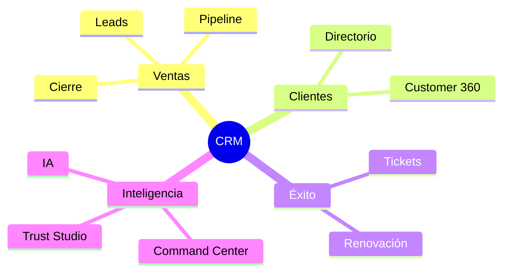
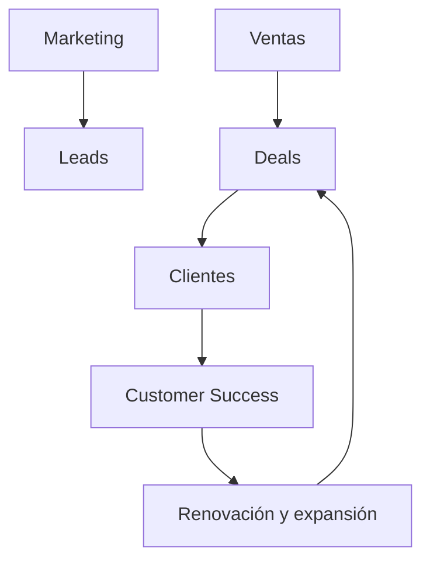
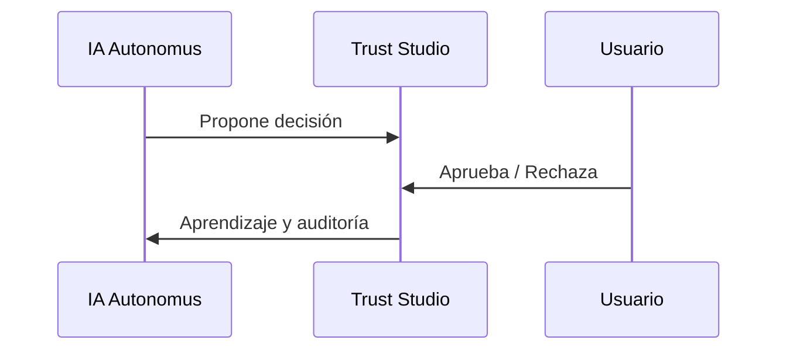
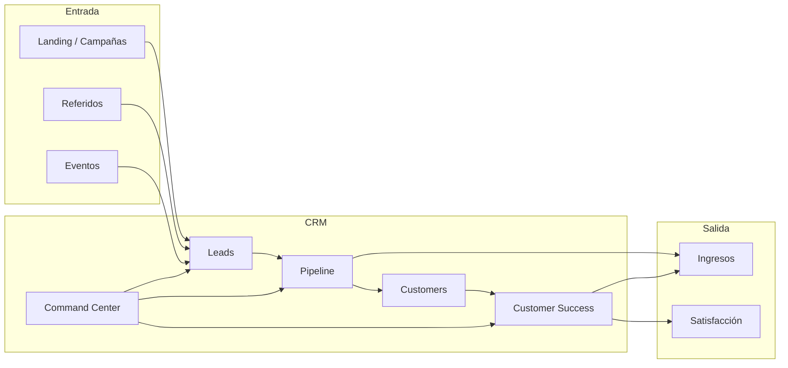
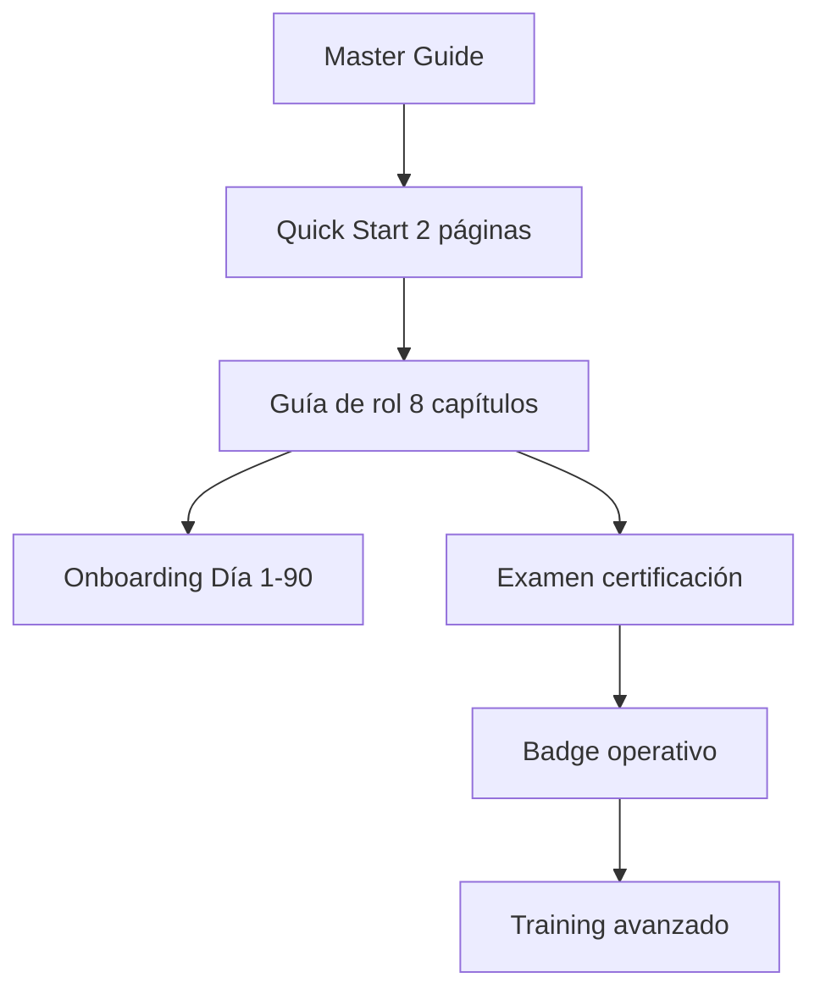

# AUTONOMUSCRM ACADEMY — Master Guide

> **Visión:** Convertir a cualquier colaborador sin experiencia previa en un operador productivo de AutonomusCRM en menos de 90 días, con certificación por rol.

---

## 1. ¿Qué es un CRM?

Un **Customer Relationship Management (CRM)** es el sistema donde vive la relación completa entre tu empresa y sus clientes potenciales y activos.

| Sin CRM | Con AutonomusCRM |
|---------|------------------|
| Información en emails y hojas sueltas | Una fuente de verdad compartida |
| Forecast "a ojo" | Pipeline medible y auditable |
| Clientes olvidados post-venta | Customer Success proactivo |
| Decisiones reactivas | IA + humanos en bucle controlado |

---

## 2. Revenue Operations (RevOps)

**RevOps** alinea ventas, marketing y éxito del cliente bajo métricas comunes de ingresos.

En AutonomusCRM: **Leads → Deals → Customers → Customer Success → Revenue OS** forman este ciclo.

---

## 3. Customer Success

Customer Success no es "soporte técnico". Es **garantizar que el cliente logre valor** y renueve.

| Fase | Objetivo | Módulo AutonomusCRM |
|------|----------|---------------------|
| Onboarding | Primer valor en 30 días | Customer 360 + Tasks |
| Adopción | Uso constante | Playbooks |
| Renovación | Proteger MRR | Customer Success OS |
| Expansión | Crecer cuenta | Deals + IA |

---

## 4. IA aplicada a negocios

La IA en AutonomusCRM **no reemplaza** tu criterio. **Amplifica** detección y ejecución:

1. **Detecta** — deals en riesgo, anomalías, oportunidades.
2. **Sugiere** — próximos pasos vía Workforce/Agents.
3. **Ejecuta con supervisión** — Trust Studio (Human-in-the-Loop).

**Riesgos a gestionar:** falsos positivos, automatización sin política, apruebas masivas sin leer.

---

## 5. Cómo funciona AutonomusCRM — Flujo del negocio

### 5.1 Arquitectura de negocio (no técnica)

### 5.2 Módulos por propósito de negocio

| Área | Pantallas | Para qué sirve |
|------|-----------|----------------|
| **Mando** | Command, Trust Studio, Workforce | Priorizar, supervisar IA, automatizar |
| **Ingresos** | Revenue OS, Executive OS, Deals | Medir, proyectar, cerrar |
| **Relación** | Customers, Customer 360, Leads | Conocer y captar |
| **Post-venta** | Customer Success, Tasks | Retener y expandir |
| **Plataforma** | Users, Policies, Audit, Settings | Gobierno y cumplimiento |

### 5.3 Roles y responsabilidad

| Rol | Mandato principal |
|-----|-------------------|
| SuperAdmin / Admin | Gobierno, usuarios, políticas |
| Manager | Pipeline del equipo, forecast |
| Sales | Prospección, calificación, cierre |
| Support | Tickets, renovación, churn |
| Viewer | Inteligencia sin modificar datos |

---

## 6. Ruta de aprendizaje recomendada

| Semana | Entregable | Resultado |
|--------|------------|-----------|
| 1 | Master + Quick Start + Cap 1-2 | Autonomía de navegación |
| 2 | Cap 3-4 + escenarios | Primera operación real supervisada |
| 3 | Cap 5-7 + shadowing | Calidad de datos y uso de IA |
| 4 | Cap 8 + examen | Certificación operativa |

---

## 7. Principios de adopción enterprise

1. **Un registro, una verdad** — Si no está en el CRM, no ocurrió.
2. **Contexto antes de acción** — Customer 360 antes de cada interacción importante.
3. **IA con responsabilidad** — Trust Studio no es opcional para roles de aprobación.
4. **Medir para mejorar** — KPIs del Capítulo 6 de tu guía de rol.
5. **Certificar antes de escalar** — Examen + casos prácticos obligatorios.

---

## 8. Entorno de práctica oficial

| Campo | Valor |
|-------|-------|
| URL | http://164.68.99.83:8091 |
| Tenant | TechSolutions Panamá |
| Contraseña práctica | `AutonomusTest123!` |

Usuarios por rol: ver `README.md` de esta carpeta.

---

## Validación world-class

| Pregunta | Respuesta esperada |
|----------|-------------------|
| ¿Persona sin experiencia puede usar el sistema? | Sí, con guía de rol + onboarding |
| ¿Puede trabajar sin ayuda? | Sí, tras certificación semana 4 |
| ¿Puede generar resultados? | Sí, KPIs definidos por rol |
| ¿Aprende en <1 semana navegación? | Sí, Capítulos 1-2 |
| ¿Nivel Academy Salesforce/HubSpot? | Estructura equivalente por rol |
| ¿Listo enterprise? | Sí, con gobierno + auditoría |

---

*AutonomusCRM Enterprise Academy — Master Guide*
