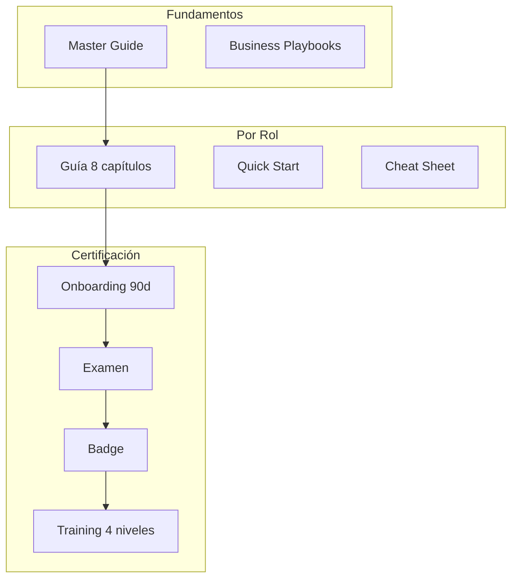

# AUTONOMUSCRM UNIVERSITY — Programa Oficial de Capacitación

> La academia corporativa oficial de AutonomusCRM

---

## Misión

Formar operadores de clase mundial que generen ingresos, satisfacción y crecimiento usando AutonomusCRM como sistema nervioso del negocio.

---

## Rutas de aprendizaje

---

## Catálogo de cursos

| Código | Nombre | Audiencia | Duración |
|--------|--------|-----------|----------|
| ACAD-101 | Fundamentos CRM + RevOps | Todos | 4 h |
| ACAD-201 | AutonomusCRM Operación | Todos | 8 h |
| ACAD-301 | Rol — Básico | Por rol | 8 h |
| ACAD-302 | Rol — Intermedio | Por rol | 16 h |
| ACAD-303 | Rol — Avanzado | Por rol | 24 h |
| ACAD-401 | IA Responsable | Manager+ | 4 h |
| ACAD-501 | Executive Intelligence | Liderazgo | 2 h |
| ACAD-601 | Certificación Operativa | Por rol | Examen |

---

## Ruta de certificación

1. Completar Master Guide
2. Quick Start + Guía de rol (Cap 1-4)
3. Onboarding Día 1-15
4. Examen teórico 80%
5. 4 casos prácticos
6. Sign-off manager
7. Badge **AutonomusCRM Certified — [Rol]**

---

## Ruta de crecimiento profesional

| Badge | Requisito | Siguiente paso |
|-------|-----------|----------------|
| Certified Basic | Examen + 15 días | Operación supervisada |
| Certified Pro | 30 días + KPIs | Mentor de nuevos |
| Certified Expert | 90 días + proyecto | Líder de práctica |
| Certified Master | Train-the-trainer | Academia interna |

---

## Documentos del programa

| # | Documento |
|---|-----------|
| 1 | AUTONOMUSCRM_ACADEMY_MASTER_GUIDE.md |
| 2 | Guides/*_GUIDE.md (×6) |
| 3 | ROLE_QUICK_START_GUIDES.md |
| 4 | ROLE_CHEAT_SHEETS.md |
| 5 | ROLE_ONBOARDING_PROGRAM.md |
| 6 | ROLE_TRAINING_PROGRAM.md |
| 7 | ROLE_CERTIFICATION_EXAMS.md |
| 8 | BUSINESS_PROCESS_PLAYBOOKS.md |
| 9 | EXECUTIVE_PLAYBOOK.md |
| 10 | AUTONOMUSCRM_UNIVERSITY.md |

---

## Entorno oficial

URL: http://164.68.99.83:8091 | Tenant: TechSolutions Panamá

---

*AutonomusCRM University — World-class CRM adoption*
