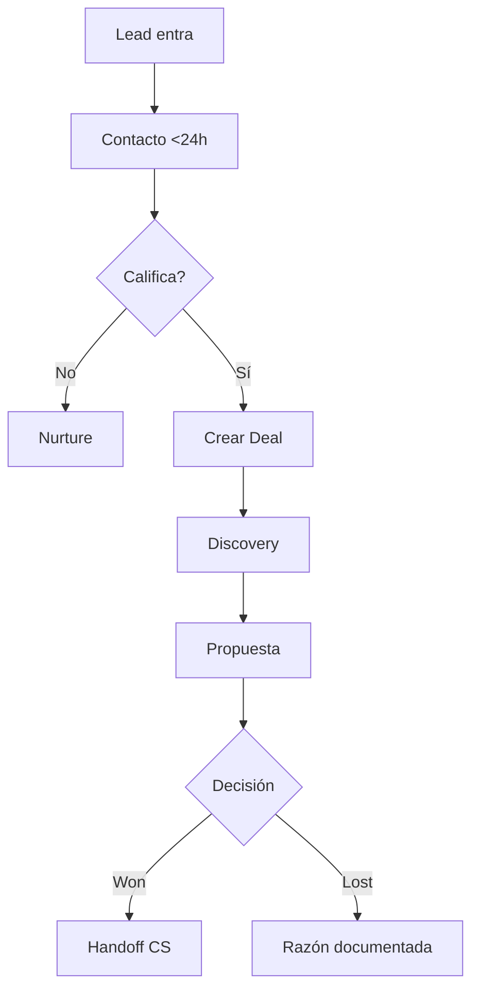
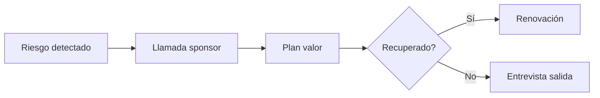

# BUSINESS PROCESS PLAYBOOKS — AutonomusCRM Academy

Playbooks operativos de negocio — no documentación técnica.

---

## 1. Ventas — Lead a Cierre

| Etapa | Criterio de salida | Pantalla |
|-------|-------------------|----------|
| Nuevo | Datos completos | Leads |
| Contactado | Nota de llamada | Leads Details |
| Calificado | BANT completo | Qualify |
| Oportunidad | Deal creado | Deals |
| Cierre | Won + contrato | Deals Details |

---

## 2. Atención al cliente

| Paso | Acción | SLA sugerido |
|------|--------|--------------|
| 1 | Crear/recibir ticket | Customer Success |
| 2 | Clasificar severidad | P1 <15 min respuesta |
| 3 | Ejecutar playbook | Según tipo |
| 4 | Resolver y confirmar | Cierre con cliente |
| 5 | Registrar en 360 | Nota permanente |

---

## 3. Renovación

1. Alerta 90 días antes — Customer Success OS
2. QBR con métricas de valor — Customer 360
3. Propuesta renovación — Deal o nota
4. Cierre o plan de recuperación

---

## 4. Cobranza (coordinación con finanzas)

| Señal | Acción CRM |
|-------|------------|
| Pago atrasado | Tarea + nota en Customer 360 |
| Sin respuesta | Escalamiento Manager |
| Disputa | Ticket + auditoría |

---

## 5. Recuperación de churn

---

## 6. Expansión (Upsell / Cross-sell)

- IA o CS identifica oportunidad → Trust Studio si aplica
- Sales crea deal expansión
- Manager valida margen

---

## 7. Escalamiento

| Nivel | Cuándo | A quién |
|-------|--------|---------|
| L1 | SLA incumplido | Support lead |
| L2 | Cliente VIP | Manager |
| L3 | Riesgo revenue | CRO / Executive OS |

---

## 8. Crisis operativa

1. Command Center — alcance
2. War room — Tasks + roles claros
3. Comunicación — plantilla ejecutiva
4. Post-mortem — Audit + lecciones

---

## 9. Clientes VIP

- Etiqueta en Customer 360
- SLA reducido
- Manager en copia de tickets P1/P2
- QBR trimestral obligatorio

---

## 10. Clientes en riesgo

| Señal | Playbook |
|-------|----------|
| Uso bajo | Adopción |
| NPS <7 | Recuperación |
| Ticket repetido | Escalamiento técnico |
| Sponsor cambió | Re-mapeo cuenta |

---

*AutonomusCRM Enterprise Academy — Business Process Playbooks*
