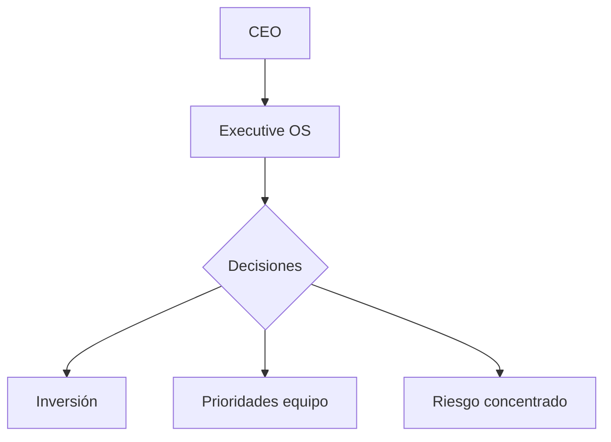

# EXECUTIVE PLAYBOOK — AutonomusCRM Academy

Guía para liderazgo — decisiones con datos, no con intuición.

---

## CEO — Visión y accountability

**Pregunta semanal:** ¿Protegimos y generamos ingresos esta semana?

| Uso AutonomusCRM | Frecuencia |
|------------------|------------|
| Executive OS + export board | Semanal (junta) |
| Command Center — revenue protected | Diario (5 min) |
| Trust Studio — decisiones críticas IA | Según alerta |

---

## COO — Operación y eficiencia

- Tasks + workflows sin cuellos de botella
- Auditoría mensual de calidad de datos
- SLA Customer Success vs capacidad

---

## CRO — Ingresos

| KPI | Fuente |
|-----|--------|
| Pipeline coverage | Revenue OS |
| Win rate | Deals |
| Forecast accuracy | Revenue OS |
| Churn | Customer Success |

**Ritual:** Pipeline review lunes — Manager + Sales en `/Deals`

---

## Director Comercial

- Coaching basado en actividad registrada
- Política de descuentos en Policies
- Alineación marketing → Leads por fuente

---

## Gerente de Operaciones

- Usuarios y permisos con Admin
- Integraciones estables
- Eventos fallidos = cero tolerancia >48h

---

## Customer Success Manager

- Health score y renovaciones 90/60/30 días
- Playbooks actualizados trimestralmente
- NPS por cohorte

---

*AutonomusCRM Enterprise Academy — Executive Playbook*
