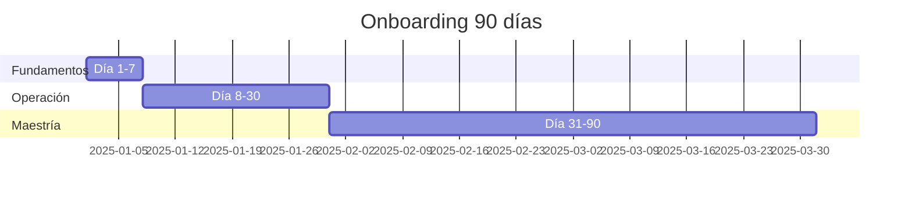

# ROLE ONBOARDING PROGRAM — AutonomusCRM Academy

Programa estructurado Día 1 → Día 90 por rol.

## SuperAdmin

| Día | Objetivo | Actividades | Evidencia |
|-----|----------|-------------|-----------|
| **1** | Primer acceso | Master Guide + Quick Start + login | Screenshot Command Center |
| **3** | Navegación | Cap 2 guía de rol + 5 pantallas | Lista pantallas visitadas |
| **7** | Primera operación | 1 escenario Cap 4 con mentor | Registro en CRM |
| **15** | Autonomía parcial | Jornada tipo Cap 3 media | KPI Uptime operativo del CRM |
| **30** | Certificación básica | Examen teórico 80% | Badge Básico |
| **60** | Intermedio | 4 escenarios sin ayuda | Revisión manager |
| **90** | Experto operativo | Examen avanzado + proyecto real | Certificación completa |

## Administrador

| Día | Objetivo | Actividades | Evidencia |
|-----|----------|-------------|-----------|
| **1** | Primer acceso | Master Guide + Quick Start + login | Screenshot Command Center |
| **3** | Navegación | Cap 2 guía de rol + 5 pantallas | Lista pantallas visitadas |
| **7** | Primera operación | 1 escenario Cap 4 con mentor | Registro en CRM |
| **15** | Autonomía parcial | Jornada tipo Cap 3 media | KPI Tiempo de alta de usuario |
| **30** | Certificación básica | Examen teórico 80% | Badge Básico |
| **60** | Intermedio | 4 escenarios sin ayuda | Revisión manager |
| **90** | Experto operativo | Examen avanzado + proyecto real | Certificación completa |

## Gerente Comercial

| Día | Objetivo | Actividades | Evidencia |
|-----|----------|-------------|-----------|
| **1** | Primer acceso | Master Guide + Quick Start + login | Screenshot Command Center |
| **3** | Navegación | Cap 2 guía de rol + 5 pantallas | Lista pantallas visitadas |
| **7** | Primera operación | 1 escenario Cap 4 con mentor | Registro en CRM |
| **15** | Autonomía parcial | Jornada tipo Cap 3 media | KPI Pipeline coverage (3x cuota) |
| **30** | Certificación básica | Examen teórico 80% | Badge Básico |
| **60** | Intermedio | 4 escenarios sin ayuda | Revisión manager |
| **90** | Experto operativo | Examen avanzado + proyecto real | Certificación completa |

## Ejecutivo Comercial

| Día | Objetivo | Actividades | Evidencia |
|-----|----------|-------------|-----------|
| **1** | Primer acceso | Master Guide + Quick Start + login | Screenshot Command Center |
| **3** | Navegación | Cap 2 guía de rol + 5 pantallas | Lista pantallas visitadas |
| **7** | Primera operación | 1 escenario Cap 4 con mentor | Registro en CRM |
| **15** | Autonomía parcial | Jornada tipo Cap 3 media | KPI Leads contactados por día |
| **30** | Certificación básica | Examen teórico 80% | Badge Básico |
| **60** | Intermedio | 4 escenarios sin ayuda | Revisión manager |
| **90** | Experto operativo | Examen avanzado + proyecto real | Certificación completa |

## Especialista de Soporte y Éxito del Cliente

| Día | Objetivo | Actividades | Evidencia |
|-----|----------|-------------|-----------|
| **1** | Primer acceso | Master Guide + Quick Start + login | Screenshot Command Center |
| **3** | Navegación | Cap 2 guía de rol + 5 pantallas | Lista pantallas visitadas |
| **7** | Primera operación | 1 escenario Cap 4 con mentor | Registro en CRM |
| **15** | Autonomía parcial | Jornada tipo Cap 3 media | KPI CSAT |
| **30** | Certificación básica | Examen teórico 80% | Badge Básico |
| **60** | Intermedio | 4 escenarios sin ayuda | Revisión manager |
| **90** | Experto operativo | Examen avanzado + proyecto real | Certificación completa |

## Analista / Observador

| Día | Objetivo | Actividades | Evidencia |
|-----|----------|-------------|-----------|
| **1** | Primer acceso | Master Guide + Quick Start + login | Screenshot Command Center |
| **3** | Navegación | Cap 2 guía de rol + 5 pantallas | Lista pantallas visitadas |
| **7** | Primera operación | 1 escenario Cap 4 con mentor | Registro en CRM |
| **15** | Autonomía parcial | Jornada tipo Cap 3 media | KPI Informes entregados a tiempo |
| **30** | Certificación básica | Examen teórico 80% | Badge Básico |
| **60** | Intermedio | 4 escenarios sin ayuda | Revisión manager |
| **90** | Experto operativo | Examen avanzado + proyecto real | Certificación completa |
