# Analista / Observador — Guía Operativa AutonomusCRM Academy

> **Programa:** AutonomusCRM Enterprise Academy  
> **Rol:** Analista / Observador  
> **Usuario de práctica:** `viewer@autonomuscrm.local`  
> **Entorno:** http://164.68.99.83:8091  

---

## Tabla de contenido

1. [Capítulo 1 — Bienvenida e impacto](#capítulo-1--bienvenida-e-impacto)
2. [Capítulo 2 — Mi primer día](#capítulo-2--mi-primer-día)
3. [Capítulo 3 — Mi jornada laboral completa](#capítulo-3--mi-jornada-laboral-completa)
4. [Capítulo 4 — Procesos y escenarios reales](#capítulo-4--procesos-y-escenarios-reales)
5. [Capítulo 5 — Errores más comunes](#capítulo-5--errores-más-comunes)
6. [Capítulo 6 — Indicadores de desempeño](#capítulo-6--indicadores-de-desempeño)
7. [Capítulo 7 — Uso de IA en tu rol](#capítulo-7--uso-de-ia-en-tu-rol)
8. [Capítulo 8 — Certificación operativa](#capítulo-8--certificación-operativa)

---

# Capítulo 1 — Bienvenida e impacto

## Quién eres como Analista / Observador

Stakeholder que consume información sin modificar registros

Toma decisiones informadas con datos en tiempo real sin riesgo operativo.

### Tu impacto en la empresa

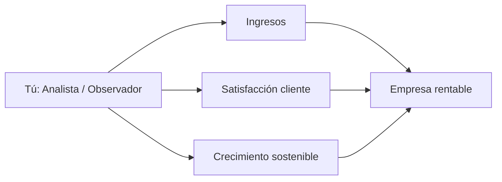

| Dimensión | Tu contribución |
|-----------|-----------------|
| **Ingresos** | Identifica tendencias y anomalías para alertar a líderes. |
| **Satisfacción** | Monitorea SLAs y salud de cartera desde dashboards. |
| **Crecimiento** | Apoya planificación estratégica con lectura de pipeline y outcomes. |

### Historia real: primer mes en TechSolutions Panamá

Imagina tu primer lunes en **TechSolutions Panamá**, empresa B2B de servicios tecnológicos. El CEO te dice: *"No necesito que aprendas software; necesito que protejas nuestro pipeline y nuestros clientes."* Esta guía te lleva de cero a productivo usando AutonomusCRM como sistema nervioso del negocio — no como formulario digital.

### Áreas de enfoque de tu rol

- Command Center
- Revenue OS
- Executive OS
- Lectura de pipeline
- Auditoría (lectura)

### Mapa mental de tu rol

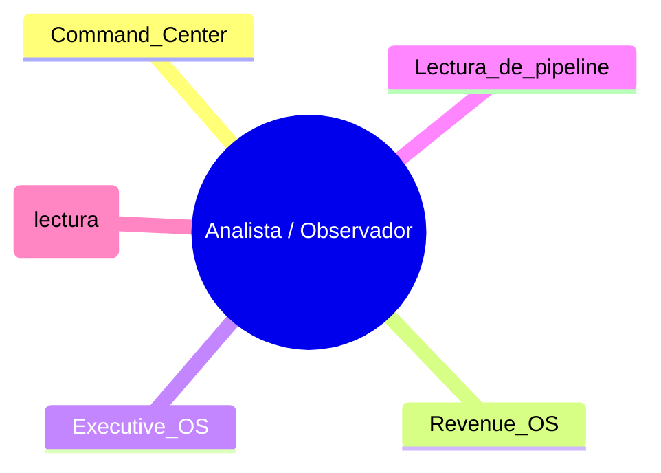

### Ejercicio 1.1 — Autodiagnóstico

Responde por escrito (15 min):

1. ¿Qué resultado medible debe lograr tu rol este trimestre?
2. ¿Quién depende de tu trabajo diario?
3. ¿Qué pasa en la empresa si no inicias sesión durante una semana?

### Ejercicios adicionales Capítulo 1

- Redacta tu elevator pitch del rol en 30 segundos usando solo lenguaje de negocio.
- Identifica 3 stakeholders que dependen de tu trabajo diario y qué les entregas.
- Enumera 5 resultados medibles que tu manager espera este trimestre.

### Estudios de caso

#### Insight que evitó sorpresa en board

**Contexto:** Forecast manager optimista +15%.

**Desafío:** CEO necesitaba segunda opinión.

**Acciones:** Análisis deals at-risk; actividad cruzada; memo independiente.

**Resultado:** Guidance ajustado; confianza inversores preservada.

**Lecciones aplicables hoy:**

1. ¿Qué elemento replicarías mañana en tu jornada?
2. ¿Qué riesgo similar existe en tu cartera actual?

#### Programa de reporting self-service

**Contexto:** CRO inundado de pedidos ad-hoc.

**Desafío:** Viewer único con acceso; cuello de botella.

**Acciones:** Plantillas semanales; catálogo informes; SLA 24h.

**Resultado:** Tiempo CRO en datos -60%.

**Lecciones aplicables hoy:**

1. ¿Qué elemento replicarías mañana en tu jornada?
2. ¿Qué riesgo similar existe en tu cartera actual?

---

# Capítulo 2 — Mi primer día

## 2.1 Acceso al sistema

| Paso | Acción | Por qué |
|------|--------|---------|
| 1 | Ir a http://164.68.99.83:8091/Account/Login | Punto de entrada seguro |
| 2 | Email: `viewer@autonomuscrm.local` | Identidad única auditada |
| 3 | Contraseña: (proporcionada por Admin) | Nunca compartir |
| 4 | TenantId: dejar vacío o cero | Búsqueda por email |
| 5 | Tras login → Command Center `/` | Tu centro de mando |

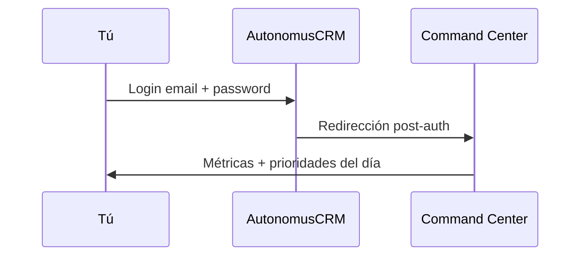

## 2.2 Recorrido guiado — Qué significa cada pantalla

| Pantalla | Ruta | Qué significa para el negocio | Aprender |
|----------|------|--------------------------------|----------|
| Command Center | `/` | Pulso del negocio: ingresos generados, protegidos, decisiones IA 24h. | Siempre |
| Trust Studio | `/TrustInbox` | Bandeja de aprobación humana para decisiones de IA (Human-in-the-Loop). | Día 3 |
| Workforce | `/Agents` | Agentes de IA que automatizan tareas repetitivas. | Día 2 |
| Revenue OS | `/revenue` | Dashboard de ingresos, pipeline y forecast. | Día 1 |
| Executive OS | `/executive` | Vista ejecutiva para juntas y board. | Día 2 |
| Pipeline | `/Deals` | Oportunidades comerciales por etapa. | Día 2 |
| Directorio | `/Customers` | Base de clientes activos. | Día 1 |
| Customer 360 | `/Customer360` | Vista unificada: historial, deals, tickets, interacciones. | Día 1 |
| Customer Success | `/customer-success` | Tickets, playbooks y salud de cartera. | Semana 1 |
| Leads | `/Leads` | Prospectos no calificados o en calificación. | Semana 1 |
| Tareas | `/Tasks` | Compromisos con fecha y responsable. | Día 1 |
| Auditoría | `/Audit` | Trazabilidad de acciones para cumplimiento. | Opcional |

## 2.3 Configuración personal esencial

1. **Idioma** — Selector en barra superior (es/en).
2. **Tema** — Modo claro/oscuro según preferencia.
3. **Búsqueda global** — `Ctrl+K` para saltar a cualquier registro.
4. **Marcadores mentales** — Memoriza 3 rutas de tu rol para la semana 1.

### Simulación 2.A — Primer login (30 min)

1. Inicia sesión con tu usuario de práctica.
2. Permanece 5 min en Command Center sin hacer clic: solo lee métricas.
3. Abre cada pantalla de la tabla anterior marcada Día 1.
4. Escribe una frase de negocio (no técnica) describiendo cada pantalla.

### Ejercicios Capítulo 2

- Completa login en entorno QA y captura Command Center (anotación, no screenshot obligatorio).
- Visita cada pantalla marcada Día 1 y escribe una frase de valor de negocio.
- Practica Ctrl+K: encuentra un cliente, un deal y una tarea en <2 min cada uno.

### Tabla de decisión — ¿Qué pantalla abro primero?

| Situación | Pantalla | Ruta |
|-----------|----------|------|
| Inicio del día | Command Center | `/` |
| Antes de llamada cliente | Customer 360 | `/Customer360` |
| Revisar pipeline | Deals | `/Deals` |
| Aprobar IA | Trust Studio | `/TrustInbox` |
| Ticket abierto | Customer Success | `/customer-success` |

---

# Capítulo 3 — Mi jornada laboral completa

> Jornada tipo B2B — adapta horarios a tu zona. La lógica es universal.

## 08:00 — Arranque y priorización

| | |
|---|---|
| **Qué hacer** | Revisar Command Center y bandeja de prioridades del día. |
| **Por qué** | Las primeras 60 minutos definen si reaccionas o lideras la jornada. |
| **Resultado esperado** | Lista top 5 acciones con dueño y hora límite. |

**Tips para tu rol:**

- Prioriza `Command Center` si el tiempo se agota.
- Usa Ctrl+K para no perder minutos navegando.
- Registra actividad antes de pasar al siguiente bloque.

**Micro-ejercicio (5 min):** Anota qué métrica de negocio validarías al terminar este bloque.

## 08:30 — Revisión de alertas

| | |
|---|---|
| **Qué hacer** | Trust Studio, deals en riesgo, tickets críticos según tu rol. |
| **Por qué** | La IA y los workflows señalan lo urgente antes que el ruido. |
| **Resultado esperado** | Cero sorpresas a mediodía. |

**Tips para tu rol:**

- Prioriza `Command Center` si el tiempo se agota.
- Usa Ctrl+K para no perder minutos navegando.
- Registra actividad antes de pasar al siguiente bloque.

**Micro-ejercicio (5 min):** Anota qué métrica de negocio validarías al terminar este bloque.

## 09:00 — Bloque de ejecución #1

| | |
|---|---|
| **Qué hacer** | Revisar dashboards |
| **Por qué** | Proteger tiempo profundo para trabajo de alto impacto. |
| **Resultado esperado** | Avance medible en métrica clave del rol. |

**Tips para tu rol:**

- Prioriza `Command Center` si el tiempo se agota.
- Usa Ctrl+K para no perder minutos navegando.
- Registra actividad antes de pasar al siguiente bloque.

**Micro-ejercicio (5 min):** Anota qué métrica de negocio validarías al terminar este bloque.

## 09:30 — Seguimiento a interesados

| | |
|---|---|
| **Qué hacer** | Actualizar registros: leads, clientes o tickets con notas de contacto. |
| **Por qué** | Sin registro no hay forecast, handoff ni auditoría. |
| **Resultado esperado** | CRM refleja la realidad del negocio. |

**Tips para tu rol:**

- Prioriza `Command Center` si el tiempo se agota.
- Usa Ctrl+K para no perder minutos navegando.
- Registra actividad antes de pasar al siguiente bloque.

**Micro-ejercicio (5 min):** Anota qué métrica de negocio validarías al terminar este bloque.

## 10:00 — Coordinación interna

| | |
|---|---|
| **Qué hacer** | Sync con ventas, soporte o admin según handoffs pendientes. |
| **Por qué** | El 40% de deals se pierden por falta de coordinación. |
| **Resultado esperado** | Handoffs cerrados con próximo paso definido. |

**Tips para tu rol:**

- Prioriza `Command Center` si el tiempo se agota.
- Usa Ctrl+K para no perder minutos navegando.
- Registra actividad antes de pasar al siguiente bloque.

**Micro-ejercicio (5 min):** Anota qué métrica de negocio validarías al terminar este bloque.

## 10:30 — Bloque de ejecución #2

| | |
|---|---|
| **Qué hacer** | Exportar insights |
| **Por qué** | Mantener momentum en pipeline o cola de servicio. |
| **Resultado esperado** | Etapa avanzada o ticket resuelto. |

**Tips para tu rol:**

- Prioriza `Command Center` si el tiempo se agota.
- Usa Ctrl+K para no perder minutos navegando.
- Registra actividad antes de pasar al siguiente bloque.

**Micro-ejercicio (5 min):** Anota qué métrica de negocio validarías al terminar este bloque.

## 11:00 — Customer 360 / contexto

| | |
|---|---|
| **Qué hacer** | Antes de cada llamada importante, abrir vista 360 del cliente. |
| **Por qué** | Personalización aumenta conversión y confianza. |
| **Resultado esperado** | Conversaciones con contexto completo. |

**Tips para tu rol:**

- Prioriza `Command Center` si el tiempo se agota.
- Usa Ctrl+K para no perder minutos navegando.
- Registra actividad antes de pasar al siguiente bloque.

**Micro-ejercicio (5 min):** Anota qué métrica de negocio validarías al terminar este bloque.

## 11:30 — Tareas y compromisos

| | |
|---|---|
| **Qué hacer** | Completar o reprogramar tareas vencidas en `/Tasks`. |
| **Por qué** | Los compromisos olvidados erosionan credibilidad. |
| **Resultado esperado** | Bandeja de tareas al día. |

**Tips para tu rol:**

- Prioriza `Command Center` si el tiempo se agota.
- Usa Ctrl+K para no perder minutos navegando.
- Registra actividad antes de pasar al siguiente bloque.

**Micro-ejercicio (5 min):** Anota qué métrica de negocio validarías al terminar este bloque.

## 12:00 — Cierre de mañana

| | |
|---|---|
| **Qué hacer** | Verificar que métricas del día AM están registradas. |
| **Por qué** | Gerencia toma decisiones con datos de hoy, no de ayer. |
| **Resultado esperado** | Dashboard actualizado. |

**Tips para tu rol:**

- Prioriza `Command Center` si el tiempo se agota.
- Usa Ctrl+K para no perder minutos navegando.
- Registra actividad antes de pasar al siguiente bloque.

**Micro-ejercicio (5 min):** Anota qué métrica de negocio validarías al terminar este bloque.

## 13:00 — Revisión post-almuerzo

| | |
|---|---|
| **Qué hacer** | Command palette (Ctrl+K) para saltar a registros pendientes. |
| **Por qué** | Recuperar foco rápido tras pausa. |
| **Resultado esperado** | Retoma en <5 minutos. |

**Tips para tu rol:**

- Prioriza `Command Center` si el tiempo se agota.
- Usa Ctrl+K para no perder minutos navegando.
- Registra actividad antes de pasar al siguiente bloque.

**Micro-ejercicio (5 min):** Anota qué métrica de negocio validarías al terminar este bloque.

## 14:00 — Bloque de ejecución #3

| | |
|---|---|
| **Qué hacer** | Reportar anomalías a gerencia |
| **Por qué** | Ventana típica de reuniones con clientes. |
| **Resultado esperado** | Propuesta enviada o caso resuelto. |

**Tips para tu rol:**

- Prioriza `Command Center` si el tiempo se agota.
- Usa Ctrl+K para no perder minutos navegando.
- Registra actividad antes de pasar al siguiente bloque.

**Micro-ejercicio (5 min):** Anota qué métrica de negocio validarías al terminar este bloque.

## 15:00 — IA y automatización

| | |
|---|---|
| **Qué hacer** | Revisar sugerencias de Workforce/Agents y aprobar o rechazar en Trust Studio si aplica. |
| **Por qué** | La IA amplifica tu capacidad; tú mantienes el criterio. |
| **Resultado esperado** | Decisiones IA alineadas a política comercial. |

**Tips para tu rol:**

- Prioriza `Command Center` si el tiempo se agota.
- Usa Ctrl+K para no perder minutos navegando.
- Registra actividad antes de pasar al siguiente bloque.

**Micro-ejercicio (5 min):** Anota qué métrica de negocio validarías al terminar este bloque.

## 16:00 — Pipeline / cola de servicio

| | |
|---|---|
| **Qué hacer** | Revisar dashboards |
| **Por qué** | Última oportunidad del día para desbloquear lo crítico. |
| **Resultado esperado** | Ningún deal/ticket crítico sin próximo paso. |

**Tips para tu rol:**

- Prioriza `Command Center` si el tiempo se agota.
- Usa Ctrl+K para no perder minutos navegando.
- Registra actividad antes de pasar al siguiente bloque.

**Micro-ejercicio (5 min):** Anota qué métrica de negocio validarías al terminar este bloque.

## 16:30 — Documentación y calidad de datos

| | |
|---|---|
| **Qué hacer** | Corregir campos vacíos, etapas incorrectas, duplicados evidentes. |
| **Por qué** | Datos sucios = forecast falso. |
| **Resultado esperado** | Registros listos para reportes. |

**Tips para tu rol:**

- Prioriza `Command Center` si el tiempo se agota.
- Usa Ctrl+K para no perder minutos navegando.
- Registra actividad antes de pasar al siguiente bloque.

**Micro-ejercicio (5 min):** Anota qué métrica de negocio validarías al terminar este bloque.

## 17:00 — Planificación del día siguiente

| | |
|---|---|
| **Qué hacer** | Crear tareas para mañana con recordatorios. |
| **Por qué** | Arrancar con plan vence arrancar con ansiedad. |
| **Resultado esperado** | Agenda del día +1 definida. |

**Tips para tu rol:**

- Prioriza `Command Center` si el tiempo se agota.
- Usa Ctrl+K para no perder minutos navegando.
- Registra actividad antes de pasar al siguiente bloque.

**Micro-ejercicio (5 min):** Anota qué métrica de negocio validarías al terminar este bloque.

## 17:30 — Cierre de jornada

| | |
|---|---|
| **Qué hacer** | Revisar KPIs personales vs meta diaria. |
| **Por qué** | Lo que no se mide no mejora. |
| **Resultado esperado** | Autoevaluación honesta + 1 mejora para mañana. |

**Tips para tu rol:**

- Prioriza `Command Center` si el tiempo se agota.
- Usa Ctrl+K para no perder minutos navegando.
- Registra actividad antes de pasar al siguiente bloque.

**Micro-ejercicio (5 min):** Anota qué métrica de negocio validarías al terminar este bloque.

```mermaid
gantt
    title Jornada tipo AutonomusCRM
    dateFormat HH:mm
    axisFormat %H:%M
    section Mañana
    Priorización     :08:00, 30m
    Ejecución        :09:00, 120m
    Coordinación     :11:00, 60m
    section Tarde
    Clientes         :14:00, 120m
    IA y cierre      :16:00, 90m
```

### Ejercicios Capítulo 3

- Simula una jornada completa en papel: asigna tus tareas reales a cada bloque horario.
- Identifica qué bloque sueles saltarte y diseña un recordatorio.
- Pairing 1h con colega certificado: observa su rutina 08:00-10:00.

---

# Capítulo 4 — Procesos y escenarios reales

## Escenario 4.1 — Reporte ejecutivo viernes

**Historia:** CEO pide estado ingresos y riesgos para junta.

**Stakeholders:** Cliente · Tu equipo · Manager · (si aplica) Admin/SuperAdmin

**Precondiciones:** Acceso al entorno QA; Customer 360 disponible; mentor asignado si es primera vez.

**Tiempo estimado:** 45-90 minutos (incluye documentación en CRM).

**Flujo:**

```mermaid
flowchart TD
    S[Inicio]
    S --> A1[/executive export board]
    A1 --> A2[Validar Revenue OS]
    A2 --> A3[Listar 3 riesgos top]
    A3 --> A4[Narrativa 3 bullets]
    A4 --> A5[Enviar antes 17:00]
    A5 --> O[Resultado]
```

**Pasos detallados:**

1. `/executive` export board
   - *Verificación:* Registro actualizado y próximo paso con fecha.

2. Validar Revenue OS
   - *Verificación:* Registro actualizado y próximo paso con fecha.

3. Listar 3 riesgos top
   - *Verificación:* Registro actualizado y próximo paso con fecha.

4. Narrativa 3 bullets
   - *Verificación:* Registro actualizado y próximo paso con fecha.

5. Enviar antes 17:00
   - *Verificación:* Registro actualizado y próximo paso con fecha.

**Resultado de negocio:** Junta informada en 15 min preparación.

**Cuadro de decisión:**

| Pregunta | Sí | No |
|----------|----|----|
| ¿Tengo contexto 360? | Continuar | Abrir Customer 360 primero |
| ¿Próximo paso definido? | Ejecutar | Crear tarea con fecha |
| ¿Requiere aprobación? | Trust Studio | Proceder |
| ¿Impacta forecast? | Notificar manager | Registrar y continuar |

**Errores comunes en este escenario:**

- Omitir registro de actividad antes de cambiar etapa.
- No definir dueño del siguiente paso.
- Ignorar alertas del Command Center relacionadas.

**Preguntas de reflexión:**

1. ¿Qué KPI de tu rol mejora si ejecutas bien este escenario?
2. ¿Qué habrías hecho diferente con un cliente VIP?
3. ¿Qué documentación dejó el siguiente rol listo para actuar?

**Práctica en entorno QA:**

- URL: http://164.68.99.83:8091
- Usuario: `viewer@autonomuscrm.local`
- Busca registros seed o crea datos de práctica con prefijo ACADEMY-

---

## Escenario 4.2 — Anomalía pipeline detectada

**Historia:** Deal $500K saltó etapa sin actividad registrada.

**Stakeholders:** Cliente · Tu equipo · Manager · (si aplica) Admin/SuperAdmin

**Precondiciones:** Acceso al entorno QA; Customer 360 disponible; mentor asignado si es primera vez.

**Tiempo estimado:** 45-90 minutos (incluye documentación en CRM).

**Flujo:**

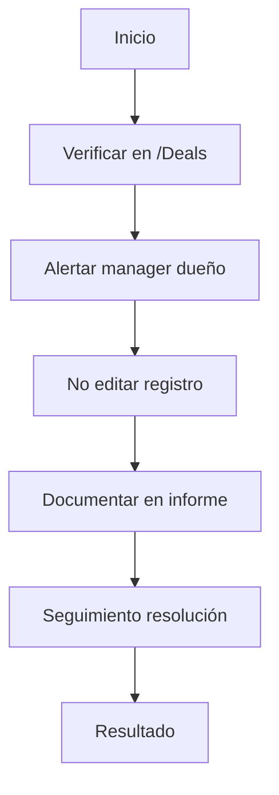

**Pasos detallados:**

1. Verificar en `/Deals`
   - *Verificación:* Registro actualizado y próximo paso con fecha.

2. Alertar manager dueño
   - *Verificación:* Registro actualizado y próximo paso con fecha.

3. No editar registro
   - *Verificación:* Registro actualizado y próximo paso con fecha.

4. Documentar en informe
   - *Verificación:* Registro actualizado y próximo paso con fecha.

5. Seguimiento resolución
   - *Verificación:* Registro actualizado y próximo paso con fecha.

**Resultado de negocio:** Dato corregido; calidad reporte preservada.

**Cuadro de decisión:**

| Pregunta | Sí | No |
|----------|----|----|
| ¿Tengo contexto 360? | Continuar | Abrir Customer 360 primero |
| ¿Próximo paso definido? | Ejecutar | Crear tarea con fecha |
| ¿Requiere aprobación? | Trust Studio | Proceder |
| ¿Impacta forecast? | Notificar manager | Registrar y continuar |

**Errores comunes en este escenario:**

- Omitir registro de actividad antes de cambiar etapa.
- No definir dueño del siguiente paso.
- Ignorar alertas del Command Center relacionadas.

**Preguntas de reflexión:**

1. ¿Qué KPI de tu rol mejora si ejecutas bien este escenario?
2. ¿Qué habrías hecho diferente con un cliente VIP?
3. ¿Qué documentación dejó el siguiente rol listo para actuar?

**Práctica en entorno QA:**

- URL: http://164.68.99.83:8091
- Usuario: `viewer@autonomuscrm.local`
- Busca registros seed o crea datos de práctica con prefijo ACADEMY-

---

## Escenario 4.3 — Dashboard semanal RevOps

**Historia:** Ritual lunes: KPIs para CRO.

**Stakeholders:** Cliente · Tu equipo · Manager · (si aplica) Admin/SuperAdmin

**Precondiciones:** Acceso al entorno QA; Customer 360 disponible; mentor asignado si es primera vez.

**Tiempo estimado:** 45-90 minutos (incluye documentación en CRM).

**Flujo:**

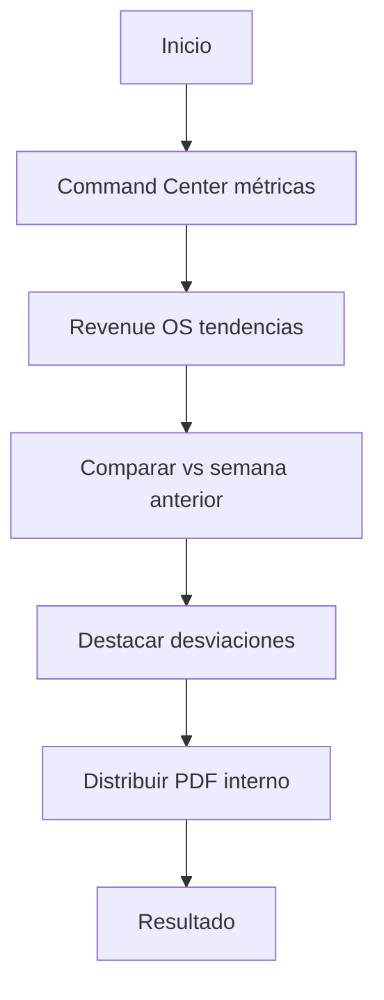

**Pasos detallados:**

1. Command Center métricas
   - *Verificación:* Registro actualizado y próximo paso con fecha.

2. Revenue OS tendencias
   - *Verificación:* Registro actualizado y próximo paso con fecha.

3. Comparar vs semana anterior
   - *Verificación:* Registro actualizado y próximo paso con fecha.

4. Destacar desviaciones
   - *Verificación:* Registro actualizado y próximo paso con fecha.

5. Distribuir PDF interno
   - *Verificación:* Registro actualizado y próximo paso con fecha.

**Resultado de negocio:** CRO recibe informe 08:30 puntual.

**Cuadro de decisión:**

| Pregunta | Sí | No |
|----------|----|----|
| ¿Tengo contexto 360? | Continuar | Abrir Customer 360 primero |
| ¿Próximo paso definido? | Ejecutar | Crear tarea con fecha |
| ¿Requiere aprobación? | Trust Studio | Proceder |
| ¿Impacta forecast? | Notificar manager | Registrar y continuar |

**Errores comunes en este escenario:**

- Omitir registro de actividad antes de cambiar etapa.
- No definir dueño del siguiente paso.
- Ignorar alertas del Command Center relacionadas.

**Preguntas de reflexión:**

1. ¿Qué KPI de tu rol mejora si ejecutas bien este escenario?
2. ¿Qué habrías hecho diferente con un cliente VIP?
3. ¿Qué documentación dejó el siguiente rol listo para actuar?

**Práctica en entorno QA:**

- URL: http://164.68.99.83:8091
- Usuario: `viewer@autonomuscrm.local`
- Busca registros seed o crea datos de práctica con prefijo ACADEMY-

---

## Escenario 4.4 — Concentración riesgo cartera

**Historia:** 40% MRR en 2 clientes; alerta estratégica.

**Stakeholders:** Cliente · Tu equipo · Manager · (si aplica) Admin/SuperAdmin

**Precondiciones:** Acceso al entorno QA; Customer 360 disponible; mentor asignado si es primera vez.

**Tiempo estimado:** 45-90 minutos (incluye documentación en CRM).

**Flujo:**

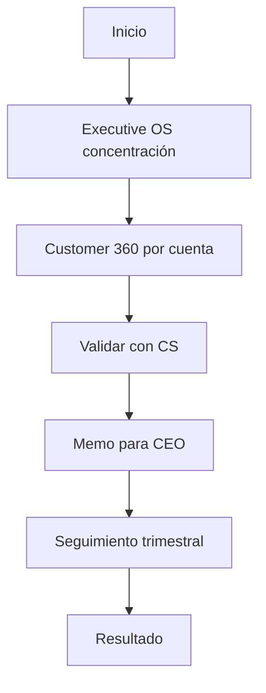

**Pasos detallados:**

1. Executive OS concentración
   - *Verificación:* Registro actualizado y próximo paso con fecha.

2. Customer 360 por cuenta
   - *Verificación:* Registro actualizado y próximo paso con fecha.

3. Validar con CS
   - *Verificación:* Registro actualizado y próximo paso con fecha.

4. Memo para CEO
   - *Verificación:* Registro actualizado y próximo paso con fecha.

5. Seguimiento trimestral
   - *Verificación:* Registro actualizado y próximo paso con fecha.

**Resultado de negocio:** Plan diversificación iniciado.

**Cuadro de decisión:**

| Pregunta | Sí | No |
|----------|----|----|
| ¿Tengo contexto 360? | Continuar | Abrir Customer 360 primero |
| ¿Próximo paso definido? | Ejecutar | Crear tarea con fecha |
| ¿Requiere aprobación? | Trust Studio | Proceder |
| ¿Impacta forecast? | Notificar manager | Registrar y continuar |

**Errores comunes en este escenario:**

- Omitir registro de actividad antes de cambiar etapa.
- No definir dueño del siguiente paso.
- Ignorar alertas del Command Center relacionadas.

**Preguntas de reflexión:**

1. ¿Qué KPI de tu rol mejora si ejecutas bien este escenario?
2. ¿Qué habrías hecho diferente con un cliente VIP?
3. ¿Qué documentación dejó el siguiente rol listo para actuar?

**Práctica en entorno QA:**

- URL: http://164.68.99.83:8091
- Usuario: `viewer@autonomuscrm.local`
- Busca registros seed o crea datos de práctica con prefijo ACADEMY-

---

## Escenario 4.5 — Lectura auditoría compliance

**Historia:** Auditor externo pide muestra accesos Q3.

**Stakeholders:** Cliente · Tu equipo · Manager · (si aplica) Admin/SuperAdmin

**Precondiciones:** Acceso al entorno QA; Customer 360 disponible; mentor asignado si es primera vez.

**Tiempo estimado:** 45-90 minutos (incluye documentación en CRM).

**Flujo:**

```mermaid
flowchart TD
    S[Inicio]
    S --> A1[/Audit filtros período]
    A1 --> A2[Export sin datos sensibles extra]
    A2 --> A3[Validar con Admin]
    A3 --> A4[Entregar paquete]
    A4 --> A5[Archivar solicitud]
    A5 --> O[Resultado]
```

**Pasos detallados:**

1. `/Audit` filtros período
   - *Verificación:* Registro actualizado y próximo paso con fecha.

2. Export sin datos sensibles extra
   - *Verificación:* Registro actualizado y próximo paso con fecha.

3. Validar con Admin
   - *Verificación:* Registro actualizado y próximo paso con fecha.

4. Entregar paquete
   - *Verificación:* Registro actualizado y próximo paso con fecha.

5. Archivar solicitud
   - *Verificación:* Registro actualizado y próximo paso con fecha.

**Resultado de negocio:** Auditoría sin hallazgos críticos.

**Cuadro de decisión:**

| Pregunta | Sí | No |
|----------|----|----|
| ¿Tengo contexto 360? | Continuar | Abrir Customer 360 primero |
| ¿Próximo paso definido? | Ejecutar | Crear tarea con fecha |
| ¿Requiere aprobación? | Trust Studio | Proceder |
| ¿Impacta forecast? | Notificar manager | Registrar y continuar |

**Errores comunes en este escenario:**

- Omitir registro de actividad antes de cambiar etapa.
- No definir dueño del siguiente paso.
- Ignorar alertas del Command Center relacionadas.

**Preguntas de reflexión:**

1. ¿Qué KPI de tu rol mejora si ejecutas bien este escenario?
2. ¿Qué habrías hecho diferente con un cliente VIP?
3. ¿Qué documentación dejó el siguiente rol listo para actuar?

**Práctica en entorno QA:**

- URL: http://164.68.99.83:8091
- Usuario: `viewer@autonomuscrm.local`
- Busca registros seed o crea datos de práctica con prefijo ACADEMY-

---

## Escenario 4.6 — Benchmark interno equipos

**Historia:** Comparar win rate región PA vs CR.

**Stakeholders:** Cliente · Tu equipo · Manager · (si aplica) Admin/SuperAdmin

**Precondiciones:** Acceso al entorno QA; Customer 360 disponible; mentor asignado si es primera vez.

**Tiempo estimado:** 45-90 minutos (incluye documentación en CRM).

**Flujo:**

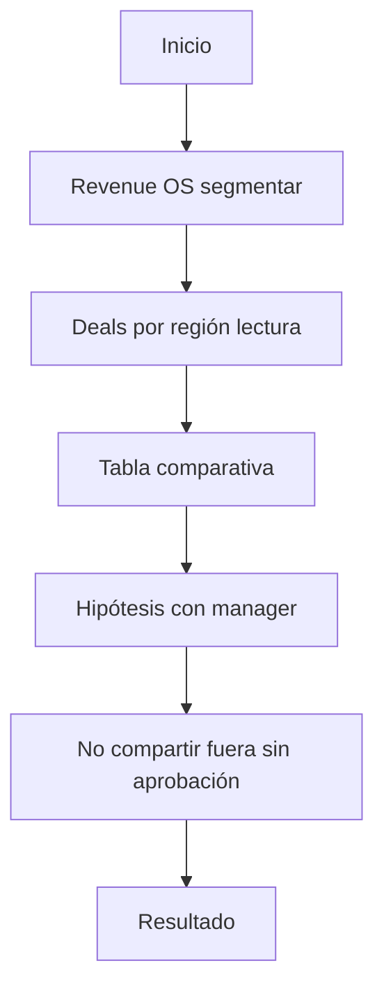

**Pasos detallados:**

1. Revenue OS segmentar
   - *Verificación:* Registro actualizado y próximo paso con fecha.

2. Deals por región lectura
   - *Verificación:* Registro actualizado y próximo paso con fecha.

3. Tabla comparativa
   - *Verificación:* Registro actualizado y próximo paso con fecha.

4. Hipótesis con manager
   - *Verificación:* Registro actualizado y próximo paso con fecha.

5. No compartir fuera sin aprobación
   - *Verificación:* Registro actualizado y próximo paso con fecha.

**Resultado de negocio:** Insight accionable para CRO.

**Cuadro de decisión:**

| Pregunta | Sí | No |
|----------|----|----|
| ¿Tengo contexto 360? | Continuar | Abrir Customer 360 primero |
| ¿Próximo paso definido? | Ejecutar | Crear tarea con fecha |
| ¿Requiere aprobación? | Trust Studio | Proceder |
| ¿Impacta forecast? | Notificar manager | Registrar y continuar |

**Errores comunes en este escenario:**

- Omitir registro de actividad antes de cambiar etapa.
- No definir dueño del siguiente paso.
- Ignorar alertas del Command Center relacionadas.

**Preguntas de reflexión:**

1. ¿Qué KPI de tu rol mejora si ejecutas bien este escenario?
2. ¿Qué habrías hecho diferente con un cliente VIP?
3. ¿Qué documentación dejó el siguiente rol listo para actuar?

**Práctica en entorno QA:**

- URL: http://164.68.99.83:8091
- Usuario: `viewer@autonomuscrm.local`
- Busca registros seed o crea datos de práctica con prefijo ACADEMY-

---

## Escenario 4.7 — Preparación board trimestral

**Historia:** Material Q4 para directorio.

**Stakeholders:** Cliente · Tu equipo · Manager · (si aplica) Admin/SuperAdmin

**Precondiciones:** Acceso al entorno QA; Customer 360 disponible; mentor asignado si es primera vez.

**Tiempo estimado:** 45-90 minutos (incluye documentación en CRM).

**Flujo:**

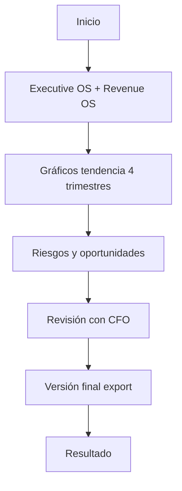

**Pasos detallados:**

1. Executive OS + Revenue OS
   - *Verificación:* Registro actualizado y próximo paso con fecha.

2. Gráficos tendencia 4 trimestres
   - *Verificación:* Registro actualizado y próximo paso con fecha.

3. Riesgos y oportunidades
   - *Verificación:* Registro actualizado y próximo paso con fecha.

4. Revisión con CFO
   - *Verificación:* Registro actualizado y próximo paso con fecha.

5. Versión final export
   - *Verificación:* Registro actualizado y próximo paso con fecha.

**Resultado de negocio:** Board deck listo 5 días antes.

**Cuadro de decisión:**

| Pregunta | Sí | No |
|----------|----|----|
| ¿Tengo contexto 360? | Continuar | Abrir Customer 360 primero |
| ¿Próximo paso definido? | Ejecutar | Crear tarea con fecha |
| ¿Requiere aprobación? | Trust Studio | Proceder |
| ¿Impacta forecast? | Notificar manager | Registrar y continuar |

**Errores comunes en este escenario:**

- Omitir registro de actividad antes de cambiar etapa.
- No definir dueño del siguiente paso.
- Ignorar alertas del Command Center relacionadas.

**Preguntas de reflexión:**

1. ¿Qué KPI de tu rol mejora si ejecutas bien este escenario?
2. ¿Qué habrías hecho diferente con un cliente VIP?
3. ¿Qué documentación dejó el siguiente rol listo para actuar?

**Práctica en entorno QA:**

- URL: http://164.68.99.83:8091
- Usuario: `viewer@autonomuscrm.local`
- Busca registros seed o crea datos de práctica con prefijo ACADEMY-

---

## Escenario 4.8 — Monitoreo SLA Customer Success

**Historia:** SLA primera respuesta cayó 8% este mes.

**Stakeholders:** Cliente · Tu equipo · Manager · (si aplica) Admin/SuperAdmin

**Precondiciones:** Acceso al entorno QA; Customer 360 disponible; mentor asignado si es primera vez.

**Tiempo estimado:** 45-90 minutos (incluye documentación en CRM).

**Flujo:**

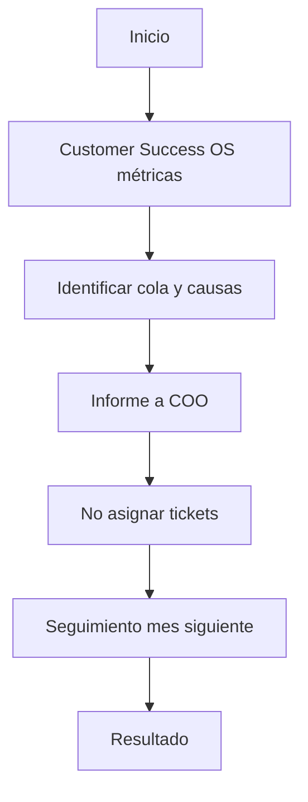

**Pasos detallados:**

1. Customer Success OS métricas
   - *Verificación:* Registro actualizado y próximo paso con fecha.

2. Identificar cola y causas
   - *Verificación:* Registro actualizado y próximo paso con fecha.

3. Informe a COO
   - *Verificación:* Registro actualizado y próximo paso con fecha.

4. No asignar tickets
   - *Verificación:* Registro actualizado y próximo paso con fecha.

5. Seguimiento mes siguiente
   - *Verificación:* Registro actualizado y próximo paso con fecha.

**Resultado de negocio:** COO activa plan capacidad.

**Cuadro de decisión:**

| Pregunta | Sí | No |
|----------|----|----|
| ¿Tengo contexto 360? | Continuar | Abrir Customer 360 primero |
| ¿Próximo paso definido? | Ejecutar | Crear tarea con fecha |
| ¿Requiere aprobación? | Trust Studio | Proceder |
| ¿Impacta forecast? | Notificar manager | Registrar y continuar |

**Errores comunes en este escenario:**

- Omitir registro de actividad antes de cambiar etapa.
- No definir dueño del siguiente paso.
- Ignorar alertas del Command Center relacionadas.

**Preguntas de reflexión:**

1. ¿Qué KPI de tu rol mejora si ejecutas bien este escenario?
2. ¿Qué habrías hecho diferente con un cliente VIP?
3. ¿Qué documentación dejó el siguiente rol listo para actuar?

**Práctica en entorno QA:**

- URL: http://164.68.99.83:8091
- Usuario: `viewer@autonomuscrm.local`
- Busca registros seed o crea datos de práctica con prefijo ACADEMY-

---

## Escenario 4.9 — Validación forecast antes commit

**Historia:** Manager pide segunda opinión datos.

**Stakeholders:** Cliente · Tu equipo · Manager · (si aplica) Admin/SuperAdmin

**Precondiciones:** Acceso al entorno QA; Customer 360 disponible; mentor asignado si es primera vez.

**Tiempo estimado:** 45-90 minutos (incluye documentación en CRM).

**Flujo:**

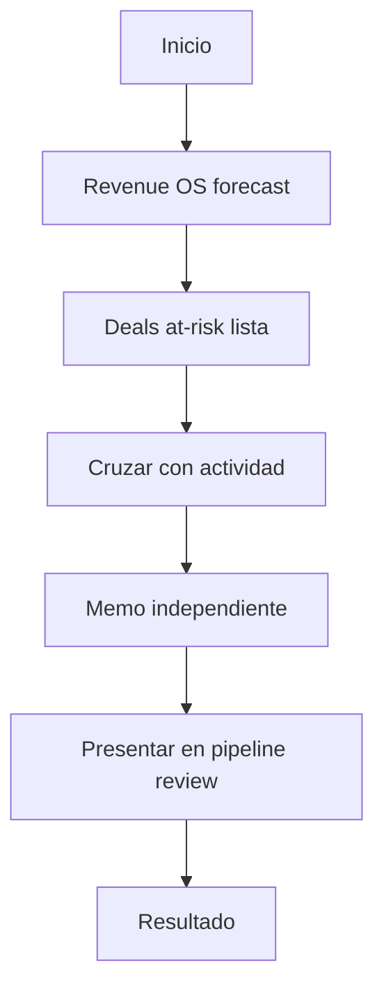

**Pasos detallados:**

1. Revenue OS forecast
   - *Verificación:* Registro actualizado y próximo paso con fecha.

2. Deals at-risk lista
   - *Verificación:* Registro actualizado y próximo paso con fecha.

3. Cruzar con actividad
   - *Verificación:* Registro actualizado y próximo paso con fecha.

4. Memo independiente
   - *Verificación:* Registro actualizado y próximo paso con fecha.

5. Presentar en pipeline review
   - *Verificación:* Registro actualizado y próximo paso con fecha.

**Resultado de negocio:** Forecast ajustado -5%; más realista.

**Cuadro de decisión:**

| Pregunta | Sí | No |
|----------|----|----|
| ¿Tengo contexto 360? | Continuar | Abrir Customer 360 primero |
| ¿Próximo paso definido? | Ejecutar | Crear tarea con fecha |
| ¿Requiere aprobación? | Trust Studio | Proceder |
| ¿Impacta forecast? | Notificar manager | Registrar y continuar |

**Errores comunes en este escenario:**

- Omitir registro de actividad antes de cambiar etapa.
- No definir dueño del siguiente paso.
- Ignorar alertas del Command Center relacionadas.

**Preguntas de reflexión:**

1. ¿Qué KPI de tu rol mejora si ejecutas bien este escenario?
2. ¿Qué habrías hecho diferente con un cliente VIP?
3. ¿Qué documentación dejó el siguiente rol listo para actuar?

**Práctica en entorno QA:**

- URL: http://164.68.99.83:8091
- Usuario: `viewer@autonomuscrm.local`
- Busca registros seed o crea datos de práctica con prefijo ACADEMY-

---

## Escenario 4.10 — Tendencia churn 6 meses

**Historia:** Churn subió de 2% a 4.5% en mid-market.

**Stakeholders:** Cliente · Tu equipo · Manager · (si aplica) Admin/SuperAdmin

**Precondiciones:** Acceso al entorno QA; Customer 360 disponible; mentor asignado si es primera vez.

**Tiempo estimado:** 45-90 minutos (incluye documentación en CRM).

**Flujo:**

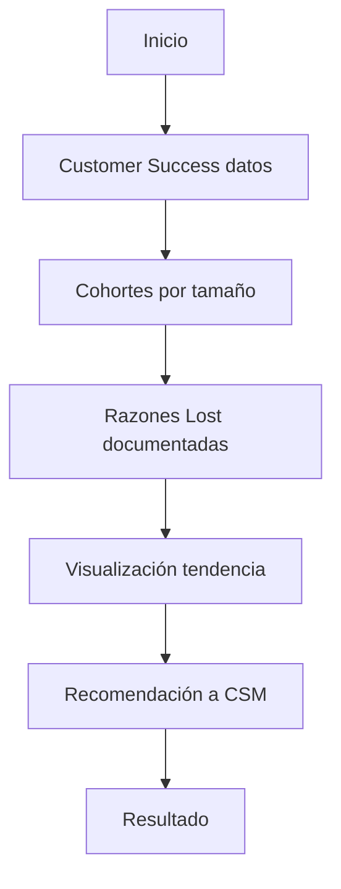

**Pasos detallados:**

1. Customer Success datos
   - *Verificación:* Registro actualizado y próximo paso con fecha.

2. Cohortes por tamaño
   - *Verificación:* Registro actualizado y próximo paso con fecha.

3. Razones Lost documentadas
   - *Verificación:* Registro actualizado y próximo paso con fecha.

4. Visualización tendencia
   - *Verificación:* Registro actualizado y próximo paso con fecha.

5. Recomendación a CSM
   - *Verificación:* Registro actualizado y próximo paso con fecha.

**Resultado de negocio:** Iniciativa retención mid-market lanzada.

**Cuadro de decisión:**

| Pregunta | Sí | No |
|----------|----|----|
| ¿Tengo contexto 360? | Continuar | Abrir Customer 360 primero |
| ¿Próximo paso definido? | Ejecutar | Crear tarea con fecha |
| ¿Requiere aprobación? | Trust Studio | Proceder |
| ¿Impacta forecast? | Notificar manager | Registrar y continuar |

**Errores comunes en este escenario:**

- Omitir registro de actividad antes de cambiar etapa.
- No definir dueño del siguiente paso.
- Ignorar alertas del Command Center relacionadas.

**Preguntas de reflexión:**

1. ¿Qué KPI de tu rol mejora si ejecutas bien este escenario?
2. ¿Qué habrías hecho diferente con un cliente VIP?
3. ¿Qué documentación dejó el siguiente rol listo para actuar?

**Práctica en entorno QA:**

- URL: http://164.68.99.83:8091
- Usuario: `viewer@autonomuscrm.local`
- Busca registros seed o crea datos de práctica con prefijo ACADEMY-

---

## Proceso maestro — Ciclo de vida del cliente

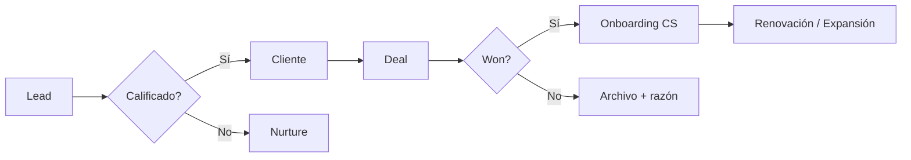

### Ejercicios Capítulo 4

- Ejecuta 2 escenarios en entorno QA con mentor validando cada paso.
- Para cada escenario, completa el cuadro de decisión antes de actuar.
- Escribe qué harías diferente si el cliente fuera VIP.

---

# Capítulo 5 — Errores más comunes

> Top 50 errores observados en adopción CRM enterprise — y cómo evitarlos.

### Error 1 — No registrar llamadas ni emails en el CRM

| | |
|---|---|
| **Consecuencia** | Pérdida de tiempo, forecast falso, riesgo de churn o incumplimiento. |
| **Prevención** | Checklist diario, mentoría día 1-7, usar plantillas del rol. |
| **Corrección** | Actualizar registro hoy; documentar lección en nota del cliente/deal. |

**Ejemplo en TechSolutions Panamá:** Un colega cometió este error; el impacto fue retraso de forecast 1 semana. La corrección inmediata fue actualizar Customer 360 y notificar al manager.

### Error 2 — Dejar leads sin contactar más de 24 horas

| | |
|---|---|
| **Consecuencia** | Pérdida de tiempo, forecast falso, riesgo de churn o incumplimiento. |
| **Prevención** | Checklist diario, mentoría día 1-7, usar plantillas del rol. |
| **Corrección** | Actualizar registro hoy; documentar lección en nota del cliente/deal. |

**Ejemplo en TechSolutions Panamá:** Un colega cometió este error; el impacto fue retraso de forecast 1 semana. La corrección inmediata fue actualizar Customer 360 y notificar al manager.

### Error 3 — Crear cliente duplicado en lugar de buscar en directorio

| | |
|---|---|
| **Consecuencia** | Pérdida de tiempo, forecast falso, riesgo de churn o incumplimiento. |
| **Prevención** | Checklist diario, mentoría día 1-7, usar plantillas del rol. |
| **Corrección** | Actualizar registro hoy; documentar lección en nota del cliente/deal. |

**Ejemplo en TechSolutions Panamá:** Un colega cometió este error; el impacto fue retraso de forecast 1 semana. La corrección inmediata fue actualizar Customer 360 y notificar al manager.

### Error 4 — Avanzar etapa de deal sin criterio de la etapa

| | |
|---|---|
| **Consecuencia** | Pérdida de tiempo, forecast falso, riesgo de churn o incumplimiento. |
| **Prevención** | Checklist diario, mentoría día 1-7, usar plantillas del rol. |
| **Corrección** | Actualizar registro hoy; documentar lección en nota del cliente/deal. |

**Ejemplo en TechSolutions Panamá:** Un colega cometió este error; el impacto fue retraso de forecast 1 semana. La corrección inmediata fue actualizar Customer 360 y notificar al manager.

### Error 5 — Cerrar deal Won sin fecha de inicio de contrato

| | |
|---|---|
| **Consecuencia** | Pérdida de tiempo, forecast falso, riesgo de churn o incumplimiento. |
| **Prevención** | Checklist diario, mentoría día 1-7, usar plantillas del rol. |
| **Corrección** | Actualizar registro hoy; documentar lección en nota del cliente/deal. |

**Ejemplo en TechSolutions Panamá:** Un colega cometió este error; el impacto fue retraso de forecast 1 semana. La corrección inmediata fue actualizar Customer 360 y notificar al manager.

### Error 6 — Ignorar alertas de deals en riesgo del Command Center

| | |
|---|---|
| **Consecuencia** | Pérdida de tiempo, forecast falso, riesgo de churn o incumplimiento. |
| **Prevención** | Checklist diario, mentoría día 1-7, usar plantillas del rol. |
| **Corrección** | Actualizar registro hoy; documentar lección en nota del cliente/deal. |

**Ejemplo en TechSolutions Panamá:** Un colega cometió este error; el impacto fue retraso de forecast 1 semana. La corrección inmediata fue actualizar Customer 360 y notificar al manager.

### Error 7 — No usar Customer 360 antes de reuniones importantes

| | |
|---|---|
| **Consecuencia** | Pérdida de tiempo, forecast falso, riesgo de churn o incumplimiento. |
| **Prevención** | Checklist diario, mentoría día 1-7, usar plantillas del rol. |
| **Corrección** | Actualizar registro hoy; documentar lección en nota del cliente/deal. |

**Ejemplo en TechSolutions Panamá:** Un colega cometió este error; el impacto fue retraso de forecast 1 semana. La corrección inmediata fue actualizar Customer 360 y notificar al manager.

### Error 8 — Dejar tareas vencidas sin reprogramar

| | |
|---|---|
| **Consecuencia** | Pérdida de tiempo, forecast falso, riesgo de churn o incumplimiento. |
| **Prevención** | Checklist diario, mentoría día 1-7, usar plantillas del rol. |
| **Corrección** | Actualizar registro hoy; documentar lección en nota del cliente/deal. |

**Ejemplo en TechSolutions Panamá:** Un colega cometió este error; el impacto fue retraso de forecast 1 semana. La corrección inmediata fue actualizar Customer 360 y notificar al manager.

### Error 9 — Aprobar decisiones de IA sin leer contexto en Trust Studio

| | |
|---|---|
| **Consecuencia** | Pérdida de tiempo, forecast falso, riesgo de churn o incumplimiento. |
| **Prevención** | Checklist diario, mentoría día 1-7, usar plantillas del rol. |
| **Corrección** | Actualizar registro hoy; documentar lección en nota del cliente/deal. |

**Ejemplo en TechSolutions Panamá:** Un colega cometió este error; el impacto fue retraso de forecast 1 semana. La corrección inmediata fue actualizar Customer 360 y notificar al manager.

### Error 10 — Rechazar todas las sugerencias de IA por costumbre

| | |
|---|---|
| **Consecuencia** | Pérdida de tiempo, forecast falso, riesgo de churn o incumplimiento. |
| **Prevención** | Checklist diario, mentoría día 1-7, usar plantillas del rol. |
| **Corrección** | Actualizar registro hoy; documentar lección en nota del cliente/deal. |

**Ejemplo en TechSolutions Panamá:** Un colega cometió este error; el impacto fue retraso de forecast 1 semana. La corrección inmediata fue actualizar Customer 360 y notificar al manager.

### Error 11 — No documentar razón al marcar deal como Lost

| | |
|---|---|
| **Consecuencia** | Pérdida de tiempo, forecast falso, riesgo de churn o incumplimiento. |
| **Prevención** | Checklist diario, mentoría día 1-7, usar plantillas del rol. |
| **Corrección** | Actualizar registro hoy; documentar lección en nota del cliente/deal. |

**Ejemplo en TechSolutions Panamá:** Un colega cometió este error; el impacto fue retraso de forecast 1 semana. La corrección inmediata fue actualizar Customer 360 y notificar al manager.

### Error 12 — Mezclar idiomas en notas sin etiqueta clara

| | |
|---|---|
| **Consecuencia** | Pérdida de tiempo, forecast falso, riesgo de churn o incumplimiento. |
| **Prevención** | Checklist diario, mentoría día 1-7, usar plantillas del rol. |
| **Corrección** | Actualizar registro hoy; documentar lección en nota del cliente/deal. |

**Ejemplo en TechSolutions Panamá:** Un colega cometió este error; el impacto fue retraso de forecast 1 semana. La corrección inmediata fue actualizar Customer 360 y notificar al manager.

### Error 13 — Compartir credenciales entre usuarios

| | |
|---|---|
| **Consecuencia** | Pérdida de tiempo, forecast falso, riesgo de churn o incumplimiento. |
| **Prevención** | Checklist diario, mentoría día 1-7, usar plantillas del rol. |
| **Corrección** | Actualizar registro hoy; documentar lección en nota del cliente/deal. |

**Ejemplo en TechSolutions Panamá:** Un colega cometió este error; el impacto fue retraso de forecast 1 semana. La corrección inmediata fue actualizar Customer 360 y notificar al manager.

### Error 14 — Exportar datos sensibles sin autorización

| | |
|---|---|
| **Consecuencia** | Pérdida de tiempo, forecast falso, riesgo de churn o incumplimiento. |
| **Prevención** | Checklist diario, mentoría día 1-7, usar plantillas del rol. |
| **Corrección** | Actualizar registro hoy; documentar lección en nota del cliente/deal. |

**Ejemplo en TechSolutions Panamá:** Un colega cometió este error; el impacto fue retraso de forecast 1 semana. La corrección inmediata fue actualizar Customer 360 y notificar al manager.

### Error 15 — Saltarse calificación BANT en leads enterprise

| | |
|---|---|
| **Consecuencia** | Pérdida de tiempo, forecast falso, riesgo de churn o incumplimiento. |
| **Prevención** | Checklist diario, mentoría día 1-7, usar plantillas del rol. |
| **Corrección** | Actualizar registro hoy; documentar lección en nota del cliente/deal. |

**Ejemplo en TechSolutions Panamá:** Un colega cometió este error; el impacto fue retraso de forecast 1 semana. La corrección inmediata fue actualizar Customer 360 y notificar al manager.

### Error 16 — No convertir lead calificado a cliente antes del cierre

| | |
|---|---|
| **Consecuencia** | Pérdida de tiempo, forecast falso, riesgo de churn o incumplimiento. |
| **Prevención** | Checklist diario, mentoría día 1-7, usar plantillas del rol. |
| **Corrección** | Actualizar registro hoy; documentar lección en nota del cliente/deal. |

**Ejemplo en TechSolutions Panamá:** Un colega cometió este error; el impacto fue retraso de forecast 1 semana. La corrección inmediata fue actualizar Customer 360 y notificar al manager.

### Error 17 — Handoff ventas a soporte sin nota de contexto

| | |
|---|---|
| **Consecuencia** | Pérdida de tiempo, forecast falso, riesgo de churn o incumplimiento. |
| **Prevención** | Checklist diario, mentoría día 1-7, usar plantillas del rol. |
| **Corrección** | Actualizar registro hoy; documentar lección en nota del cliente/deal. |

**Ejemplo en TechSolutions Panamá:** Un colega cometió este error; el impacto fue retraso de forecast 1 semana. La corrección inmediata fue actualizar Customer 360 y notificar al manager.

### Error 18 — Prometer funcionalidades no confirmadas con producto

| | |
|---|---|
| **Consecuencia** | Pérdida de tiempo, forecast falso, riesgo de churn o incumplimiento. |
| **Prevención** | Checklist diario, mentoría día 1-7, usar plantillas del rol. |
| **Corrección** | Actualizar registro hoy; documentar lección en nota del cliente/deal. |

**Ejemplo en TechSolutions Panamá:** Un colega cometió este error; el impacto fue retraso de forecast 1 semana. La corrección inmediata fue actualizar Customer 360 y notificar al manager.

### Error 19 — Usar probabilidad 90% en etapa Discovery

| | |
|---|---|
| **Consecuencia** | Pérdida de tiempo, forecast falso, riesgo de churn o incumplimiento. |
| **Prevención** | Checklist diario, mentoría día 1-7, usar plantillas del rol. |
| **Corrección** | Actualizar registro hoy; documentar lección en nota del cliente/deal. |

**Ejemplo en TechSolutions Panamá:** Un colega cometió este error; el impacto fue retraso de forecast 1 semana. La corrección inmediata fue actualizar Customer 360 y notificar al manager.

### Error 20 — No actualizar forecast después de cambio de etapa

| | |
|---|---|
| **Consecuencia** | Pérdida de tiempo, forecast falso, riesgo de churn o incumplimiento. |
| **Prevención** | Checklist diario, mentoría día 1-7, usar plantillas del rol. |
| **Corrección** | Actualizar registro hoy; documentar lección en nota del cliente/deal. |

**Ejemplo en TechSolutions Panamá:** Un colega cometió este error; el impacto fue retraso de forecast 1 semana. La corrección inmediata fue actualizar Customer 360 y notificar al manager.

### Error 21 — Ignorar políticas ABAC configuradas por Admin

| | |
|---|---|
| **Consecuencia** | Pérdida de tiempo, forecast falso, riesgo de churn o incumplimiento. |
| **Prevención** | Checklist diario, mentoría día 1-7, usar plantillas del rol. |
| **Corrección** | Actualizar registro hoy; documentar lección en nota del cliente/deal. |

**Ejemplo en TechSolutions Panamá:** Un colega cometió este error; el impacto fue retraso de forecast 1 semana. La corrección inmediata fue actualizar Customer 360 y notificar al manager.

### Error 22 — Crear workflows duplicados para el mismo trigger

| | |
|---|---|
| **Consecuencia** | Pérdida de tiempo, forecast falso, riesgo de churn o incumplimiento. |
| **Prevención** | Checklist diario, mentoría día 1-7, usar plantillas del rol. |
| **Corrección** | Actualizar registro hoy; documentar lección en nota del cliente/deal. |

**Ejemplo en TechSolutions Panamá:** Un colega cometió este error; el impacto fue retraso de forecast 1 semana. La corrección inmediata fue actualizar Customer 360 y notificar al manager.

### Error 23 — No revisar eventos fallidos en plataforma

| | |
|---|---|
| **Consecuencia** | Pérdida de tiempo, forecast falso, riesgo de churn o incumplimiento. |
| **Prevención** | Checklist diario, mentoría día 1-7, usar plantillas del rol. |
| **Corrección** | Actualizar registro hoy; documentar lección en nota del cliente/deal. |

**Ejemplo en TechSolutions Panamá:** Un colega cometió este error; el impacto fue retraso de forecast 1 semana. La corrección inmediata fue actualizar Customer 360 y notificar al manager.

### Error 24 — Dejar usuarios inactivos con acceso activo

| | |
|---|---|
| **Consecuencia** | Pérdida de tiempo, forecast falso, riesgo de churn o incumplimiento. |
| **Prevención** | Checklist diario, mentoría día 1-7, usar plantillas del rol. |
| **Corrección** | Actualizar registro hoy; documentar lección en nota del cliente/deal. |

**Ejemplo en TechSolutions Panamá:** Un colega cometió este error; el impacto fue retraso de forecast 1 semana. La corrección inmediata fue actualizar Customer 360 y notificar al manager.

### Error 25 — No cerrar tickets resueltos en Customer Success

| | |
|---|---|
| **Consecuencia** | Pérdida de tiempo, forecast falso, riesgo de churn o incumplimiento. |
| **Prevención** | Checklist diario, mentoría día 1-7, usar plantillas del rol. |
| **Corrección** | Actualizar registro hoy; documentar lección en nota del cliente/deal. |

**Ejemplo en TechSolutions Panamá:** Un colega cometió este error; el impacto fue retraso de forecast 1 semana. La corrección inmediata fue actualizar Customer 360 y notificar al manager.

### Error 26 — Escalar todo en lugar de usar playbooks

| | |
|---|---|
| **Consecuencia** | Pérdida de tiempo, forecast falso, riesgo de churn o incumplimiento. |
| **Prevención** | Checklist diario, mentoría día 1-7, usar plantillas del rol. |
| **Corrección** | Actualizar registro hoy; documentar lección en nota del cliente/deal. |

**Ejemplo en TechSolutions Panamá:** Un colega cometió este error; el impacto fue retraso de forecast 1 semana. La corrección inmediata fue actualizar Customer 360 y notificar al manager.

### Error 27 — No ejecutar playbook correcto para el tipo de incidente

| | |
|---|---|
| **Consecuencia** | Pérdida de tiempo, forecast falso, riesgo de churn o incumplimiento. |
| **Prevención** | Checklist diario, mentoría día 1-7, usar plantillas del rol. |
| **Corrección** | Actualizar registro hoy; documentar lección en nota del cliente/deal. |

**Ejemplo en TechSolutions Panamá:** Un colega cometió este error; el impacto fue retraso de forecast 1 semana. La corrección inmediata fue actualizar Customer 360 y notificar al manager.

### Error 28 — Perder SLA de primera respuesta en tickets P1

| | |
|---|---|
| **Consecuencia** | Pérdida de tiempo, forecast falso, riesgo de churn o incumplimiento. |
| **Prevención** | Checklist diario, mentoría día 1-7, usar plantillas del rol. |
| **Corrección** | Actualizar registro hoy; documentar lección en nota del cliente/deal. |

**Ejemplo en TechSolutions Panamá:** Un colega cometió este error; el impacto fue retraso de forecast 1 semana. La corrección inmediata fue actualizar Customer 360 y notificar al manager.

### Error 29 — No identificar sponsor económico en deals B2B

| | |
|---|---|
| **Consecuencia** | Pérdida de tiempo, forecast falso, riesgo de churn o incumplimiento. |
| **Prevención** | Checklist diario, mentoría día 1-7, usar plantillas del rol. |
| **Corrección** | Actualizar registro hoy; documentar lección en nota del cliente/deal. |

**Ejemplo en TechSolutions Panamá:** Un colega cometió este error; el impacto fue retraso de forecast 1 semana. La corrección inmediata fue actualizar Customer 360 y notificar al manager.

### Error 30 — Trabajar deals fuera del pipeline oficial

| | |
|---|---|
| **Consecuencia** | Pérdida de tiempo, forecast falso, riesgo de churn o incumplimiento. |
| **Prevención** | Checklist diario, mentoría día 1-7, usar plantillas del rol. |
| **Corrección** | Actualizar registro hoy; documentar lección en nota del cliente/deal. |

**Ejemplo en TechSolutions Panamá:** Un colega cometió este error; el impacto fue retraso de forecast 1 semana. La corrección inmediata fue actualizar Customer 360 y notificar al manager.

### Error 31 — No segmentar leads por fuente/campaña

| | |
|---|---|
| **Consecuencia** | Pérdida de tiempo, forecast falso, riesgo de churn o incumplimiento. |
| **Prevención** | Checklist diario, mentoría día 1-7, usar plantillas del rol. |
| **Corrección** | Actualizar registro hoy; documentar lección en nota del cliente/deal. |

**Ejemplo en TechSolutions Panamá:** Un colega cometió este error; el impacto fue retraso de forecast 1 semana. La corrección inmediata fue actualizar Customer 360 y notificar al manager.

### Error 32 — Importar CSV sin validar formato

| | |
|---|---|
| **Consecuencia** | Pérdida de tiempo, forecast falso, riesgo de churn o incumplimiento. |
| **Prevención** | Checklist diario, mentoría día 1-7, usar plantillas del rol. |
| **Corrección** | Actualizar registro hoy; documentar lección en nota del cliente/deal. |

**Ejemplo en TechSolutions Panamá:** Un colega cometió este error; el impacto fue retraso de forecast 1 semana. La corrección inmediata fue actualizar Customer 360 y notificar al manager.

### Error 33 — Borrar registros en lugar de marcar Lost/Inactivo

| | |
|---|---|
| **Consecuencia** | Pérdida de tiempo, forecast falso, riesgo de churn o incumplimiento. |
| **Prevención** | Checklist diario, mentoría día 1-7, usar plantillas del rol. |
| **Corrección** | Actualizar registro hoy; documentar lección en nota del cliente/deal. |

**Ejemplo en TechSolutions Panamá:** Un colega cometió este error; el impacto fue retraso de forecast 1 semana. La corrección inmediata fue actualizar Customer 360 y notificar al manager.

### Error 34 — No usar filtros guardados en listas grandes

| | |
|---|---|
| **Consecuencia** | Pérdida de tiempo, forecast falso, riesgo de churn o incumplimiento. |
| **Prevención** | Checklist diario, mentoría día 1-7, usar plantillas del rol. |
| **Corrección** | Actualizar registro hoy; documentar lección en nota del cliente/deal. |

**Ejemplo en TechSolutions Panamá:** Un colega cometió este error; el impacto fue retraso de forecast 1 semana. La corrección inmediata fue actualizar Customer 360 y notificar al manager.

### Error 35 — Ignorar señales de churn en Customer Success OS

| | |
|---|---|
| **Consecuencia** | Pérdida de tiempo, forecast falso, riesgo de churn o incumplimiento. |
| **Prevención** | Checklist diario, mentoría día 1-7, usar plantillas del rol. |
| **Corrección** | Actualizar registro hoy; documentar lección en nota del cliente/deal. |

**Ejemplo en TechSolutions Panamá:** Un colega cometió este error; el impacto fue retraso de forecast 1 semana. La corrección inmediata fue actualizar Customer 360 y notificar al manager.

### Error 36 — No preparar QBR con datos de Revenue OS

| | |
|---|---|
| **Consecuencia** | Pérdida de tiempo, forecast falso, riesgo de churn o incumplimiento. |
| **Prevención** | Checklist diario, mentoría día 1-7, usar plantillas del rol. |
| **Corrección** | Actualizar registro hoy; documentar lección en nota del cliente/deal. |

**Ejemplo en TechSolutions Panamá:** Un colega cometió este error; el impacto fue retraso de forecast 1 semana. La corrección inmediata fue actualizar Customer 360 y notificar al manager.

### Error 37 — Confundir MRR con valor total del deal

| | |
|---|---|
| **Consecuencia** | Pérdida de tiempo, forecast falso, riesgo de churn o incumplimiento. |
| **Prevención** | Checklist diario, mentoría día 1-7, usar plantillas del rol. |
| **Corrección** | Actualizar registro hoy; documentar lección en nota del cliente/deal. |

**Ejemplo en TechSolutions Panamá:** Un colega cometió este error; el impacto fue retraso de forecast 1 semana. La corrección inmediata fue actualizar Customer 360 y notificar al manager.

### Error 38 — No alinear fecha cierre con ciclo de compra del cliente

| | |
|---|---|
| **Consecuencia** | Pérdida de tiempo, forecast falso, riesgo de churn o incumplimiento. |
| **Prevención** | Checklist diario, mentoría día 1-7, usar plantillas del rol. |
| **Corrección** | Actualizar registro hoy; documentar lección en nota del cliente/deal. |

**Ejemplo en TechSolutions Panamá:** Un colega cometió este error; el impacto fue retraso de forecast 1 semana. La corrección inmediata fue actualizar Customer 360 y notificar al manager.

### Error 39 — Dejar campos obligatorios vacíos para ir rápido

| | |
|---|---|
| **Consecuencia** | Pérdida de tiempo, forecast falso, riesgo de churn o incumplimiento. |
| **Prevención** | Checklist diario, mentoría día 1-7, usar plantillas del rol. |
| **Corrección** | Actualizar registro hoy; documentar lección en nota del cliente/deal. |

**Ejemplo en TechSolutions Panamá:** Un colega cometió este error; el impacto fue retraso de forecast 1 semana. La corrección inmediata fue actualizar Customer 360 y notificar al manager.

### Error 40 — No sincronizar actividades con calendario del equipo

| | |
|---|---|
| **Consecuencia** | Pérdida de tiempo, forecast falso, riesgo de churn o incumplimiento. |
| **Prevención** | Checklist diario, mentoría día 1-7, usar plantillas del rol. |
| **Corrección** | Actualizar registro hoy; documentar lección en nota del cliente/deal. |

**Ejemplo en TechSolutions Panamá:** Un colega cometió este error; el impacto fue retraso de forecast 1 semana. La corrección inmediata fue actualizar Customer 360 y notificar al manager.

### Error 41 — Revisar solo email y olvidar Command Center

| | |
|---|---|
| **Consecuencia** | Pérdida de tiempo, forecast falso, riesgo de churn o incumplimiento. |
| **Prevención** | Checklist diario, mentoría día 1-7, usar plantillas del rol. |
| **Corrección** | Actualizar registro hoy; documentar lección en nota del cliente/deal. |

**Ejemplo en TechSolutions Panamá:** Un colega cometió este error; el impacto fue retraso de forecast 1 semana. La corrección inmediata fue actualizar Customer 360 y notificar al manager.

### Error 42 — No usar búsqueda global Ctrl+K

| | |
|---|---|
| **Consecuencia** | Pérdida de tiempo, forecast falso, riesgo de churn o incumplimiento. |
| **Prevención** | Checklist diario, mentoría día 1-7, usar plantillas del rol. |
| **Corrección** | Actualizar registro hoy; documentar lección en nota del cliente/deal. |

**Ejemplo en TechSolutions Panamá:** Un colega cometió este error; el impacto fue retraso de forecast 1 semana. La corrección inmediata fue actualizar Customer 360 y notificar al manager.

### Error 43 — Crear tareas genéricas sin vínculo a registro

| | |
|---|---|
| **Consecuencia** | Pérdida de tiempo, forecast falso, riesgo de churn o incumplimiento. |
| **Prevención** | Checklist diario, mentoría día 1-7, usar plantillas del rol. |
| **Corrección** | Actualizar registro hoy; documentar lección en nota del cliente/deal. |

**Ejemplo en TechSolutions Panamá:** Un colega cometió este error; el impacto fue retraso de forecast 1 semana. La corrección inmediata fue actualizar Customer 360 y notificar al manager.

### Error 44 — No nombrar deals con convención del equipo

| | |
|---|---|
| **Consecuencia** | Pérdida de tiempo, forecast falso, riesgo de churn o incumplimiento. |
| **Prevención** | Checklist diario, mentoría día 1-7, usar plantillas del rol. |
| **Corrección** | Actualizar registro hoy; documentar lección en nota del cliente/deal. |

**Ejemplo en TechSolutions Panamá:** Un colega cometió este error; el impacto fue retraso de forecast 1 semana. La corrección inmediata fue actualizar Customer 360 y notificar al manager.

### Error 45 — Ignorar capacitación de certificación operativa

| | |
|---|---|
| **Consecuencia** | Pérdida de tiempo, forecast falso, riesgo de churn o incumplimiento. |
| **Prevención** | Checklist diario, mentoría día 1-7, usar plantillas del rol. |
| **Corrección** | Actualizar registro hoy; documentar lección en nota del cliente/deal. |

**Ejemplo en TechSolutions Panamá:** Un colega cometió este error; el impacto fue retraso de forecast 1 semana. La corrección inmediata fue actualizar Customer 360 y notificar al manager.

### Error 46 — Operar en producción sin haber pasado examen del rol

| | |
|---|---|
| **Consecuencia** | Pérdida de tiempo, forecast falso, riesgo de churn o incumplimiento. |
| **Prevención** | Checklist diario, mentoría día 1-7, usar plantillas del rol. |
| **Corrección** | Actualizar registro hoy; documentar lección en nota del cliente/deal. |

**Ejemplo en TechSolutions Panamá:** Un colega cometió este error; el impacto fue retraso de forecast 1 semana. La corrección inmediata fue actualizar Customer 360 y notificar al manager.

### Error 47 — No reportar bugs o fricción UX a Admin

| | |
|---|---|
| **Consecuencia** | Pérdida de tiempo, forecast falso, riesgo de churn o incumplimiento. |
| **Prevención** | Checklist diario, mentoría día 1-7, usar plantillas del rol. |
| **Corrección** | Actualizar registro hoy; documentar lección en nota del cliente/deal. |

**Ejemplo en TechSolutions Panamá:** Un colega cometió este error; el impacto fue retraso de forecast 1 semana. La corrección inmediata fue actualizar Customer 360 y notificar al manager.

### Error 48 — Asumir permisos de otro rol sin verificar

| | |
|---|---|
| **Consecuencia** | Pérdida de tiempo, forecast falso, riesgo de churn o incumplimiento. |
| **Prevención** | Checklist diario, mentoría día 1-7, usar plantillas del rol. |
| **Corrección** | Actualizar registro hoy; documentar lección en nota del cliente/deal. |

**Ejemplo en TechSolutions Panamá:** Un colega cometió este error; el impacto fue retraso de forecast 1 semana. La corrección inmediata fue actualizar Customer 360 y notificar al manager.

### Error 49 — No leer Quick Start impreso del primer día

| | |
|---|---|
| **Consecuencia** | Pérdida de tiempo, forecast falso, riesgo de churn o incumplimiento. |
| **Prevención** | Checklist diario, mentoría día 1-7, usar plantillas del rol. |
| **Corrección** | Actualizar registro hoy; documentar lección en nota del cliente/deal. |

**Ejemplo en TechSolutions Panamá:** Un colega cometió este error; el impacto fue retraso de forecast 1 semana. La corrección inmediata fue actualizar Customer 360 y notificar al manager.

### Error 50 — Mezclar datos de prueba con producción en demos

| | |
|---|---|
| **Consecuencia** | Pérdida de tiempo, forecast falso, riesgo de churn o incumplimiento. |
| **Prevención** | Checklist diario, mentoría día 1-7, usar plantillas del rol. |
| **Corrección** | Actualizar registro hoy; documentar lección en nota del cliente/deal. |

**Ejemplo en TechSolutions Panamá:** Un colega cometió este error; el impacto fue retraso de forecast 1 semana. La corrección inmediata fue actualizar Customer 360 y notificar al manager.

### Ejercicios Capítulo 5

- Auto-evaluación: ¿cuántos de los 50 errores cometiste la semana pasada?
- Crea tu checklist personal de 10 errores a evitar.
- Role-play: compañero simula error; tú aplicas prevención y corrección.

---

# Capítulo 6 — Indicadores de desempeño

## KPIs de tu rol

| KPI | Meta sugerida | Dónde medir | Alerta si... |
|-----|---------------|-------------|--------------|
| Informes entregados a tiempo | Definir con manager | Command / Revenue / CS | Tendencia 2 semanas negativa |
| Alertas válidas generadas | Definir con manager | Command / Revenue / CS | Tendencia 2 semanas negativa |
| Precisión de lectura de KPIs | Definir con manager | Command / Revenue / CS | Tendencia 2 semanas negativa |
| Adopción de rutina de revisión diaria | Definir con manager | Command / Revenue / CS | Tendencia 2 semanas negativa |

## Interpretación ejecutiva

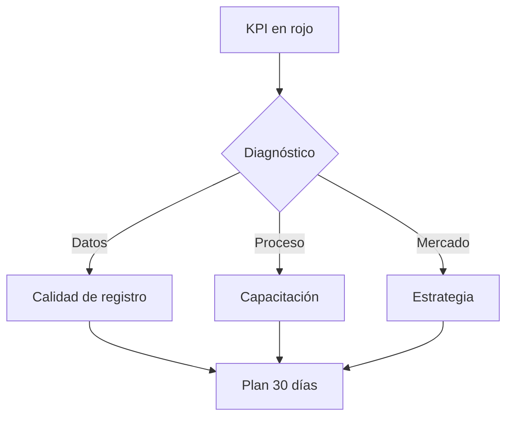

### Profundización por KPI

#### Informes entregados a tiempo

**Definición de negocio:** Métrica acordada con tu manager que refleja contribución del rol.

**Ritual de medición:** Revisar al cierre de jornada (17:30) y en stand-up semanal.

**Acción si está en rojo:** Diagnóstico en 24h; plan de mejora documentado en tarea vinculada.

**Pregunta para tu manager:** ¿Cuál es la meta numérica este trimestre?

#### Alertas válidas generadas

**Definición de negocio:** Métrica acordada con tu manager que refleja contribución del rol.

**Ritual de medición:** Revisar al cierre de jornada (17:30) y en stand-up semanal.

**Acción si está en rojo:** Diagnóstico en 24h; plan de mejora documentado en tarea vinculada.

**Pregunta para tu manager:** ¿Cuál es la meta numérica este trimestre?

#### Precisión de lectura de KPIs

**Definición de negocio:** Métrica acordada con tu manager que refleja contribución del rol.

**Ritual de medición:** Revisar al cierre de jornada (17:30) y en stand-up semanal.

**Acción si está en rojo:** Diagnóstico en 24h; plan de mejora documentado en tarea vinculada.

**Pregunta para tu manager:** ¿Cuál es la meta numérica este trimestre?

#### Adopción de rutina de revisión diaria

**Definición de negocio:** Métrica acordada con tu manager que refleja contribución del rol.

**Ritual de medición:** Revisar al cierre de jornada (17:30) y en stand-up semanal.

**Acción si está en rojo:** Diagnóstico en 24h; plan de mejora documentado en tarea vinculada.

**Pregunta para tu manager:** ¿Cuál es la meta numérica este trimestre?

### Plan de mejora personal (plantilla)

1. KPI más débil esta semana: ___________
2. Causa raíz probable: ___________
3. Acción concreta mañana: ___________
4. Fecha de revisión con manager: ___________

### Ejercicios Capítulo 6

- Define meta numérica para tu KPI #1 con tu manager.
- Identifica en qué pantalla medirás cada KPI esta semana.
- Redacta plan de mejora 30 días para tu KPI más débil.

---

# Capítulo 7 — Uso de IA en tu rol

## IA para usuarios de negocio (sin tecnicismos)

AutonomusCRM integra IA como **copiloto operativo**: detecta riesgos, sugiere acciones y automatiza tareas repetitivas. **Tú** conservas la decisión final en Trust Studio.

| Capacidad IA | Beneficio | Riesgo si se ignora | Riesgo si se abusa |
|--------------|-----------|---------------------|---------------------|
| Detección deals en riesgo | Salvar ingresos | Churn de pipeline | Falsos positivos sin revisión |
| Sugerencias Workforce | Ahorro de tiempo | Burnout manual | Automatizar sin política |
| Aprobación HITL | Control y cumplimiento | Decisiones no auditadas | Cuello de botella si no revisas |

### Escenario IA — Anomalía en dashboard

IA señala pico inusual pipeline. Investigas lectura; alertas manager con evidencia.

**Tu decisión:** Aprobar · Rechazar · Escalar — siempre con nota de negocio.

### Escenario IA — Resumen ejecutivo auto

Borrador narrativa semanal. Validas cifras en Revenue OS antes de distribuir.

**Tu decisión:** Aprobar · Rechazar · Escalar — siempre con nota de negocio.

### Escenario IA 7.1 — Command Center

El Command Center muestra *3 decisiones pendientes*. Abres Trust Studio, lees el contexto de cada una, apruebas 2 y rechazas 1 porque contradice política comercial. **Eso es operación enterprise con IA responsable.**

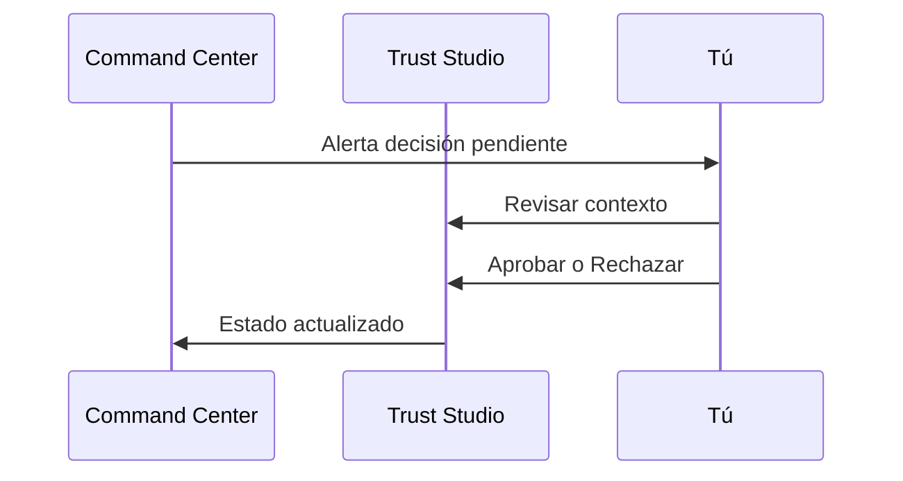

### Ejercicios Capítulo 7

- Lista 3 tareas delegables a IA y 3 que nunca delegarías.
- Procesa 5 decisiones en Trust Studio (entorno QA) con nota de criterio.
- Discute con manager: ¿dónde está el límite de automatización en tu rol?

---

# Capítulo 8 — Certificación operativa

## Checklist de competencias

- [ ] Inicio de sesión y navegación sin ayuda
- [ ] Explicar Command Center en lenguaje de negocio
- [ ] Usar Customer 360 antes de reunión simulada
- [ ] Completar jornada tipo Capítulo 3 en entorno de práctica
- [ ] Aprobar/rechazar decisión IA con criterio
- [ ] Identificar 10 errores del Capítulo 5 en simulación

## Criterios de aprobación

| Componente | Peso | Mínimo |
|------------|------|--------|
| Examen teórico | 30% | 80% |
| Casos prácticos | 40% | 3/4 aprobados |
| Checklist operativo | 20% | 100% ítems críticos |
| Observación manager | 10% | Satisfactorio |

**Examen completo:** ver `ROLE_CERTIFICATION_EXAMS.md` — sección **Analista / Observador**.

### Ejercicios Capítulo 8

- Completa checklist competencias al 100% ítems críticos.
- Simula examen: responde 10 preguntas muestra sin consultar guía.
- Solicita observación manager en operación real 2h.

### FAQ de certificación

**¿Puedo reintentar el examen?** Sí, tras 5 días y revisión con mentor.

**¿El entorno QA es el mismo que producción?** Misma interfaz; datos de práctica.

**¿Contraseña práctica?** `AutonomusTest123!`

---

*AutonomusCRM Enterprise Academy — Analista / Observador — Documento generado para capacitación operativa.*
