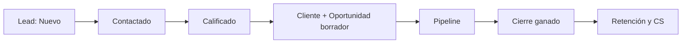
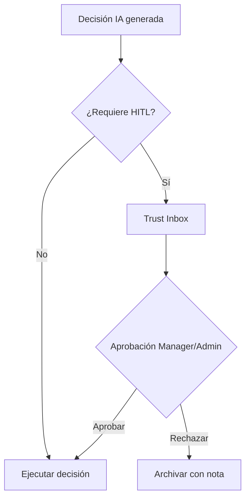
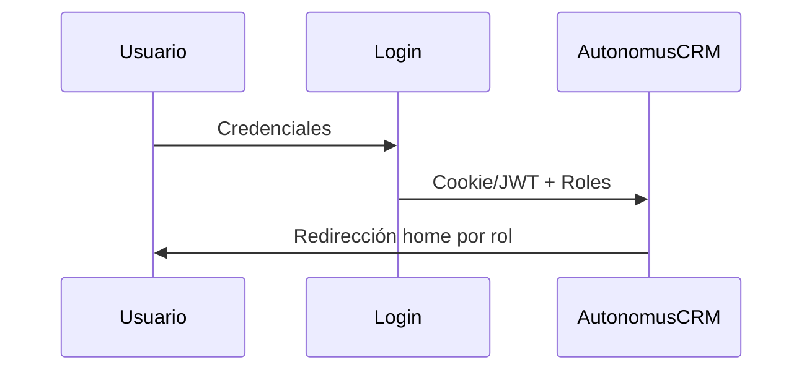

<div align="center">

# AutonomusCRM

## Guía de Operaciones — Administrador

**Versión:** 2.0.0  
**Fecha de publicación:** 5 de junio de 2026  
**Autor:** AutonomusCRM Enterprise Documentation Team  
**Rol objetivo:** Admin  
**Clasificación:** Confidencial — Uso interno y clientes autorizados

---

*Documentación corporativa — Estándar Salesforce / Microsoft Dynamics 365*

</div>

---

## Control de versiones

| Versión | Fecha | Autor | Descripción |
|---------|-------|-------|-------------|
| 1.0.0 | 2026-06-05 | Enterprise Documentation Team | Publicación inicial basada en código |
| 2.0.0 | 5 de junio de 2026 | Enterprise Documentation Team | Transformación corporativa: estructura, diagramas, callouts, glosario |

---

## Tabla de contenido

*Índice generado automáticamente — ver encabezados numerados del documento.*

1. Introducción
2. Cuerpo del documento (capítulos originales transformados)
3. Diagramas de referencia
4. Glosario corporativo
5. Apéndices

---

## 1. Introducción

### 1.1 Objetivo del documento

Usuarios, settings, audit, integraciones, incidentes

### 1.2 Audiencia

Administradores operativos

### 1.3 Alcance

Este documento cubre **únicamente funcionalidades verificadas** en el código fuente de AutonomusCRM. No describe módulos inexistentes ni roles no implementados.

### 1.4 Prerrequisitos

| Requisito | Detalle |
|-----------|---------|
| Acceso | Cuenta activa en el tenant AutonomusCRM |
| Navegador | Chrome, Edge o Firefox actualizado |
| Rol | Según matriz en `ROLE_PERMISSION_MATRIX.md` |
| Conocimientos | Ninguno técnico requerido para roles operativos |

### 1.5 Definiciones clave

Consulte el **Glosario corporativo** al final del documento. Términos críticos: Lead, Customer, Deal, Pipeline, Tenant, Revenue OS.

> **NOTA:** La interfaz admite español (ES) e inglés (EN). Las rutas técnicas (`/Leads`, `/Deals`) se conservan por trazabilidad al producto.

[CAPTURA: Pantalla de inicio de sesión — /Account/Login]

---

## 2. Cuerpo del documento

# Guía de Operaciones Administrativas — AutonomusCRM

**Audiencia:** Administradores (`Admin`) y gerentes operativos (`Manager`)  
**Versión:** Enterprise · Basada en código fuente verificado  
**Roles con acceso administrativo UI:** `Admin`, `Manager` (alcance diferenciado según sección)

---

## 1. Alcance del administrador

El rol **Admin** concentra la gobernanza del tenant: usuarios, configuración, auditoría, integraciones, eventos fallidos, MFA, facturación y aprovisionamiento de tenants vía API. El rol **Manager** comparte la mayoría de pantallas operativas (usuarios, settings, políticas, auditoría, integraciones) pero **no** puede crear tenants ni usuarios vía **Crear un nuevo usuario** (API administrativa) / **Provisionar un nuevo tenant** (API administrativa) (política `RequireAdmin`).

| Área | Ruta / API | Admin | Manager |
|------|------------|:-----:|:-------:|
| Usuarios UI | `/Users`, `/Users/*` | ✅ | ✅ |

[CAPTURA: Gestión de usuarios — /Users]
| Crear usuario API | **Crear un nuevo usuario** (API administrativa) | ✅ | ❌ |
| Settings | `/Settings` | ✅ | ✅ |
| Políticas ABAC | `/Policies` | ✅ | ✅ |
| Auditoría | `/Audit` | ✅ | ✅ |
| Integraciones | `/Integrations` | ✅ | ✅ |
| Eventos fallidos | `/FailedEvents` | ✅ | ✅ |
| Facturación | `/billing` | ✅ | ✅* |
| Provisioning tenant | **Provisionar un nuevo tenant** (API administrativa) | ✅ | ❌ |
| MFA por usuario | `POST /api/users/{id}/enable-mfa` | ✅ | ✅* |

\*Acceso autenticado; restricciones de negocio pueden aplicar según política interna del tenant.

---

## 2. Gestión de usuarios

### 2.1 Pantalla principal (`/Users`)
Muestra resumen operativo del tenant:

- Total de usuarios, activos, con MFA habilitado y con roles asignados.
- Listado filtrable por email, nombre y rol.
- Acceso a creación, edición, importación masiva y asignación de roles.

### 2.2 Crear usuario (UI)
1. Ir a `/Users/Create`.
2. Completar: email, contraseña, nombre y apellido (opcionales).
3. El comando `CreateUserCommand` crea el usuario en el tenant actual.
4. Asignar rol en `/Users/Roles` o `/Users/Edit/{id}`.

**Roles disponibles en el sistema** (definidos en `Users/Roles.cshtml.cs`):

`Admin` · `Manager` · `Sales` · `Support` · `Viewer`

### 2.3 Crear usuario (API)
```http
POST /api/users
Authorization: Bearer {token_admin}
Content-Type: application/json

{
  "tenantId": "{guid}",
  "email": "nuevo@empresa.com",
  "password": "ContraseñaSegura123!",
  "firstName": "Nombre",
  "lastName": "Apellido"
}
```

Requiere política `RequireAdmin`. Devuelve `201 Created` con el `userId`.

### 2.4 Asignación y retiro de roles
- **UI:** `/Users/Roles` — vista consolidada de usuarios por rol.
- **Comandos de dominio:** `AddUserRoleCommand`, `RemoveUserRoleCommand`, `AssignRoleCommand`.
- > **BUENA PRÁCTICA** asignar el rol mínimo necesario (`Sales` para vendedores, `Viewer` para consulta, `Support` para post-venta).

### 2.5 Activar / desactivar usuarios
`ToggleUserStatusCommand` permite habilitar o deshabilitar cuentas sin eliminar historial. Usuarios inactivos no pueden autenticarse.

### 2.6 Importación masiva
`/Users/Import` acepta archivos para cargar usuarios en lote. Validar formato y revisar `/Audit` tras importaciones masivas.

---

## 3. Configuración del tenant (`/Settings`)

**Autorización:** `[Authorize(Roles = "Admin,Manager")]`

### 3.1 Datos del tenant
Actualización vía `UpdateTenantCommand`:

- Nombre del tenant
- Email de contacto
- Región (`us-east-1` por defecto)
- Zona horaria (`America/Panama` por defecto)

### 3.2 Configuración del sistema
Parámetros persistidos con `UpdateSystemSettingsCommand`:

| Clave | Descripción | Valor por defecto |
|-------|-------------|-------------------|
| `MfaRequired` | MFA obligatorio para el tenant | `true` |
| `KillSwitch` | Desactiva operaciones autónomas | `false` |
| `MinConfidence` | Umbral mínimo de confianza IA | `0.75` |
| `OperationMode` | Modo de operación autónoma | `Supervised` |
| `Region` | Región del tenant | `us-east-1` |
| `TimeZone` | Zona horaria | `America/Panama` |

### 3.3 Exportar / importar configuración
- **Exportar:** genera JSON con tenant + settings + timestamp.
- **Importar:** restaura settings desde JSON exportado previamente.
- **Restaurar defaults:** revierte a valores de fábrica documentados arriba.

---

## 4. Autenticación multifactor (MFA)

### 4.1 MFA a nivel tenant
En `/Settings`, la clave `MfaRequired` define si el MFA es obligatorio u opcional para todos los usuarios del tenant.

### 4.2 MFA por usuario
- Campo `MfaEnabled` y `MfaSecret` en entidad `User`.
- Resumen visible en `/Users` (contador de usuarios con MFA).
- **Habilitar vía API:**

```http
POST /api/users/{userId}/enable-mfa?tenantId={tenantGuid}
```

Devuelve `EnableMfaResult` con datos para configurar el autenticador TOTP.

### 4.3 Flujo de login con MFA
1. Usuario ingresa credenciales en `/Account/Login`.
2. Si `RequiresMfa`, se muestra paso adicional con código TOTP.
3. Verificación vía `VerifyMfaCommand` y `MfaTempToken`.

### 4.4 Operaciones recomendadas
- Habilitar `MfaRequired = true` en producción.
- Auditar usuarios sin MFA en `/Users` semanalmente.
- Rotar credenciales demo (`{Rol}123!`) antes de exponer el entorno.

---

## 5. Auditoría (`/Audit`)

Sistema de **event sourcing** basado en `IEventStore` y `GetAuditEventsQuery`.

### 5.1 Capacidades
- Listado de eventos de dominio por tenant (hasta 1 000 por consulta).
- Filtros por tipo de evento, rango de fechas.
- Métricas: total de eventos, eventos del día, distribución por tipo.

### 5.2 Cuándo consultar auditoría
| Escenario | Acción |
|-----------|--------|
| Cambio de rol o usuario nuevo | Filtrar eventos de usuario |
| Cierre de deal inesperado | Buscar `DealClosedEvent` |
| Decisión IA ejecutada | Revisar eventos autónomos + `/TrustInbox` |
| Importación masiva | Verificar volumen y tipos post-import |
| Incidente de seguridad | Exportar rango de fechas para análisis |

### 5.3 Retención
Los eventos se almacenan en el event store del tenant. No eliminar eventos manualmente; usar filtros para investigación.

---

## 6. Integraciones (`/Integrations`)

### 6.1 Proveedores soportados
| Proveedor | Constante | Modo de conexión |
|-----------|-----------|------------------|
| HubSpot | `HubSpot` | OAuth o token manual |
| Salesforce | `Salesforce` | OAuth o token manual |
| Gmail | `Gmail` | OAuth |
| Outlook | `Outlook` | OAuth |
| Stripe | `Stripe` | API key |

### 6.2 Operaciones
1. **Conectar:** OAuth (`OnGetOAuthAsync`) o conexión manual con tokens/API key.
2. **Sincronizar:** `SyncProviderAsync` — reporta `pull`, `push` y `errors`.
3. **Desconectar:** elimina la conexión del tenant.
4. **Health Center:** dashboard de salud de integraciones activas.

### 6.3 Callback OAuth
`/Integrations/OAuthCallback` procesa el retorno del proveedor y persiste la conexión.

### 6.4 Buenas prácticas
- Verificar health después de cada sync.
- Documentar credenciales en gestor de secretos, no en tickets.
- Revisar `/FailedEvents` si sync reporta errores recurrentes.

---

## 7. Eventos fallidos (`/FailedEvents`)

Cola de mensajes no procesados (DLQ) gestionada por `IFailedEventReplayService`.

### 7.1 Pantalla
- Lista hasta 100 eventos fallidos del tenant.
- Muestra tipo, payload, fecha y estado.

### 7.2 Reprocesar evento
1. Identificar evento en la lista.
2. Clic en **Replay** → `MarkReplayRequestedAsync`.
3. El worker reintenta el procesamiento.
4. Verificar en `/Audit` que el evento se procesó correctamente.

### 7.3 Escalamiento
Si un evento falla repetidamente tras replay:

1. Revisar logs del worker.
2. Validar integración relacionada en `/Integrations`.
3. Contactar soporte técnico con `eventId` y tipo de evento.

---

## 8. Facturación (`/billing`)

Dashboard de suscripción vía `IBillingDashboardService`.

### 8.1 Información disponible
- Estado de suscripción del tenant.
- Métricas de facturación (según integración Stripe configurada).
- Plan activo y límites.

### 8.2 Dependencia Stripe
La facturación real requiere conexión Stripe en `/Integrations`. Sin Stripe conectado, el dashboard puede mostrar estado vacío.

---

## 9. API de tenants

### 9.1 Crear tenant
```http
POST /api/tenants
Authorization: Bearer {token_admin}
Content-Type: application/json

{
  "name": "Nueva Empresa S.A.",
  "description": "Tenant productivo"
}
```

- Requiere `RequireAdmin`.
- Ejecuta `CreateTenantCommand` y provisiona admin inicial vía `TenantProvisioningService`.
- Devuelve `201 Created` con `tenantId`.

### 9.2 Consultar tenant
```http
GET /api/tenants/{id}
```

Devuelve `TenantDto` o `404 Not Found`.

---

## 10. Políticas de control (`/Policies`)

Motor ABAC para reglas de negocio configurables.

- Crear, editar, importar y duplicar políticas.
- Las políticas `RequireAdmin`, `RequireManager`, `RequireSales` están registradas en `AuthorizationPolicies` pero su uso en endpoints es limitado — **no sustituyen** la revisión manual de permisos UI.

---

## 11. Checklist operativo diario (Admin)

| Hora | Tarea | Ruta |
|------|-------|------|
| Inicio | Revisar eventos fallidos | `/FailedEvents` |
| Inicio | Verificar health integraciones | `/Integrations` |
| Mediodía | Auditar cambios del día | `/Audit` |
| Semanal | Revisar usuarios sin MFA | `/Users` |
| Semanal | Validar settings y kill-switch | `/Settings` |
| Mensual | Revisar facturación | `/billing` |

---

## 12. Riesgos documentados (del código)

1. **> **RIESGO** Brecha UI vs API:** control de escritura comercial del sistema bloquea escritura comercial UI para `Viewer`/`Support`, pero controllers comerciales API no filtran por rol en todos los endpoints.
2. **AssignRole sin whitelist estricta:** el dominio acepta strings de rol arbitrarios; validar en UI antes de asignar.
3. **Credenciales demo:** patrón `{Rol}123!` en seed local — rotar en producción.

---

## 13. Contactos de escalamiento

| Tipo de incidente | Escalar a |
|-------------------|-----------|
| Usuario bloqueado / MFA | Admin del tenant |
| Integración caída | Admin + proveedor externo |
| Eventos fallidos persistentes | Equipo técnico / DevOps |
| > **RIESGO** Brecha de seguridad | Admin + auditoría `/Audit` |

---

*Documento generado a partir de: `UsersController`, `TenantsController`, `Settings.cshtml.cs`, `Audit.cshtml.cs`, `Integrations.cshtml.cs`, `FailedEvents.cshtml.cs`, `Billing.cshtml.cs`, `DemoRoleUsers.cs`, `AuthorizationPolicies.cs`.*

---

## 3. Diagramas de referencia


### Diagramas de referencia

#### Ciclo de vida del Lead


#### Flujo de aprobación Trust Studio


#### Flujo de autenticación



---

## 4. Glosario corporativo


## Glosario corporativo

| Término | Definición |
|---------|------------|
| **CRM** | Customer Relationship Management — sistema para registrar y medir relaciones comerciales |
| **Lead** | Prospecto o contacto potencial; entidad inicial del embudo |
| **Customer** | Cuenta o cliente en el directorio del tenant |
| **Opportunity / Deal** | Oportunidad de venta con monto, etapa y probabilidad |
| **Pipeline** | Conjunto de oportunidades abiertas y sus etapas en `/Deals` |
| **Forecast** | Proyección ponderada: monto × probabilidad por ventana de cierre |
| **Workflow** | Automatización configurable: trigger + condiciones + acciones |
| **Tenant** | Organización aislada; todos los datos pertenecen a un TenantId |
| **Trust Studio** | Buzón HITL en `/TrustInbox` para aprobar decisiones de IA |
| **Revenue OS** | Módulo de ingresos en `/revenue` — priorización y fugas |
| **Executive OS** | Tablero ejecutivo en `/executive` |
| **MFA** | Autenticación multifactor configurable en Settings |
| **ABAC** | Attribute-Based Access Control — políticas en `/Policies` (no sustituye RBAC) |
| **Customer Success** | Módulo post-venta en `/customer-success` (no es un rol) |
| **Churn** | Abandono del cliente; predicción ML en Customer 360 |
| **LTV** | Lifetime Value — valor acumulado del cliente |
| **Upsell** | Venta adicional al mismo cliente (expansión) |
| **Cross-Sell** | Venta de productos complementarios |
| **Playbook** | Secuencia automatizada: onboarding, rescue, re-engagement |
| **AI Agent** | Agente autónomo en `/Agents` (LeadIntelligence, Communication, etc.) |
| **Semantic Memory** | Memoria empresarial en `/Memory` |
| **Outcome Fabric** | Atribución de resultados en `/command/outcomes` |
| **HITL** | Human-in-the-Loop — supervisión humana de decisiones IA |
| **SLA** | Acuerdo de nivel de servicio (ej. contacto lead en 24 h) |
| **DLQ** | Dead Letter Queue — eventos fallidos en `/FailedEvents` |


---

## 5. Apéndices

### 5.1 Referencias cruzadas

| Documento | Ubicación |
|-----------|-----------|
| Matriz de permisos | `Documentation/ROLE_PERMISSION_MATRIX.md` |
| Descubrimiento de roles | `Documentation/ROLE_DISCOVERY_REPORT.md` |
| Manual maestro | `docs/manual-empresarial-autonomuscrm/` |

### 5.2 Pie de documento

| Campo | Valor |
|-------|-------|
| Producto | AutonomusCRM |
| Versión documento | 2.0.0 |
| Clasificación | Confidencial — Uso interno y clientes autorizados |
| Fuente | Código verificado — sin funcionalidades inventadas |

---

*© AutonomusCRM — Documentación Enterprise. Listo para impresión PDF y capacitación corporativa.*

