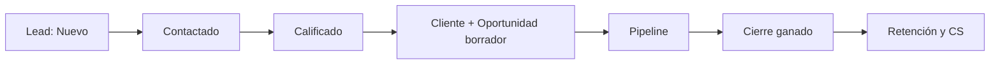
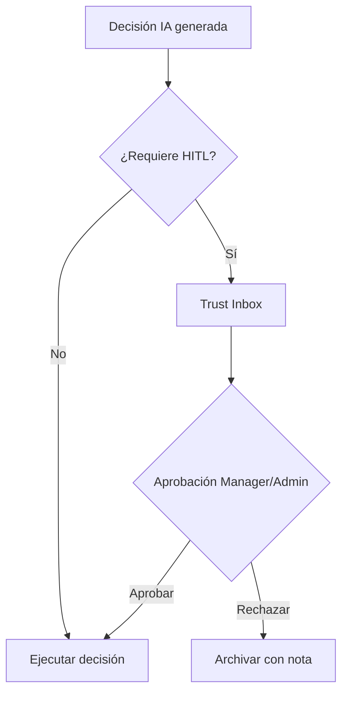
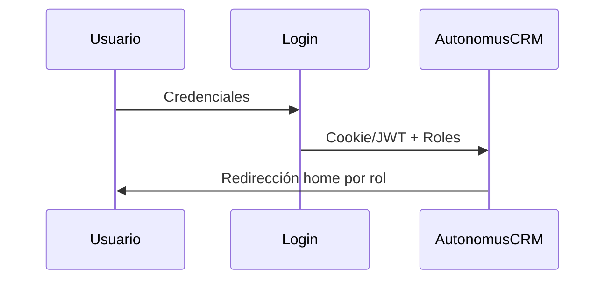

<div align="center">

# AutonomusCRM

## Playbook — Customer Success

**Versión:** 2.0.0  
**Fecha de publicación:** 5 de junio de 2026  
**Autor:** AutonomusCRM Enterprise Documentation Team  
**Rol objetivo:** Support  
**Clasificación:** Confidencial — Uso interno y clientes autorizados

---

*Documentación corporativa — Estándar Salesforce / Microsoft Dynamics 365*

</div>

---

## Control de versiones

| Versión | Fecha | Autor | Descripción |
|---------|-------|-------|-------------|
| 1.0.0 | 2026-06-05 | Enterprise Documentation Team | Publicación inicial basada en código |
| 2.0.0 | 5 de junio de 2026 | Enterprise Documentation Team | Transformación corporativa: estructura, diagramas, callouts, glosario |

---

## Tabla de contenido

*Índice generado automáticamente — ver encabezados numerados del documento.*

1. Introducción
2. Cuerpo del documento (capítulos originales transformados)
3. Diagramas de referencia
4. Glosario corporativo
5. Apéndices

---

## 1. Introducción

### 1.1 Objetivo del documento

Onboarding, rescue, re-engagement y retención

### 1.2 Audiencia

Customer Success y soporte post-venta

### 1.3 Alcance

Este documento cubre **únicamente funcionalidades verificadas** en el código fuente de AutonomusCRM. No describe módulos inexistentes ni roles no implementados.

### 1.4 Prerrequisitos

| Requisito | Detalle |
|-----------|---------|
| Acceso | Cuenta activa en el tenant AutonomusCRM |
| Navegador | Chrome, Edge o Firefox actualizado |
| Rol | Según matriz en `ROLE_PERMISSION_MATRIX.md` |
| Conocimientos | Ninguno técnico requerido para roles operativos |

### 1.5 Definiciones clave

Consulte el **Glosario corporativo** al final del documento. Términos críticos: Lead, Customer, Deal, Pipeline, Tenant, Revenue OS.

> **NOTA:** La interfaz admite español (ES) e inglés (EN). Las rutas técnicas (`/Leads`, `/Deals`) se conservan por trazabilidad al producto.

[CAPTURA: Pantalla de inicio de sesión — /Account/Login]

---

## 2. Cuerpo del documento

# Playbook de Customer Success — AutonomusCRM

[CAPTURA: Customer Success OS — /customer-success]

**Audiencia:** Equipo de soporte con rol `Support` que opera el **módulo** Customer Success  
**Ruta principal:** `/customer-success`  
> **IMPORTANTE** Customer Success es un **módulo funcional**, no un rol de sistema. Los roles disponibles son: `Admin`, `Manager`, `Sales`, `Support`, `Viewer`.

---

## 1. Arquitectura del módulo

Customer Success OS (`ICustomerSuccessOsService`) orquesta:

| Motor | Responsabilidad |
|-------|-----------------|
| `ICustomerHealthEngine` | Health score: Healthy, Warning, Critical |
| `IChurnRiskEngine` | Detección de señales de abandono |
| `IRenewalEngine` | Ventanas de renovación 90/60/30 días |
| `IExpansionRevenueEngine` | Oportunidades de upsell/cross-sell |
| `ICustomerPlaybookService` | Ejecución de playbooks con tareas |
| `IRetentionAutomationEngine` | Automatización post-cierre de deals |

Los tickets y casos se persisten como `WorkflowTask` con tipos `CS_Ticket` y `CS_Case_*`.

---

## 2. Playbook: Onboarding

**Código:** `CustomerSuccessConstants.PlaybookOnboarding`  
**Cuándo ejecutar:** Inmediatamente después de un deal `ClosedWon` (handoff desde Sales).

### 2.1 Disparador
1. Sales cierra deal → `DealClosedEvent`.
2. `RetentionAutomationEngine` detecta `ClosedWon`.
3. Support confirma datos del cliente en `/Customers/Details/{id}`.
4. Support ejecuta playbook desde `/customer-success`.

### 2.2 Ejecución
```
POST (UI) → RunPlaybookAsync(tenantId, customerId, "Onboarding")
```

### 2.3 Tareas generadas
| TaskType | Título | Plazo | Prioridad |
|----------|--------|-------|-----------|
| `PB_Onboard_Kickoff` | Kick-off onboarding | 1 día | High |
| `PB_Onboard_Config` | Configuración cuenta | 3 días | Normal |
| `PB_Onboard_Training` | Capacitación | 7 días | Normal |

### 2.4 Criterios de éxito
- [ ] Kick-off realizado con stakeholders del cliente.
- [ ] Integraciones validadas (si aplica) en `/Integrations`.
- [ ] Usuarios del cliente activos y con roles asignados.
- [ ] Health score ≥ `Healthy` al día 14.
- [ ] Transición a playbook **Adoption** al día 14.

### 2.5 Escalamiento
| Bloqueo | Acción |
|---------|--------|
| Cliente no responde kick-off | Ejecutar **ReEngagement** al día 5 |
| Error de integración | Escalar a Admin (`/Integrations`) |
| Health cae a Warning durante onboarding | Abrir caso `CS_Case_AtRisk` |

---

## 3. Playbook: Rescue (Rescate)

**Código:** `CustomerSuccessConstants.PlaybookRescue` (alias UI: `AtRisk`)  
**Cuándo ejecutar:** Health `Critical`, señal de churn activa o caso `CS_Case_AtRisk`.

### 3.1 Disparadores automáticos
- `IChurnRiskEngine.EnforceAlertsAndPlaybooksAsync` crea alertas.
- Tarea `ChurnRisk_Alert` y `Health_Rescue` en cola.
- Panel de churn en `/customer-success` muestra señales prioritarias.

### 3.2 Ejecución
```
RunPlaybookAsync(tenantId, customerId, "Rescue")
-- o desde UI con alias --
RunPlaybookAsync(tenantId, customerId, "AtRisk")  → normaliza a Rescue
```

### 3.3 Tareas generadas
| TaskType | Título | Plazo | Prioridad |
|----------|--------|-------|-----------|
| `PB_Rescue_Call` | Llamada rescate | 1 día | Urgent |
| `PB_Rescue_Plan` | Plan de recuperación | 3 días | Urgent |
| `Health_Rescue` | Seguimiento rescate | 7 días | High |

### 3.4 Protocolo de rescate
| Paso | Tiempo | Responsable | Acción |
|------|--------|-------------|--------|
| 1 | 0–4h | Support L1 | Contacto urgente al cliente |
| 2 | 24h | Support L2 | Documentar causas raíz |
| 3 | 48h | Support + Manager | Plan de acción aprobado |
| 4 | 7d | Support | Verificar mejora health score |
| 5 | 14d | Manager | Revisión de resultado |

### 3.5 Criterios de éxito
- Health mejora de `Critical` → `Warning` o `Healthy`.
- Ticket de rescate cerrado con resolución documentada.
- Si no hay mejora en 14 días → escalar a Manager + Sales para decisión comercial.

### 3.6 Coordinación con Sales
Si durante el rescate se identifica oportunidad de re-contratación o expansión, crear caso `CS_Case_Expansion` y notificar al ejecutivo Sales.

---

## 4. Playbook: Re-Engagement (Reactivación)

**Código:** `CustomerSuccessConstants.PlaybookReEngagement`  
**Cuándo ejecutar:** Cliente inactivo, sin respuesta post-onboarding, o contrato en `Inactive`.

### 4.1 Señales de activación
| Señal | Fuente |
|-------|--------|
| Sin login del cliente > 30 días | Métricas de adopción |
| Health degradado sin churn activo | `ICustomerHealthEngine` |
| Onboarding incompleto | Tareas `PB_Onboard_*` vencidas |
| Tarea `ReEngagement` pendiente | `CustomerSuccessConstants.TaskReEngagement` |

### 4.2 Ejecución
```
RunPlaybookAsync(tenantId, customerId, "ReEngagement")
```

### 4.3 Tareas generadas
| TaskType | Título | Plazo | Prioridad |
|----------|--------|-------|-----------|
| `PB_Reengage_Outreach` | Re-engagement | 1 día | High |
| `ReEngagement` | Seguimiento re-engagement | 5 días | Normal |

### 4.4 Canales de contacto
El módulo soporta comunicación vía:

- **Email** (`IEmailAutomationEngine` / SendGrid)
- **WhatsApp** (`IWhatsAppAutomationEngine`)

Support inicia contacto manual; las automatizaciones de retención pueden complementar con plantillas templadas.

### 4.5 Árbol de decisión
```
¿Cliente responde en 5 días?
├── SÍ → Retomar Onboarding o Adoption según etapa
├── PARCIAL → Mantener caso Recovery abierto
└── NO → Evaluar Rescue o marcar Churned (escalar a Manager)
```

### 4.6 Criterios de éxito
- Cliente reactivado con interacción confirmada.
- Health estable en `Warning` o superior.
- Tarea `ReEngagement` completada.

---

## 5. Playbooks complementarios

### 5.1 Adoption
**Código:** `PlaybookAdoption`  
**Cuándo:** Post-onboarding, semana 2–4.

| Tarea | Plazo |
|-------|-------|
| Revisión de uso | 14 días |
| QBR ligero | 30 días |

### 5.2 Renewal
**Código:** `PlaybookRenewal`  
**Cuándo:** Contrato en `PendingRenewal` o alertas `Renewal_90d/60d/30d`.

| Tarea | Plazo |
|-------|-------|
| Revisión renovación | 14 días |
| Propuesta renovación | 21 días |
| Cierre renovación | 28 días |

### 5.3 Expansion
**Código:** `PlaybookExpansion`  
**Cuándo:** `IExpansionRevenueEngine` detecta oportunidad.

| Tarea | Plazo |
|-------|-------|
| Descubrimiento expansión | 7 días |
| Oportunidad expansión (`Expansion_Opportunity`) | 14 días |

---

## 6. Estados de salud del cliente

| Estado | Constante | Acción Support |
|--------|-----------|----------------|
| Saludable | `HealthHealthy` | Monitoreo rutinario |
| Advertencia | `HealthWarning` | Revisar adopción, considerar ReEngagement |
| Crítico | `HealthCritical` | Ejecutar Rescue inmediatamente |

---

## 7. Contratos y ciclo de vida

| Estado contrato | Constante | Playbook recomendado |
|-----------------|-----------|----------------------|
| Activo | `ContractActive` | Adoption / Expansion |
| Renovación pendiente | `ContractPendingRenewal` | Renewal |
| Abandonado | `ContractChurned` | — (análisis post-mortem) |

---

## 8. Integración con Customer 360

Desde `/customers/{id}/360`, el panel CS (`Customer360CsPanelDto`) muestra:

- Tickets abiertos y cerrados del cliente.
- Casos activos.
- Contexto comercial para decisiones de playbook.

**Flujo recomendado:** Customer 360 (diagnóstico) → Customer Success (acción).

---

## 9. Métricas de éxito del módulo

| Métrica | Dónde verla |
|---------|-------------|
| Tickets abiertos | `/customer-success` — contador |
| Casos abiertos | `/customer-success` — contador |
| Señales churn activas | Panel churn (top 15) |
| Renovaciones próximas | Panel renewal (top 20) |
| Health distribution | Panel health (top 20) |
| Oportunidades expansión | Panel expansion (top 15) |

---

## 10. Checklist semanal Customer Success

| Día | Actividad |
|-----|-----------|
| Lunes | Revisar churn signals y health Critical |
| Martes | Cola de tickets vencidos |
| Miércoles | Renovaciones 30 días |
| Jueves | Oportunidades expansión → coordinar Sales |
| Viernes | Cerrar casos resueltos, reportar KPIs a Manager |

---

## 11. Errores comunes

| Error | Solución |
|-------|----------|
| Playbook no crea tareas | Verificar que no existan tareas abiertas del mismo `TaskType` |
| Alias AtRisk no funciona | Usar `Rescue` o `AtRisk` — ambos normalizan correctamente |
| Cliente sin health score | Esperar cálculo batch o forzar vía intelligence service |
| 0 tareas en resultado | Playbook ya ejecutado — revisar `/Tasks` |

---

*Documento basado en: `CustomerSuccessConstants.cs`, `CustomerSuccessOsConstants.cs`, `CustomerPlaybookService.cs`, `CustomerSuccess.cshtml.cs`, `RetentionAutomationEngine.cs`.*

---

## 3. Diagramas de referencia


### Diagramas de referencia

#### Ciclo de vida del Lead


#### Flujo de aprobación Trust Studio


#### Flujo de autenticación



---

## 4. Glosario corporativo


## Glosario corporativo

| Término | Definición |
|---------|------------|
| **CRM** | Customer Relationship Management — sistema para registrar y medir relaciones comerciales |
| **Lead** | Prospecto o contacto potencial; entidad inicial del embudo |
| **Customer** | Cuenta o cliente en el directorio del tenant |
| **Opportunity / Deal** | Oportunidad de venta con monto, etapa y probabilidad |
| **Pipeline** | Conjunto de oportunidades abiertas y sus etapas en `/Deals` |
| **Forecast** | Proyección ponderada: monto × probabilidad por ventana de cierre |
| **Workflow** | Automatización configurable: trigger + condiciones + acciones |
| **Tenant** | Organización aislada; todos los datos pertenecen a un TenantId |
| **Trust Studio** | Buzón HITL en `/TrustInbox` para aprobar decisiones de IA |
| **Revenue OS** | Módulo de ingresos en `/revenue` — priorización y fugas |
| **Executive OS** | Tablero ejecutivo en `/executive` |
| **MFA** | Autenticación multifactor configurable en Settings |
| **ABAC** | Attribute-Based Access Control — políticas en `/Policies` (no sustituye RBAC) |
| **Customer Success** | Módulo post-venta en `/customer-success` (no es un rol) |
| **Churn** | Abandono del cliente; predicción ML en Customer 360 |
| **LTV** | Lifetime Value — valor acumulado del cliente |
| **Upsell** | Venta adicional al mismo cliente (expansión) |
| **Cross-Sell** | Venta de productos complementarios |
| **Playbook** | Secuencia automatizada: onboarding, rescue, re-engagement |
| **AI Agent** | Agente autónomo en `/Agents` (LeadIntelligence, Communication, etc.) |
| **Semantic Memory** | Memoria empresarial en `/Memory` |
| **Outcome Fabric** | Atribución de resultados en `/command/outcomes` |
| **HITL** | Human-in-the-Loop — supervisión humana de decisiones IA |
| **SLA** | Acuerdo de nivel de servicio (ej. contacto lead en 24 h) |
| **DLQ** | Dead Letter Queue — eventos fallidos en `/FailedEvents` |


---

## 5. Apéndices

### 5.1 Referencias cruzadas

| Documento | Ubicación |
|-----------|-----------|
| Matriz de permisos | `Documentation/ROLE_PERMISSION_MATRIX.md` |
| Descubrimiento de roles | `Documentation/ROLE_DISCOVERY_REPORT.md` |
| Manual maestro | `docs/manual-empresarial-autonomuscrm/` |

### 5.2 Pie de documento

| Campo | Valor |
|-------|-------|
| Producto | AutonomusCRM |
| Versión documento | 2.0.0 |
| Clasificación | Confidencial — Uso interno y clientes autorizados |
| Fuente | Código verificado — sin funcionalidades inventadas |

---

*© AutonomusCRM — Documentación Enterprise. Listo para impresión PDF y capacitación corporativa.*

