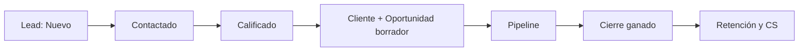
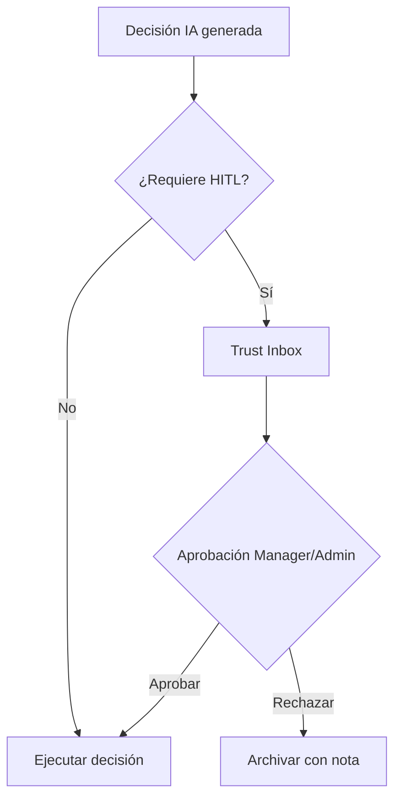
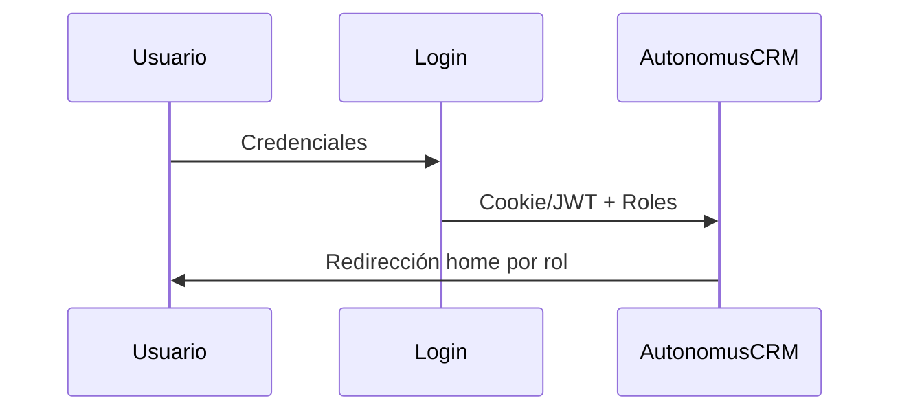

<div align="center">

# AutonomusCRM

## Guía de Operaciones — Marketing (funcional)

**Versión:** 2.0.0  
**Fecha de publicación:** 5 de junio de 2026  
**Autor:** AutonomusCRM Enterprise Documentation Team  
**Rol objetivo:** N/A — No existe rol Marketing  
**Clasificación:** Confidencial — Uso interno y clientes autorizados

---

*Documentación corporativa — Estándar Salesforce / Microsoft Dynamics 365*

</div>

---

## Control de versiones

| Versión | Fecha | Autor | Descripción |
|---------|-------|-------|-------------|
| 1.0.0 | 2026-06-05 | Enterprise Documentation Team | Publicación inicial basada en código |
| 2.0.0 | 5 de junio de 2026 | Enterprise Documentation Team | Transformación corporativa: estructura, diagramas, callouts, glosario |

---

## Tabla de contenido

*Índice generado automáticamente — ver encabezados numerados del documento.*

1. Introducción
2. Cuerpo del documento (capítulos originales transformados)
3. Diagramas de referencia
4. Glosario corporativo
5. Apéndices

---

## 1. Introducción

### 1.1 Objetivo del documento

Páginas públicas, importación de leads, LeadSource

### 1.2 Audiencia

Marketing y growth (coordina con Sales/Admin)

### 1.3 Alcance

Este documento cubre **únicamente funcionalidades verificadas** en el código fuente de AutonomusCRM. No describe módulos inexistentes ni roles no implementados.

### 1.4 Prerrequisitos

| Requisito | Detalle |
|-----------|---------|
| Acceso | Cuenta activa en el tenant AutonomusCRM |
| Navegador | Chrome, Edge o Firefox actualizado |
| Rol | Según matriz en `ROLE_PERMISSION_MATRIX.md` |
| Conocimientos | Ninguno técnico requerido para roles operativos |

### 1.5 Definiciones clave

Consulte el **Glosario corporativo** al final del documento. Términos críticos: Lead, Customer, Deal, Pipeline, Tenant, Revenue OS.

> **NOTA:** La interfaz admite español (ES) e inglés (EN). Las rutas técnicas (`/Leads`, `/Deals`) se conservan por trazabilidad al producto.

[CAPTURA: Pantalla de inicio de sesión — /Account/Login]

---

## 2. Cuerpo del documento

# Guía de Operaciones de Marketing — AutonomusCRM

**Audiencia:** Equipo de marketing, growth y operaciones comerciales  
**Versión:** Enterprise · Basada en código fuente verificado

---

## Aviso importante: Marketing NO es un rol

AutonomusCRM define **cinco roles de sistema** en `Users/Roles.cshtml.cs`:

`Admin` · `Manager` · `Sales` · `Support` · `Viewer`

**No existe un rol "Marketing".** Las actividades de marketing se ejecutan mediante:

1. **Páginas públicas** (sin autenticación) para captación.
2. **Importación de leads** por usuarios con rol `Sales`, `Manager` o `Admin`.
3. **API comercial** (**Registrar un nuevo prospecto** (API)) con usuario autenticado.
4. Coordinación operativa con el equipo Sales para calificación y cierre.

No hay un módulo de "marketing automation" en el código. Las automatizaciones existentes pertenecen a Revenue OS (SLA comercial), Customer Success (retención) y Workflows configurables — no a campañas de marketing.

---

## 1. Páginas públicas (sin login)

Todas las páginas de marketing usan `[AllowAnonymous]` — accesibles sin credenciales.

| Ruta | Página | Propósito |
|------|--------|-----------|
| `/landing` | `Landing.cshtml` | Landing principal del producto |
| `/demo` | `Demo.cshtml` | Guía demo CEO (5 minutos) |
| `/roi` | `Roi.cshtml` | Calculadora de ROI |
| `/pricing` | `Pricing.cshtml` | Precios y planes |
| `/stories` | `Stories.cshtml` | Casos de impacto |

### 1.1 Landing (`/landing`)
Página de captación principal. Contenido localizado (ES/EN) con claves `Marketing_Landing_*`:

- Propuesta de valor: sistema que detecta, decide y actúa con control humano.
- CTAs: "CEO demo en 5 minutos" → `/demo`, "Calcular ROI" → `/roi`.
- Secciones: diferenciación vs CRM+BI, capacidades ejecutivas, accionabilidad.

### 1.2 Demo CEO (`/demo`)
Guía estructurada para demostración ejecutiva de 5 minutos. Destino recomendado desde campañas de alto valor (C-level, board).

### 1.3 ROI (`/roi`)
Calculadora interactiva para cuantificar retorno de inversión. Útil en campañas de consideración y nutrición de pipeline.

### 1.4 Pricing (`/pricing`)
Información de planes y precios. Punto de conversión para leads calificados que evalúan compra.

### 1.5 Stories (`/stories`)
Casos de impacto y testimonios. Soporte para campañas de confianza y remarketing.

---

## 2. Flujo de captación → CRM

```
Página pública (/landing, /demo, etc.)
        ↓
  Lead en CRM (manual, import o API)
        ↓
  Sales califica (Qualify)
        ↓
  Deal en pipeline → Cierre
```

### 2.1 Puntos de entrada al CRM
| Método | Quién lo ejecuta | Ruta / API |
|--------|------------------|------------|
| Creación manual | Sales / Manager / Admin | `/Leads/Create` |
| Importación masiva | Sales / Manager / Admin | `/Leads/Import` |
| API REST | Usuario autenticado | **Registrar un nuevo prospecto** (API) |
| Integración HubSpot | Admin configura, sync automático | `/Integrations` |
| Integración Salesforce | Admin configura, sync automático | `/Integrations` |

> Marketing **no crea leads directamente** salvo que tenga credenciales con rol `Sales` o superior, o que exista integración configurada por Admin.

---

## 3. Importación de leads

### 3.1 Ruta
`/Leads/Import` — handler `ImportModel.OnPostAsync`

### 3.2 Formatos soportados
| Formato | Extensión | Estructura |
|---------|-----------|------------|
| JSON | `.json` | Array de objetos `LeadImportDto` |
| CSV | `.csv` | Columnas: Name, Email, Phone, Company, Source |

### 3.3 Campos del import
| Campo | Obligatorio | Descripción |
|-------|:-----------:|-------------|
| `Name` | ✅ | Nombre del prospecto |
| `Email` | — | Correo electrónico |
| `Phone` | — | Teléfono |
| `Company` | — | Empresa |
| `Source` | — | Valor del enum `LeadSource` (ver sección 4) |

### 3.4 Validaciones (`ImportGuard`)
- Tamaño máximo de archivo validado.
- Conteo máximo de filas validado.
- Fuente inválida → default `Other`.
- Cada lead creado inicia en estado `New`.

### 3.5 Procedimiento operativo para marketing
1. Exportar lista de campaña (CSV o JSON) con columna `Source` correcta.
2. Solicitar a Sales o Admin la importación en `/Leads/Import`.
3. Verificar conteo importado en `/Leads?imported={n}`.
4. Confirmar que Sales tiene SLA de contacto 24h activo (`SLA_LeadContact24h`).

### 3.6 Plantilla CSV de ejemplo
```csv
Name,Email,Phone,Company,Source
María López,maria@empresa.com,+50760001111,Empresa SA,Website
Juan Pérez,juan@referido.com,,Consultores PA,Referral
Ana Ruiz,ana@evento.com,+50760002222,Event Corp,Event
```

---

## 4. Enum LeadSource

Definido en `AutonomusCRM.Domain/Leads/Lead.cs`:

| Valor | Código numérico | Uso recomendado |
|-------|:---------------:|-----------------|
| `Unknown` | 0 | Origen no identificado |
| `Website` | 1 | Formulario web, landing, demo |
| `Referral` | 2 | Referido por cliente o partner |
| `SocialMedia` | 3 | Redes sociales (LinkedIn, etc.) |
| `EmailCampaign` | 4 | Campaña de email marketing |
| `ColdCall` | 5 | Prospección telefónica |
| `Partner` | 6 | Canal de partners |
| `Event` | 7 | Ferias, webinars, conferencias |
| `Other` | 99 | Cualquier otro origen |

### 4.1 Impacto en scoring
`LeadIntelligenceAgent` asigna pesos por fuente:

| Fuente | Peso default |
|--------|:------------:|
| Referral | 30 |
| Website | 20 |
| SocialMedia | 15 |
| EmailCampaign | 10 |

Leads con mayor peso aparecen priorizados en Revenue OS y Command.

### 4.2 Estadísticas por fuente
`ILeadRepository.GetSourceStatsAsync` devuelve conteo y calificados por fuente. Visible en `/Leads` para análisis de campañas.

### 4.3 Mapeo campaña → LeadSource
| Canal de marketing | LeadSource |
|--------------------|------------|
| Landing / formulario web | `Website` |
| Webinar / feria | `Event` |
| Email nurturing | `EmailCampaign` |
| LinkedIn / Instagram ads | `SocialMedia` |
| Programa de referidos | `Referral` |
| Alianza comercial | `Partner` |
| Teleprospección | `ColdCall` |
| Otro | `Other` |

---

## 5. Handoff a Sales

### 5.1 Responsabilidad de Sales post-captación
| Etapa | Responsable | Acción | SLA |
|-------|-------------|--------|-----|
| Lead creado | Sistema | Estado `New`, scoring | — |
| Primer contacto | Sales | Cambiar a `Contacted` | 24h (`SLA_LeadContact24h`) |
| Calificación | Sales | **Qualify** en `/Leads/Details` | Post-contacto |
| Pipeline | Sales | Crear/avanzar Deal | Según oportunidad |

[CAPTURA: Pipeline Kanban — /Deals]

### 5.2 Información mínima para handoff
Marketing debe entregar a Sales:

- [ ] Lista importada con `Source` correcto.
- [ ] Contexto de campaña (mensaje, oferta, segmento).
- [ ] Fecha y canal de captación.
- [ ] Cualificación previa (si aplica): BANT, ICP, etc.

### 5.3 Reunión de alineación semanal
| Participante | Agenda |
|--------------|--------|
| Marketing | Leads importados por fuente, volumen por campaña |
| Sales | Tasa de contacto, calificación, conversión |
| Manager | Forecast impactado, ajuste de fuentes |

### 5.4 Métricas de conversión marketing → revenue
| Métrica | Cálculo | Dónde verla |
|---------|---------|-------------|
| Leads por fuente | Conteo por `LeadSource` | `/Leads` stats |
| Tasa de calificación | Qualified / Total por fuente | `LeadSourceStat` |
| Pipeline generado | Deals desde leads por fuente | `/Deals` + origen |
| ROI de campaña | Revenue ClosedWon / inversión | Análisis externo + `/revenue` |

---

## 6. Lo que NO existe (evitar suposiciones)

| Funcionalidad | Estado en código |
|---------------|------------------|
| Rol Marketing | ❌ No existe |
| Módulo marketing automation | ❌ No existe |
| Campañas de email desde UI marketing | ❌ No existe (email CS es post-venta) |
| Landing page builder | ❌ No existe (páginas fijas Razor) |
| A/B testing de landing | ❌ No existe |
| Formulario web embebido auto-POST | ❌ No verificado — leads vía import/API |
| Segmentación de audiencias marketing | ❌ No existe |

---

## 7. Integraciones relevantes para marketing

| Integración | Uso | Configuración |
|-------------|-----|---------------|
| HubSpot | Sync leads inbound desde HubSpot | Admin en `/Integrations` |
| Salesforce | Sync leads desde Salesforce | Admin en `/Integrations` |
| Stripe | No aplica a captación | Facturación post-venta |

Marketing coordina con Admin la configuración de sync; no accede a `/Integrations` sin rol adecuado.

---

## 8. Checklist de campaña

### Pre-lanzamiento

- [ ] Definir `LeadSource` para la campaña.
- [ ] Preparar CSV/JSON con plantilla validada.
- [ ] Coordinar con Sales disponibilidad para SLA 24h.
- [ ] Verificar landing/demo/ROI actualizados.

### Post-lanzamiento

- [ ] Importar leads dentro de 24h de captación.
- [ ] Verificar conteo en `/Leads`.
- [ ] Confirmar SLA activo en `/Tasks` (Sales).
- [ ] Revisar stats por fuente a los 7 días.

### Post-campaña (30 días)

- [ ] Tasa de calificación por fuente.
- [ ] Deals creados y monto en pipeline.
- [ ] ClosedWon atribuible a campaña.
- [ ] Retroalimentación a Sales sobre calidad de leads.

---

## 9. Acceso recomendado para equipo marketing

| Necesidad | Solución |
|-----------|----------|
| Ver leads y métricas | Rol `Viewer` (solo lectura) |
| Importar leads directamente | Rol `Sales` o coordinación con Sales |
| Configurar integraciones | Solicitar a Admin |
| Editar landing/pricing | Equipo de desarrollo (código Razor) |

---

*Documento basado en: `Landing.cshtml.cs`, `Demo.cshtml.cs`, `Leads/Import.cshtml.cs`, `Lead.cs` (LeadSource), `DemoRoleUsers.cs`, `Users/Roles.cshtml.cs`, `LeadIntelligenceAgent.cs`, `CommercialSlaEngine.cs`.*

---

## 3. Diagramas de referencia


### Diagramas de referencia

#### Ciclo de vida del Lead


#### Flujo de aprobación Trust Studio


#### Flujo de autenticación



---

## 4. Glosario corporativo


## Glosario corporativo

| Término | Definición |
|---------|------------|
| **CRM** | Customer Relationship Management — sistema para registrar y medir relaciones comerciales |
| **Lead** | Prospecto o contacto potencial; entidad inicial del embudo |
| **Customer** | Cuenta o cliente en el directorio del tenant |
| **Opportunity / Deal** | Oportunidad de venta con monto, etapa y probabilidad |
| **Pipeline** | Conjunto de oportunidades abiertas y sus etapas en `/Deals` |
| **Forecast** | Proyección ponderada: monto × probabilidad por ventana de cierre |
| **Workflow** | Automatización configurable: trigger + condiciones + acciones |
| **Tenant** | Organización aislada; todos los datos pertenecen a un TenantId |
| **Trust Studio** | Buzón HITL en `/TrustInbox` para aprobar decisiones de IA |
| **Revenue OS** | Módulo de ingresos en `/revenue` — priorización y fugas |
| **Executive OS** | Tablero ejecutivo en `/executive` |
| **MFA** | Autenticación multifactor configurable en Settings |
| **ABAC** | Attribute-Based Access Control — políticas en `/Policies` (no sustituye RBAC) |
| **Customer Success** | Módulo post-venta en `/customer-success` (no es un rol) |
| **Churn** | Abandono del cliente; predicción ML en Customer 360 |
| **LTV** | Lifetime Value — valor acumulado del cliente |
| **Upsell** | Venta adicional al mismo cliente (expansión) |
| **Cross-Sell** | Venta de productos complementarios |
| **Playbook** | Secuencia automatizada: onboarding, rescue, re-engagement |
| **AI Agent** | Agente autónomo en `/Agents` (LeadIntelligence, Communication, etc.) |
| **Semantic Memory** | Memoria empresarial en `/Memory` |
| **Outcome Fabric** | Atribución de resultados en `/command/outcomes` |
| **HITL** | Human-in-the-Loop — supervisión humana de decisiones IA |
| **SLA** | Acuerdo de nivel de servicio (ej. contacto lead en 24 h) |
| **DLQ** | Dead Letter Queue — eventos fallidos en `/FailedEvents` |


---

## 5. Apéndices

### 5.1 Referencias cruzadas

| Documento | Ubicación |
|-----------|-----------|
| Matriz de permisos | `Documentation/ROLE_PERMISSION_MATRIX.md` |
| Descubrimiento de roles | `Documentation/ROLE_DISCOVERY_REPORT.md` |
| Manual maestro | `docs/manual-empresarial-autonomuscrm/` |

### 5.2 Pie de documento

| Campo | Valor |
|-------|-------|
| Producto | AutonomusCRM |
| Versión documento | 2.0.0 |
| Clasificación | Confidencial — Uso interno y clientes autorizados |
| Fuente | Código verificado — sin funcionalidades inventadas |

---

*© AutonomusCRM — Documentación Enterprise. Listo para impresión PDF y capacitación corporativa.*

