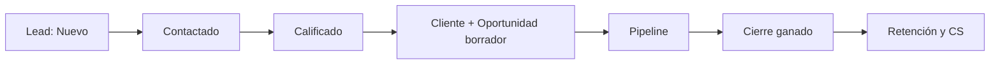
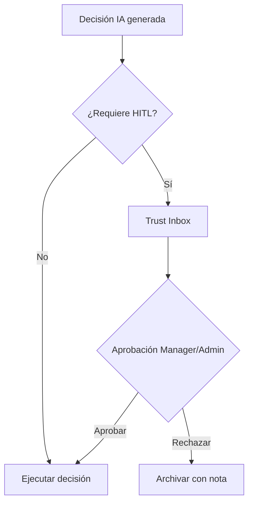
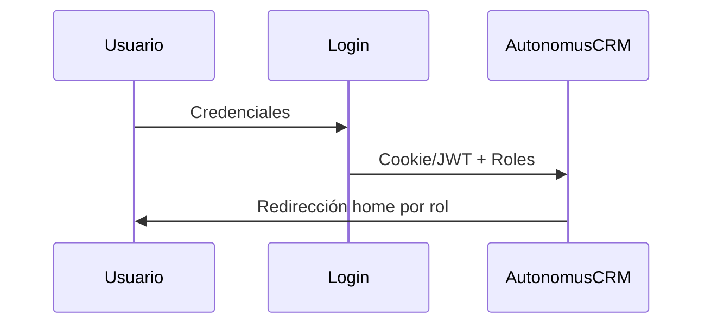

# AutonomusCRM

## Onboarding — Nuevo Colaborador

**Versión:** 2.0.0  
**Fecha de publicación:** 5 de junio de 2026  
**Autor:** AutonomusCRM Enterprise Documentation Team  
**Rol objetivo:** Todos  
**Clasificación:** Confidencial — Uso interno y clientes autorizados

---

*Documentación corporativa — Estándar Salesforce / Microsoft Dynamics 365*

---

## Control de versiones

| Versión | Fecha | Autor | Descripción |
|---------|-------|-------|-------------|
| 1.0.0 | 2026-06-05 | Enterprise Documentation Team | Publicación inicial basada en código |
| 2.0.0 | 5 de junio de 2026 | Enterprise Documentation Team | Transformación corporativa: estructura, diagramas, callouts, glosario |

---

## Tabla de contenido

*Índice generado automáticamente — ver encabezados numerados del documento.*

1. Introducción
2. Cuerpo del documento (capítulos originales transformados)
3. Diagramas de referencia
4. Glosario corporativo
5. Apéndices

---

## 1. Introducción

### 1.1 Objetivo del documento

Introducción al sistema y primeros pasos

### 1.2 Audiencia

Cualquier nuevo empleado

### 1.3 Alcance

Este documento cubre **únicamente funcionalidades verificadas** en el código fuente de AutonomusCRM. No describe módulos inexistentes ni roles no implementados.

### 1.4 Prerrequisitos

| Requisito | Detalle |
|-----------|---------|
| Acceso | Cuenta activa en el tenant AutonomusCRM |
| Navegador | Chrome, Edge o Firefox actualizado |
| Rol | Según matriz en `ROLE_PERMISSION_MATRIX.md` |
| Conocimientos | Ninguno técnico requerido para roles operativos |

### 1.5 Definiciones clave

Consulte el **Glosario corporativo** al final del documento. Términos críticos: Lead, Customer, Deal, Pipeline, Tenant, Revenue OS.

> **NOTA:** La interfaz admite español (ES) e inglés (EN). Las rutas técnicas (`/Leads`, `/Deals`) se conservan por trazabilidad al producto.

[CAPTURA: Pantalla de inicio de sesión — /Account/Login]

---

## 2. Cuerpo del documento

# Onboarding de Nuevo Empleado — AutonomusCRM

**Audiencia:** Cualquier empleado nuevo que utilizará AutonomusCRM, independientemente del rol  
**Duración:** 5 días (14 horas formación + 1 día producción supervisada)  
**Idiomas:** Español / Inglés (selector en la interfaz)

---

## 1. Objetivos del programa

Al completar este onboarding, el empleado será capaz de:

1. Autenticarse y navegar el sistema según su rol.
2. Identificar las pantallas relevantes para su función diaria.
3. Comprender las restricciones de permisos de su rol.
4. Ejecutar las operaciones básicas de su área con supervisión mínima.
5. Saber cuándo y a quién escalar problemas.

---

## 2. Roles del sistema

| Rol | Email demo | Contraseña | Home post-login |
|-----|------------|------------|-----------------|
| Admin | admin@autonomuscrm.local | Admin123! | `/executive` |
| Manager | manager@autonomuscrm.local | Manager123! | `/executive` |
| Sales | sales@autonomuscrm.local | Sales123! | `/revenue` |
| Support | support@autonomuscrm.local | Support123! | `/Customer360` |
| Viewer | viewer@autonomuscrm.local | Viewer123! | `/` (Command) |

> Patrón de contraseña demo: `{Rol}123!`. En producción, el Admin asigna credenciales reales y habilita MFA.

**No existe rol Marketing.** Actividades de captación se coordinan con Sales vía importación de leads.

---

## 3. Día 1 — Fundamentos (4 horas)

### Bloque 1: Qué es AutonomusCRM (1 h)

| Tema | Contenido |
|------|-----------|
| Propósito | Plataforma de operaciones de ingresos y clientes |
| Entidades clave | Lead, Customer, Deal, WorkflowTask |
| Tenant | Aislamiento de datos por organización |
| IA gobernada | Command, Trust Studio, decisiones con HITL |

**Material:** `Documentation/SALES_PLAYBOOK.md` (sección 1), landing `/landing`.

### Bloque 2: Login y navegación (1 h)

| Paso | Acción |
|------|--------|
| 1 | Ir a `/Account/Login` |
| 2 | Ingresar credenciales asignadas por Admin |
| 3 | Completar MFA si está habilitado |
| 4 | Verificar redirección al home del rol |
| 5 | Explorar menú lateral (19 ítems) |
| 6 | Probar búsqueda global: `Ctrl+K` → `/api/flow/search` |
| 7 | Cambiar idioma ES/EN |

**Menú lateral — referencia rápida:**

| Sección | Rutas clave |
|---------|-------------|
| Command | `/`, `/TrustInbox`, `/Agents` |
| Revenue | `/revenue`, `/executive`, `/Deals` |
| Customers | `/Customers`, `/Customer360`, `/customer-success` |
| Commerce | `/Leads` |
| Intelligence | `/Memory` |
| Operations | `/Tasks` |
| Platform | `/Integrations`, `/VoiceCalls` |
| Admin | `/Users`, `/Policies`, `/Audit`, `/Settings`, `/billing` |

### Bloque 3: Rol y permisos (1 h)

| Rol | Puede | No puede |
|-----|-------|----------|
| Admin | Todo + API tenants/users | — |
| Manager | Usuarios, settings, políticas, supervisión | Crear tenants API |
| Sales | Leads, deals, clientes, workflows | `/Users`, `/Settings` |
| Support | Customer 360, CS, lectura comercial | Crear/editar leads, deals |
| Viewer | Lectura comercial y reportes | Cualquier escritura comercial UI |

**Evidencia:** control de escritura comercial del sistema bloquea POST en `/Leads`, `/Customers`, `/Deals`, `/Workflows`, `/Policies` para Viewer y Support.

### Bloque 4: Lab guiado (1 h)

Ejercicio según rol asignado:

| Rol | Lab |
|-----|-----|
| Sales | Crear lead → calificar → ver tarea SLA |
| Support | Buscar cliente en 360 → crear ticket CS |
| Viewer | Navegar leads y deals en solo lectura |
| Manager/Admin | Revisar `/Users` y `/Audit` |

---

## 4. Día 2 — Operación por área (4 horas)

### Sales (4 h)

| Bloque | Contenido | Documento |
|--------|-----------|-----------|
| 2 h | Leads + pipeline + calificación | `SALES_PLAYBOOK.md` |
| 1 h | Tasks + Revenue OS | `SALES_PLAYBOOK.md` §3, §7 |
| 1 h | Lab: deal completo hasta Proposal | `/Deals` |

### Support (4 h)

| Bloque | Contenido | Documento |
|--------|-----------|-----------|
| 2 h | Customer 360 + tickets | `SUPPORT_OPERATIONS_GUIDE.md` |
| 1 h | Casos CS + escalamiento | `SUPPORT_OPERATIONS_GUIDE.md` §4-5 |
| 1 h | Lab: ticket + caso AtRisk | `/customer-success` |

### Viewer (4 h)

| Bloque | Contenido | Documento |
|--------|-----------|-----------|
| 2 h | Navegación lectura + Command | `Roles/Viewer_User_Manual.md` |
| 1 h | Revenue, pipeline, clientes (consulta) | Manual Viewer cap. 5-6 |
| 1 h | Lab: recorrer 10 pantallas sin escribir | Checklist Viewer |

### Manager / Admin (4 h)

| Bloque | Contenido | Documento |
|--------|-----------|-----------|
| 2 h | Usuarios, roles, MFA | `ADMIN_OPERATIONS_GUIDE.md` §2-4 |
| 1 h | Settings, auditoría, integraciones | `ADMIN_OPERATIONS_GUIDE.md` §3-6 |
| 1 h | Lab: crear usuario + revisar audit | `/Users`, `/Audit` |

---

## 5. Día 3 — IA, métricas y automatización (3 horas)

| Bloque | Contenido |
|--------|-----------|
| 1 h | Command Center: decisiones, métricas, riesgo |
| 1 h | Trust Studio (Manager/Admin): aprobar/rechazar IA |
| 1 h | Interpretar forecast, health scores, SLAs |

**Pantallas:**

- `/` — Command (todos)
- `/TrustInbox` — Admin, Manager
- `/revenue` — Sales, Manager
- `/Tasks` — todos (tareas SLA y operativas)

---

## 6. Día 4 — Post-venta e integridad (3 horas)

| Bloque | Contenido |
|--------|-----------|
| 1 h | Customers, Customer 360, Customer Success (lectura o operación según rol) |
| 1 h | Seguridad: MFA, auditoría, buenas prácticas |
| 1 h | Evaluación con checklist (ver §8) |

**Documentos de referencia:**

- `CUSTOMER_SUCCESS_PLAYBOOK.md` — playbooks Onboarding, Rescue, ReEngagement
- `ADMIN_OPERATIONS_GUIDE.md` §5 — auditoría

---

## 7. Día 5 — Producción supervisada

| Actividad | Detalle |
|-----------|---------|
| Shadowing | Acompañar a colega senior del mismo rol |
| Operación autónoma | Ejecutar rutina diaria del rol sin asistencia |
| Revisión Manager | Manager verifica acciones en `/Audit` |
| Feedback | Sesión 30 min: dudas, mejoras, certificación |

### Rutinas diarias por rol

| Rol | Rutina | Documento |
|-----|--------|-----------|
| Sales | Revenue → Tasks → Leads → Deals | `SALES_PLAYBOOK.md` §7 |
| Support | Tickets → Churn → 360 → Casos | `SUPPORT_OPERATIONS_GUIDE.md` §8 |
| Viewer | Command → consulta módulos asignados | `Roles/Viewer_User_Manual.md` |
| Manager | Executive → Audit → supervisión pipeline | `ADMIN_OPERATIONS_GUIDE.md` §11 |

---

## 8. Checklist de certificación

El empleado debe completar todos los ítems de su rol:

### Todos los roles

- [ ] Login exitoso con MFA (si aplica)
- [ ] Navegación al home correcto del rol
- [ ] Uso de búsqueda global (Ctrl+K)
- [ ] Cambio de idioma ES/EN
- [ ] Identificación de pantalla de escalamiento

### Sales

- [ ] Crear lead con fuente correcta
- [ ] Calificar lead y verificar tarea SLA
- [ ] Crear deal vinculado a customer
- [ ] Avanzar deal a Proposal
- [ ] Revisar forecast en `/revenue`

### Support

- [ ] Buscar cliente en Customer 360
- [ ] Crear y cerrar ticket CS
- [ ] Crear caso AtRisk
- [ ] Ejecutar playbook Rescue
- [ ] Escalar a Sales un caso Expansion

### Viewer

- [ ] Consultar leads sin acceder a Create/Edit
- [ ] Verificar redirect > **ADVERTENCIA** Access Denied en escritura
- [ ] Revisar Command y Revenue en lectura
- [ ] Exportar o comunicar hallazgos al equipo

### Manager / Admin

- [ ] Crear usuario con rol correcto
- [ ] Revisar eventos en `/Audit`
- [ ] Verificar settings del tenant
- [ ] Identificar integración activa en `/Integrations`

---

## 9. Credenciales y seguridad

| Paso | Responsable | Acción |
|------|-------------|--------|
| Crear cuenta | Admin | `/Users/Create` o **Crear un nuevo usuario** (API administrativa) |
| Asignar rol mínimo | Admin/Manager | `/Users/Roles` |
| Habilitar MFA | Admin | `POST /api/users/{id}/enable-mfa` |
| Política MFA tenant | Admin | `/Settings` → `MfaRequired` |
| Entregar credenciales | Admin | Canal seguro (no email sin cifrar) |

---

## 10. Documentación por rol

| Rol | Documentos principales |
|-----|------------------------|
| Sales | `SALES_PLAYBOOK.md` |
| Support | `SUPPORT_OPERATIONS_GUIDE.md`, `CUSTOMER_SUCCESS_PLAYBOOK.md` |
| Viewer | `Roles/Viewer_User_Manual.md` |
| Manager | `ADMIN_OPERATIONS_GUIDE.md`, `SALES_PLAYBOOK.md` |
| Admin | `ADMIN_OPERATIONS_GUIDE.md` (completo) |
| Marketing (sin rol) | `MARKETING_OPERATIONS_GUIDE.md` |

---

## 11. Soporte y escalamiento

| Problema | Contacto |
|----------|----------|
| No puedo iniciar sesión | Admin del tenant |
| > **ADVERTENCIA** Access Denied inesperado | Verificar rol en `/Users` |
| MFA no funciona | Admin → re-habilitar MFA |
| Bug de plataforma | Admin → `/FailedEvents` + equipo técnico |
| Dudas de proceso | Manager del área |

---

*Programa basado en: `DemoRoleUsers.cs`, `RoleHomeRedirect.cs`, `CommercialWriteAuthorizationMiddleware.cs`, `Users/Roles.cshtml.cs`, manuales enterprise del repositorio.*

---

## 3. Diagramas de referencia

### Diagramas de referencia

#### Ciclo de vida del Lead

#### Flujo de aprobación Trust Studio

#### Flujo de autenticación

---

## 4. Glosario corporativo

## Glosario corporativo

| Término | Definición |
|---------|------------|
| **CRM** | Customer Relationship Management — sistema para registrar y medir relaciones comerciales |
| **Lead** | Prospecto o contacto potencial; entidad inicial del embudo |
| **Customer** | Cuenta o cliente en el directorio del tenant |
| **Opportunity / Deal** | Oportunidad de venta con monto, etapa y probabilidad |
| **Pipeline** | Conjunto de oportunidades abiertas y sus etapas en `/Deals` |
| **Forecast** | Proyección ponderada: monto × probabilidad por ventana de cierre |
| **Workflow** | Automatización configurable: trigger + condiciones + acciones |
| **Tenant** | Organización aislada; todos los datos pertenecen a un TenantId |
| **Trust Studio** | Buzón HITL en `/TrustInbox` para aprobar decisiones de IA |
| **Revenue OS** | Módulo de ingresos en `/revenue` — priorización y fugas |
| **Executive OS** | Tablero ejecutivo en `/executive` |
| **MFA** | Autenticación multifactor configurable en Settings |
| **ABAC** | Attribute-Based Access Control — políticas en `/Policies` (no sustituye RBAC) |
| **Customer Success** | Módulo post-venta en `/customer-success` (no es un rol) |
| **Churn** | Abandono del cliente; predicción ML en Customer 360 |
| **LTV** | Lifetime Value — valor acumulado del cliente |
| **Upsell** | Venta adicional al mismo cliente (expansión) |
| **Cross-Sell** | Venta de productos complementarios |
| **Playbook** | Secuencia automatizada: onboarding, rescue, re-engagement |
| **AI Agent** | Agente autónomo en `/Agents` (LeadIntelligence, Communication, etc.) |
| **Semantic Memory** | Memoria empresarial en `/Memory` |
| **Outcome Fabric** | Atribución de resultados en `/command/outcomes` |
| **HITL** | Human-in-the-Loop — supervisión humana de decisiones IA |
| **SLA** | Acuerdo de nivel de servicio (ej. contacto lead en 24 h) |
| **DLQ** | Dead Letter Queue — eventos fallidos en `/FailedEvents` |

---

## 5. Apéndices

### 5.1 Referencias cruzadas

| Documento | Ubicación |
|-----------|-----------|
| Matriz de permisos | `Documentation/ROLE_PERMISSION_MATRIX.md` |
| Descubrimiento de roles | `Documentation/ROLE_DISCOVERY_REPORT.md` |
| Manual maestro | `docs/manual-empresarial-autonomuscrm/` |

### 5.2 Pie de documento

| Campo | Valor |
|-------|-------|
| Producto | AutonomusCRM |
| Versión documento | 2.0.0 |
| Clasificación | Confidencial — Uso interno y clientes autorizados |
| Fuente | Código verificado — sin funcionalidades inventadas |

---

*© AutonomusCRM — Documentación Enterprise. Listo para impresión PDF y capacitación corporativa.*

