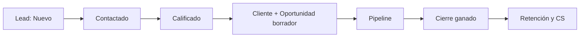
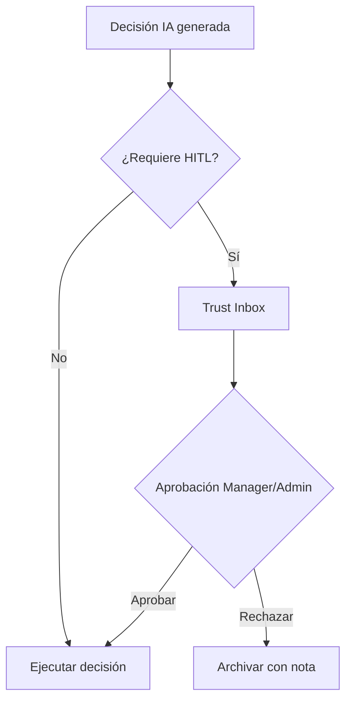
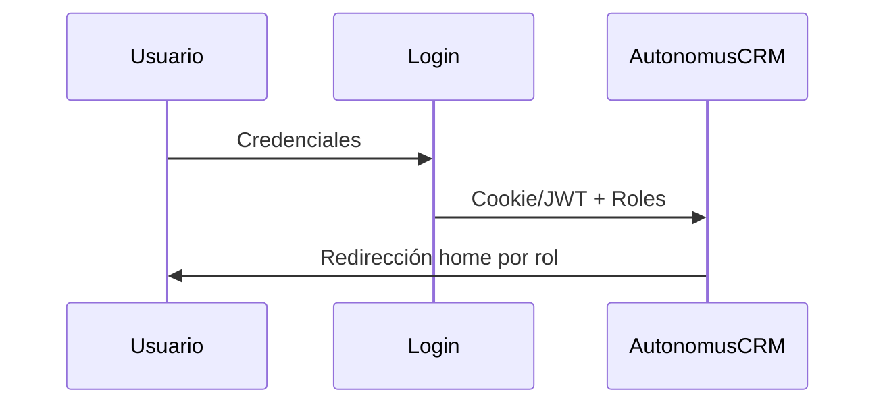

<div align="center">

# AutonomusCRM

## Índice de Documentación Enterprise

**Versión:** 2.0.0  
**Fecha de publicación:** 5 de junio de 2026  
**Autor:** AutonomusCRM Enterprise Documentation Team  
**Rol objetivo:** Todos  
**Clasificación:** Confidencial — Uso interno y clientes autorizados

---

*Documentación corporativa — Estándar Salesforce / Microsoft Dynamics 365*

</div>

---

## Control de versiones

| Versión | Fecha | Autor | Descripción |
|---------|-------|-------|-------------|
| 1.0.0 | 2026-06-05 | Enterprise Documentation Team | Publicación inicial basada en código |
| 2.0.0 | 5 de junio de 2026 | Enterprise Documentation Team | Transformación corporativa: estructura, diagramas, callouts, glosario |

---

## Tabla de contenido

*Índice generado automáticamente — ver encabezados numerados del documento.*

1. Introducción
2. Cuerpo del documento (capítulos originales transformados)
3. Diagramas de referencia
4. Glosario corporativo
5. Apéndices

---

## 1. Introducción

### 1.1 Objetivo del documento

Mapa de documentos por rol

### 1.2 Audiencia

Todos los colaboradores

### 1.3 Alcance

Este documento cubre **únicamente funcionalidades verificadas** en el código fuente de AutonomusCRM. No describe módulos inexistentes ni roles no implementados.

### 1.4 Prerrequisitos

| Requisito | Detalle |
|-----------|---------|
| Acceso | Cuenta activa en el tenant AutonomusCRM |
| Navegador | Chrome, Edge o Firefox actualizado |
| Rol | Según matriz en `ROLE_PERMISSION_MATRIX.md` |
| Conocimientos | Ninguno técnico requerido para roles operativos |

### 1.5 Definiciones clave

Consulte el **Glosario corporativo** al final del documento. Términos críticos: Lead, Customer, Deal, Pipeline, Tenant, Revenue OS.

> **NOTA:** La interfaz admite español (ES) e inglés (EN). Las rutas técnicas (`/Leads`, `/Deals`) se conservan por trazabilidad al producto.

[CAPTURA: Pantalla de inicio de sesión — /Account/Login]

---

## 2. Cuerpo del documento

# Documentación por Rol — AutonomusCRM

Paquete de habilitación enterprise generado desde código real.

## Roles del sistema (5)

| Rol | Manual | Playbook adicional |
|-----|--------|-------------------|
| Admin | [Roles/Admin_User_Manual.md](Roles/Admin_User_Manual.md) | [ADMIN_OPERATIONS_GUIDE.md](ADMIN_OPERATIONS_GUIDE.md) |
| Manager | [Roles/Manager_User_Manual.md](Roles/Manager_User_Manual.md) | — |
| Sales | [Roles/Sales_User_Manual.md](Roles/Sales_User_Manual.md) | [SALES_PLAYBOOK.md](SALES_PLAYBOOK.md) |
| Support | [Roles/Support_User_Manual.md](Roles/Support_User_Manual.md) | [SUPPORT_OPERATIONS_GUIDE.md](SUPPORT_OPERATIONS_GUIDE.md), [CUSTOMER_SUCCESS_PLAYBOOK.md](CUSTOMER_SUCCESS_PLAYBOOK.md) |
| Viewer | [Roles/Viewer_User_Manual.md](Roles/Viewer_User_Manual.md) | — |

## Documentos transversales

| Documento | Propósito |
|-----------|-----------|
| [ROLE_DISCOVERY_REPORT.md](ROLE_DISCOVERY_REPORT.md) | Inventario y descubrimiento de roles |
| [ROLE_PERMISSION_MATRIX.md](ROLE_PERMISSION_MATRIX.md) | Matriz global rol × módulo × permiso |
| [NEW_EMPLOYEE_ONBOARDING.md](NEW_EMPLOYEE_ONBOARDING.md) | Onboarding cualquier colaborador |
| [MARKETING_OPERATIONS_GUIDE.md](MARKETING_OPERATIONS_GUIDE.md) | Lead generation (no existe rol Marketing) |

## Manual maestro existente

Documentación extendida (18 capítulos transversales) en `docs/manual-empresarial-autonomuscrm/`.

## Estructura de carpetas

```
Documentation/
├── README.md
├── ROLE_DISCOVERY_REPORT.md
├── ROLE_PERMISSION_MATRIX.md
├── NEW_EMPLOYEE_ONBOARDING.md
├── ADMIN_OPERATIONS_GUIDE.md
├── SALES_PLAYBOOK.md
├── SUPPORT_OPERATIONS_GUIDE.md
├── CUSTOMER_SUCCESS_PLAYBOOK.md
├── MARKETING_OPERATIONS_GUIDE.md   ← Marketing NO es rol
└── Roles/
    ├── Admin_User_Manual.md        (100 FAQ)
    ├── Manager_User_Manual.md      (100 FAQ)
    ├── Sales_User_Manual.md        (100 FAQ)
    ├── Support_User_Manual.md      (100 FAQ)
    └── Viewer_User_Manual.md       (100 FAQ)
```

**No generado:** `SuperAdmin_User_Manual.md` — el rol no existe; Admin es el máximo privilegio.

## Credenciales demo

| Rol | Email | Contraseña |
|-----|-------|------------|
| Admin | admin@autonomuscrm.local | Admin123! |
| Manager | manager@autonomuscrm.local | Manager123! |
| Sales | sales@autonomuscrm.local | Sales123! |
| Support | support@autonomuscrm.local | Support123! |
| Viewer | viewer@autonomuscrm.local | Viewer123! |

## Roles que NO existen

SuperAdmin, Marketing, Customer Success (como rol), Operations, Executive, Analyst — ver `ROLE_DISCOVERY_REPORT.md`.

---

## 3. Diagramas de referencia


### Diagramas de referencia

#### Ciclo de vida del Lead


#### Flujo de aprobación Trust Studio


#### Flujo de autenticación



---

## 4. Glosario corporativo


## Glosario corporativo

| Término | Definición |
|---------|------------|
| **CRM** | Customer Relationship Management — sistema para registrar y medir relaciones comerciales |
| **Lead** | Prospecto o contacto potencial; entidad inicial del embudo |
| **Customer** | Cuenta o cliente en el directorio del tenant |
| **Opportunity / Deal** | Oportunidad de venta con monto, etapa y probabilidad |
| **Pipeline** | Conjunto de oportunidades abiertas y sus etapas en `/Deals` |
| **Forecast** | Proyección ponderada: monto × probabilidad por ventana de cierre |
| **Workflow** | Automatización configurable: trigger + condiciones + acciones |
| **Tenant** | Organización aislada; todos los datos pertenecen a un TenantId |
| **Trust Studio** | Buzón HITL en `/TrustInbox` para aprobar decisiones de IA |
| **Revenue OS** | Módulo de ingresos en `/revenue` — priorización y fugas |
| **Executive OS** | Tablero ejecutivo en `/executive` |
| **MFA** | Autenticación multifactor configurable en Settings |
| **ABAC** | Attribute-Based Access Control — políticas en `/Policies` (no sustituye RBAC) |
| **Customer Success** | Módulo post-venta en `/customer-success` (no es un rol) |
| **Churn** | Abandono del cliente; predicción ML en Customer 360 |
| **LTV** | Lifetime Value — valor acumulado del cliente |
| **Upsell** | Venta adicional al mismo cliente (expansión) |
| **Cross-Sell** | Venta de productos complementarios |
| **Playbook** | Secuencia automatizada: onboarding, rescue, re-engagement |
| **AI Agent** | Agente autónomo en `/Agents` (LeadIntelligence, Communication, etc.) |
| **Semantic Memory** | Memoria empresarial en `/Memory` |
| **Outcome Fabric** | Atribución de resultados en `/command/outcomes` |
| **HITL** | Human-in-the-Loop — supervisión humana de decisiones IA |
| **SLA** | Acuerdo de nivel de servicio (ej. contacto lead en 24 h) |
| **DLQ** | Dead Letter Queue — eventos fallidos en `/FailedEvents` |


---

## 5. Apéndices

### 5.1 Referencias cruzadas

| Documento | Ubicación |
|-----------|-----------|
| Matriz de permisos | `Documentation/ROLE_PERMISSION_MATRIX.md` |
| Descubrimiento de roles | `Documentation/ROLE_DISCOVERY_REPORT.md` |
| Manual maestro | `docs/manual-empresarial-autonomuscrm/` |

### 5.2 Pie de documento

| Campo | Valor |
|-------|-------|
| Producto | AutonomusCRM |
| Versión documento | 2.0.0 |
| Clasificación | Confidencial — Uso interno y clientes autorizados |
| Fuente | Código verificado — sin funcionalidades inventadas |

---

*© AutonomusCRM — Documentación Enterprise. Listo para impresión PDF y capacitación corporativa.*

