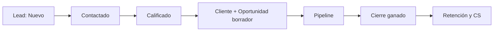
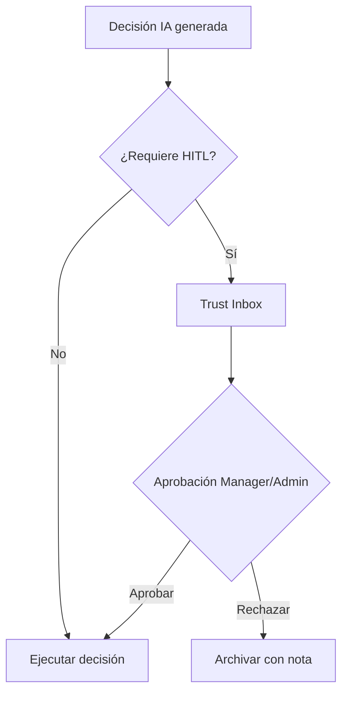
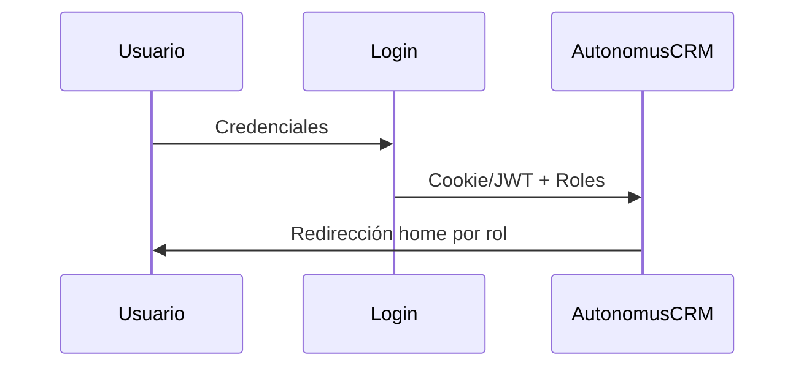

# AutonomusCRM

## Informe de Descubrimiento de Roles

**Versión:** 2.0.0  
**Fecha de publicación:** 5 de junio de 2026  
**Autor:** AutonomusCRM Enterprise Documentation Team  
**Rol objetivo:** Gobernanza  
**Clasificación:** Confidencial — Uso interno y clientes autorizados

---

*Documentación corporativa — Estándar Salesforce / Microsoft Dynamics 365*

---

## Control de versiones

| Versión | Fecha | Autor | Descripción |
|---------|-------|-------|-------------|
| 1.0.0 | 2026-06-05 | Enterprise Documentation Team | Publicación inicial basada en código |
| 2.0.0 | 5 de junio de 2026 | Enterprise Documentation Team | Transformación corporativa: estructura, diagramas, callouts, glosario |

---

## Tabla de contenido

*Índice generado automáticamente — ver encabezados numerados del documento.*

1. Introducción
2. Cuerpo del documento (capítulos originales transformados)
3. Diagramas de referencia
4. Glosario corporativo
5. Apéndices

---

## 1. Introducción

### 1.1 Objetivo del documento

Inventario verificado de roles RBAC

### 1.2 Audiencia

Arquitectos, auditores y administradores

### 1.3 Alcance

Este documento cubre **únicamente funcionalidades verificadas** en el código fuente de AutonomusCRM. No describe módulos inexistentes ni roles no implementados.

### 1.4 Prerrequisitos

| Requisito | Detalle |
|-----------|---------|
| Acceso | Cuenta activa en el tenant AutonomusCRM |
| Navegador | Chrome, Edge o Firefox actualizado |
| Rol | Según matriz en `ROLE_PERMISSION_MATRIX.md` |
| Conocimientos | Ninguno técnico requerido para roles operativos |

### 1.5 Definiciones clave

Consulte el **Glosario corporativo** al final del documento. Términos críticos: Lead, Customer, Deal, Pipeline, Tenant, Revenue OS.

> **NOTA:** La interfaz admite español (ES) e inglés (EN). Las rutas técnicas (`/Leads`, `/Deals`) se conservan por trazabilidad al producto.

[CAPTURA: Pantalla de inicio de sesión — /Account/Login]

---

## 2. Cuerpo del documento

# ROLE_DISCOVERY_REPORT — Inventario de Roles AutonomusCRM

**Fecha de análisis:** 2026-06-05  
**Método:** Análisis estático de código, seed, migraciones, middleware, policies, menús y controllers  
**Principio:** Solo roles verificados en implementación real

---

## 1. Resumen ejecutivo

AutonomusCRM implementa **exactamente 5 roles RBAC** como cadenas de texto en `User.Roles` (columna `jsonb` en PostgreSQL). **No existe enum de roles** ni rol SuperAdmin.

| Rol | Usuarios demo | Home post-login |
|-----|---------------|-----------------|
| Admin | admin@autonomuscrm.local | `/executive` |
| Manager | manager@autonomuscrm.local | `/executive` |
| Sales | sales@autonomuscrm.local | `/revenue` |
| Support | support@autonomuscrm.local | `/Customer360` |
| Viewer | viewer@autonomuscrm.local | `/` |

**Evidencia seed:** `AutonomusCRM.Infrastructure/Persistence/Seed/DemoRoleUsers.cs`  
**Evidencia redirect:** `AutonomusCRM.API/Infrastructure/RoleHomeRedirect.cs`  
**Whitelist UI:** `Users/Edit.cshtml.cs`, `Users/Roles.cshtml.cs` → `{ Admin, Manager, Sales, Support, Viewer }`

---

## 2. Roles descubiertos (detalle)

### 2.1 Admin
| Atributo | Valor |
|----------|-------|
| **Descripción** | Administrador del tenant con máximos privilegios operativos |
| **Permisos distintivos** | Único rol con **Provisionar un nuevo tenant** (API administrativa) y **Crear un nuevo usuario** (API administrativa) (`RequireAdmin`) |
| **Menús visibles** | Los 19 ítems del sidebar (sin filtro por rol) |
| **Módulos accesibles** | Todos los módulos autenticados |
| **Escritura comercial UI** | Sí (Leads, Customers, Deals, Workflows, Policies) |
| **Gestión usuarios** | Sí (`/Users/*` — Admin + Manager) |
| **Settings** | Sí (`/Settings` — Admin + Manager) |
| **Trust Studio** | Acceso completo (aprobar decisiones HITL) |
| **Cantidad permisos distintivos** | ~45 acciones (lectura global + escritura comercial + admin UI + API provisioning) |

### 2.2 Manager
| Atributo | Valor |
|----------|-------|
| **Descripción** | Gerente comercial/operativo del tenant |
| **Permisos distintivos** | Igual que Admin en UI excepto API `RequireAdmin` |
| **Home** | `/executive` |
| **Escritura comercial** | Sí |
| **Gestión usuarios / Settings** | Sí |
| **API tenants/users POST** | No |
| **Cantidad permisos distintivos** | ~40 acciones |

### 2.3 Sales
| Atributo | Valor |
|----------|-------|
| **Descripción** | Ejecutivo de ventas — ciclo Lead → Deal → cierre |
| **Home** | `/revenue` |
| **Escritura comercial** | Sí (middleware + handlers Leads) |
| **Gestión usuarios / Settings** | No (> **ADVERTENCIA** Access Denied) |
| **Pantallas primarias** | `/revenue`, `/Leads`, `/Deals`, `/Tasks`, `/Customers` |
| **Cantidad permisos distintivos** | ~25 acciones comerciales |

### 2.4 Support
| Atributo | Valor |
|----------|-------|
| **Descripción** | Soporte y Customer Success — post-venta, retención |
| **Home** | `/Customer360` |
| **Escritura comercial UI** | **No** (middleware bloquea POST y Create/Edit) |
| **Lectura comercial** | Sí (listas y detalles GET) |
| **Pantallas primarias** | `/customer-success`, `/Customer360`, `/Customers` (lectura) |
| **> **RIESGO** Brecha API** | API comercial POST permitida si autenticado (sin filtro rol) |
| **Cantidad permisos distintivos** | ~15 acciones (lectura + CS) |

### 2.5 Viewer
| Atributo | Valor |
|----------|-------|
| **Descripción** | Consulta y reportes — stakeholders de solo lectura |
| **Home** | `/` (Command Center) |
| **Escritura comercial UI** | **No** (igual que Support) |
| **Gestión usuarios** | No |
| **SCIM default** | Rol por defecto si no se especifica en provisioning |
| **Cantidad permisos distintivos** | ~12 acciones (lectura) |

---

## 3. Matriz resumida de acciones

| Rol | Crear | Editar | Eliminar | Aprobar | Configurar | Administrar |
| --- | ----- | ------ | -------- | ------- | ---------- | ----------- |
| **Admin** | ✅ Comercial + usuarios | ✅ | ✅ Leads (handlers) | ✅ Trust Studio | ✅ Settings, Policies, Workflows | ✅ Tenants/Users API |
| **Manager** | ✅ Comercial + usuarios | ✅ | ✅ Leads | ✅ Trust Studio | ✅ Settings, Policies | ✅ Users UI (no API tenants) |
| **Sales** | ✅ Leads/Customers/Deals | ✅ | ✅ Leads | ❌ (consulta) | ❌ | ❌ |
| **Support** | ❌ UI comercial | ❌ UI comercial | ❌ | ❌ | ❌ | ❌ |
| **Viewer** | ❌ | ❌ | ❌ | ❌ | ❌ | ❌ |

**Notas:**
- *Crear/Editar/Eliminar* comercial = UI en `/Leads`, `/Customers`, `/Deals`, `/Workflows`, `/Policies`
- *Aprobar* = Trust Studio `/TrustInbox` (Admin/Manager operativo)
- *Configurar* = `/Settings`, `/Integrations`, `/Policies`
- *Administrar* = `/Users`, **Provisionar un nuevo tenant** (API administrativa), **Crear un nuevo usuario** (API administrativa)

---

## 4. Nombres evaluados que NO son roles

| Nombre buscado | Resultado | Qué es en el sistema |
|----------------|-----------|----------------------|
| SuperAdmin | **No existe** | Admin es el rol máximo |
| Marketing | **No es rol** | Páginas públicas `/landing`, `/roi`, `/demo`; claves i18n `Marketing_*` |
| Customer Success | **No es rol** | Módulo `/customer-success`; usuario típico: Support |
| Operations | **No es rol** | Sección sidebar "Operation"; agente IA "Operations Agent" |
| Executive | **No es rol** | Dashboard `/executive` para Admin/Manager |
| Customer | **No es rol** | Entidad de dominio `Customer` |
| Agent | **No es rol** | Workforce IA en `/Agents` |
| Analyst | **No existe** | Sin página ni rol dedicado |

---

## 5. Fuentes de evidencia

| Componente | Archivo |
|------------|---------|
| Seed usuarios demo | `Infrastructure/Persistence/Seed/DemoRoleUsers.cs` |
| Entidad User.Roles | `Domain/Users/User.cs` |
| Migración jsonb Roles | `Migrations/20251224185349_InitialCreate.cs` |
| Middleware escritura | `API/Middleware/CommercialWriteAuthorizationMiddleware.cs` |
| Home redirect | `API/Infrastructure/RoleHomeRedirect.cs` |
| Policies ASP.NET | `Application/Authorization/Policies/AuthorizationPolicies.cs` |
| RequireAdmin uso | `API/Controllers/TenantsController.cs`, `UsersController.cs` |
| Leads authorize | `API/Pages/Leads/*.cshtml.cs` |
| Users/Settings authorize | `API/Pages/Users/*.cshtml.cs`, `Settings.cshtml.cs` |
| Sidebar (sin filtro rol) | `API/Pages/Shared/Flow/_FlowSidebar.cshtml` |
| Claims JWT/cookie | `Application/Auth/TokenService.cs` |
| ABAC (no RBAC) | `Infrastructure/Policies/PolicyEngine.cs` |
| SCIM default Viewer | `API/Controllers/EnterpriseAuthController.cs` |

---

## 6. Manuales generados (solo roles reales)

| Rol | Manual |
|-----|--------|
| Admin | `Roles/Admin_User_Manual.md` + `ADMIN_OPERATIONS_GUIDE.md` |
| Manager | `Roles/Manager_User_Manual.md` |
| Sales | `Roles/Sales_User_Manual.md` + `SALES_PLAYBOOK.md` |
| Support | `Roles/Support_User_Manual.md` + `SUPPORT_OPERATIONS_GUIDE.md` + `CUSTOMER_SUCCESS_PLAYBOOK.md` |
| Viewer | `Roles/Viewer_User_Manual.md` |

**No generado:** `SuperAdmin_User_Manual.md` — rol inexistente. Admin cubre administración máxima.

**Guía funcional (no rol):** `MARKETING_OPERATIONS_GUIDE.md` — generación de leads sin rol Marketing.

---

## 7. Riesgos de seguridad documentados

1. **> **RIESGO** Brecha UI vs API:** Support/Viewer bloqueados en Razor; API comercial solo exige autenticación.
2. **RequireManager / RequireSales:** Registradas, no aplicadas en controllers comerciales.
3. **AssignRole:** Acepta string arbitrario en dominio; whitelist solo en UI de edición.
4. **Sidebar:** Muestra enlaces Admin a todos los roles (> **ADVERTENCIA** Access Denied al navegar).

---

*Fin del reporte de descubrimiento de roles.*

---

## 3. Diagramas de referencia

### Diagramas de referencia

#### Ciclo de vida del Lead

#### Flujo de aprobación Trust Studio

#### Flujo de autenticación

---

## 4. Glosario corporativo

## Glosario corporativo

| Término | Definición |
|---------|------------|
| **CRM** | Customer Relationship Management — sistema para registrar y medir relaciones comerciales |
| **Lead** | Prospecto o contacto potencial; entidad inicial del embudo |
| **Customer** | Cuenta o cliente en el directorio del tenant |
| **Opportunity / Deal** | Oportunidad de venta con monto, etapa y probabilidad |
| **Pipeline** | Conjunto de oportunidades abiertas y sus etapas en `/Deals` |
| **Forecast** | Proyección ponderada: monto × probabilidad por ventana de cierre |
| **Workflow** | Automatización configurable: trigger + condiciones + acciones |
| **Tenant** | Organización aislada; todos los datos pertenecen a un TenantId |
| **Trust Studio** | Buzón HITL en `/TrustInbox` para aprobar decisiones de IA |
| **Revenue OS** | Módulo de ingresos en `/revenue` — priorización y fugas |
| **Executive OS** | Tablero ejecutivo en `/executive` |
| **MFA** | Autenticación multifactor configurable en Settings |
| **ABAC** | Attribute-Based Access Control — políticas en `/Policies` (no sustituye RBAC) |
| **Customer Success** | Módulo post-venta en `/customer-success` (no es un rol) |
| **Churn** | Abandono del cliente; predicción ML en Customer 360 |
| **LTV** | Lifetime Value — valor acumulado del cliente |
| **Upsell** | Venta adicional al mismo cliente (expansión) |
| **Cross-Sell** | Venta de productos complementarios |
| **Playbook** | Secuencia automatizada: onboarding, rescue, re-engagement |
| **AI Agent** | Agente autónomo en `/Agents` (LeadIntelligence, Communication, etc.) |
| **Semantic Memory** | Memoria empresarial en `/Memory` |
| **Outcome Fabric** | Atribución de resultados en `/command/outcomes` |
| **HITL** | Human-in-the-Loop — supervisión humana de decisiones IA |
| **SLA** | Acuerdo de nivel de servicio (ej. contacto lead en 24 h) |
| **DLQ** | Dead Letter Queue — eventos fallidos en `/FailedEvents` |

---

## 5. Apéndices

### 5.1 Referencias cruzadas

| Documento | Ubicación |
|-----------|-----------|
| Matriz de permisos | `Documentation/ROLE_PERMISSION_MATRIX.md` |
| Descubrimiento de roles | `Documentation/ROLE_DISCOVERY_REPORT.md` |
| Manual maestro | `docs/manual-empresarial-autonomuscrm/` |

### 5.2 Pie de documento

| Campo | Valor |
|-------|-------|
| Producto | AutonomusCRM |
| Versión documento | 2.0.0 |
| Clasificación | Confidencial — Uso interno y clientes autorizados |
| Fuente | Código verificado — sin funcionalidades inventadas |

---

*© AutonomusCRM — Documentación Enterprise. Listo para impresión PDF y capacitación corporativa.*

