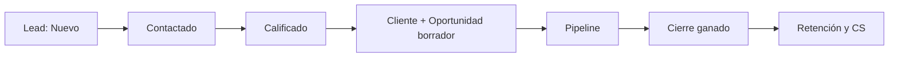
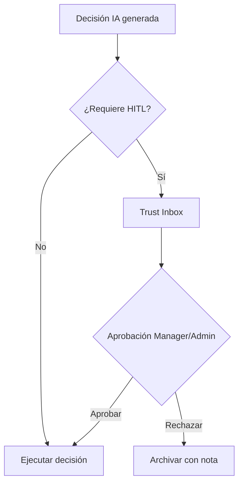
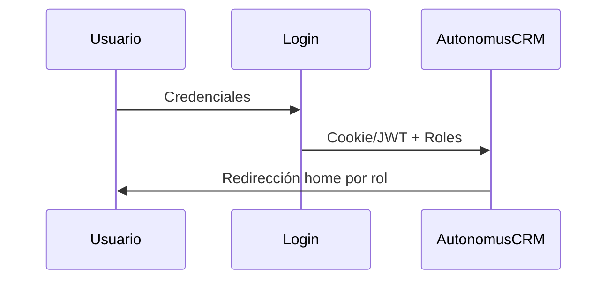

# AutonomusCRM

## Matriz Global de Permisos

**Versión:** 2.0.0  
**Fecha de publicación:** 5 de junio de 2026  
**Autor:** AutonomusCRM Enterprise Documentation Team  
**Rol objetivo:** Gobernanza  
**Clasificación:** Confidencial — Uso interno y clientes autorizados

---

*Documentación corporativa — Estándar Salesforce / Microsoft Dynamics 365*

---

## Control de versiones

| Versión | Fecha | Autor | Descripción |
|---------|-------|-------|-------------|
| 1.0.0 | 2026-06-05 | Enterprise Documentation Team | Publicación inicial basada en código |
| 2.0.0 | 5 de junio de 2026 | Enterprise Documentation Team | Transformación corporativa: estructura, diagramas, callouts, glosario |

---

## Tabla de contenido

*Índice generado automáticamente — ver encabezados numerados del documento.*

1. Introducción
2. Cuerpo del documento (capítulos originales transformados)
3. Diagramas de referencia
4. Glosario corporativo
5. Apéndices

---

## 1. Introducción

### 1.1 Objetivo del documento

Permisos por rol y módulo

### 1.2 Audiencia

Administradores y auditores

### 1.3 Alcance

Este documento cubre **únicamente funcionalidades verificadas** en el código fuente de AutonomusCRM. No describe módulos inexistentes ni roles no implementados.

### 1.4 Prerrequisitos

| Requisito | Detalle |
|-----------|---------|
| Acceso | Cuenta activa en el tenant AutonomusCRM |
| Navegador | Chrome, Edge o Firefox actualizado |
| Rol | Según matriz en `ROLE_PERMISSION_MATRIX.md` |
| Conocimientos | Ninguno técnico requerido para roles operativos |

### 1.5 Definiciones clave

Consulte el **Glosario corporativo** al final del documento. Términos críticos: Lead, Customer, Deal, Pipeline, Tenant, Revenue OS.

> **NOTA:** La interfaz admite español (ES) e inglés (EN). Las rutas técnicas (`/Leads`, `/Deals`) se conservan por trazabilidad al producto.

[CAPTURA: Pantalla de inicio de sesión — /Account/Login]

---

## 2. Cuerpo del documento

# ROLE_PERMISSION_MATRIX — Matriz Global de Permisos

**Roles:** Admin, Manager, Sales, Support, Viewer  
**Leyenda:** ✅ Permitido · ❌ Denegado · 👁 Lectura · ⚠️ > **RIESGO** Brecha (API sin filtro rol)

---

## 1. Módulos × Rol

| Módulo | Ruta | Admin | Manager | Sales | Support | Viewer |
|--------|------|:-----:|:-------:|:-----:|:-------:|:------:|
| Command Center | `/` | ✅ | ✅ | ✅ | ✅ | ✅ |
| Trust Studio | `/TrustInbox` | ✅ | ✅ | 👁 | 👁 | 👁 |
| Workforce | `/Agents` | ✅ | ✅ | 👁 | 👁 | 👁 |
| Revenue OS | `/revenue` | ✅ | ✅ | ✅ | 👁 | 👁 |
| Executive OS | `/executive` | ✅ | ✅ | 👁 | 👁 | 👁 |
| Pipeline / Deals | `/Deals` | ✅ | ✅ | ✅ | 👁 | 👁 |

[CAPTURA: Pipeline Kanban — /Deals]
| Customers Directory | `/Customers` | ✅ | ✅ | ✅ | 👁 | 👁 |
| Customer 360 | `/Customer360` | ✅ | ✅ | 👁 | ✅ | 👁 |
| Customer Success | `/customer-success` | ✅ | ✅ | 👁 | ✅ | 👁 |
| Leads | `/Leads` | ✅ | ✅ | ✅ | 👁 | 👁 |
| Memory | `/Memory` | ✅ | ✅ | 👁 | 👁 | 👁 |
| Tasks | `/Tasks` | ✅ | ✅ | ✅ | ✅ | 👁 |
| Integrations | `/Integrations` | ✅ | ✅ | 👁 | 👁 | 👁 |
| Voice Calls | `/VoiceCalls` | ✅ | ✅ | ✅ | 👁 | 👁 |
| Users | `/Users` | ✅ | ✅ | ❌ | ❌ | ❌ |
| Policies (ABAC) | `/Policies` | ✅ | ✅ | ✅* | 👁 | 👁 |
| Audit | `/Audit` | ✅ | ✅ | 👁 | 👁 | 👁 |
| Settings | `/Settings` | ✅ | ✅ | ❌ | ❌ | ❌ |
| Billing | `/billing` | ✅ | ✅ | 👁 | 👁 | 👁 |
| Workflows | `/Workflows` | ✅ | ✅ | ✅ | 👁 | 👁 |
| Failed Events | `/FailedEvents` | ✅ | ✅ | 👁 | 👁 | 👁 |

\*Sales puede escribir Policies vía middleware comercial; operación típica es Admin/Manager.

---

## 2. Acciones comerciales × Rol

| Acción | Admin | Manager | Sales | Support | Viewer |
|--------|:-----:|:-------:|:-----:|:-------:|:------:|
| Crear Lead (UI) | ✅ | ✅ | ✅ | ❌ | ❌ |
| Editar Lead (UI) | ✅ | ✅ | ✅ | ❌ | ❌ |
| Qualify Lead | ✅ | ✅ | ✅ | ❌ | ❌ |
| Convert Lead | ✅ | ✅ | ✅ | ❌ | ❌ |
| Delete Lead | ✅ | ✅ | ✅ | ❌ | ❌ |
| Import Leads | ✅ | ✅ | ✅ | ❌ | ❌ |
| Crear Customer (UI) | ✅ | ✅ | ✅ | ❌ | ❌ |
| Editar Customer (UI) | ✅ | ✅ | ✅ | ❌ | ❌ |
| Crear Deal (UI) | ✅ | ✅ | ✅ | ❌ | ❌ |
| Editar Deal / etapa | ✅ | ✅ | ✅ | ❌ | ❌ |
| Close / Lose Deal | ✅ | ✅ | ✅ | ❌ | ❌ |
| Import Deals | ✅ | ✅ | ✅ | ❌ | ❌ |
| Completar Task | ✅ | ✅ | ✅ | ✅ | 👁 |
| Crear Task manual | ✅ | ✅ | ✅ | ⚠️ | ❌ |

---

## 3. API REST × Rol

| Endpoint | Admin | Manager | Sales | Support | Viewer |
|----------|:-----:|:-------:|:-----:|:-------:|:------:|
| **Provisionar un nuevo tenant** (API administrativa) | ✅ | ❌ | ❌ | ❌ | ❌ |
| **Crear un nuevo usuario** (API administrativa) | ✅ | ❌ | ❌ | ❌ | ❌ |
| **Registrar un nuevo prospecto** (API) | ✅ | ✅ | ✅ | ⚠️ | ⚠️ |
| `POST /api/customers` | ✅ | ✅ | ✅ | ⚠️ | ⚠️ |
| `POST /api/deals` | ✅ | ✅ | ✅ | ⚠️ | ⚠️ |
| `GET /api/ai/*` | ✅ | ✅ | ✅ | ✅ | ✅ |
| `GET /api/flow/search` | ✅ | ✅ | ✅ | ✅ | ✅ |

⚠️ = Autenticado sin verificación de rol (> **RIESGO** Brecha documentada).

---

## 4. Administración × Rol

| Acción | Admin | Manager | Sales | Support | Viewer |
|--------|:-----:|:-------:|:-----:|:-------:|:------:|
| Crear usuario (UI) | ✅ | ✅ | ❌ | ❌ | ❌ |
| Asignar roles (UI) | ✅ | ✅ | ❌ | ❌ | ❌ |
| Settings tenant | ✅ | ✅ | ❌ | ❌ | ❌ |
| MFA configuración | ✅ | ✅ | ❌ | ❌ | ❌ |
| AI kill-switch | ✅ | ✅ | ❌ | ❌ | ❌ |
| Integrations OAuth | ✅ | ✅ | ❌ | ❌ | ❌ |
| Audit export | ✅ | ✅ | ❌ | ❌ | ❌ |
| Billing | ✅ | ✅ | ❌ | ❌ | ❌ |
| Aprobar Trust (HITL) | ✅ | ✅ | ❌ | ❌ | ❌ |

---

## 5. Restricciones globales

| Restricción | Aplica a |
|-------------|----------|
| Tenant isolation | Todos — solo datos de su `TenantId` |
| Plan limits | `PlanLimitMiddleware` — según suscripción |
| Usuario inactivo | Login rechazado |
| Commercial write middleware | Bloquea Support/Viewer en POST y Create/Edit comercial |
| RequireAdmin policy | Solo Admin en tenants/users API |

---

## 6. Home redirect

| Rol | Ruta |
|-----|------|
| Admin | `/executive` |
| Manager | `/executive` |
| Sales | `/revenue` |
| Support | `/Customer360` |
| Viewer | `/` |

**Fuente:** `RoleHomeRedirect.cs`

---

*Matriz derivada de `CommercialWriteAuthorizationMiddleware.cs`, `[Authorize(Roles)]` en páginas, controllers API y `03_ROLE_MATRIX.md`.*

---

## 3. Diagramas de referencia

### Diagramas de referencia

#### Ciclo de vida del Lead

#### Flujo de aprobación Trust Studio

#### Flujo de autenticación

---

## 4. Glosario corporativo

## Glosario corporativo

| Término | Definición |
|---------|------------|
| **CRM** | Customer Relationship Management — sistema para registrar y medir relaciones comerciales |
| **Lead** | Prospecto o contacto potencial; entidad inicial del embudo |
| **Customer** | Cuenta o cliente en el directorio del tenant |
| **Opportunity / Deal** | Oportunidad de venta con monto, etapa y probabilidad |
| **Pipeline** | Conjunto de oportunidades abiertas y sus etapas en `/Deals` |
| **Forecast** | Proyección ponderada: monto × probabilidad por ventana de cierre |
| **Workflow** | Automatización configurable: trigger + condiciones + acciones |
| **Tenant** | Organización aislada; todos los datos pertenecen a un TenantId |
| **Trust Studio** | Buzón HITL en `/TrustInbox` para aprobar decisiones de IA |
| **Revenue OS** | Módulo de ingresos en `/revenue` — priorización y fugas |
| **Executive OS** | Tablero ejecutivo en `/executive` |
| **MFA** | Autenticación multifactor configurable en Settings |
| **ABAC** | Attribute-Based Access Control — políticas en `/Policies` (no sustituye RBAC) |
| **Customer Success** | Módulo post-venta en `/customer-success` (no es un rol) |
| **Churn** | Abandono del cliente; predicción ML en Customer 360 |
| **LTV** | Lifetime Value — valor acumulado del cliente |
| **Upsell** | Venta adicional al mismo cliente (expansión) |
| **Cross-Sell** | Venta de productos complementarios |
| **Playbook** | Secuencia automatizada: onboarding, rescue, re-engagement |
| **AI Agent** | Agente autónomo en `/Agents` (LeadIntelligence, Communication, etc.) |
| **Semantic Memory** | Memoria empresarial en `/Memory` |
| **Outcome Fabric** | Atribución de resultados en `/command/outcomes` |
| **HITL** | Human-in-the-Loop — supervisión humana de decisiones IA |
| **SLA** | Acuerdo de nivel de servicio (ej. contacto lead en 24 h) |
| **DLQ** | Dead Letter Queue — eventos fallidos en `/FailedEvents` |

---

## 5. Apéndices

### 5.1 Referencias cruzadas

| Documento | Ubicación |
|-----------|-----------|
| Matriz de permisos | `Documentation/ROLE_PERMISSION_MATRIX.md` |
| Descubrimiento de roles | `Documentation/ROLE_DISCOVERY_REPORT.md` |
| Manual maestro | `docs/manual-empresarial-autonomuscrm/` |

### 5.2 Pie de documento

| Campo | Valor |
|-------|-------|
| Producto | AutonomusCRM |
| Versión documento | 2.0.0 |
| Clasificación | Confidencial — Uso interno y clientes autorizados |
| Fuente | Código verificado — sin funcionalidades inventadas |

---

*© AutonomusCRM — Documentación Enterprise. Listo para impresión PDF y capacitación corporativa.*

