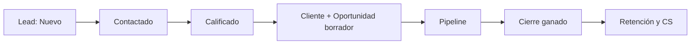
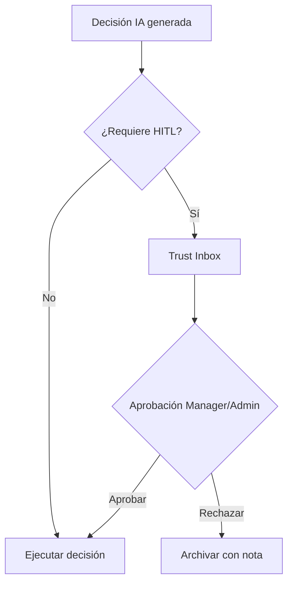
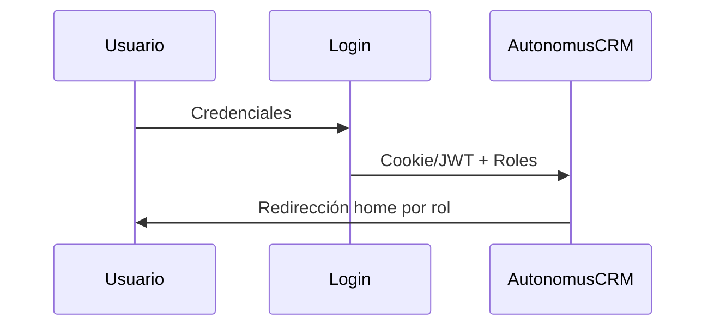

# AutonomusCRM

## Manual de Usuario — Administrador

**Versión:** 2.0.0  
**Fecha de publicación:** 5 de junio de 2026  
**Autor:** AutonomusCRM Enterprise Documentation Team  
**Rol objetivo:** Admin  
**Clasificación:** Confidencial — Uso interno y clientes autorizados

---

*Documentación corporativa — Estándar Salesforce / Microsoft Dynamics 365*

---

## Control de versiones

| Versión | Fecha | Autor | Descripción |
|---------|-------|-------|-------------|
| 1.0.0 | 2026-06-05 | Enterprise Documentation Team | Publicación inicial basada en código |
| 2.0.0 | 5 de junio de 2026 | Enterprise Documentation Team | Transformación corporativa: estructura, diagramas, callouts, glosario |

---

## Tabla de contenido

*Índice generado automáticamente — ver encabezados numerados del documento.*

1. Introducción
2. Cuerpo del documento (capítulos originales transformados)
3. Diagramas de referencia
4. Glosario corporativo
5. Apéndices

---

## 1. Introducción

### 1.1 Objetivo del documento

Operación completa del tenant, seguridad, usuarios, IA y auditoría

### 1.2 Audiencia

Administradores del tenant, TI y dirección técnica

### 1.3 Alcance

Este documento cubre **únicamente funcionalidades verificadas** en el código fuente de AutonomusCRM. No describe módulos inexistentes ni roles no implementados.

### 1.4 Prerrequisitos

| Requisito | Detalle |
|-----------|---------|
| Acceso | Cuenta activa en el tenant AutonomusCRM |
| Navegador | Chrome, Edge o Firefox actualizado |
| Rol | Según matriz en `ROLE_PERMISSION_MATRIX.md` |
| Conocimientos | Ninguno técnico requerido para roles operativos |

### 1.5 Definiciones clave

Consulte el **Glosario corporativo** al final del documento. Términos críticos: Lead, Customer, Deal, Pipeline, Tenant, Revenue OS.

> **NOTA:** La interfaz admite español (ES) e inglés (EN). Las rutas técnicas (`/Leads`, `/Deals`) se conservan por trazabilidad al producto.

[CAPTURA: Pantalla de inicio de sesión — /Account/Login]

---

## 2. Cuerpo del documento

## Capítulo 1. Quién es este rol

### 1.1 Definición
El **Admin** es el administrador del tenant y la máxima autoridad operativa dentro de AutonomusCRM. En el seed de demostración corresponde al usuario **Admin Sistema** (`admin@autonomuscrm.local`). Es el único rol autorizado para **provisionar tenants y usuarios vía API REST** (`POST api/tenants`, `POST api/users` con política `RequireAdmin`).

### 1.2 Objetivos estratégicos
| Objetivo | Descripción |
|----------|-------------|
| Gobernanza del tenant | Configurar Settings, políticas ABAC, integraciones y facturación |
| Seguridad y cumplimiento | Auditar eventos, gestionar usuarios/roles, MFA y kill-switch autónomo |
| Supervisión de ingresos | Usar Executive OS y Revenue OS para decisiones de dirección |
| Gobernanza de IA | Aprobar/rechazar decisiones en Trust Studio (HITL) |

[CAPTURA: Trust Studio — /TrustInbox]
| Operación comercial | Escritura completa en Leads, Customers, Deals, Workflows y Policies (igual que Manager y Sales en UI) |

### 1.3 Responsabilidades operativas
1. **Provisioning:** crear tenants (`POST api/tenants`) y usuarios API (`POST api/users`); gestión UI en `/Users`, `/Users/Create`, `/Users/Roles`, `/Users/Import`.

[CAPTURA: Gestión de usuarios — /Users]
2. **Configuración:** `/Settings` (perfil tenant, MFA, kill-switch, restauración de defaults).
3. **Políticas y automatización:** `/Policies`, `/Workflows` — definir reglas ABAC y flujos por eventos de dominio.
4. **Trust Studio:** `/TrustInbox` — aprobar, rechazar, rollback y ajustar umbral de aprobación (50–95).
5. **Auditoría:** `/Audit` — consulta y export JSON (hasta 10.000 eventos).
6. **Integraciones:** `/Integrations` — HubSpot, Salesforce, email, Stripe.
7. **Resolución de incidentes:** `/FailedEvents` (DLQ), logs workers, health checks.
8. **Facturación:** `/billing` — dashboard de suscripción del tenant.

### 1.4 KPIs que el Admin debe monitorear
| KPI | Fuente en sistema | Interpretación |
|-----|-------------------|----------------|
| Forecast 30/60/90 | `/Deals` — `DealRepository.GetListSummaryAsync` | Compromiso de ingresos ponderado (Amount × Probability) |
| Win Rate | `/Deals` | Won / (Won + Lost) |
| Revenue generated/protected | `/` Command, `/executive` | Salud del flujo de ingresos (7 o 30 días) |
| Pending Trust approvals | `/TrustInbox`, badge sidebar | Backlog HITL; riesgo de SLA vencido |
| Leads HighScoreCount (>70) | `/Leads` | Calidad del embudo superior |
| Customer HighRiskCount (>70) | `/Customers` | Cuentas en riesgo de churn |
| Tasks overdue | `/Tasks?overdueOnly=true` | Incumplimiento SLA operativo |
| Failed events | `/FailedEvents` | Eventos no procesados por workers |

### 1.5 Impacto en el negocio
- Sin Admin configurado correctamente, **no hay usuarios**, **no hay integraciones** y **las decisiones autónomas** pueden ejecutarse sin supervisión HITL adecuada.
- El Admin es el punto de escalamiento para **> **RIESGO** Brechas documentadas** (p. ej. API comercial POST sin filtro de rol vs UI bloqueada para Support/Viewer).
- La redirección post-login a `/executive` posiciona al Admin en la **vista consolidada de dirección**, no en el pipeline diario de un vendedor (`/revenue` es home de Sales).

---

## Capítulo 2. Acceso, login, permisos y seguridad

[CAPTURA: Pantalla de inicio de sesión — /Account/Login]

### 2.1 Credenciales demo
| Campo | Valor |
|-------|-------|
| Email | `admin@autonomuscrm.local` |
| Contraseña | `Admin123!` (patrón `{Role}123!` en `DemoRoleUsers.PasswordFor`) |
| Nombre | Admin Sistema |

La pantalla de login muestra cuentas demo desde `DemoRoleUsers.All`.

### 2.2 Flujo de acceso
1. Navegar a `/Account/Login`.
2. Autenticarse con email y contraseña (o cuenta demo Admin).
3. Si MFA está habilitado, completar segundo factor (`EnableMfaCommand` vía `POST api/users/{id}/enable-mfa`).
4. Tras login exitoso, `RoleHomeRedirect.GetHomePath` redirige a **`/executive`**.

### 2.3 Matriz de permisos Admin (código verificado)
| Capacidad | Admin | Evidencia |
|-----------|:-----:|-----------|
| Lectura autenticada general | ✅ | `[Authorize]` global |
| Home `/executive` | ✅ | `RoleHomeRedirect.cs` |
| POST `api/tenants` | ✅ | `TenantsController` + `RequireAdmin` |
| POST `api/users` | ✅ | `UsersController` + `RequireAdmin` |
| UI `/Users/*` | ✅ | `[Authorize(Roles = "Admin,Manager")]` |
| UI `/Settings` | ✅ | `[Authorize(Roles = "Admin,Manager")]` |
| Escritura comercial UI (Leads/Customers/Deals/Workflows/Policies) | ✅ | control de escritura comercial del sistema — roles `Admin`, `Manager`, `Sales` |
| Trust Studio Approve/Reject/Rollback | ✅ | `TrustInbox.cshtml.cs` — sin restricción de rol adicional (autenticado) |
| Billing `/billing` | ✅ | Sin `[Authorize(Roles=...)]` en `Billing.cshtml.cs` |
| Búsqueda global Ctrl+K | ✅ | `/api/flow/search` |

### 2.4 Escritura comercial — middleware
control de escritura comercial del sistema bloquea POST y GET a rutas `/Create` o `/Edit` en:

- `/Leads`, `/Customers`, `/Deals`, `/Workflows`, `/Policies`

para roles que **no** sean Admin, Manager o Sales. El Admin **nunca** recibe redirect a `/Account/AccessDenied` por escritura comercial en UI.

### 2.5 Políticas de autorización registradas
`AuthorizationPolicies.cs` define:

- `RequireAdmin` → solo rol Admin
- `RequireManager` → Admin o Manager
- `RequireSales` → Admin, Manager o Sales
- `RequireSameTenant` → aislamiento por tenant

**Uso real verificado:** `RequireAdmin` en `POST api/tenants` y `POST api/users`. Las políticas `RequireManager` y `RequireSales` están registradas pero **no aplicadas** en endpoints comerciales según documentación enterprise.

### 2.6 Seguridad operativa recomendada
1. **Rotar contraseñas demo** en entornos no demostrativos.
2. **No asignar rol Admin** a ejecutivos comerciales; usar Sales o Manager.
3. Revisar **Audit** tras cambios en Users, Settings o Policies.
4. Mantener **kill-switch** (`Settings` → `KillSwitch`) accesible para detener ciclo autónomo en incidentes.
5. Validar que integraciones OAuth usen callbacks correctos antes de producción.
6. Conocer la **> **RIESGO** Brecha UI vs API:** Support/Viewer bloqueados en Razor pero API POST comercial solo exige autenticación — restringir tokens API en producción.

### 2.7 MFA
- Habilitación: `POST api/users/{id}/enable-mfa?tenantId={guid}`.
- Gestión de usuarios bloqueados por MFA: reset desde `/Users/Edit` (escalar internamente si el Admin pierde acceso).

---

## Capítulo 3. Menús disponibles (19 ítems del sidebar)

El menú lateral está definido en `Pages/Shared/Flow/_FlowSidebar.cshtml`. **Los 19 ítems son visibles para todos los roles autenticados**; la restricción es por **acceso denegado** en acciones de escritura o páginas con `[Authorize(Roles=...)]`, no por ocultar ítems.

| # | Sección | Etiqueta | Ruta | Uso principal Admin |
|---|---------|----------|------|---------------------|
| 1 | Command | Command | `/` | Métricas flujo, decisiones IA, workforce snapshot |
| 2 | Command | Trust Studio | `/TrustInbox` | Aprobación HITL; badge con pendientes |
| 3 | Command | Workforce | `/Agents` | Agentes autónomos y decisiones recientes |
| 4 | Revenue | Revenue OS | `/revenue` | Fugas de ingreso, grafo explicativo |
| 5 | Revenue | Executive | `/executive` | **Home post-login** — dashboard consolidado |
| 6 | Revenue | Pipeline | `/Deals` | Kanban/lista oportunidades, forecast |

[CAPTURA: Pipeline Kanban — /Deals]
| 7 | Customers | Directory | `/Customers` | Directorio clientes, LTV, riesgo |
| 8 | Customers | Customer 360 | `/Customer360` | Búsqueda vista 360 |
| 9 | Customers | Customer Success | `/customer-success` | Tickets, casos, playbooks CS |
| 10 | Commerce | Leads | `/Leads` | Gestión prospectos |
| 11 | Intelligence | Memory | `/Memory` | Memoria semántica empresarial |
| 12 | Operations | Tasks | `/Tasks` | Tareas workflow y operativas |
| 13 | Platform | Integrations | `/Integrations` | HubSpot, Salesforce, email, Stripe |
| 14 | Platform | Voice | `/VoiceCalls` | Registro de llamadas |
| 15 | Admin | Users | `/Users` | Usuarios, roles, importación |
| 16 | Admin | Policies | `/Policies` | Políticas ABAC |
| 17 | Admin | Audit | `/Audit` | Event sourcing / auditoría |
| 18 | Admin | Settings | `/Settings` | Perfil tenant, MFA, kill-switch |
| 19 | Admin | Billing | `/billing` | Suscripción y facturación |

### Rutas críticas fuera del sidebar

| Ruta | Propósito Admin |
|------|-----------------|
| `/Leads/Create`, `/Edit`, `/Details` | CRUD y Qualify/Convert/Create Deal |
| `/Customers/Create`, `/Edit`, `/Details` | CRUD cliente |
| `/Deals/Create`, `/Edit`, `/Details` | CRUD deal, Close/Lose |
| `/Workflows`, `/Workflows/Edit` | Automatizaciones configurables |
| `/command/decisions` | Historial decisiones filtrable |
| `/command/outcomes` | Outcome Fabric |
| `/command/playbooks` | Playbooks autónomos |
| `/customers/{id}/360` | Vista 360 individual |
| `/FailedEvents` | DLQ — replay eventos fallidos |
| `/Users/Create`, `/Users/Roles`, `/Users/Import` | Gestión usuarios |

### Nota sobre > **ADVERTENCIA** Access Denied (otros roles)

Sales recibe **> **ADVERTENCIA** Access Denied** en `/Users` y `/Settings` (`[Authorize(Roles = "Admin,Manager")]`). Support y Viewer reciben **> **ADVERTENCIA** Access Denied** al intentar POST o `/Create`/`/Edit` en módulos comerciales. **Admin y Manager no tienen estas restricciones** en los módulos documentados.

### Búsqueda global

**Ctrl+K** abre búsqueda que consulta `/api/flow/search` (incluye Trust Studio, Leads, Deals, etc.).

---

## Capítulo 4. Flujo diario del Admin

### 4.1 Ritual matutino (30 minutos)
| Minuto | Acción | Ruta |
|--------|--------|------|
| 0–5 | Login → Executive OS | `/executive` |
| 5–10 | Revisar badge Trust Studio | `/TrustInbox` |
| 10–15 | Command Center — decisiones y cuentas en riesgo | `/` |
| 15–20 | Tasks overdue del tenant | `/Tasks?overdueOnly=true` |
| 20–25 | Failed Events si hay alertas | `/FailedEvents` |
| 25–30 | Integrations health | `/Integrations` |

### 4.2 Durante la jornada
| Evento | Acción Admin |
|--------|--------------|
| Nueva solicitud de usuario | `/Users/Create` o `POST api/users` |
| Decisión IA pendiente crítica | `/TrustInbox` → Approve/Reject |
| Cambio de política comercial | `/Policies` o `/Workflows/Edit` |
| Incidente workers/RabbitMQ | Logs + `/FailedEvents` replay |
| Solicitud de forecast | `/Deals` o export Executive |

### 4.3 Ritual de cierre (15 minutos)
1. Trust Studio — cero pendientes críticos/overdue SLA.
2. Audit — muestreo de eventos del día (cambios Users/Settings).
3. Command — revisar métricas 7 días.
4. Verificar que kill-switch refleje estado deseado en Settings.

### 4.4 Ritual semanal
| Día | Acción |
|-----|--------|
| Lunes | Executive OS + forecast 30/60/90 en `/Deals` |
| Miércoles | Trust backlog + Memory dashboard |
| Viernes | Export Audit JSON; revisión roles en `/Users/Roles` |
| Según necesidad | Billing, rotación credenciales demo, backup VPS |

---

## Capítulo 5. Procesos operativos paso a paso

### 5.1 Provisionar un nuevo tenant (solo Admin)
**Prerrequisito:** token JWT de usuario Admin.

1. `POST api/tenants` con body `CreateTenantCommand` (nombre, settings).
2. Verificar respuesta `201 Created` con `tenantId`.
3. `GET api/tenants/{id}` para confirmar datos.
4. Configurar Settings del nuevo tenant vía UI o `UpdateSystemSettingsCommand`.
5. Crear usuario inicial con `POST api/users` o `/Users/Create`.

### 5.2 Crear usuario (UI y API)
**UI (`/Users/Create`):** Admin y Manager pueden usar el formulario (`CreateUserCommand`).

**API (`POST api/users`):** **solo Admin** (`RequireAdmin`).

Pasos UI:

1. Ir a `/Users` → Crear.
2. Completar email, contraseña, nombre, apellido.
3. Asignar rol en `/Users/Roles` o `/Users/Edit` (`AssignRole`).
4. Opcional: habilitar MFA vía API.

### 5.3 Gestionar roles de equipo
1. `/Users/Roles` — vista de roles del sistema: Admin, Manager, Sales, Support, Viewer.
2. `/Users/Edit/{id}` — asignar rol, activar/desactivar usuario.
3. `/Users/BulkActions` — acciones masivas.
4. `/Users/Import` — importación CSV.

> **BUENA PRÁCTICA** vendedores → Sales; supervisores → Manager; solo TI/dirección → Admin.

### 5.4 Configurar Settings del tenant
1. Abrir `/Settings` (`[Authorize(Roles = "Admin,Manager")]`).
2. Editar perfil tenant, comunicaciones, umbrales.
3. **KillSwitch:** `false` = ciclo autónomo activo (si `AutonomousPlatformGate` lo permite).
4. Exportar/importar configuración JSON desde handlers `OnPostExportConfigAsync` / `OnPostImportConfigAsync`.
5. Restaurar defaults con handler de configuración por defecto.

### 5.5 Aprobar decisión en Trust Studio
1. Abrir `/TrustInbox` (badge en sidebar si hay pendientes).
2. Seleccionar ítem de la cola (severidad: critical, high, medium, low).
3. Revisar explicabilidad (`ExplainTrustApprovalAsync`) y Outcome Fabric.
4. Opcional: **Simulate** (`?preview=simulate`).
5. **Approve** → ejecuta decisión (`executeDecision: true`).
6. **Reject** → con nota opcional.
7. **Rollback** → si ya se ejecutó y requiere reversión.
8. Ajustar umbral: `OnPostSetThresholdAsync` (50–95).

### 5.6 Crear y calificar un Lead (escritura comercial)
1. `/Leads/Create` — estado inicial `New`, evento `LeadCreatedEvent`.
2. Automatizaciones: SLA 24h, `LeadIntelligenceAgent` (score), `CommunicationAgent` (si configurado).
3. `/Leads/Details` → **Qualify** → Customer auto, deal borrador ($1, IsDraft), tarea alta prioridad.
4. Actualizar deal borrador en `/Deals/Edit` con monto real.

### 5.7 Cerrar un Deal ganado
1. `/Deals/Details` → mover etapas (Prospecting → … → Negotiation).
2. **Close** → `DealClosedEvent`.
3. Post-cierre: Retention actualiza Customer/LTV; Operational crea tareas onboarding D0/D7/D30; OutcomeAttribution aprende.

### 5.8 Configurar un Workflow
1. `/Workflows` → Crear.
2. Definir trigger (tipo evento dominio, p. ej. `Lead.Created`).
3. Añadir condiciones y acciones: `Assign`, `UpdateStatus`, `CreateTask`.
4. > **ADVERTENCIA** acciones `Communicate` y `ActivateAgent` solo registran log — no envían mensajes ni activan LLM.

### 5.9 Reprocesar eventos fallidos
1. `/FailedEvents` — listar DLQ.
2. Identificar evento y causa en logs (`autonomuscrm-workers`).
3. Ejecutar replay según UI disponible.
4. Verificar en `/Audit` y `/Tasks` que se generaron efectos esperados.

### 5.10 Exportar auditoría
1. `/Audit` — filtrar por tipo/fecha.
2. Export JSON (hasta 10.000 eventos).
3. Archivar para cumplimiento o investigación de incidentes.

---

## Capítulo 6. Automatizaciones relacionadas con el rol Admin

El Admin no ejecuta automatizaciones manualmente, pero **las configura, supervisa y resuelve fallos**.

### 6.1 Motores síncronos (API — `DomainEventDispatcher`)
| Motor | Eventos clave | Efecto | Supervisión Admin |
|-------|---------------|--------|-------------------|
| WorkflowEngine | Cualquier evento con workflow activo | Assign, UpdateStatus, CreateTask | `/Workflows`, `/Tasks` |
| OperationalAutomation | LeadQualified, DealClosed | Customer+deal draft+task / onboarding | `/Leads`, `/Deals` |
| RevenueAutomation | LeadCreated, LeadScoreUpdated, LeadQualified | SLA, asignación score alto | `/Tasks`, `/revenue` |
| RetentionAutomation | CustomerCreated, DealClosed, RiskScore≥70 | Status, playbooks, emails | `/Customers`, `/customer-success` |
| AutonomousOrchestration | Varios (gated) | Decisiones autónomas | `/TrustInbox`, Settings kill-switch |
| BusinessMemoryPipeline | Seleccionados | Episodios memoria | `/Memory` |

### 6.2 Workers RabbitMQ
| Agente | Evento | Efecto |
|--------|--------|--------|
| LeadIntelligenceAgent | LeadCreated | Score → LeadScoreUpdated |
| CommunicationAgent | LeadCreated, CustomerCreated | Email/WhatsApp bienvenida |
| CustomerRiskAgent | CustomerCreated | Risk score |
| CustomerHealthAgent | CustomerCreated | Playbooks rescue/adoption |
| ChurnRiskAgent | RiskScore≥60 | Acciones churn |
| DealStrategyAgent | DealCreated, StageChanged | Tareas inteligencia ventas |
| OutcomeAttribution | DealClosed/Lost | NBA ML + ABOS learning |

### 6.3 Jobs periódicos (`Worker.cs` — cada 15 min por tenant)
- Revenue scan (deals estancados, leads inactivos)
- Data quality tasks
- Retention scan
- Renewal / Expansion agents
- Intelligence scan
- Customer insights
- Ciclo autónomo completo

**Cada 6 h:** `BusinessMemoryConsolidationWorker`.

### 6.4 Limitaciones que el Admin debe conocer
| Componente | Estado real |
|------------|-------------|
| Workflow `Communicate` | Solo log |
| Workflow `ActivateAgent` | Solo log |
| AutomationOptimizerAgent | Solo log (TODO) |
| DataQualityGuardian | Registrado, no invocado |
| ComplianceSecurityAgent | No bloquea (TODO) |

### 6.5 Monitoreo Admin
- `/FailedEvents` — DLQ replay
- `/Audit` — trazabilidad
- `/Tasks` — tareas generadas
- Logs: `docker logs autonomuscrm-api`, `docker logs autonomuscrm-workers`

---

## Capítulo 7. Uso de IA (Command, Trust, Agents, Memory)

### 7.1 Command Center (`/`)
**Servicio:** `IAiCommandCenterService.GetFlowCommandAsync`

- Métricas: revenue generated/protected, cuentas en riesgo, expansiones, renovaciones.
- Decisiones en vivo y snapshot workforce.
- Periodo: 7 o 30 días (query param).
- Enlace directo a Trust Studio si `PendingApprovals > 0`.

### 7.2 Trust Studio (`/TrustInbox`)
- Cola HITL con severidad y SLA (`ITrustSlaService`).
- Acciones: Approve, Reject, Rollback, Simulate, SetThreshold.
- Métricas: `ITrustMetricsService.GetMetricsAsync`.
- **Admin y Manager** son los roles operativos de aprobación según documentación enterprise.

### 7.3 Workforce / Agents (`/Agents`)
- Vista de agentes autónomos y decisiones recientes.
- Complementar con `/command/decisions`, `/command/outcomes`, `/command/playbooks`.

### 7.4 Memory (`/Memory`)
**Servicio:** `ISemanticMemoryService.GetDashboardAsync`

- Timeline de memoria empresarial semántica.
- Estado del proveedor de embeddings.
- Consolidación cada 6 h vía worker.

### 7.5 Revenue OS y Executive OS
| Módulo | Ruta | Servicio | Uso Admin |
|--------|------|----------|-----------|
| Revenue OS | `/revenue` | `IRevenueOsService` + `IGraphReasoningEngine` | Fugas de ingreso |
| Executive OS | `/executive` | `IExecutiveOsService` | Home; export HTML |

### 7.6 API de IA (integraciones)
| Endpoint | Salida |
|----------|--------|
| `GET api/ai/ml/churn` | Predicciones churn |
| `GET api/ai/ml/expansion` | Oportunidades expansión |
| `GET api/ai/ml/revenue` | Forecast ML |
| `POST api/ai/enterprise-cycle` | Train + drift + graph |
| `GET api/ai/analytics` | Analytics ejecutivo |
| `GET api/ai/governance` | Reporte gobernanza |
| `GET api/ai/dashboard` | Executive AI dashboard |

### 7.7 Gate autónomo
`AutonomousRevenueDecisionEngine` combina health, churn V2, expansion, NPS/CSAT, memoria semántica. Controlado por `AutonomousPlatformGate` + **kill-switch** en Settings.

### 7.8 Expectativas realistas (Admin)
| Expectativa incorrecta | Realidad |
|------------------------|----------|
| "La IA cierra ventas sola" | Crea tareas y decisiones; humano o Trust aprueba |
| "ChatGPT en cada email" | CommunicationAgent usa templates configurados |
| "Trust vacío = IA rota" | Puede significar sin decisiones HITL pendientes |
| "LLM en workers producción" | `LlmAgentService` en tests; workers default sin LLM cableado |

---

## Capítulo 8. Reportes y analítica

### 8.1 Executive OS (`/executive`) — reporte principal Admin
- Dashboard consolidado dirección.
- Trust pending approvals.
- Export HTML (`?handler=Export`).

### 8.2 Command (`/`)
- Flow command metrics 7/30 días.
- Priorización diaria operativa.

### 8.3 Revenue OS (`/revenue`)
- Dashboard ingresos.
- `DetectRevenueLeakAsync` — explicación fugas pipeline.

### 8.4 Pipeline / Deals (`/Deals`)
| Métrica | Significado |
|---------|-------------|
| Forecast 30/60/90 | Suma ponderada deals abiertos por ventana cierre |
| Win Rate | Won / (Won + Lost) |
| Revenue Closed | Suma Amount ClosedWon |
| Pipeline Open | Suma Amount deals Open |

### 8.5 Leads (`/Leads`)
TotalCount, QualifiedCount, NewCount, HighScoreCount (>70), AvgScore, SourceStats.

### 8.6 Customers (`/Customers`)
TotalCount, AvgLtv, HighLtvCount (>10.000), HighRiskCount (>70), AvgRisk.

### 8.7 Tasks (`/Tasks`)
Conteos por tenant, overdue, filtros status/assignee/priority.

### 8.8 Audit (`/Audit`)
Event store paginado, conteos por tipo, **export JSON hasta 10.000 eventos**.

### 8.9 Trust Studio métricas
SLA aprobaciones, severidad cola, umbral configurado.

### 8.10 Memory, Integrations, Billing
- `/Memory` — dashboard memoria semántica.
- `/Integrations` — `IntegrationHealthDashboardDto`.
- `/billing` — `IBillingDashboardService`.

### 8.11 Cómo interpretar como Admin
1. **Executive OS** → salud global del negocio en el tenant.
2. **Audit** → quién cambió qué (Users, Settings, deals).
3. **Deals forecast** → compromiso con dirección; validar ExpectedCloseDate.
4. **Trust metrics** → gobernanza IA efectiva.
5. **No confundir** totales de página paginada (50 ítems) con cards de resumen SQL.

---

## Capítulo 9. Escenario real completo

### Contexto

**Empresa:** TechScale SaaS (tenant demo).  
**Admin:** admin@autonomuscrm.local.  
**Situación:** Lunes 8:00 — nuevo lead inbound, usuario Sales solicitado, decisión IA pendiente, deal estancado detectado por Revenue scan.

### Paso 1 — Inicio en Executive (8:00)

Admin inicia sesión → redirección `/executive`. Revisa:

- Forecast 30 días: $245.000 (3 deals en Negotiation).
- Trust pending: 2 (badge sidebar).
- Cuentas high risk: 4 en `/Customers` resumen.

### Paso 2 — Trust Studio (8:10)

En `/TrustInbox`, primera decisión severidad **high**: playbook de retención propone email automático a cliente RiskScore 72.

- Revisa Outcome Fabric y explicabilidad.
- **Approve** — decisión ejecutada; Audit registra aprobación con UserId Admin.

Segunda decisión: asignación automática lead score 85 → **Approve**.

### Paso 3 — Nuevo usuario Sales (8:25)

Gerente comercial solicita cuenta para nuevo ejecutivo.

- Admin abre `/Users/Create`.
- Email: `nuevo.vendedor@techscale.local`, rol Sales en `/Users/Edit`.
- Alternativa automatizada: `POST api/users` con JWT Admin (único método API permitido).

### Paso 4 — Lead inbound (8:40)

Lead creado vía web (**Registrar un nuevo prospecto** (API) o UI):

- Estado `New`, fuente `Website`.
- Worker asigna score 78 en 2 minutos.
- RevenueAutomation crea tarea SLA 24h.

Admin verifica en `/Leads` que HighScoreCount incrementó y asigna manualmente si workflow no lo hizo.

### Paso 5 — Deal estancado (9:00)

Revenue OS señala deal "Acme Corp — Enterprise" 45 días en Proposal.

- Admin abre `/Deals/Details`, revisa historial en Audit.
- Crea tarea en `/Tasks` asignada al Sales owner: "Reactivar propuesta Acme".
- Notifica al Manager por canal interno.

### Paso 6 — Qualify y pipeline (9:30)

El Sales califica otro lead; Admin supervisa:

- Customer auto-creado, deal borrador $1.
- Admin edita deal → monto $48.000, etapa Qualification, ExpectedCloseDate +45 días.

### Paso 7 — Cierre de jornada Admin (18:00)

- Trust Studio: 0 pendientes.
- `/FailedEvents`: vacío.
- Export Audit parcial del día → archivo JSON archivado.
- Settings: kill-switch = false, integraciones email OK en `/Integrations`.

### Resultado

- Usuario Sales operativo.
- Decisiones IA gobernadas.
- Pipeline actualizado y deal estancado escalado.
- Trazabilidad completa en Audit.

---

## Capítulo 10. Errores comunes

| # | Error | Causa | Solución Admin |
|---|-------|-------|----------------|
| 1 | 403 en `POST api/users` con cuenta Manager | `RequireAdmin` solo Admin | Usar cuenta Admin o UI `/Users/Create` (Manager puede UI) |
| 2 | 403 en `POST api/tenants` | Misma política | Solo Admin |
| 3 | Sales reporta > **ADVERTENCIA** Access Denied en `/Users` | `[Authorize(Roles = "Admin,Manager")]` | Normal — Admin/Manager gestionan usuarios |
| 4 | Trust Studio vacío | Sin decisiones HITL pendientes | Revisar umbral en Trust; kill-switch; ciclo autónomo |
| 5 | Score lead siempre 0 | Worker no procesó | `/FailedEvents`, logs LeadIntelligenceAgent, replay |
| 6 | Deal borrador $1 tras Qualify | OperationalAutomation diseño | Editar monto en `/Deals/Edit` |
| 7 | Workflow no dispara | Inactivo o trigger incorrecto | `/Workflows/Edit` — verificar EventType |
| 8 | Communicate no envía email | Acción solo log | Usar CommunicationAgent vía eventos Lead/Customer |
| 9 | Forecast $0 | Sin ExpectedCloseDate | Sales/Admin actualizan deals |
| 10 | Email no enviado | Comms no configurado | `/Settings` + `/Integrations` |
| 11 | Integración OAuth falla | Callback/credenciales | Reconectar en `/Integrations` |
| 12 | MFA bloquea login | MFA sin setup usuario | `/Users/Edit` o `enable-mfa` API |
| 13 | Tareas no se crean | Worker caído | `docker ps`, reiniciar workers |
| 14 | Health 503 | Postgres/Redis down | Reiniciar docker compose |
| 15 | API comercial desde Support | > **RIESGO** Brecha UI vs API | Restringir tokens; política organizacional |
| 16 | Paginación muestra 50 ítems | Diseño SearchPagedAsync | Usar cards resumen y filtros |
| 17 | AssignRole acepta string libre | Sin whitelist estricta en dominio | Admin valida roles permitidos manualmente |
| 18 | Export Audit incompleto | Límite 10.000 | Filtrar por fecha y exportar por lotes |
| 19 | Memory sin embeddings | Provider no configurado | Config sección `AI` en deployment |
| 20 | Billing vacío | tenantId vacío en sesión | Re-login, verificar tenant |

---

## Capítulo 11. Preguntas frecuentes (FAQ) — Rol Admin

**Total: 100 preguntas numeradas específicas del rol Admin.**

### Acceso y identidad (1–10)

### 1. ¿Cuál es el email del Admin demo?

**Pregunta:** ¿Cuál es el email del Admin demo?

**Respuesta:** `admin@autonomuscrm.local`, definido en `DemoRoleUsers.All`.

**Impacto:** Afecta la operación diaria y la calidad de datos del tenant.

**Acción recomendada:** Seguir el procedimiento descrito y escalar al Manager o Admin si persiste.

### 2. ¿Cuál es la contraseña del Admin demo?

**Pregunta:** ¿Cuál es la contraseña del Admin demo?

**Respuesta:** `Admin123!` — patrón `{Role}123!` en `DemoRoleUsers.PasswordFor("Admin")`.

**Impacto:** Afecta la operación diaria y la calidad de datos del tenant.

**Acción recomendada:** Seguir el procedimiento descrito y escalar al Manager o Admin si persiste.

### 3. ¿A qué pantalla llego tras login como Admin?

**Pregunta:** ¿A qué pantalla llego tras login como Admin?

**Respuesta:** A `/executive`, según `RoleHomeRedirect.GetHomePath` cuando el claim de rol contiene "Admin".

**Impacto:** Afecta la operación diaria y la calidad de datos del tenant.

**Acción recomendada:** Seguir el procedimiento descrito y escalar al Manager o Admin si persiste.

### 4. ¿El Admin comparte home con algún otro rol?

**Pregunta:** ¿El Admin comparte home con algún otro rol?

**Respuesta:** Sí, con **Manager** — ambos redirigen a `/executive`.

**Impacto:** Afecta la operación diaria y la calidad de datos del tenant.

**Acción recomendada:** Seguir el procedimiento descrito y escalar al Manager o Admin si persiste.

### 5. ¿Puedo cambiar el home del Admin sin código?

**Pregunta:** ¿Puedo cambiar el home del Admin sin código?

**Respuesta:** No. La redirección está hardcodeada en `RoleHomeRedirect.cs`.

**Impacto:** Afecta la operación diaria y la calidad de datos del tenant.

**Acción recomendada:** Seguir el procedimiento descrito y escalar al Manager o Admin si persiste.

### 6. ¿El Admin puede iniciar sesión desde la lista de cuentas demo?

**Pregunta:** ¿El Admin puede iniciar sesión desde la lista de cuentas demo?

**Respuesta:** Sí. `Login.cshtml.cs` expone `DemoAccounts` desde `DemoRoleUsers.All`.

**Impacto:** Afecta la operación diaria y la calidad de datos del tenant.

**Acción recomendada:** Seguir el procedimiento descrito y escalar al Manager o Admin si persiste.

### 7. ¿Qué nombre muestra el perfil Admin demo?

**Pregunta:** ¿Qué nombre muestra el perfil Admin demo?

**Respuesta:** Admin Sistema (FirstName: Admin, LastName: Sistema).

**Impacto:** Afecta la operación diaria y la calidad de datos del tenant.

**Acción recomendada:** Seguir el procedimiento descrito y escalar al Manager o Admin si persiste.

### 8. ¿El Admin necesita MFA obligatoriamente?

**Pregunta:** ¿El Admin necesita MFA obligatoriamente?

**Respuesta:** No por defecto en seed demo. MFA se habilita por usuario vía `EnableMfaCommand`.

**Impacto:** Restricción de permisos o alcance del rol.

**Acción recomendada:** Seguir el procedimiento descrito y escalar al Manager o Admin si persiste.

### 9. ¿Puedo tener varios usuarios Admin en un tenant?

**Pregunta:** ¿Puedo tener varios usuarios Admin en un tenant?

**Respuesta:** Sí. El rol Admin se asigna vía `/Users/Roles`; no hay límite de uno en el código documentado.

**Impacto:** Afecta la operación diaria y la calidad de datos del tenant.

**Acción recomendada:** Seguir el procedimiento descrito y escalar al Manager o Admin si persiste.

### 10. ¿Qué ocurre si un Admin pierde acceso MFA?

**Pregunta:** ¿Qué ocurre si un Admin pierde acceso MFA?

**Respuesta:** Otro Admin debe intervenir vía `/Users/Edit` o restauración de entorno; no hay flujo self-service documentado.

**Impacto:** Afecta la operación diaria y la calidad de datos del tenant.

**Acción recomendada:** Seguir el procedimiento descrito y escalar al Manager o Admin si persiste.

### Permisos exclusivos Admin (11–25)

### 11. ¿Qué puede hacer el Admin que el Manager no puede vía API?

**Pregunta:** ¿Qué puede hacer el Admin que el Manager no puede vía API?

**Respuesta:** `POST api/tenants` y `POST api/users` — ambos requieren política `RequireAdmin`.

**Impacto:** Afecta la operación diaria y la calidad de datos del tenant.

**Acción recomendada:** Seguir el procedimiento descrito y escalar al Manager o Admin si persiste.

### 12. ¿El Manager puede crear usuarios en UI?

**Pregunta:** ¿El Manager puede crear usuarios en UI?

**Respuesta:** Sí, `/Users/Create` autoriza `Admin,Manager`. La diferencia es la API REST POST.

**Impacto:** Afecta la operación diaria y la calidad de datos del tenant.

**Acción recomendada:** Seguir el procedimiento descrito y escalar al Manager o Admin si persiste.

### 13. ¿Dónde está definida la política RequireAdmin?

**Pregunta:** ¿Dónde está definida la política RequireAdmin?

**Respuesta:** `AuthorizationPolicies.cs` y `Extensions.AddAutonomusPolicies` — `RequireRole("Admin")`.

**Impacto:** Afecta la operación diaria y la calidad de datos del tenant.

**Acción recomendada:** Seguir el procedimiento descrito y escalar al Manager o Admin si persiste.

### 14. ¿Qué controller usa RequireAdmin para tenants?

**Pregunta:** ¿Qué controller usa RequireAdmin para tenants?

**Respuesta:** `TenantsController.CreateTenant` — `[Authorize(Policy = AuthorizationPolicies.RequireAdmin)]`.

**Impacto:** Afecta la operación diaria y la calidad de datos del tenant.

**Acción recomendada:** Seguir el procedimiento descrito y escalar al Manager o Admin si persiste.

### 15. ¿Qué controller usa RequireAdmin para users API?

**Pregunta:** ¿Qué controller usa RequireAdmin para users API?

**Respuesta:** `UsersController.CreateUser` — `[Authorize(Policy = "RequireAdmin")]`.

**Impacto:** Afecta la operación diaria y la calidad de datos del tenant.

**Acción recomendada:** Seguir el procedimiento descrito y escalar al Manager o Admin si persiste.

### 16. ¿Puedo crear tenants desde la UI Razor?

**Pregunta:** ¿Puedo crear tenants desde la UI Razor?

**Respuesta:** No hay página `/Tenants/Create` documentada. Provisioning tenant es vía `POST api/tenants`.

**Impacto:** Restricción de permisos o alcance del rol.

**Acción recomendada:** Seguir el procedimiento descrito y escalar al Manager o Admin si persiste.

### 17. ¿El Admin puede leer cualquier tenant?

**Pregunta:** ¿El Admin puede leer cualquier tenant?

**Respuesta:** `GET api/tenants/{id}` requiere autenticación, no RequireAdmin. El aislamiento operativo depende del token/sesión del tenant activo.

**Impacto:** Afecta la operación diaria y la calidad de datos del tenant.

**Acción recomendada:** Seguir el procedimiento descrito y escalar al Manager o Admin si persiste.

### 18. ¿RequireManager incluye al Admin?

**Pregunta:** ¿RequireManager incluye al Admin?

**Respuesta:** Sí. `RequireRole("Admin", "Manager")` — Admin satisface políticas Manager y Sales.

**Impacto:** Afecta la operación diaria y la calidad de datos del tenant.

**Acción recomendada:** Seguir el procedimiento descrito y escalar al Manager o Admin si persiste.

### 19. ¿El Admin está exento del CommercialWriteAuthorizationMiddleware?

**Pregunta:** ¿El Admin está exento del CommercialWriteAuthorizationMiddleware?

**Respuesta:** Sí. Admin está en `WriteRoles = ["Admin", "Manager", "Sales"]`.

**Impacto:** Afecta la operación diaria y la calidad de datos del tenant.

**Acción recomendada:** Seguir el procedimiento descrito y escalar al Manager o Admin si persiste.

### 20. ¿El Admin puede acceder a `/Settings`?

**Pregunta:** ¿El Admin puede acceder a `/Settings`?

**Respuesta:** Sí. `[Authorize(Roles = "Admin,Manager")]` en `Settings.cshtml.cs`.

**Impacto:** Afecta la operación diaria y la calidad de datos del tenant.

**Acción recomendada:** Seguir el procedimiento descrito y escalar al Manager o Admin si persiste.

### 21. ¿El Admin puede gestionar `/Users`?

**Pregunta:** ¿El Admin puede gestionar `/Users`?

**Respuesta:** Sí. Misma autorización Admin,Manager en `Users.cshtml.cs` y subpáginas.

**Impacto:** Afecta la operación diaria y la calidad de datos del tenant.

**Acción recomendada:** Seguir el procedimiento descrito y escalar al Manager o Admin si persiste.

### 22. ¿El Admin puede usar Billing?

**Pregunta:** ¿El Admin puede usar Billing?

**Respuesta:** Sí. `Billing.cshtml.cs` no restringe por rol; el ítem sidebar es visible para todos.

**Impacto:** Afecta la operación diaria y la calidad de datos del tenant.

**Acción recomendada:** Seguir el procedimiento descrito y escalar al Manager o Admin si persiste.

### 23. ¿El Admin puede aprobar en Trust Studio?

**Pregunta:** ¿El Admin puede aprobar en Trust Studio?

**Respuesta:** Sí. `TrustInbox.cshtml.cs` no añade restricción de rol; Admin y Manager operan HITL.

**Impacto:** Afecta la operación diaria y la calidad de datos del tenant.

**Acción recomendada:** Seguir el procedimiento descrito y escalar al Manager o Admin si persiste.

### 24. ¿Puedo asignar rol Admin a mí mismo vía API sin ser Admin?

**Pregunta:** ¿Puedo asignar rol Admin a mí mismo vía API sin ser Admin?

**Respuesta:** `AssignRole` en dominio no tiene whitelist estricta documentada, pero gestión UI requiere Admin/Manager. Buena práctica: solo Admin asigna Admin.

**Impacto:** Afecta la operación diaria y la calidad de datos del tenant.

**Acción recomendada:** Seguir el procedimiento descrito y escalar al Manager o Admin si persiste.

### 25. ¿Qué políticas están registradas pero sin uso en endpoints comerciales?

**Pregunta:** ¿Qué políticas están registradas pero sin uso en endpoints comerciales?

**Respuesta:** `RequireManager` y `RequireSales` — documentado en matriz enterprise como no aplicadas en controllers comerciales.

**Impacto:** Afecta la operación diaria y la calidad de datos del tenant.

**Acción recomendada:** Seguir el procedimiento descrito y escalar al Manager o Admin si persiste.

### Menú y navegación Admin (26–40)

### 26. ¿Cuántos ítems tiene el sidebar?

**Pregunta:** ¿Cuántos ítems tiene el sidebar?

**Respuesta:** 19, definidos en `_FlowSidebar.cshtml`.

**Impacto:** Afecta la operación diaria y la calidad de datos del tenant.

**Acción recomendada:** Seguir el procedimiento descrito y escalar al Manager o Admin si persiste.

### 27. ¿Se ocultan ítems del menú al Admin?

**Pregunta:** ¿Se ocultan ítems del menú al Admin?

**Respuesta:** No. Todos los ítems son visibles; las restricciones son por página/handlers.

**Impacto:** Afecta la operación diaria y la calidad de datos del tenant.

**Acción recomendada:** Seguir el procedimiento descrito y escalar al Manager o Admin si persiste.

### 28. ¿Qué significa el badge numérico en Trust Studio?

**Pregunta:** ¿Qué significa el badge numérico en Trust Studio?

**Respuesta:** Cantidad de aprobaciones pendientes (`trustPending` en sidebar model).

**Impacto:** Afecta la operación diaria y la calidad de datos del tenant.

**Acción recomendada:** Seguir el procedimiento descrito y escalar al Manager o Admin si persiste.

### 29. ¿Cómo accedo a búsqueda global?

**Pregunta:** ¿Cómo accedo a búsqueda global?

**Respuesta:** Ctrl+K → `/api/flow/search`.

**Impacto:** Afecta la operación diaria y la calidad de datos del tenant.

**Acción recomendada:** Seguir el procedimiento descrito y escalar al Manager o Admin si persiste.

### 30. ¿Cuál es la ruta del Command Center?

**Pregunta:** ¿Cuál es la ruta del Command Center?

**Respuesta:** `/` (Index).

**Impacto:** Afecta la operación diaria y la calidad de datos del tenant.

**Acción recomendada:** Seguir el procedimiento descrito y escalar al Manager o Admin si persiste.

### 31. ¿Dónde está Workforce en el menú?

**Pregunta:** ¿Dónde está Workforce en el menú?

**Respuesta:** Sección Command → `/Agents`.

**Impacto:** Afecta la operación diaria y la calidad de datos del tenant.

**Acción recomendada:** Seguir el procedimiento descrito y escalar al Manager o Admin si persiste.

### 32. ¿El Admin debe usar `/revenue` o `/executive`?

**Pregunta:** ¿El Admin debe usar `/revenue` o `/executive`?

**Respuesta:** Home es `/executive`; `/revenue` es complementario para fugas de ingreso (home de Sales es `/revenue`).

**Impacto:** Afecta la operación diaria y la calidad de datos del tenant.

**Acción recomendada:** Seguir el procedimiento descrito y escalar al Manager o Admin si persiste.

### 33. ¿Puedo acceder a `/Deals` como Admin?

**Pregunta:** ¿Puedo acceder a `/Deals` como Admin?

**Respuesta:** Sí, con escritura completa.

**Impacto:** Afecta la operación diaria y la calidad de datos del tenant.

**Acción recomendada:** Seguir el procedimiento descrito y escalar al Manager o Admin si persiste.

### 34. ¿Dónde está Failed Events?

**Pregunta:** ¿Dónde está Failed Events?

**Respuesta:** `/FailedEvents` — no está en sidebar; acceso directo URL o búsqueda Ctrl+K.

**Impacto:** Afecta la operación diaria y la calidad de datos del tenant.

**Acción recomendada:** Seguir el procedimiento descrito y escalar al Manager o Admin si persiste.

### 35. ¿El enlace del email de usuario en sidebar a dónde va?

**Pregunta:** ¿El enlace del email de usuario en sidebar a dónde va?

**Respuesta:** A `/Settings`.

**Impacto:** Afecta la operación diaria y la calidad de datos del tenant.

**Acción recomendada:** Seguir el procedimiento descrito y escalar al Manager o Admin si persiste.

### 36. ¿Qué secciones agrupan el menú?

**Pregunta:** ¿Qué secciones agrupan el menú?

**Respuesta:** Command, Revenue, Customers, Commerce, Intelligence, Operation, Platform, Admin.

**Impacto:** Afecta la operación diaria y la calidad de datos del tenant.

**Acción recomendada:** Seguir el procedimiento descrito y escalar al Manager o Admin si persiste.

### 37. ¿Puedo ver Customer Success como Admin?

**Pregunta:** ¿Puedo ver Customer Success como Admin?

**Respuesta:** Sí, `/customer-success` sin restricción de rol documentada.

**Impacto:** Afecta la operación diaria y la calidad de datos del tenant.

**Acción recomendada:** Seguir el procedimiento descrito y escalar al Manager o Admin si persiste.

### 38. ¿Voice Calls está disponible para Admin?

**Pregunta:** ¿Voice Calls está disponible para Admin?

**Respuesta:** Sí, `/VoiceCalls` visible en sidebar.

**Impacto:** Afecta la operación diaria y la calidad de datos del tenant.

**Acción recomendada:** Seguir el procedimiento descrito y escalar al Manager o Admin si persiste.

### 39. ¿Dónde configuro políticas ABAC?

**Pregunta:** ¿Dónde configuro políticas ABAC?

**Respuesta:** `/Policies` — escritura permitida por CommercialWrite middleware.

**Impacto:** Afecta la operación diaria y la calidad de datos del tenant.

**Acción recomendada:** Seguir el procedimiento descrito y escalar al Manager o Admin si persiste.

### 40. ¿Dónde veo playbooks autónomos fuera del sidebar?

**Pregunta:** ¿Dónde veo playbooks autónomos fuera del sidebar?

**Respuesta:** `/command/playbooks`.

**Impacto:** Afecta la operación diaria y la calidad de datos del tenant.

**Acción recomendada:** Seguir el procedimiento descrito y escalar al Manager o Admin si persiste.

### Gestión de usuarios y tenant (41–55)

### 41. ¿Cómo creo un usuario desde UI siendo Admin?

**Pregunta:** ¿Cómo creo un usuario desde UI siendo Admin?

**Respuesta:** `/Users/Create` → OnPostAsync con `CreateUserCommand`.

**Impacto:** Afecta la operación diaria y la calidad de datos del tenant.

**Acción recomendada:** Seguir el procedimiento descrito y escalar al Manager o Admin si persiste.

### 42. ¿Cómo creo un usuario vía API siendo Admin?

**Pregunta:** ¿Cómo creo un usuario vía API siendo Admin?

**Respuesta:** `POST api/users` con body CreateUserCommand y JWT Admin.

**Impacto:** Afecta la operación diaria y la calidad de datos del tenant.

**Acción recomendada:** Seguir el procedimiento descrito y escalar al Manager o Admin si persiste.

### 43. ¿Puedo importar usuarios masivamente?

**Pregunta:** ¿Puedo importar usuarios masivamente?

**Respuesta:** Sí, `/Users/Import` (Admin,Manager).

**Impacto:** Afecta la operación diaria y la calidad de datos del tenant.

**Acción recomendada:** Seguir el procedimiento descrito y escalar al Manager o Admin si persiste.

### 44. ¿Dónde asigno roles?

**Pregunta:** ¿Dónde asigno roles?

**Respuesta:** `/Users/Roles` y `/Users/Edit/{id}` con `AssignRole`.

**Impacto:** Afecta la operación diaria y la calidad de datos del tenant.

**Acción recomendada:** Seguir el procedimiento descrito y escalar al Manager o Admin si persiste.

### 45. ¿Qué roles existen en el sistema?

**Pregunta:** ¿Qué roles existen en el sistema?

**Respuesta:** Admin, Manager, Sales, Support, Viewer — `DemoRoleUsers` y seed.

**Impacto:** Afecta la operación diaria y la calidad de datos del tenant.

**Acción recomendada:** Seguir el procedimiento descrito y escalar al Manager o Admin si persiste.

### 46. ¿Cómo desactivo un usuario?

**Pregunta:** ¿Cómo desactivo un usuario?

**Respuesta:** `/Users/Edit` — `ToggleUserStatus` command.

**Impacto:** Afecta la operación diaria y la calidad de datos del tenant.

**Acción recomendada:** Seguir el procedimiento descrito y escalar al Manager o Admin si persiste.

### 47. ¿Cómo habilito MFA para un usuario?

**Pregunta:** ¿Cómo habilito MFA para un usuario?

**Respuesta:** `POST api/users/{id}/enable-mfa?tenantId={guid}`.

**Impacto:** Afecta la operación diaria y la calidad de datos del tenant.

**Acción recomendada:** Seguir el procedimiento descrito y escalar al Manager o Admin si persiste.

### 48. ¿Cómo creo un nuevo tenant?

**Pregunta:** ¿Cómo creo un nuevo tenant?

**Respuesta:** `POST api/tenants` con CreateTenantCommand — solo Admin.

**Impacto:** Afecta la operación diaria y la calidad de datos del tenant.

**Acción recomendada:** Seguir el procedimiento descrito y escalar al Manager o Admin si persiste.

### 49. ¿Puedo exportar configuración del tenant?

**Pregunta:** ¿Puedo exportar configuración del tenant?

**Respuesta:** Sí, handlers export en `/Settings`.

**Impacto:** Afecta la operación diaria y la calidad de datos del tenant.

**Acción recomendada:** Seguir el procedimiento descrito y escalar al Manager o Admin si persiste.

### 50. ¿Puedo restaurar Settings por defecto?

**Pregunta:** ¿Puedo restaurar Settings por defecto?

**Respuesta:** Sí, `OnPostRestoreDefaultsAsync` en Settings con valores incluyendo `KillSwitch = false`.

**Impacto:** Afecta la operación diaria y la calidad de datos del tenant.

**Acción recomendada:** Seguir el procedimiento descrito y escalar al Manager o Admin si persiste.

### 51. ¿Qué es el kill-switch en Settings?

**Pregunta:** ¿Qué es el kill-switch en Settings?

**Respuesta:** Bandera que detiene ciclo autónomo cuando está activa (junto con `AutonomousPlatformGate`).

**Impacto:** Afecta la operación diaria y la calidad de datos del tenant.

**Acción recomendada:** Seguir el procedimiento descrito y escalar al Manager o Admin si persiste.

### 52. ¿Dónde edito email del tenant?

**Pregunta:** ¿Dónde edito email del tenant?

**Respuesta:** `/Settings` — datos tenant en SystemSettings.

**Impacto:** Afecta la operación diaria y la calidad de datos del tenant.

**Acción recomendada:** Seguir el procedimiento descrito y escalar al Manager o Admin si persiste.

### 53. ¿BulkActions en Users qué permite?

**Pregunta:** ¿BulkActions en Users qué permite?

**Respuesta:** Acciones masivas sobre usuarios (`/Users/BulkActions`).

**Impacto:** Afecta la operación diaria y la calidad de datos del tenant.

**Acción recomendada:** Seguir el procedimiento descrito y escalar al Manager o Admin si persiste.

### 54. ¿El Admin debe crear el primer usuario de un tenant nuevo?

**Pregunta:** ¿El Admin debe crear el primer usuario de un tenant nuevo?

**Respuesta:** Operativamente sí, tras `POST api/tenants`.

**Impacto:** Afecta la operación diaria y la calidad de datos del tenant.

**Acción recomendada:** Seguir el procedimiento descrito y escalar al Manager o Admin si persiste.

### 55. ¿Puedo ver lista paginada de usuarios?

**Pregunta:** ¿Puedo ver lista paginada de usuarios?

**Respuesta:** Sí, `/Users` con `FilteredUsers` paginado.

**Impacto:** Afecta la operación diaria y la calidad de datos del tenant.

**Acción recomendada:** Seguir el procedimiento descrito y escalar al Manager o Admin si persiste.

### Trust Studio y gobernanza IA (56–70)

### 56. ¿Qué es Trust Studio para el Admin?

**Pregunta:** ¿Qué es Trust Studio para el Admin?

**Respuesta:** Buzón HITL en `/TrustInbox` para aprobar decisiones autónomas.

**Impacto:** Afecta la operación diaria y la calidad de datos del tenant.

**Acción recomendada:** Seguir el procedimiento descrito y escalar al Manager o Admin si persiste.

### 57. ¿Qué acciones puedo ejecutar en Trust?

**Pregunta:** ¿Qué acciones puedo ejecutar en Trust?

**Respuesta:** Approve, Reject, Rollback, Simulate, SetThreshold (50–95).

**Impacto:** Afecta la operación diaria y la calidad de datos del tenant.

**Acción recomendada:** Seguir el procedimiento descrito y escalar al Manager o Admin si persiste.

### 58. ¿Approve ejecuta la decisión automáticamente?

**Pregunta:** ¿Approve ejecuta la decisión automáticamente?

**Respuesta:** Sí. `ApproveAsync(..., executeDecision: true)`.

**Impacto:** Afecta la operación diaria y la calidad de datos del tenant.

**Acción recomendada:** Seguir el procedimiento descrito y escalar al Manager o Admin si persiste.

### 59. ¿Qué es Simulate en Trust?

**Pregunta:** ¿Qué es Simulate en Trust?

**Respuesta:** Vista preview con `?preview=simulate` sin ejecutar.

**Impacto:** Afecta la operación diaria y la calidad de datos del tenant.

**Acción recomendada:** Seguir el procedimiento descrito y escalar al Manager o Admin si persiste.

### 60. ¿Qué severidades muestra la cola?

**Pregunta:** ¿Qué severidades muestra la cola?

**Respuesta:** critical, high, medium, low — mapeadas por SLA y RiskLevel.

**Impacto:** Afecta la operación diaria y la calidad de datos del tenant.

**Acción recomendada:** Seguir el procedimiento descrito y escalar al Manager o Admin si persiste.

### 61. ¿Qué es Outcome Fabric en Trust?

**Pregunta:** ¿Qué es Outcome Fabric en Trust?

**Respuesta:** `IOutcomeFabricService.GetStatusAsync` — impacto de la decisión seleccionada.

**Impacto:** Afecta la operación diaria y la calidad de datos del tenant.

**Acción recomendada:** Seguir el procedimiento descrito y escalar al Manager o Admin si persiste.

### 62. ¿Puedo cambiar el umbral de aprobación automática?

**Pregunta:** ¿Puedo cambiar el umbral de aprobación automática?

**Respuesta:** Sí, `OnPostSetThresholdAsync` — rango 50–95.

**Impacto:** Afecta la operación diaria y la calidad de datos del tenant.

**Acción recomendada:** Seguir el procedimiento descrito y escalar al Manager o Admin si persiste.

### 63. ¿Trust vacío es un error?

**Pregunta:** ¿Trust vacío es un error?

**Respuesta:** No necesariamente — puede indicar sin decisiones pendientes HITL.

**Impacto:** Restricción de permisos o alcance del rol.

**Acción recomendada:** Seguir el procedimiento descrito y escalar al Manager o Admin si persiste.

### 64. ¿Dónde escalo desde operación a Trust?

**Pregunta:** ¿Dónde escalo desde operación a Trust?

**Respuesta:** `/FlowActions` puede redirigir a TrustInbox con decisión pendiente.

**Impacto:** Afecta la operación diaria y la calidad de datos del tenant.

**Acción recomendada:** Seguir el procedimiento descrito y escalar al Manager o Admin si persiste.

### 65. ¿El Admin debe revisar Trust diariamente?

**Pregunta:** ¿El Admin debe revisar Trust diariamente?

**Respuesta:** Sí, es responsabilidad documentada en guía Manager/Admin.

**Impacto:** Afecta la operación diaria y la calidad de datos del tenant.

**Acción recomendada:** Seguir el procedimiento descrito y escalar al Manager o Admin si persiste.

### 66. ¿Qué métricas SLA muestra Trust?

**Pregunta:** ¿Qué métricas SLA muestra Trust?

**Respuesta:** `ITrustSlaService` — aprobaciones overdue con severidad.

**Impacto:** Afecta la operación diaria y la calidad de datos del tenant.

**Acción recomendada:** Seguir el procedimiento descrito y escalar al Manager o Admin si persiste.

### 67. ¿Rollback cuándo se usa?

**Pregunta:** ¿Rollback cuándo se usa?

**Respuesta:** Cuando una decisión aprobada debe revertirse con nota obligatoria.

**Impacto:** Afecta la operación diaria y la calidad de datos del tenant.

**Acción recomendada:** Seguir el procedimiento descrito y escalar al Manager o Admin si persiste.

### 68. ¿Reject requiere nota?

**Pregunta:** ¿Reject requiere nota?

**Respuesta:** Opcional (`note` nullable en handler).

**Impacto:** Afecta la operación diaria y la calidad de datos del tenant.

**Acción recomendada:** Seguir el procedimiento descrito y escalar al Manager o Admin si persiste.

### 69. ¿Las aprobaciones quedan en Audit?

**Pregunta:** ¿Las aprobaciones quedan en Audit?

**Respuesta:** Sí, el sistema de eventos registra operaciones de dominio y trust.

**Impacto:** Afecta la operación diaria y la calidad de datos del tenant.

**Acción recomendada:** Seguir el procedimiento descrito y escalar al Manager o Admin si persiste.

### 70. ¿Dónde veo historial completo de decisiones?

**Pregunta:** ¿Dónde veo historial completo de decisiones?

**Respuesta:** `/command/decisions` complementa Trust.

**Impacto:** Afecta la operación diaria y la calidad de datos del tenant.

**Acción recomendada:** Seguir el procedimiento descrito y escalar al Manager o Admin si persiste.

### Automatizaciones y operaciones (71–85)

### 71. ¿El Admin configura workflows?

**Pregunta:** ¿El Admin configura workflows?

**Respuesta:** Sí, `/Workflows` con triggers, condiciones y acciones.

**Impacto:** Afecta la operación diaria y la calidad de datos del tenant.

**Acción recomendada:** Seguir el procedimiento descrito y escalar al Manager o Admin si persiste.

### 72. ¿Qué acciones de workflow están limitadas?

**Pregunta:** ¿Qué acciones de workflow están limitadas?

**Respuesta:** `Communicate` y `ActivateAgent` solo log.

**Impacto:** Afecta la operación diaria y la calidad de datos del tenant.

**Acción recomendada:** Seguir el procedimiento descrito y escalar al Manager o Admin si persiste.

### 73. ¿Cómo sé si un worker falló?

**Pregunta:** ¿Cómo sé si un worker falló?

**Respuesta:** `/FailedEvents` y logs `autonomuscrm-workers`.

**Impacto:** Afecta la operación diaria y la calidad de datos del tenant.

**Acción recomendada:** Seguir el procedimiento descrito y escalar al Manager o Admin si persiste.

### 74. ¿Cada cuánto corre el revenue scan?

**Pregunta:** ¿Cada cuánto corre el revenue scan?

**Respuesta:** Cada 15 minutos por tenant en `Worker.cs`.

**Impacto:** Afecta la operación diaria y la calidad de datos del tenant.

**Acción recomendada:** Seguir el procedimiento descrito y escalar al Manager o Admin si persiste.

### 75. ¿Qué hace LeadIntelligenceAgent?

**Pregunta:** ¿Qué hace LeadIntelligenceAgent?

**Respuesta:** Score en LeadCreated → LeadScoreUpdated.

**Impacto:** Afecta la operación diaria y la calidad de datos del tenant.

**Acción recomendada:** Seguir el procedimiento descrito y escalar al Manager o Admin si persiste.

### 76. ¿Puedo replay eventos DLQ?

**Pregunta:** ¿Puedo replay eventos DLQ?

**Respuesta:** Sí, desde `/FailedEvents` según UI disponible.

**Impacto:** Afecta la operación diaria y la calidad de datos del tenant.

**Acción recomendada:** Seguir el procedimiento descrito y escalar al Manager o Admin si persiste.

### 77. ¿OperationalAutomation qué hace al Qualify?

**Pregunta:** ¿OperationalAutomation qué hace al Qualify?

**Respuesta:** Customer + deal borrador + tarea alta prioridad.

**Impacto:** Afecta la operación diaria y la calidad de datos del tenant.

**Acción recomendada:** Seguir el procedimiento descrito y escalar al Manager o Admin si persiste.

### 78. ¿Cómo detengo automatizaciones autónomas en emergencia?

**Pregunta:** ¿Cómo detengo automatizaciones autónomas en emergencia?

**Respuesta:** Kill-switch en Settings + revisar AutonomousPlatformGate.

**Impacto:** Afecta la operación diaria y la calidad de datos del tenant.

**Acción recomendada:** Seguir el procedimiento descrito y escalar al Manager o Admin si persiste.

### 79. ¿Dónde monitoreo tareas generadas por IA?

**Pregunta:** ¿Dónde monitoreo tareas generadas por IA?

**Respuesta:** `/Tasks` con filtros overdue y assignee.

**Impacto:** Afecta la operación diaria y la calidad de datos del tenant.

**Acción recomendada:** Seguir el procedimiento descrito y escalar al Manager o Admin si persiste.

### 80. ¿RetentionAutomation cuándo actúa?

**Pregunta:** ¿RetentionAutomation cuándo actúa?

**Respuesta:** CustomerCreated, DealClosed, RiskScore≥70.

**Impacto:** Afecta la operación diaria y la calidad de datos del tenant.

**Acción recomendada:** Seguir el procedimiento descrito y escalar al Manager o Admin si persiste.

### 81. ¿BusinessMemoryConsolidationWorker frecuencia?

**Pregunta:** ¿BusinessMemoryConsolidationWorker frecuencia?

**Respuesta:** Cada 6 horas.

**Impacto:** Afecta la operación diaria y la calidad de datos del tenant.

**Acción recomendada:** Seguir el procedimiento descrito y escalar al Manager o Admin si persiste.

### 82. ¿El Admin debe revisar Integrations si hay emails fallidos?

**Pregunta:** ¿El Admin debe revisar Integrations si hay emails fallidos?

**Respuesta:** Sí, salud OAuth/sync en `/Integrations`.

**Impacto:** Afecta la operación diaria y la calidad de datos del tenant.

**Acción recomendada:** Seguir el procedimiento descrito y escalar al Manager o Admin si persiste.

### 83. ¿Qué playbook usar para lead inbound?

**Pregunta:** ¿Qué playbook usar para lead inbound?

**Respuesta:** Playbook 1 en manual operativo: crear → SLA → contactar → Qualify.

**Impacto:** Afecta la operación diaria y la calidad de datos del tenant.

**Acción recomendada:** Seguir el procedimiento descrito y escalar al Manager o Admin si persiste.

### 84. ¿Tres caminos Qualify/Convert/Create Deal — cuál imponer?

**Pregunta:** ¿Tres caminos Qualify/Convert/Create Deal — cuál imponer?

**Respuesta:** Admin define estándar único para el equipo; código permite los tres.

**Impacto:** Afecta la operación diaria y la calidad de datos del tenant.

**Acción recomendada:** Seguir el procedimiento descrito y escalar al Manager o Admin si persiste.

### 85. ¿Dónde veo limitación AutomationOptimizerAgent?

**Pregunta:** ¿Dónde veo limitación AutomationOptimizerAgent?

**Respuesta:** Solo log — documentado en catálogo automatizaciones.

**Impacto:** Afecta la operación diaria y la calidad de datos del tenant.

**Acción recomendada:** Seguir el procedimiento descrito y escalar al Manager o Admin si persiste.

### Reportes, auditoría e integraciones (86–100)

### 86. ¿Cuál es el reporte principal del Admin?

**Pregunta:** ¿Cuál es el reporte principal del Admin?

**Respuesta:** Executive OS en `/executive` con export HTML.

**Impacto:** Afecta la operación diaria y la calidad de datos del tenant.

**Acción recomendada:** Seguir el procedimiento descrito y escalar al Manager o Admin si persiste.

### 87. ¿Cómo exporto auditoría?

**Pregunta:** ¿Cómo exporto auditoría?

**Respuesta:** `/Audit` — JSON hasta 10.000 eventos.

**Impacto:** Afecta la operación diaria y la calidad de datos del tenant.

**Acción recomendada:** Seguir el procedimiento descrito y escalar al Manager o Admin si persiste.

### 88. ¿Qué métricas de Deals debe revisar el Admin semanalmente?

**Pregunta:** ¿Qué métricas de Deals debe revisar el Admin semanalmente?

**Respuesta:** Forecast 30/60/90, Win Rate, Pipeline Open.

**Impacto:** Afecta la operación diaria y la calidad de datos del tenant.

**Acción recomendada:** Seguir el procedimiento descrito y escalar al Manager o Admin si persiste.

### 89. ¿Dónde está el forecast ML avanzado?

**Pregunta:** ¿Dónde está el forecast ML avanzado?

**Respuesta:** `GET api/ai/ml/revenue` además de forecast SQL en `/Deals`.

**Impacto:** Afecta la operación diaria y la calidad de datos del tenant.

**Acción recomendada:** Seguir el procedimiento descrito y escalar al Manager o Admin si persiste.

### 90. ¿Cómo interpreto HighRiskCount en Customers?

**Pregunta:** ¿Cómo interpreto HighRiskCount en Customers?

**Respuesta:** Clientes con RiskScore > 70 — riesgo churn/retención.

**Impacto:** Afecta la operación diaria y la calidad de datos del tenant.

**Acción recomendada:** Seguir el procedimiento descrito y escalar al Manager o Admin si persiste.

### 91. ¿Revenue OS detecta fugas cómo?

**Pregunta:** ¿Revenue OS detecta fugas cómo?

**Respuesta:** `IGraphReasoningEngine.DetectRevenueLeakAsync`.

**Impacto:** Afecta la operación diaria y la calidad de datos del tenant.

**Acción recomendada:** Seguir el procedimiento descrito y escalar al Manager o Admin si persiste.

### 92. ¿Dónde veo gobernanza IA agregada?

**Pregunta:** ¿Dónde veo gobernanza IA agregada?

**Respuesta:** `GET api/ai/governance`.

**Impacto:** Afecta la operación diaria y la calidad de datos del tenant.

**Acción recomendada:** Seguir el procedimiento descrito y escalar al Manager o Admin si persiste.

### 93. ¿Billing muestra qué?

**Pregunta:** ¿Billing muestra qué?

**Respuesta:** `BillingDashboardDto` — suscripción tenant.

**Impacto:** Afecta la operación diaria y la calidad de datos del tenant.

**Acción recomendada:** Seguir el procedimiento descrito y escalar al Manager o Admin si persiste.

### 94. ¿Memory dashboard qué incluye?

**Pregunta:** ¿Memory dashboard qué incluye?

**Respuesta:** Timeline memoria + estado embedding provider.

**Impacto:** Afecta la operación diaria y la calidad de datos del tenant.

**Acción recomendada:** Seguir el procedimiento descrito y escalar al Manager o Admin si persiste.

### 95. ¿Puedo exportar Executive board?

**Pregunta:** ¿Puedo exportar Executive board?

**Respuesta:** Sí, `?handler=Export` en Executive.

**Impacto:** Afecta la operación diaria y la calidad de datos del tenant.

**Acción recomendada:** Seguir el procedimiento descrito y escalar al Manager o Admin si persiste.

### 96. ¿Audit muestra eventos de dominio?

**Pregunta:** ¿Audit muestra eventos de dominio?

**Respuesta:** Sí, event store paginado con conteos por tipo.

**Impacto:** Afecta la operación diaria y la calidad de datos del tenant.

**Acción recomendada:** Seguir el procedimiento descrito y escalar al Manager o Admin si persiste.

### 97. ¿Integraciones soportadas documentadas?

**Pregunta:** ¿Integraciones soportadas documentadas?

**Respuesta:** HubSpot, Salesforce, email, Stripe en `/Integrations`.

**Impacto:** Afecta la operación diaria y la calidad de datos del tenant.

**Acción recomendada:** Seguir el procedimiento descrito y escalar al Manager o Admin si persiste.

### 98. ¿Cómo valido salud del sistema?

**Pregunta:** ¿Cómo valido salud del sistema?

**Respuesta:** Endpoint `/health` — 503 si Postgres/Redis down.

**Impacto:** Afecta la operación diaria y la calidad de datos del tenant.

**Acción recomendada:** Seguir el procedimiento descrito y escalar al Manager o Admin si persiste.

**99. ¿Qué hacer ante > **RIESGO** Brecha API comercial Support/Viewer?**  
Admin restringe tokens API, política interna, monitoreo Audit.

### 100. ¿Dónde está la evidencia técnica de este manual?

**Pregunta:** ¿Dónde está la evidencia técnica de este manual?

**Respuesta:** `DemoRoleUsers.cs`, `CommercialWriteAuthorizationMiddleware.cs`, `RoleHomeRedirect.cs`, `AuthorizationPolicies.cs`, `UsersController.cs`, `TenantsController.cs`, `_FlowSidebar.cshtml`, documentación enterprise en `docs/enterprise-manual/`.

**Impacto:** Afecta la operación diaria y la calidad de datos del tenant.

**Acción recomendada:** Seguir el procedimiento descrito y escalar al Manager o Admin si persiste.

---

*Documento generado para operación empresarial AutonomusCRM. Versión alineada al código del repositorio. Roles cubiertos: Admin únicamente.*

---

## 3. Diagramas de referencia

### Diagramas de referencia

#### Ciclo de vida del Lead

#### Flujo de aprobación Trust Studio

#### Flujo de autenticación

---

## 4. Glosario corporativo

## Glosario corporativo

| Término | Definición |
|---------|------------|
| **CRM** | Customer Relationship Management — sistema para registrar y medir relaciones comerciales |
| **Lead** | Prospecto o contacto potencial; entidad inicial del embudo |
| **Customer** | Cuenta o cliente en el directorio del tenant |
| **Opportunity / Deal** | Oportunidad de venta con monto, etapa y probabilidad |
| **Pipeline** | Conjunto de oportunidades abiertas y sus etapas en `/Deals` |
| **Forecast** | Proyección ponderada: monto × probabilidad por ventana de cierre |
| **Workflow** | Automatización configurable: trigger + condiciones + acciones |
| **Tenant** | Organización aislada; todos los datos pertenecen a un TenantId |
| **Trust Studio** | Buzón HITL en `/TrustInbox` para aprobar decisiones de IA |
| **Revenue OS** | Módulo de ingresos en `/revenue` — priorización y fugas |
| **Executive OS** | Tablero ejecutivo en `/executive` |
| **MFA** | Autenticación multifactor configurable en Settings |
| **ABAC** | Attribute-Based Access Control — políticas en `/Policies` (no sustituye RBAC) |
| **Customer Success** | Módulo post-venta en `/customer-success` (no es un rol) |
| **Churn** | Abandono del cliente; predicción ML en Customer 360 |
| **LTV** | Lifetime Value — valor acumulado del cliente |
| **Upsell** | Venta adicional al mismo cliente (expansión) |
| **Cross-Sell** | Venta de productos complementarios |
| **Playbook** | Secuencia automatizada: onboarding, rescue, re-engagement |
| **AI Agent** | Agente autónomo en `/Agents` (LeadIntelligence, Communication, etc.) |
| **Semantic Memory** | Memoria empresarial en `/Memory` |
| **Outcome Fabric** | Atribución de resultados en `/command/outcomes` |
| **HITL** | Human-in-the-Loop — supervisión humana de decisiones IA |
| **SLA** | Acuerdo de nivel de servicio (ej. contacto lead en 24 h) |
| **DLQ** | Dead Letter Queue — eventos fallidos en `/FailedEvents` |

---

## 5. Apéndices

### 5.1 Referencias cruzadas

| Documento | Ubicación |
|-----------|-----------|
| Matriz de permisos | `Documentation/ROLE_PERMISSION_MATRIX.md` |
| Descubrimiento de roles | `Documentation/ROLE_DISCOVERY_REPORT.md` |
| Manual maestro | `docs/manual-empresarial-autonomuscrm/` |

### 5.2 Pie de documento

| Campo | Valor |
|-------|-------|
| Producto | AutonomusCRM |
| Versión documento | 2.0.0 |
| Clasificación | Confidencial — Uso interno y clientes autorizados |
| Fuente | Código verificado — sin funcionalidades inventadas |

---

*© AutonomusCRM — Documentación Enterprise. Listo para impresión PDF y capacitación corporativa.*

