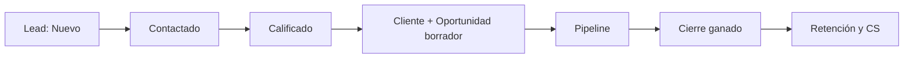
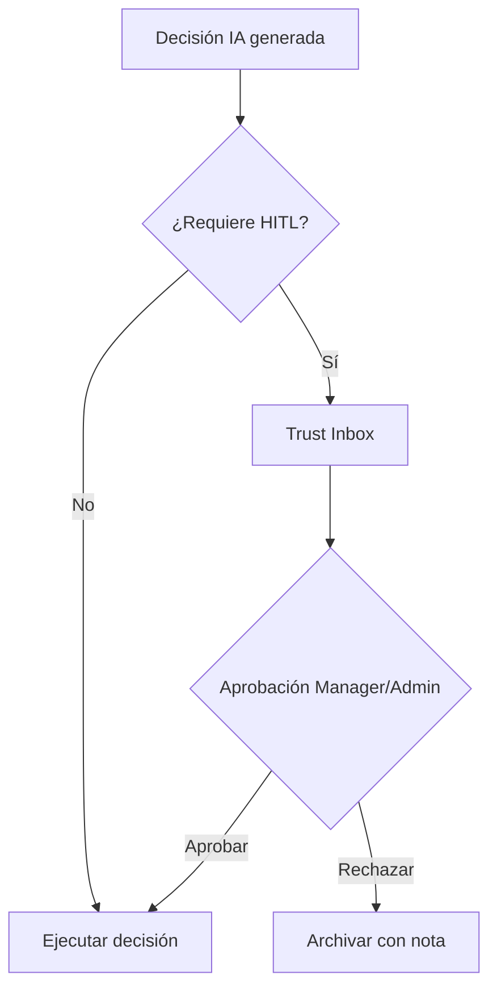
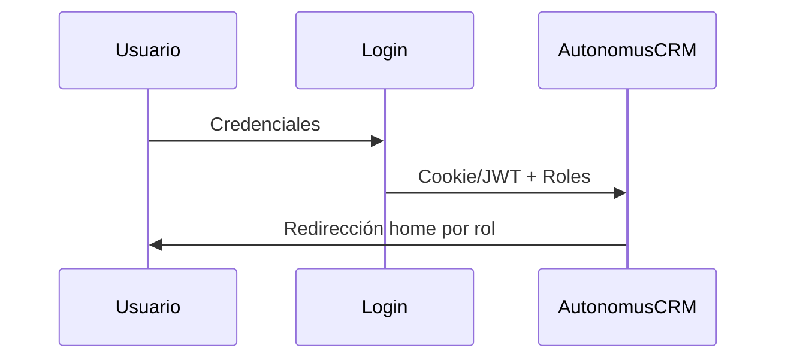

<div align="center">

# AutonomusCRM

## Manual de Usuario — Gerente

**Versión:** 2.0.0  
**Fecha de publicación:** 5 de junio de 2026  
**Autor:** AutonomusCRM Enterprise Documentation Team  
**Rol objetivo:** Manager  
**Clasificación:** Confidencial — Uso interno y clientes autorizados

---

*Documentación corporativa — Estándar Salesforce / Microsoft Dynamics 365*

</div>

---

## Control de versiones

| Versión | Fecha | Autor | Descripción |
|---------|-------|-------|-------------|
| 1.0.0 | 2026-06-05 | Enterprise Documentation Team | Publicación inicial basada en código |
| 2.0.0 | 5 de junio de 2026 | Enterprise Documentation Team | Transformación corporativa: estructura, diagramas, callouts, glosario |

---

## Tabla de contenido

*Índice generado automáticamente — ver encabezados numerados del documento.*

1. Introducción
2. Cuerpo del documento (capítulos originales transformados)
3. Diagramas de referencia
4. Glosario corporativo
5. Apéndices

---

## 1. Introducción

### 1.1 Objetivo del documento

Supervisión de ingresos, usuarios, Trust Studio y pipeline

### 1.2 Audiencia

Gerentes comerciales y operativos

### 1.3 Alcance

Este documento cubre **únicamente funcionalidades verificadas** en el código fuente de AutonomusCRM. No describe módulos inexistentes ni roles no implementados.

### 1.4 Prerrequisitos

| Requisito | Detalle |
|-----------|---------|
| Acceso | Cuenta activa en el tenant AutonomusCRM |
| Navegador | Chrome, Edge o Firefox actualizado |
| Rol | Según matriz en `ROLE_PERMISSION_MATRIX.md` |
| Conocimientos | Ninguno técnico requerido para roles operativos |

### 1.5 Definiciones clave

Consulte el **Glosario corporativo** al final del documento. Términos críticos: Lead, Customer, Deal, Pipeline, Tenant, Revenue OS.

> **NOTA:** La interfaz admite español (ES) e inglés (EN). Las rutas técnicas (`/Leads`, `/Deals`) se conservan por trazabilidad al producto.

[CAPTURA: Pantalla de inicio de sesión — /Account/Login]

---

## 2. Cuerpo del documento

## Capítulo 1. Quién es este rol

### 1.1 Definición
El **Manager** es el gerente de operaciones comerciales y de equipo dentro del tenant. En el seed demo corresponde a **María Gerente** (`manager@autonomuscrm.local`). Comparte con Admin la **escritura comercial completa**, gestión de usuarios en **UI**, Settings, Trust Studio y home en Executive OS. La **diferencia crítica** frente a Admin: **no puede** ejecutar `POST api/tenants` ni `POST api/users` (política `RequireAdmin`).

[CAPTURA: Trust Studio — /TrustInbox]

### 1.2 Objetivos estratégicos
| Objetivo | Descripción |
|----------|-------------|
| Supervisar ingresos | Forecast, win rate, fugas pipeline vía Executive y Revenue OS |
| Liderar equipo Sales | Asignación leads, tareas overdue, estándar Qualify/Convert |
| Gobernar IA operativa | Aprobar decisiones HITL en Trust Studio |
| Configurar operación | Workflows, Policies, Settings (sin provisioning API de tenants) |
| Asegurar cumplimiento | Auditoría, roles correctos, escalamiento a Admin |

### 1.3 Responsabilidades operativas
1. **Supervisión pipeline:** `/Deals`, `/Leads`, `/executive` — forecast 30/60/90 y win rate.
2. **Gestión de equipo:** `/Users`, `/Users/Create`, `/Users/Roles`, `/Users/Edit` — UI autorizada; **sin** API POST users.

[CAPTURA: Gestión de usuarios — /Users]
3. **Trust Studio:** `/TrustInbox` — aprobar, rechazar, rollback decisiones autónomas.
4. **Configuración tenant:** `/Settings` — perfil, comunicaciones, kill-switch (con conocimiento de impacto).
5. **Políticas y workflows:** `/Policies`, `/Workflows`.
6. **Operación comercial directa:** crear/editar Leads, Customers, Deals cuando supervise o apoye al equipo.
7. **Escalamiento a Admin:** `POST api/tenants`, `POST api/users`, Billing crítico, Failed Events DLQ, integraciones OAuth rotas, deploy/backups.

### 1.4 KPIs del Manager
| KPI | Fuente | Meta operativa |
|-----|--------|----------------|
| Forecast 30/60/90 | `/Deals` | Compromiso semanal con dirección |
| Win Rate | `/Deals` | Tendencia semanal |
| Qualified / Total Leads | `/Leads` | Calidad embudo |
| HighScoreCount (>70) | `/Leads` | Leads priorizados por IA |
| Tasks overdue por rep | `/Tasks?overdueOnly=true` | Cero críticos por vendedor |
| Trust pending SLA | `/TrustInbox` | Resolver en <24h |
| HighRiskCount Customers | `/Customers` | Plan retención coordinado |
| Revenue leak alerts | `/revenue` | Acción en deals estancados |

### 1.5 Impacto en el negocio
- El Manager es el **puente** entre ejecutivos Sales y la dirección (Admin).
- Sin supervisión Manager, los vendedores pueden divergir en procesos (Qualify vs Convert vs Create Deal).
- Las decisiones autónomas sin aprobación Manager/Admin pueden ejecutar playbooks no alineados con la estrategia comercial.
- El Manager **no provisiona infraestructura multi-tenant** — debe escalar a Admin para nuevos tenants o integraciones API de provisioning.

---

## Capítulo 2. Acceso, login, permisos y seguridad

[CAPTURA: Pantalla de inicio de sesión — /Account/Login]

### 2.1 Credenciales demo
| Campo | Valor |
|-------|-------|
| Email | `manager@autonomuscrm.local` |
| Contraseña | `Manager123!` |
| Nombre | María Gerente |

### 2.2 Flujo de acceso
1. `/Account/Login` con credenciales o cuenta demo Manager.
2. MFA si está habilitado para el usuario.
3. Post-login: `RoleHomeRedirect` → **`/executive`** (igual que Admin).

### 2.3 Matriz de permisos Manager (código verificado)
| Capacidad | Manager | Admin | Evidencia |
|-----------|:-------:|:-----:|-----------|
| Home `/executive` | ✅ | ✅ | `RoleHomeRedirect.cs` |
| POST `api/tenants` | ❌ | ✅ | `TenantsController` + `RequireAdmin` |
| POST `api/users` | ❌ | ✅ | `UsersController` + `RequireAdmin` |
| UI `/Users/*` | ✅ | ✅ | `[Authorize(Roles = "Admin,Manager")]` |
| UI `/Settings` | ✅ | ✅ | `[Authorize(Roles = "Admin,Manager")]` |
| Escritura comercial UI | ✅ | ✅ | control de escritura comercial del sistema |
| Trust Studio Approve/Reject | ✅ | ✅ | `TrustInbox.cshtml.cs` |
| `/billing` | ✅ | ✅ | Sin restricción de rol en página |
| RequireManager policy | ✅ | ✅ | Admin incluido en `RequireRole("Admin","Manager")` |

### 2.4 Diferencia Manager vs Admin — resumen
```
Manager = Admin en UI operativa (Users, Settings, comercial, Trust)
Manager ≠ Admin en API provisioning (POST api/tenants, POST api/users)
```

Para crear usuarios, el Manager usa **`/Users/Create`** (UI), no la API REST.

### 2.5 Escritura comercial
Manager está en `WriteRoles` del middleware. Puede POST y acceder a `/Create`/`/Edit` en:

- `/Leads`, `/Customers`, `/Deals`, `/Workflows`, `/Policies`

Support y Viewer reciben redirect a `/Account/AccessDenied` — **no aplica al Manager**.

### 2.6 Seguridad y buenas prácticas Manager
1. **No solicitar rol Admin** para operación diaria — Manager cubre supervisión y gestión UI.
2. Escalar a Admin para provisioning API, incidentes infra, Failed Events masivos.
3. Revisar `/Users/Roles` semanalmente — no asignar Admin a vendedores.
4. Validar estándar único de calificación de leads con el equipo Sales.
5. Conocer > **RIESGO** Brecha UI vs API: tokens de Support/Viewer no deben usarse para POST comercial.

---

## Capítulo 3. Menús disponibles (19 ítems del sidebar)

Definidos en `_FlowSidebar.cshtml`. **Los 19 ítems son visibles** para Manager (igual que todos los roles autenticados). Sales recibe > **ADVERTENCIA** Access Denied en acciones admin; Manager **no**.

| # | Sección | Etiqueta | Ruta | Uso principal Manager |
|---|---------|----------|------|----------------------|
| 1 | Command | Command | `/` | Priorización diaria, decisiones IA |
| 2 | Command | Trust Studio | `/TrustInbox` | **Aprobación HITL diaria** |
| 3 | Command | Workforce | `/Agents` | Supervisar agentes y decisiones |
| 4 | Revenue | Revenue OS | `/revenue` | Fugas ingreso, deals estancados |
| 5 | Revenue | Executive | `/executive` | **Home** — vista gerencial |
| 6 | Revenue | Pipeline | `/Deals` | Supervisar kanban y forecast |

[CAPTURA: Pipeline Kanban — /Deals]
| 7 | Customers | Directory | `/Customers` | LTV, riesgo, cartera |
| 8 | Customers | Customer 360 | `/Customer360` | Vista integral clientes |
| 9 | Customers | Customer Success | `/customer-success` | Coordinar con Support/CS |
| 10 | Commerce | Leads | `/Leads` | Supervisar embudo superior |
| 11 | Intelligence | Memory | `/Memory` | Contexto semántico empresa |
| 12 | Operations | Tasks | `/Tasks` | SLA equipo, overdue |
| 13 | Platform | Integrations | `/Integrations` | Salud integraciones (escalar OAuth a Admin) |
| 14 | Platform | Voice | `/VoiceCalls` | Seguimiento llamadas equipo |
| 15 | Admin | Users | `/Users` | **Gestión equipo** |
| 16 | Admin | Policies | `/Policies` | Políticas ABAC |
| 17 | Admin | Audit | `/Audit` | Trazabilidad cambios |
| 18 | Admin | Settings | `/Settings` | Config operativa tenant |
| 19 | Admin | Billing | `/billing` | Consulta suscripción (escalar cambios plan a Admin) |

### Rutas complementarias Manager

| Ruta | Uso |
|------|-----|
| `/Users/Create` | Alta vendedores (UI — no API) |
| `/Users/Roles` | Asignar Sales/Support/Viewer |
| `/Workflows` | Automatizaciones equipo |
| `/command/decisions` | Historial decisiones |
| `/FailedEvents` | Escalar a Admin si DLQ crece |

### > **ADVERTENCIA** Access Denied — qué no aplica al Manager

- `/Users`, `/Settings` → bloqueado para **Sales** (Manager tiene acceso).
- Escritura comercial → bloqueado para **Support/Viewer** (Manager tiene acceso).
- `POST api/users` → bloqueado para **Manager** (usar UI o pedir Admin).

---

## Capítulo 4. Flujo diario del Manager

### 4.1 Inicio de jornada (25 minutos)
| Minuto | Acción | Ruta |
|--------|--------|------|
| 0–5 | Executive OS — KPIs consolidados | `/executive` |
| 5–10 | Trust Studio — pendientes y SLA | `/TrustInbox` |
| 10–15 | Tasks overdue por vendedor | `/Tasks?overdueOnly=true` |
| 15–20 | Leads New sin contacto >24h | `/Leads?status=0` |
| 20–25 | Deals Negotiation/Proposal estancados | `/Deals` o `/revenue` |

### 4.2 Durante el día
| Situación | Acción Manager |
|-----------|----------------|
| Lead score ≥70 sin asignar | Asignar en `/Leads/Edit` o verificar workflow Assign |
| Vendedor pide cuenta nueva | `/Users/Create` |
| Decisión IA riesgo Alto | `/TrustInbox` → revisar y Approve/Reject |
| Deal sin movimiento 30+ días | Tarea en `/Tasks` al owner + revisión etapa |
| Cliente HighRisk | Coordinar Support en `/customer-success` |

### 4.3 Cierre de jornada (10 minutos)
1. Trust Studio sin críticos overdue.
2. Actualizar notas internas si hubo cambios de forecast.
3. Muestra rápida Command `/` — decisiones del día.

### 4.4 Ritual semanal (documentado enterprise)
| Día | Acción |
|-----|--------|
| Lunes | Executive OS + forecast 30/60/90 |
| Miércoles | Trust backlog completo |
| Viernes | Win rate, leads sin calificar, export Audit muestra |

---

## Capítulo 5. Procesos operativos paso a paso

### 5.1 Crear usuario vendedor (UI — sin API)
1. `/Users` → Crear (`/Users/Create`).
2. Email, contraseña temporal, nombre.
3. `/Users/Edit/{id}` → asignar rol **Sales**.
4. Comunicar credenciales por canal seguro.
5. Si se requiere automatización API → **escalar a Admin** para `POST api/users`.

### 5.2 Asignar y revisar roles
1. `/Users/Roles` — vista roles del sistema.
2. Verificar que solo personal de confianza tenga Manager.
3. **Nunca** asignar Admin a ejecutivos comerciales.
4. Support para post-venta; Viewer para consulta.

### 5.3 Supervisar calificación de Leads
1. Establecer estándar: **Qualify** como path principal (Customer auto + deal borrador + tarea).
2. Revisar en `/Leads` que QualifiedCount progrese.
3. Si deal borrador $1 aparece tras Qualify → instruir al Sales a editar monto en `/Deals/Edit`.
4. Desalentar uso paralelo inconsistente de Convert y Create Deal sin criterio.

### 5.4 Aprobar decisión Trust Studio
1. `/TrustInbox` — ordenar por severidad critical/high primero.
2. Leer explicabilidad y Outcome Fabric.
3. Si impacto comercial alto → coordinar con Sales antes de Approve.
4. Reject con nota si no alinea con estrategia.
5. Rollback si decisión ya ejecutada fue incorrecta.

### 5.5 Revisar forecast con dirección
1. `/Deals` — cards Forecast 30/60/90.
2. Validar ExpectedCloseDate en deals clave.
3. Comparar con `/executive` y opcionalmente `GET api/ai/ml/revenue`.
4. Export Executive si requiere presentación (`?handler=Export`).

### 5.6 Gestionar deal estancado
1. Detectar en `/revenue` (leak detection) o tarea auto Revenue scan.
2. Abrir `/Deals/Details` — historial etapas.
3. Reunión con owner Sales → actualizar etapa o Lose con razón.
4. Registrar seguimiento en `/Tasks`.

### 5.7 Configurar workflow para el equipo
1. `/Workflows` → Crear trigger `Lead.Created` o `LeadScoreUpdated`.
2. Condición score ≥70 → acción Assign al mejor rep.
3. Recordar: `Communicate` en workflow solo log — emails vía CommunicationAgent en workers.

### 5.8 Revisar auditoría semanal
1. `/Audit` — filtrar eventos Users, Deals, Trust.
2. Export JSON muestra (hasta 10.000).
3. Investigar cambios no autorizados → escalar Admin.

### 5.9 Settings operativos (con precaución)
1. `/Settings` — ajustar comunicaciones, umbrales.
2. Kill-switch: coordinar con Admin antes de cambiar en producción.
3. No importar configuración JSON sin validar con Admin.

### 5.10 Escalamiento a Admin — cuándo y cómo
| Necesidad | Por qué Manager no basta |
|-----------|--------------------------|
| Nuevo tenant | Solo `POST api/tenants` Admin |
| Usuario vía API/SSO | Solo `POST api/users` Admin |
| Failed Events masivos | Replay + infra workers |
| OAuth integraciones rotas | Credenciales sistema |
| Deploy/backup VPS | Operación infra |
| Cambio plan Billing | Stripe/suscripción |

---

## Capítulo 6. Automatizaciones relacionadas con el rol Manager

El Manager **supervisa** automatizaciones y **configura** workflows; los workers ejecutan en background.

### 6.1 Automatizaciones que impactan la supervisión diaria
| Automatización | Trigger | Efecto visible para Manager |
|----------------|---------|----------------------------|
| RevenueAutomation | LeadCreated | Tarea SLA 24h en `/Tasks` |
| LeadIntelligenceAgent | LeadCreated | Score en `/Leads` |
| OperationalAutomation | LeadQualified | Deal borrador + tarea alta prioridad |
| DealStrategyAgent | StageChanged | Tareas inteligencia ventas |
| Revenue scan (15 min) | Periódico | Alertas deals/leads inactivos |
| RetentionAutomation | RiskScore≥70 | Playbooks — revisar en CS |

### 6.2 Tareas del Manager sobre automatizaciones
- Verificar que **workflows activos** reflejen proceso comercial del equipo.
- Revisar `/Tasks` overdue generadas por motores (no solo manuales).
- Escalar a Admin si `/FailedEvents` tiene backlog.
- Alinear umbral Trust (`SetThreshold`) con apetito de riesgo del negocio.

### 6.3 Limitaciones a comunicar al equipo Sales
- IA crea **tareas y decisiones**, no cierra ventas sola.
- Workflow Communicate **no envía** emails — depende de CommunicationAgent y config Settings.
- Score 0 puede significar worker pendiente, no lead malo.

---

## Capítulo 7. Uso de IA (Command, Trust, Agents, Memory)

### 7.1 Command Center (`/`)
- Métricas 7/30 días: ingresos, riesgo, expansiones.
- Botón a Trust si hay pendientes.
- Manager usa para **priorizar** intervenciones del día.

### 7.2 Trust Studio (`/TrustInbox`) — responsabilidad principal Manager
- Cola HITL con severidad SLA.
- Approve ejecuta decisión; Reject detiene; Rollback revierte.
- Umbral 50–95 configurable.
- **Manager y Admin** son perfiles operativos documentados para HITL.

### 7.3 Workforce (`/Agents`) y rutas Command
| Ruta | Uso Manager |
|------|-------------|
| `/Agents` | Snapshot agentes |
| `/command/decisions` | Auditoría decisiones |
| `/command/outcomes` | Impacto outcomes |
| `/command/playbooks` | Estados playbooks autónomos |

### 7.4 Memory (`/Memory`)
- Contexto semántico para decisiones.
- Manager revisa semanalmente para alinear estrategia comercial.

### 7.5 Revenue OS y Executive OS
- **Executive** (`/executive`): home gerencial, trust pending, export.
- **Revenue OS** (`/revenue`): fugas pipeline — uso diario para coaching a Sales.

### 7.6 API IA (consulta — mismo acceso autenticado)
`api/ai/ml/churn`, `api/ai/ml/expansion`, `api/ai/ml/revenue`, `api/ai/analytics`, `api/ai/governance` — útiles para reuniones de pipeline; Manager no administra training (`enterprise-cycle` — coordinar con Admin).

### 7.7 Expectativas Manager sobre IA
| Realidad | Implicación gerencial |
|----------|----------------------|
| HITL obligatorio sobre umbral | Manager debe dedicar tiempo diario a Trust |
| CommunicationAgent usa templates | No prometer emails "GPT personalizados" al equipo |
| Kill-switch en Settings | Coordinar con Admin antes de desactivar autonomía |

---

## Capítulo 8. Reportes y analítica

### 8.1 Reportes principales del Manager
| Reporte | Ruta | Frecuencia |
|---------|------|------------|
| Executive OS | `/executive` | Diaria |
| Pipeline forecast | `/Deals` | Semanal |
| Revenue leaks | `/revenue` | Diaria |
| Leads embudo | `/Leads` | Semanal |
| Tasks SLA | `/Tasks` | Diaria |
| Trust métricas | `/TrustInbox` | Diaria |
| Audit muestra | `/Audit` | Semanal |

### 8.2 Métricas Deals (supervisión)
- **Forecast 30/60/90:** ponderado Amount × Probability.
- **Win Rate:** Won / (Won + Lost).
- **Pipeline Open:** exposición total abierta.

### 8.3 Métricas Leads (coaching)
- **QualifiedCount / TotalCount:** tasa calificación.
- **HighScoreCount:** leads IA priorizados.
- **SourceStats:** efectividad por canal.

### 8.4 Métricas Customers (retención)
- **HighRiskCount (>70):** coordinación con CS.
- **AvgLtv / HighLtvCount:** foco en cuentas estratégicas.

### 8.5 Export y presentación
- Executive export HTML para dirección.
- Audit JSON para cumplimiento (muestra semanal).
- No confundir paginación (50 ítems) con totales en cards resumen.

---

## Capítulo 9. Escenario real completo

### Contexto

**Empresa:** NovaRetail (tenant demo).  
**Manager:** manager@autonomuscrm.local (María Gerente).  
**Miércoles 9:00** — reunión pipeline semanal, Trust con 3 pendientes, nuevo vendedor, deal en riesgo.

### Paso 1 — Executive y Trust (9:00–9:20)

María inicia sesión → `/executive`:

- Forecast 30d: $128.000; Win Rate 34% (bajo objetivo 40%).
- Trust pending: 3.

En `/TrustInbox`:

1. **Approve** asignación automática lead score 91 a Sales Ana.
2. **Reject** email retención masivo a segmento VIP — nota: "requiere revisión manual".
3. **Approve** tarea DealStrategy para deal en Negotiation.

### Paso 2 — Alta vendedor (9:25)

Solicitud RR.HH.: nuevo ejecutivo Juan.

- `/Users/Create` — `juan.ventas@novaretail.local` (UI, sin API).
- `/Users/Edit` → rol Sales.
- Juan recibirá home `/revenue` al login (`RoleHomeRedirect`).

### Paso 3 — Coaching pipeline (9:45)

En `/Deals` kanban:

- Deal "RetailCo Q2" 38 días en Proposal — leak en `/revenue`.
- María crea tarea urgente para Ana en `/Tasks`.
- Revisa con Ana: mover a Negotiation o Lose con razón documentada.

### Paso 4 — Leads sin calificar (10:15)

`/Leads`: 12 leads New, 4 con score >70 sin contacto.

- Mensaje al equipo: SLA 24h de RevenueAutomation.
- Verifica workflow Assign activo para score alto.

### Paso 5 — Customer en riesgo (11:00)

`/Customers`: HighRiskCount +1 (RiskScore 74).

- Coordina con Support en `/customer-success`.
- No cierra deal nuevo hasta plan retención.

### Paso 6 — Cierre semanal viernes (recordatorio)

- Export Audit muestra.
- `/Users/Roles` — sin roles Admin indebidos.
- Executive export para dirección.

### Resultado

- Trust gobernado; equipo ampliado; deal estancado escalado; estándar SLA reforzado.

---

## Capítulo 10. Errores comunes

| # | Error | Causa | Solución Manager |
|---|-------|-------|------------------|
| 1 | 403 al llamar `POST api/users` | RequireAdmin | Usar `/Users/Create` o escalar Admin |
| 2 | 403 al llamar `POST api/tenants` | Solo Admin | Escalar Admin |
| 3 | Vendedor no accede `/Users` | Normal para Sales | Manager crea usuarios en UI |
| 4 | Deal $1 tras Qualify | OperationalAutomation | Instruir editar monto en Deals |
| 5 | Trust vacío | Sin pendientes HITL | Normal; revisar umbral |
| 6 | Forecast bajo | ExpectedCloseDate vacías | Coaching Sales en Deals |
| 7 | Tres procesos lead distintos en equipo | Sin estándar | Imponer Qualify como estándar |
| 8 | Workflow no asigna leads | Trigger/condición incorrecta | `/Workflows/Edit` |
| 9 | Score 0 prolongado | Worker/delay | Escalar Admin + FailedEvents |
| 10 | Tasks overdue acumuladas | Capacidad equipo | Redistribuir en `/Tasks` |
| 11 | Admin asignado a vendedor | Error en `/Users/Roles` | Corregir a Sales |
| 12 | Kill-switch cambiado sin aviso | Settings | Coordinar con Admin |
| 13 | Integración email rota | Config | Escalar Admin Integrations |
| 14 | Win rate calculado mal | Pocos deals cerrados | Muestra más grande en el tiempo |
| 15 | Export Audit vacío | Filtros restrictivos | Ampliar rango fechas |
| 16 | Manager intenta provisioning tenant | Fuera de alcance | API solo Admin |
| 17 | Approve Trust sin leer Outcome | Prisa operativa | Siempre revisar explicabilidad |
| 18 | Revenue OS sin leaks pero deals viejos | Umbral detección | Revisión manual kanban |
| 19 | Paginación confunde totales | 50 ítems por página | Usar cards resumen |
| 20 | API POST comercial con token Support | > **RIESGO** Brecha documentada | Política interna + escalar Admin |

---

## Capítulo 11. Preguntas frecuentes (FAQ) — Rol Manager

**Total: 100 preguntas numeradas específicas del rol Manager.**

### Identidad y acceso (1–10)

### 1. ¿Cuál es el email demo del Manager?

**Pregunta:** ¿Cuál es el email demo del Manager?

**Respuesta:** `manager@autonomuscrm.local` en `DemoRoleUsers.All`.

**Impacto:** Afecta la operación diaria y la calidad de datos del tenant.

**Acción recomendada:** Seguir el procedimiento descrito y escalar al Manager o Admin si persiste.

### 2. ¿Cuál es la contraseña demo?

**Pregunta:** ¿Cuál es la contraseña demo?

**Respuesta:** `Manager123!` — patrón `{Role}123!`.

**Impacto:** Afecta la operación diaria y la calidad de datos del tenant.

**Acción recomendada:** Seguir el procedimiento descrito y escalar al Manager o Admin si persiste.

### 3. ¿A dónde redirige el login del Manager?

**Pregunta:** ¿A dónde redirige el login del Manager?

**Respuesta:** A `/executive`, igual que Admin (`RoleHomeRedirect.cs`).

**Impacto:** Afecta la operación diaria y la calidad de datos del tenant.

**Acción recomendada:** Seguir el procedimiento descrito y escalar al Manager o Admin si persiste.

### 4. ¿El Manager se llama así en el seed?

**Pregunta:** ¿El Manager se llama así en el seed?

**Respuesta:** María Gerente (FirstName: María, LastName: Gerente).

**Impacto:** Afecta la operación diaria y la calidad de datos del tenant.

**Acción recomendada:** Seguir el procedimiento descrito y escalar al Manager o Admin si persiste.

### 5. ¿Manager y Admin comparten pantalla de inicio?

**Pregunta:** ¿Manager y Admin comparten pantalla de inicio?

**Respuesta:** Sí, ambos `/executive`. Sales va a `/revenue`.

**Impacto:** Afecta la operación diaria y la calidad de datos del tenant.

**Acción recomendada:** Seguir el procedimiento descrito y escalar al Manager o Admin si persiste.

### 6. ¿El Manager aparece en cuentas demo del login?

**Pregunta:** ¿El Manager aparece en cuentas demo del login?

**Respuesta:** Sí, en `DemoAccounts` derivado de `DemoRoleUsers`.

**Impacto:** Afecta la operación diaria y la calidad de datos del tenant.

**Acción recomendada:** Seguir el procedimiento descrito y escalar al Manager o Admin si persiste.

### 7. ¿Puedo tener varios Managers en un tenant?

**Pregunta:** ¿Puedo tener varios Managers en un tenant?

**Respuesta:** Sí, asignando rol Manager en `/Users/Roles`.

**Impacto:** Afecta la operación diaria y la calidad de datos del tenant.

**Acción recomendada:** Seguir el procedimiento descrito y escalar al Manager o Admin si persiste.

### 8. ¿El Manager necesita permisos especiales en sidebar?

**Pregunta:** ¿El Manager necesita permisos especiales en sidebar?

**Respuesta:** No. Los 19 ítems son visibles; las restricciones son por página/API.

**Impacto:** Afecta la operación diaria y la calidad de datos del tenant.

**Acción recomendada:** Seguir el procedimiento descrito y escalar al Manager o Admin si persiste.

### 9. ¿Support o Viewer pueden ser Manager?

**Pregunta:** ¿Support o Viewer pueden ser Manager?

**Respuesta:** Son roles mutuamente excluyentes por usuario; se asigna un rol principal por cuenta.

**Impacto:** Afecta la operación diaria y la calidad de datos del tenant.

**Acción recomendada:** Seguir el procedimiento descrito y escalar al Manager o Admin si persiste.

### 10. ¿Qué rol debo pedir si necesito solo consultar?

**Pregunta:** ¿Qué rol debo pedir si necesito solo consultar?

**Respuesta:** Viewer — no Manager.

**Impacto:** Restricción de permisos o alcance del rol.

**Acción recomendada:** Seguir el procedimiento descrito y escalar al Manager o Admin si persiste.

### Permisos Manager vs Admin (11–25)

### 11. ¿Puede el Manager crear usuarios?

**Pregunta:** ¿Puede el Manager crear usuarios?

**Respuesta:** Sí, vía UI `/Users/Create` (`[Authorize(Roles = "Admin,Manager")]`).

**Impacto:** Afecta la operación diaria y la calidad de datos del tenant.

**Acción recomendada:** Seguir el procedimiento descrito y escalar al Manager o Admin si persiste.

### 12. ¿Puede el Manager usar POST api/users?

**Pregunta:** ¿Puede el Manager usar POST api/users?

**Respuesta:** No. `UsersController.CreateUser` exige `RequireAdmin`.

**Impacto:** Afecta la operación diaria y la calidad de datos del tenant.

**Acción recomendada:** Seguir el procedimiento descrito y escalar al Manager o Admin si persiste.

### 13. ¿Puede el Manager crear tenants?

**Pregunta:** ¿Puede el Manager crear tenants?

**Respuesta:** No vía API. `POST api/tenants` es solo Admin.

**Impacto:** Restricción de permisos o alcance del rol.

**Acción recomendada:** Seguir el procedimiento descrito y escalar al Manager o Admin si persiste.

### 14. ¿Cuál es la diferencia práctica más importante con Admin?

**Pregunta:** ¿Cuál es la diferencia práctica más importante con Admin?

**Respuesta:** Provisioning API (tenants/users POST). Todo lo demás UI es equivalente.

**Impacto:** Afecta la operación diaria y la calidad de datos del tenant.

**Acción recomendada:** Seguir el procedimiento descrito y escalar al Manager o Admin si persiste.

### 15. ¿El Manager está en WriteRoles del middleware comercial?

**Pregunta:** ¿El Manager está en WriteRoles del middleware comercial?

**Respuesta:** Sí, con Admin y Sales.

**Impacto:** Afecta la operación diaria y la calidad de datos del tenant.

**Acción recomendada:** Seguir el procedimiento descrito y escalar al Manager o Admin si persiste.

### 16. ¿Puede el Manager acceder a Settings?

**Pregunta:** ¿Puede el Manager acceder a Settings?

**Respuesta:** Sí, `[Authorize(Roles = "Admin,Manager")]`.

**Impacto:** Afecta la operación diaria y la calidad de datos del tenant.

**Acción recomendada:** Seguir el procedimiento descrito y escalar al Manager o Admin si persiste.

### 17. ¿Puede el Manager importar usuarios CSV?

**Pregunta:** ¿Puede el Manager importar usuarios CSV?

**Respuesta:** Sí, `/Users/Import` autoriza Admin,Manager.

**Impacto:** Afecta la operación diaria y la calidad de datos del tenant.

**Acción recomendada:** Seguir el procedimiento descrito y escalar al Manager o Admin si persiste.

### 18. ¿Puede el Manager usar BulkActions en Users?

**Pregunta:** ¿Puede el Manager usar BulkActions en Users?

**Respuesta:** Sí.

**Impacto:** Afecta la operación diaria y la calidad de datos del tenant.

**Acción recomendada:** Seguir el procedimiento descrito y escalar al Manager o Admin si persiste.

### 19. ¿RequireManager policy aplica al Manager?

**Pregunta:** ¿RequireManager policy aplica al Manager?

**Respuesta:** Sí, y Admin también la satisface.

**Impacto:** Afecta la operación diaria y la calidad de datos del tenant.

**Acción recomendada:** Seguir el procedimiento descrito y escalar al Manager o Admin si persiste.

### 20. ¿Puede el Manager habilitar MFA vía API?

**Pregunta:** ¿Puede el Manager habilitar MFA vía API?

**Respuesta:** `POST api/users/{id}/enable-mfa` no exige RequireAdmin — autenticado; coordinar con política interna.

**Impacto:** Afecta la operación diaria y la calidad de datos del tenant.

**Acción recomendada:** Seguir el procedimiento descrito y escalar al Manager o Admin si persiste.

### 21. ¿Debo escalar a Admin para nuevo tenant?

**Pregunta:** ¿Debo escalar a Admin para nuevo tenant?

**Respuesta:** Sí, siempre.

**Impacto:** Afecta la operación diaria y la calidad de datos del tenant.

**Acción recomendada:** Seguir el procedimiento descrito y escalar al Manager o Admin si persiste.

### 22. ¿Puede el Manager asignar rol Admin a alguien?

**Pregunta:** ¿Puede el Manager asignar rol Admin a alguien?

**Respuesta:** Técnicamente vía `/Users/Edit` AssignRole; buena práctica: solo Admin asigna Admin.

**Impacto:** Afecta la operación diaria y la calidad de datos del tenant.

**Acción recomendada:** Seguir el procedimiento descrito y escalar al Manager o Admin si persiste.

### 23. ¿Puede el Manager ver Billing?

**Pregunta:** ¿Puede el Manager ver Billing?

**Respuesta:** Sí, `/billing` sin restricción de rol en página.

**Impacto:** Afecta la operación diaria y la calidad de datos del tenant.

**Acción recomendada:** Seguir el procedimiento descrito y escalar al Manager o Admin si persiste.

### 24. ¿Puede el Manager editar Policies?

**Pregunta:** ¿Puede el Manager editar Policies?

**Respuesta:** Sí, escritura comercial en `/Policies`.

**Impacto:** Afecta la operación diaria y la calidad de datos del tenant.

**Acción recomendada:** Seguir el procedimiento descrito y escalar al Manager o Admin si persiste.

### 25. ¿Sales puede hacer lo que Manager en Users?

**Pregunta:** ¿Sales puede hacer lo que Manager en Users?

**Respuesta:** No. Sales recibe > **ADVERTENCIA** Access Denied en `/Users`.

**Impacto:** Restricción de permisos o alcance del rol.

**Acción recomendada:** Seguir el procedimiento descrito y escalar al Manager o Admin si persiste.

### Menú y navegación (26–40)

### 26. ¿Cuál es el home del Manager?

**Pregunta:** ¿Cuál es el home del Manager?

**Respuesta:** `/executive` — ítem Revenue → Executive.

**Impacto:** Afecta la operación diaria y la calidad de datos del tenant.

**Acción recomendada:** Seguir el procedimiento descrito y escalar al Manager o Admin si persiste.

### 27. ¿Debo usar Revenue OS siendo Manager?

**Pregunta:** ¿Debo usar Revenue OS siendo Manager?

**Respuesta:** Sí, para fugas de ingreso y coaching; home sigue siendo Executive.

**Impacto:** Afecta la operación diaria y la calidad de datos del tenant.

**Acción recomendada:** Seguir el procedimiento descrito y escalar al Manager o Admin si persiste.

### 28. ¿Qué ítem tiene badge de pendientes?

**Pregunta:** ¿Qué ítem tiene badge de pendientes?

**Respuesta:** Trust Studio (`/TrustInbox`).

**Impacto:** Afecta la operación diaria y la calidad de datos del tenant.

**Acción recomendada:** Seguir el procedimiento descrito y escalar al Manager o Admin si persiste.

### 29. ¿Cuántos ítems tiene el sidebar?

**Pregunta:** ¿Cuántos ítems tiene el sidebar?

**Respuesta:** 19 en `_FlowSidebar.cshtml`.

**Impacto:** Afecta la operación diaria y la calidad de datos del tenant.

**Acción recomendada:** Seguir el procedimiento descrito y escalar al Manager o Admin si persiste.

### 30. ¿Dónde gestiono el pipeline?

**Pregunta:** ¿Dónde gestiono el pipeline?

**Respuesta:** `/Deals` — Revenue → Pipeline.

**Impacto:** Afecta la operación diaria y la calidad de datos del tenant.

**Acción recomendada:** Seguir el procedimiento descrito y escalar al Manager o Admin si persiste.

### 31. ¿Dónde superviso leads?

**Pregunta:** ¿Dónde superviso leads?

**Respuesta:** `/Leads` — Commerce.

**Impacto:** Afecta la operación diaria y la calidad de datos del tenant.

**Acción recomendada:** Seguir el procedimiento descrito y escalar al Manager o Admin si persiste.

### 32. ¿Dónde veo tareas del equipo?

**Pregunta:** ¿Dónde veo tareas del equipo?

**Respuesta:** `/Tasks` con filtros assignee y overdue.

**Impacto:** Afecta la operación diaria y la calidad de datos del tenant.

**Acción recomendada:** Seguir el procedimiento descrito y escalar al Manager o Admin si persiste.

### 33. ¿Cómo busco rápido una entidad?

**Pregunta:** ¿Cómo busco rápido una entidad?

**Respuesta:** Ctrl+K → `/api/flow/search`.

**Impacto:** Afecta la operación diaria y la calidad de datos del tenant.

**Acción recomendada:** Seguir el procedimiento descrito y escalar al Manager o Admin si persiste.

### 34. ¿Dónde está Memory?

**Pregunta:** ¿Dónde está Memory?

**Respuesta:** Intelligence → `/Memory`.

**Impacto:** Afecta la operación diaria y la calidad de datos del tenant.

**Acción recomendada:** Seguir el procedimiento descrito y escalar al Manager o Admin si persiste.

### 35. ¿Manager ve Voice Calls?

**Pregunta:** ¿Manager ve Voice Calls?

**Respuesta:** Sí, `/VoiceCalls`.

**Impacto:** Afecta la operación diaria y la calidad de datos del tenant.

**Acción recomendada:** Seguir el procedimiento descrito y escalar al Manager o Admin si persiste.

### 36. ¿Dónde configuro integraciones?

**Pregunta:** ¿Dónde configuro integraciones?

**Respuesta:** `/Integrations` — escalar OAuth roto a Admin.

**Impacto:** Afecta la operación diaria y la calidad de datos del tenant.

**Acción recomendada:** Seguir el procedimiento descrito y escalar al Manager o Admin si persiste.

### 37. ¿Failed Events está en el menú?

**Pregunta:** ¿Failed Events está en el menú?

**Respuesta:** No — URL directa `/FailedEvents`.

**Impacto:** Restricción de permisos o alcance del rol.

**Acción recomendada:** Seguir el procedimiento descrito y escalar al Manager o Admin si persiste.

### 38. ¿Dónde veo playbooks?

**Pregunta:** ¿Dónde veo playbooks?

**Respuesta:** `/command/playbooks`.

**Impacto:** Afecta la operación diaria y la calidad de datos del tenant.

**Acción recomendada:** Seguir el procedimiento descrito y escalar al Manager o Admin si persiste.

### 39. ¿Customer 360 útil para Manager?

**Pregunta:** ¿Customer 360 útil para Manager?

**Respuesta:** Sí, para cuentas estratégicas antes de reuniones.

**Impacto:** Afecta la operación diaria y la calidad de datos del tenant.

**Acción recomendada:** Seguir el procedimiento descrito y escalar al Manager o Admin si persiste.

### 40. ¿El click en email del sidebar lleva a Settings?

**Pregunta:** ¿El click en email del sidebar lleva a Settings?

**Respuesta:** Sí.

**Impacto:** Afecta la operación diaria y la calidad de datos del tenant.

**Acción recomendada:** Seguir el procedimiento descrito y escalar al Manager o Admin si persiste.

### Gestión de equipo (41–55)

### 41. ¿Cómo doy de alta un vendedor?

**Pregunta:** ¿Cómo doy de alta un vendedor?

**Respuesta:** `/Users/Create` → rol Sales en Edit.

**Impacto:** Afecta la operación diaria y la calidad de datos del tenant.

**Acción recomendada:** Seguir el procedimiento descrito y escalar al Manager o Admin si persiste.

### 42. ¿Puedo desactivar un usuario?

**Pregunta:** ¿Puedo desactivar un usuario?

**Respuesta:** Sí, `/Users/Edit` ToggleUserStatus.

**Impacto:** Afecta la operación diaria y la calidad de datos del tenant.

**Acción recomendada:** Seguir el procedimiento descrito y escalar al Manager o Admin si persiste.

### 43. ¿Cómo cambio rol de Support a Sales?

**Pregunta:** ¿Cómo cambio rol de Support a Sales?

**Respuesta:** `/Users/Edit` AssignRole.

**Impacto:** Afecta la operación diaria y la calidad de datos del tenant.

**Acción recomendada:** Seguir el procedimiento descrito y escalar al Manager o Admin si persiste.

### 44. ¿Dónde veo todos los roles del sistema?

**Pregunta:** ¿Dónde veo todos los roles del sistema?

**Respuesta:** `/Users/Roles`.

**Impacto:** Afecta la operación diaria y la calidad de datos del tenant.

**Acción recomendada:** Seguir el procedimiento descrito y escalar al Manager o Admin si persiste.

### 45. ¿Qué roles no deben tener acceso comercial escritura UI?

**Pregunta:** ¿Qué roles no deben tener acceso comercial escritura UI?

**Respuesta:** Support y Viewer — bloqueados por middleware.

**Impacto:** Afecta la operación diaria y la calidad de datos del tenant.

**Acción recomendada:** Seguir el procedimiento descrito y escalar al Manager o Admin si persiste.

### 46. ¿Cómo verifico que nadie tenga Admin indebido?

**Pregunta:** ¿Cómo verifico que nadie tenga Admin indebido?

**Respuesta:** Revisión semanal `/Users/Roles`.

**Impacto:** Afecta la operación diaria y la calidad de datos del tenant.

**Acción recomendada:** Seguir el procedimiento descrito y escalar al Manager o Admin si persiste.

### 47. ¿Puedo crear Manager adicionales?

**Pregunta:** ¿Puedo crear Manager adicionales?

**Respuesta:** Sí; considerar segregación de funciones.

**Impacto:** Afecta la operación diaria y la calidad de datos del tenant.

**Acción recomendada:** Seguir el procedimiento descrito y escalar al Manager o Admin si persiste.

### 48. ¿Importación masiva reemplaza usuarios?

**Pregunta:** ¿Importación masiva reemplaza usuarios?

**Respuesta:** Según lógica Import — validar en UI; escalar dudas a Admin.

**Impacto:** Afecta la operación diaria y la calidad de datos del tenant.

**Acción recomendada:** Seguir el procedimiento descrito y escalar al Manager o Admin si persiste.

### 49. ¿Cómo asigno leads a un rep específico?

**Pregunta:** ¿Cómo asigno leads a un rep específico?

**Respuesta:** `/Leads/Edit` AssignedToUserId o workflow Assign.

**Impacto:** Afecta la operación diaria y la calidad de datos del tenant.

**Acción recomendada:** Seguir el procedimiento descrito y escalar al Manager o Admin si persiste.

### 50. ¿El nuevo Sales a dónde va al login?

**Pregunta:** ¿El nuevo Sales a dónde va al login?

**Respuesta:** `/revenue` (`RoleHomeRedirect`).

**Impacto:** Afecta la operación diaria y la calidad de datos del tenant.

**Acción recomendada:** Seguir el procedimiento descrito y escalar al Manager o Admin si persiste.

### 51. ¿Debo crear usuarios por API en integración HR?

**Pregunta:** ¿Debo crear usuarios por API en integración HR?

**Respuesta:** Requiere Admin para POST api/users — coordinar.

**Impacto:** Afecta la operación diaria y la calidad de datos del tenant.

**Acción recomendada:** Seguir el procedimiento descrito y escalar al Manager o Admin si persiste.

### 52. ¿Puedo ver email de todos los usuarios?

**Pregunta:** ¿Puedo ver email de todos los usuarios?

**Respuesta:** Sí, listado `/Users` paginado.

**Impacto:** Afecta la operación diaria y la calidad de datos del tenant.

**Acción recomendada:** Seguir el procedimiento descrito y escalar al Manager o Admin si persiste.

### 53. ¿Qué hago si un vendedor olvida contraseña?

**Pregunta:** ¿Qué hago si un vendedor olvida contraseña?

**Respuesta:** Admin/Manager reset vía Edit según capacidades UI; escalar si no disponible.

**Impacto:** Afecta la operación diaria y la calidad de datos del tenant.

**Acción recomendada:** Seguir el procedimiento descrito y escalar al Manager o Admin si persiste.

### 54. ¿Cuántos Sales puedo crear?

**Pregunta:** ¿Cuántos Sales puedo crear?

**Respuesta:** Sin límite documentado en código.

**Impacto:** Afecta la operación diaria y la calidad de datos del tenant.

**Acción recomendada:** Seguir el procedimiento descrito y escalar al Manager o Admin si persiste.

### 55. ¿Viewer puede ver datos comerciales?

**Pregunta:** ¿Viewer puede ver datos comerciales?

**Respuesta:** Lectura UI; sin Create/Edit POST.

**Impacto:** Afecta la operación diaria y la calidad de datos del tenant.

**Acción recomendada:** Seguir el procedimiento descrito y escalar al Manager o Admin si persiste.

### Trust Studio y supervisión IA (56–70)

### 56. ¿Es obligación del Manager revisar Trust diariamente?

**Pregunta:** ¿Es obligación del Manager revisar Trust diariamente?

**Respuesta:** Sí, ritual documentado en guía operaciones.

**Impacto:** Afecta la operación diaria y la calidad de datos del tenant.

**Acción recomendada:** Seguir el procedimiento descrito y escalar al Manager o Admin si persiste.

### 57. ¿Puedo aprobar decisiones Trust?

**Pregunta:** ¿Puedo aprobar decisiones Trust?

**Respuesta:** Sí, OnPostApproveAsync en TrustInbox.

**Impacto:** Afecta la operación diaria y la calidad de datos del tenant.

**Acción recomendada:** Seguir el procedimiento descrito y escalar al Manager o Admin si persiste.

### 58. ¿Debo rechazar decisiones dudosas?

**Pregunta:** ¿Debo rechazar decisiones dudosas?

**Respuesta:** Sí, Reject con nota es práctica recomendada.

**Impacto:** Afecta la operación diaria y la calidad de datos del tenant.

**Acción recomendada:** Seguir el procedimiento descrito y escalar al Manager o Admin si persiste.

### 59. ¿Qué es Rollback?

**Pregunta:** ¿Qué es Rollback?

**Respuesta:** Revertir decisión ya ejecutada con nota obligatoria.

**Impacto:** Afecta la operación diaria y la calidad de datos del tenant.

**Acción recomendada:** Seguir el procedimiento descrito y escalar al Manager o Admin si persiste.

### 60. ¿Qué severidad atender primero?

**Pregunta:** ¿Qué severidad atender primero?

**Respuesta:** critical, luego high (SLA y RiskLevel).

**Impacto:** Afecta la operación diaria y la calidad de datos del tenant.

**Acción recomendada:** Seguir el procedimiento descrito y escalar al Manager o Admin si persiste.

### 61. ¿Puedo simular antes de aprobar?

**Pregunta:** ¿Puedo simular antes de aprobar?

**Respuesta:** Sí, `?preview=simulate`.

**Impacto:** Afecta la operación diaria y la calidad de datos del tenant.

**Acción recomendada:** Seguir el procedimiento descrito y escalar al Manager o Admin si persiste.

### 62. ¿Puedo cambiar umbral de aprobación?

**Pregunta:** ¿Puedo cambiar umbral de aprobación?

**Respuesta:** Sí, SetThreshold 50–95.

**Impacto:** Afecta la operación diaria y la calidad de datos del tenant.

**Acción recomendada:** Seguir el procedimiento descrito y escalar al Manager o Admin si persiste.

### 63. ¿Trust vacío es problema?

**Pregunta:** ¿Trust vacío es problema?

**Respuesta:** No si no hay decisiones pendientes HITL.

**Impacto:** Restricción de permisos o alcance del rol.

**Acción recomendada:** Seguir el procedimiento descrito y escalar al Manager o Admin si persiste.

### 64. ¿Dónde veo impacto de una decisión?

**Pregunta:** ¿Dónde veo impacto de una decisión?

**Respuesta:** Outcome Fabric en panel Trust seleccionado.

**Impacto:** Afecta la operación diaria y la calidad de datos del tenant.

**Acción recomendada:** Seguir el procedimiento descrito y escalar al Manager o Admin si persiste.

### 65. ¿Approve ejecuta la acción?

**Pregunta:** ¿Approve ejecuta la acción?

**Respuesta:** Sí, executeDecision: true.

**Impacto:** Afecta la operación diaria y la calidad de datos del tenant.

**Acción recomendada:** Seguir el procedimiento descrito y escalar al Manager o Admin si persiste.

### 66. ¿Manager y Admin comparten responsabilidad HITL?

**Pregunta:** ¿Manager y Admin comparten responsabilidad HITL?

**Respuesta:** Sí, perfiles operativos documentados.

**Impacto:** Afecta la operación diaria y la calidad de datos del tenant.

**Acción recomendada:** Seguir el procedimiento descrito y escalar al Manager o Admin si persiste.

### 67. ¿Dónde historial completo decisiones?

**Pregunta:** ¿Dónde historial completo decisiones?

**Respuesta:** `/command/decisions`.

**Impacto:** Afecta la operación diaria y la calidad de datos del tenant.

**Acción recomendada:** Seguir el procedimiento descrito y escalar al Manager o Admin si persiste.

### 68. ¿Debo leer explicabilidad antes de Approve?

**Pregunta:** ¿Debo leer explicabilidad antes de Approve?

**Respuesta:** Buena práctica gerencial — ExplainTrustApprovalAsync.

**Impacto:** Afecta la operación diaria y la calidad de datos del tenant.

**Acción recomendada:** Seguir el procedimiento descrito y escalar al Manager o Admin si persiste.

### 69. ¿Qué pasa si no apruebo a tiempo?

**Pregunta:** ¿Qué pasa si no apruebo a tiempo?

**Respuesta:** SLA alerts con severidad warning/critical.

**Impacto:** Afecta la operación diaria y la calidad de datos del tenant.

**Acción recomendada:** Seguir el procedimiento descrito y escalar al Manager o Admin si persiste.

### 70. ¿Puedo escalar decisión desde Command?

**Pregunta:** ¿Puedo escalar decisión desde Command?

**Respuesta:** FlowActions puede redirigir a TrustInbox.

**Impacto:** Afecta la operación diaria y la calidad de datos del tenant.

**Acción recomendada:** Seguir el procedimiento descrito y escalar al Manager o Admin si persiste.

### Operación comercial y automatizaciones (71–85)

### 71. ¿Puede el Manager crear leads?

**Pregunta:** ¿Puede el Manager crear leads?

**Respuesta:** Sí, `/Leads/Create`.

**Impacto:** Afecta la operación diaria y la calidad de datos del tenant.

**Acción recomendada:** Seguir el procedimiento descrito y escalar al Manager o Admin si persiste.

### 72. ¿Puede calificar leads?

**Pregunta:** ¿Puede calificar leads?

**Respuesta:** Sí, Qualify en Details — mismo que Sales.

**Impacto:** Afecta la operación diaria y la calidad de datos del tenant.

**Acción recomendada:** Seguir el procedimiento descrito y escalar al Manager o Admin si persiste.

### 73. ¿Qué ocurre al Qualify?

**Pregunta:** ¿Qué ocurre al Qualify?

**Respuesta:** Customer auto, deal borrador $1, tarea alta prioridad.

**Impacto:** Afecta la operación diaria y la calidad de datos del tenant.

**Acción recomendada:** Seguir el procedimiento descrito y escalar al Manager o Admin si persiste.

### 74. ¿Debo estandarizar Qualify vs Convert?

**Pregunta:** ¿Debo estandarizar Qualify vs Convert?

**Respuesta:** Sí, imponer un proceso al equipo.

**Impacto:** Afecta la operación diaria y la calidad de datos del tenant.

**Acción recomendada:** Seguir el procedimiento descrito y escalar al Manager o Admin si persiste.

### 75. ¿Puedo cerrar deals?

**Pregunta:** ¿Puedo cerrar deals?

**Respuesta:** Sí, Close en Deals Details.

**Impacto:** Afecta la operación diaria y la calidad de datos del tenant.

**Acción recomendada:** Seguir el procedimiento descrito y escalar al Manager o Admin si persiste.

### 76. ¿Qué automatización crea SLA 24h?

**Pregunta:** ¿Qué automatización crea SLA 24h?

**Respuesta:** RevenueAutomation en LeadCreated.

**Impacto:** Afecta la operación diaria y la calidad de datos del tenant.

**Acción recomendada:** Seguir el procedimiento descrito y escalar al Manager o Admin si persiste.

### 77. ¿Quién asigna score al lead?

**Pregunta:** ¿Quién asigna score al lead?

**Respuesta:** LeadIntelligenceAgent vía worker.

**Impacto:** Afecta la operación diaria y la calidad de datos del tenant.

**Acción recomendada:** Seguir el procedimiento descrito y escalar al Manager o Admin si persiste.

### 78. ¿Cada cuánto revenue scan?

**Pregunta:** ¿Cada cuánto revenue scan?

**Respuesta:** 15 minutos por tenant.

**Impacto:** Afecta la operación diaria y la calidad de datos del tenant.

**Acción recomendada:** Seguir el procedimiento descrito y escalar al Manager o Admin si persiste.

### 79. ¿Workflow Communicate envía email?

**Pregunta:** ¿Workflow Communicate envía email?

**Respuesta:** No — solo log. Emails vía CommunicationAgent.

**Impacto:** Restricción de permisos o alcance del rol.

**Acción recomendada:** Seguir el procedimiento descrito y escalar al Manager o Admin si persiste.

### 80. ¿Dónde veo tareas auto generadas?

**Pregunta:** ¿Dónde veo tareas auto generadas?

**Respuesta:** `/Tasks`.

**Impacto:** Afecta la operación diaria y la calidad de datos del tenant.

**Acción recomendada:** Seguir el procedimiento descrito y escalar al Manager o Admin si persiste.

### 81. ¿Puedo configurar workflow Assign?

**Pregunta:** ¿Puedo configurar workflow Assign?

**Respuesta:** Sí en `/Workflows`.

**Impacto:** Afecta la operación diaria y la calidad de datos del tenant.

**Acción recomendada:** Seguir el procedimiento descrito y escalar al Manager o Admin si persiste.

### 82. ¿DealStrategyAgent qué hace?

**Pregunta:** ¿DealStrategyAgent qué hace?

**Respuesta:** Tareas en DealCreated/StageChanged.

**Impacto:** Afecta la operación diaria y la calidad de datos del tenant.

**Acción recomendada:** Seguir el procedimiento descrito y escalar al Manager o Admin si persiste.

### 83. ¿Qué hacer con deal estancado?

**Pregunta:** ¿Qué hacer con deal estancado?

**Respuesta:** Revenue OS + tarea al owner + revisión etapa.

**Impacto:** Afecta la operación diaria y la calidad de datos del tenant.

**Acción recomendada:** Seguir el procedimiento descrito y escalar al Manager o Admin si persiste.

### 84. ¿RetentionAutomation cuándo actúa?

**Pregunta:** ¿RetentionAutomation cuándo actúa?

**Respuesta:** CustomerCreated, DealClosed, RiskScore≥70.

**Impacto:** Afecta la operación diaria y la calidad de datos del tenant.

**Acción recomendada:** Seguir el procedimiento descrito y escalar al Manager o Admin si persiste.

### 85. ¿Debo escalar Failed Events a Admin?

**Pregunta:** ¿Debo escalar Failed Events a Admin?

**Respuesta:** Sí, si backlog crece o replay falla.

**Impacto:** Afecta la operación diaria y la calidad de datos del tenant.

**Acción recomendada:** Seguir el procedimiento descrito y escalar al Manager o Admin si persiste.

### Reportes, auditoría y escalamiento (86–100)

### 86. ¿Reporte principal del Manager?

**Pregunta:** ¿Reporte principal del Manager?

**Respuesta:** Executive OS `/executive`.

**Impacto:** Afecta la operación diaria y la calidad de datos del tenant.

**Acción recomendada:** Seguir el procedimiento descrito y escalar al Manager o Admin si persiste.

### 87. ¿Qué forecast revisar semanalmente?

**Pregunta:** ¿Qué forecast revisar semanalmente?

**Respuesta:** 30/60/90 en `/Deals`.

**Impacto:** Afecta la operación diaria y la calidad de datos del tenant.

**Acción recomendada:** Seguir el procedimiento descrito y escalar al Manager o Admin si persiste.

### 88. ¿Cómo mido desempeño del equipo?

**Pregunta:** ¿Cómo mido desempeño del equipo?

**Respuesta:** Win Rate, Tasks overdue por assignee, Qualified/Total leads.

**Impacto:** Afecta la operación diaria y la calidad de datos del tenant.

**Acción recomendada:** Seguir el procedimiento descrito y escalar al Manager o Admin si persiste.

### 89. ¿Dónde leaks de pipeline?

**Pregunta:** ¿Dónde leaks de pipeline?

**Respuesta:** `/revenue` — DetectRevenueLeakAsync.

**Impacto:** Afecta la operación diaria y la calidad de datos del tenant.

**Acción recomendada:** Seguir el procedimiento descrito y escalar al Manager o Admin si persiste.

### 90. ¿Cómo exporto para dirección?

**Pregunta:** ¿Cómo exporto para dirección?

**Respuesta:** Executive `?handler=Export`.

**Impacto:** Afecta la operación diaria y la calidad de datos del tenant.

**Acción recomendada:** Seguir el procedimiento descrito y escalar al Manager o Admin si persiste.

### 91. ¿Audit qué aporta al Manager?

**Pregunta:** ¿Audit qué aporta al Manager?

**Respuesta:** Trazabilidad cambios Users/Deals/Trust.

**Impacto:** Afecta la operación diaria y la calidad de datos del tenant.

**Acción recomendada:** Seguir el procedimiento descrito y escalar al Manager o Admin si persiste.

### 92. ¿Límite export Audit?

**Pregunta:** ¿Límite export Audit?

**Respuesta:** 10.000 eventos JSON.

**Impacto:** Afecta la operación diaria y la calidad de datos del tenant.

**Acción recomendada:** Seguir el procedimiento descrito y escalar al Manager o Admin si persiste.

### 93. ¿API ML revenue útil en reunión pipeline?

**Pregunta:** ¿API ML revenue útil en reunión pipeline?

**Respuesta:** Sí, `GET api/ai/ml/revenue` complementa forecast SQL.

**Impacto:** Afecta la operación diaria y la calidad de datos del tenant.

**Acción recomendada:** Seguir el procedimiento descrito y escalar al Manager o Admin si persiste.

### 94. ¿HighRiskCount en Customers?

**Pregunta:** ¿HighRiskCount en Customers?

**Respuesta:** RiskScore > 70 — coordinar CS.

**Impacto:** Afecta la operación diaria y la calidad de datos del tenant.

**Acción recomendada:** Seguir el procedimiento descrito y escalar al Manager o Admin si persiste.

### 95. ¿Cuándo escalar a Admin integraciones?

**Pregunta:** ¿Cuándo escalar a Admin integraciones?

**Respuesta:** OAuth fallido, Stripe, credenciales sistema.

**Impacto:** Afecta la operación diaria y la calidad de datos del tenant.

**Acción recomendada:** Seguir el procedimiento descrito y escalar al Manager o Admin si persiste.

### 96. ¿Manager cambia kill-switch solo?

**Pregunta:** ¿Manager cambia kill-switch solo?

**Respuesta:** Posible en Settings; coordinar con Admin en producción.

**Impacto:** Afecta la operación diaria y la calidad de datos del tenant.

**Acción recomendada:** Seguir el procedimiento descrito y escalar al Manager o Admin si persiste.

### 97. ¿Billing lo gestiona Manager?

**Pregunta:** ¿Billing lo gestiona Manager?

**Respuesta:** Consulta sí; cambios plan escalar Admin.

**Impacto:** Afecta la operación diaria y la calidad de datos del tenant.

**Acción recomendada:** Seguir el procedimiento descrito y escalar al Manager o Admin si persiste.

**98. ¿> **RIESGO** Brecha API comercial afecta al Manager?**  
Indirectamente — asegurar tokens Support/Viewer no hagan POST.

### 99. ¿Dónde evidencia técnica de permisos Manager?

**Pregunta:** ¿Dónde evidencia técnica de permisos Manager?

**Respuesta:** `DemoRoleUsers.cs`, `CommercialWriteAuthorizationMiddleware.cs`, `RoleHomeRedirect.cs`, `AuthorizationPolicies.cs`, `UsersController.cs`, `TenantsController.cs`, `Users/Create.cshtml.cs`.

**Impacto:** Afecta la operación diaria y la calidad de datos del tenant.

**Acción recomendada:** Seguir el procedimiento descrito y escalar al Manager o Admin si persiste.

### 100. ¿Qué hacer si necesito POST api/users por automatización?

**Pregunta:** ¿Qué hacer si necesito POST api/users por automatización?

**Respuesta:** Solicitar ejecución a Admin o usar UI `/Users/Create` para altas manuales.

**Impacto:** Afecta la operación diaria y la calidad de datos del tenant.

**Acción recomendada:** Seguir el procedimiento descrito y escalar al Manager o Admin si persiste.

---

*Documento generado para operación empresarial AutonomusCRM. Versión alineada al código del repositorio. Rol cubierto: Manager únicamente.*

---

## 3. Diagramas de referencia


### Diagramas de referencia

#### Ciclo de vida del Lead


#### Flujo de aprobación Trust Studio


#### Flujo de autenticación



---

## 4. Glosario corporativo


## Glosario corporativo

| Término | Definición |
|---------|------------|
| **CRM** | Customer Relationship Management — sistema para registrar y medir relaciones comerciales |
| **Lead** | Prospecto o contacto potencial; entidad inicial del embudo |
| **Customer** | Cuenta o cliente en el directorio del tenant |
| **Opportunity / Deal** | Oportunidad de venta con monto, etapa y probabilidad |
| **Pipeline** | Conjunto de oportunidades abiertas y sus etapas en `/Deals` |
| **Forecast** | Proyección ponderada: monto × probabilidad por ventana de cierre |
| **Workflow** | Automatización configurable: trigger + condiciones + acciones |
| **Tenant** | Organización aislada; todos los datos pertenecen a un TenantId |
| **Trust Studio** | Buzón HITL en `/TrustInbox` para aprobar decisiones de IA |
| **Revenue OS** | Módulo de ingresos en `/revenue` — priorización y fugas |
| **Executive OS** | Tablero ejecutivo en `/executive` |
| **MFA** | Autenticación multifactor configurable en Settings |
| **ABAC** | Attribute-Based Access Control — políticas en `/Policies` (no sustituye RBAC) |
| **Customer Success** | Módulo post-venta en `/customer-success` (no es un rol) |
| **Churn** | Abandono del cliente; predicción ML en Customer 360 |
| **LTV** | Lifetime Value — valor acumulado del cliente |
| **Upsell** | Venta adicional al mismo cliente (expansión) |
| **Cross-Sell** | Venta de productos complementarios |
| **Playbook** | Secuencia automatizada: onboarding, rescue, re-engagement |
| **AI Agent** | Agente autónomo en `/Agents` (LeadIntelligence, Communication, etc.) |
| **Semantic Memory** | Memoria empresarial en `/Memory` |
| **Outcome Fabric** | Atribución de resultados en `/command/outcomes` |
| **HITL** | Human-in-the-Loop — supervisión humana de decisiones IA |
| **SLA** | Acuerdo de nivel de servicio (ej. contacto lead en 24 h) |
| **DLQ** | Dead Letter Queue — eventos fallidos en `/FailedEvents` |


---

## 5. Apéndices

### 5.1 Referencias cruzadas

| Documento | Ubicación |
|-----------|-----------|
| Matriz de permisos | `Documentation/ROLE_PERMISSION_MATRIX.md` |
| Descubrimiento de roles | `Documentation/ROLE_DISCOVERY_REPORT.md` |
| Manual maestro | `docs/manual-empresarial-autonomuscrm/` |

### 5.2 Pie de documento

| Campo | Valor |
|-------|-------|
| Producto | AutonomusCRM |
| Versión documento | 2.0.0 |
| Clasificación | Confidencial — Uso interno y clientes autorizados |
| Fuente | Código verificado — sin funcionalidades inventadas |

---

*© AutonomusCRM — Documentación Enterprise. Listo para impresión PDF y capacitación corporativa.*

