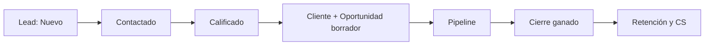
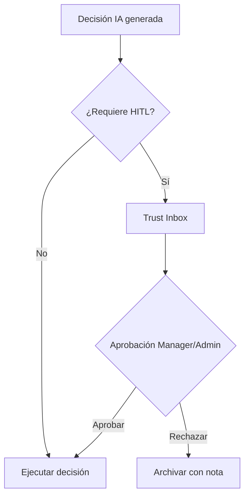
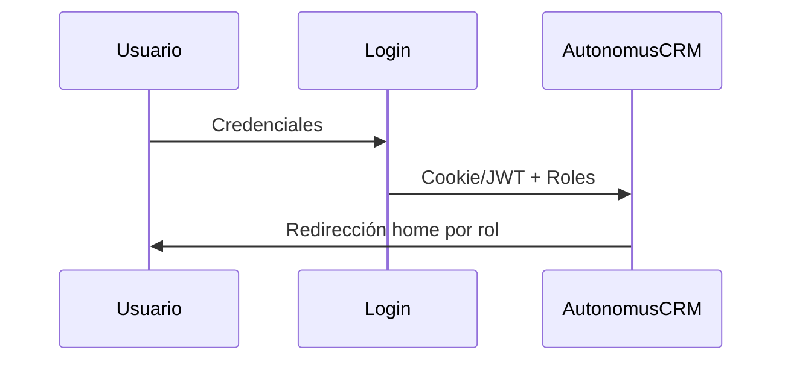

<div align="center">

# AutonomusCRM

## Manual de Usuario — Ejecutivo de Ventas

**Versión:** 2.0.0  
**Fecha de publicación:** 5 de junio de 2026  
**Autor:** AutonomusCRM Enterprise Documentation Team  
**Rol objetivo:** Sales  
**Clasificación:** Confidencial — Uso interno y clientes autorizados

---

*Documentación corporativa — Estándar Salesforce / Microsoft Dynamics 365*

</div>

---

## Control de versiones

| Versión | Fecha | Autor | Descripción |
|---------|-------|-------|-------------|
| 1.0.0 | 2026-06-05 | Enterprise Documentation Team | Publicación inicial basada en código |
| 2.0.0 | 5 de junio de 2026 | Enterprise Documentation Team | Transformación corporativa: estructura, diagramas, callouts, glosario |

---

## Tabla de contenido

*Índice generado automáticamente — ver encabezados numerados del documento.*

1. Introducción
2. Cuerpo del documento (capítulos originales transformados)
3. Diagramas de referencia
4. Glosario corporativo
5. Apéndices

---

## 1. Introducción

### 1.1 Objetivo del documento

Leads, pipeline, cierre y Revenue OS

### 1.2 Audiencia

Ejecutivos comerciales sin experiencia previa en CRM

### 1.3 Alcance

Este documento cubre **únicamente funcionalidades verificadas** en el código fuente de AutonomusCRM. No describe módulos inexistentes ni roles no implementados.

### 1.4 Prerrequisitos

| Requisito | Detalle |
|-----------|---------|
| Acceso | Cuenta activa en el tenant AutonomusCRM |
| Navegador | Chrome, Edge o Firefox actualizado |
| Rol | Según matriz en `ROLE_PERMISSION_MATRIX.md` |
| Conocimientos | Ninguno técnico requerido para roles operativos |

### 1.5 Definiciones clave

Consulte el **Glosario corporativo** al final del documento. Términos críticos: Lead, Customer, Deal, Pipeline, Tenant, Revenue OS.

> **NOTA:** La interfaz admite español (ES) e inglés (EN). Las rutas técnicas (`/Leads`, `/Deals`) se conservan por trazabilidad al producto.

[CAPTURA: Pantalla de inicio de sesión — /Account/Login]

---

## 2. Cuerpo del documento


## Capítulo 1 — ¿Qué es AutonomusCRM?

### 1.1 Definición para el ejecutivo de ventas
AutonomusCRM es una plataforma web de **operaciones de ingresos y relación con clientes**. Como ejecutivo Sales, la usará para registrar prospectos, mover oportunidades por el pipeline, cumplir tareas de seguimiento y priorizar acciones desde Revenue OS.

No es una hoja de cálculo ni un buzón de correo: es el **sistema único de verdad** del ciclo comercial de su tenant (organización).

### 1.2 Qué resuelve en su día a día
| Necesidad | Módulo |
|-----------|--------|
| ¿A quién debo llamar hoy? | `/Tasks`, `/Leads` |
| ¿Dónde está mi pipeline? | `/Deals` |
| ¿Dónde pierdo ingresos? | `/revenue` |
| ¿Quién es este contacto? | `/Customers`, `/Customer360` |

### 1.3 Componentes que verá (sin administrar)
La interfaz autenticada usa el shell **AutonomusFlow**: barra superior (búsqueda Ctrl+K, idioma ES/EN, modo oscuro) y menú lateral con 19 ítems. Como Sales verá todos los enlaces, pero **Users** y **Settings** le devolverán > **ADVERTENCIA** Access Denied.

### 1.4 Su cuenta demo
| Campo | Valor |
|-------|-------|
| Email | `sales@autonomuscrm.local` |
| Contraseña | `Sales123!` |
| Nombre demo | Ana Ventas |
| Tras login | Redirección automática a `/revenue` |

### 1.5 Principio de veracidad
Este manual describe **solo funcionalidades verificadas en código**. No se documentan roles inexistentes (SuperAdmin, Marketing) ni capacidades no implementadas (por ejemplo, la acción de workflow `Communicate` solo registra log).

---

## Capítulo 2 — Conceptos fundamentales

[CAPTURA: Pantalla de inicio de sesión — /Account/Login]

### 2.1 Lead, Customer y Deal
| Entidad | Qué es | Ruta principal |
|---------|--------|----------------|
| **Lead** | Prospecto aún no consolidado como cuenta | `/Leads` |
| **Customer** | Cuenta o cliente en el directorio | `/Customers` |
| **Deal** | Oportunidad de venta vinculada a un Customer | `/Deals` |

**No existe** una entidad separada llamada "Prospecto": el prospecto inicial es un Lead en estado `New`.

### 2.2 Estados del Lead
`New` → `Contacted` → `Qualified` → `Converted` | `Lost` | `Unqualified`

### 2.3 Estados del Customer
`Prospect`, `Lead`, `Qualified`, `Customer`, `VIP`, `Churned`, `Inactive`

### 2.4 Etapas del Deal (pipeline)
`Prospecting` (10%) → `Qualification` (25%) → `Proposal` (50%) → `Negotiation` (75%) → `ClosedWon` (100%) / `ClosedLost` (0%)

Estados de deal independientes de la etapa: `Open`, `Closed`, `OnHold`, `Cancelled`.

### 2.5 Tareas (Tasks)
Las tareas en `/Tasks` usan estados `Open` y `Completed`. Se vinculan a Lead, Deal o Customer mediante tipo de entidad e `entityId`.

### 2.6 Tenant
Todos los datos pertenecen a su organización (`TenantId`). Solo verá registros de su tenant.

### 2.7 Revenue OS
Módulo en `/revenue` que agrega ingresos, detecta **fugas de pipeline** (deals estancados, leads inactivos) y explica prioridades mediante grafo de razonamiento.

### 2.8 Automatización de calificación (Qualify)
Al calificar un Lead, el sistema puede crear automáticamente Customer (por email), deal borrador y tarea de seguimiento 24 h — ver Capítulo 10.

---

## Capítulo 3 — Arquitectura funcional del negocio

### 3.1 Journey comercial implementado
```
Lead.New → Contacted → Qualified → [Deal borrador] → Pipeline → ClosedWon

[CAPTURA: Pipeline Kanban — /Deals]
                ↓
         Convert to Customer → Customer.Prospect/Customer → Retención CS
```

### 3.2 Flujo de creación de Lead
**Disparadores:** `/Leads/Create`, **Registrar un nuevo prospecto** (API), import CSV/JSON  
**Estado inicial:** `New`  
**Evento:** `LeadCreatedEvent`  
**Automatizaciones:** WorkflowEngine, RevenueAutomation (SLA 24 h), LeadIntelligenceAgent (score), CommunicationAgent (email si configurado)

### 3.3 Flujo de calificación (Qualify)
**UI:** `/Leads/Details` → **Qualify**  
**Command:** acción **Calificar** en la ficha del lead  
**OperationalAutomationService:**
1. Crea Customer si no existe (mismo email)
2. Crea Deal borrador (`Amount=1`, `IsDraft=true`)
3. Crea WorkflowTask de seguimiento alta prioridad

El Lead **no** pasa a `Converted` en este path; queda en `Qualified`.

### 3.4 Conversión manual Lead → Customer
**UI:** Convert to Customer en Details  
Crea Customer `Prospect`, marca Lead `Converted`, dispara `CustomerCreatedEvent` y retención.

### 3.5 Crear Deal desde Lead
**UI:** Create Deal — busca/crea Customer por email, crea Deal en `Prospecting`/`Open` **sin** cambiar estado del Lead.

### 3.6 Cierre ganado (ClosedWon)
`CloseDealCommand` → `DealClosedEvent` → retención (LTV, estado Customer), tareas onboarding CS D0/D7/D30, OutcomeAttribution.

### 3.7 Post-venta (colaboración con Support)
Tras ClosedWon, Support trabaja en `/customer-success` y Customer 360. Sales debe completar sus tareas comerciales y dejar datos limpios en el deal.

### 3.8 Capas del producto relevantes para Sales
| Capa | Uso Sales |
|------|-----------|
| Revenue OS | Priorización matutina |
| Command `/` | Panorama IA y workforce (consulta) |
| Workers (15 min) | Escaneos de revenue, deals estancados |
| Trust Studio | Solo lectura típica; aprobación HITL es Manager/Admin |

---

## Capítulo 4 — Roles del sistema

### 4.1 Los cinco roles reales
| Rol | Home | Escritura comercial UI |
|-----|------|------------------------|
| Admin | `/executive` | Sí + administración |
| Manager | `/executive` | Sí + Users/Settings |
| **Sales** | **`/revenue`** | **Sí** |
| Support | `/Customer360` | No (solo lectura comercial) |
| Viewer | `/` | No |

**No existen:** SuperAdmin, Marketing, Customer Success (como rol), Operations, Executive, Analyst.

### 4.2 Permisos del rol Sales
**Puede:**
- Crear, editar, calificar, convertir y eliminar Leads
- Crear y editar Customers y Deals
- Cerrar deals (won/lost), importar leads/deals
- Usar Revenue OS, Leads, Deals, Tasks, Customers, VoiceCalls
- Consultar Command, Trust Studio, Workforce (lectura)
- Completar tareas; crear tareas manuales

**No puede:**
- Gestionar usuarios (`/Users`) — > **ADVERTENCIA** Access Denied
- Configurar tenant (`/Settings`) — > **ADVERTENCIA** Access Denied
- Aprobar decisiones en Trust Studio (operación típica Manager/Admin)
- **Provisionar un nuevo tenant** (API administrativa) ni **Crear un nuevo usuario** (API administrativa)

### 4.3 Colaboración con otros roles
| Situación | Escalar a |
|-----------|-----------|
| Nuevo usuario o cambio de rol | Manager / Admin |
| Cliente en riesgo post-venta | Support (`/customer-success`) |
| Workflow roto o Failed Events | Admin |
| Política ABAC | Manager / Admin (`/Policies`) |

### 4.4 Prioridad de roles múltiples
Si un usuario tuviera varios roles, el home usa: Admin > Manager > Sales > Support > default.

---

## Capítulo 5 — Navegación del sistema

### 5.1 Inicio de sesión
1. Ir a `/Account/Login`
2. Email: `sales@autonomuscrm.local`
3. Contraseña: `Sales123!`
4. Llegará a **Revenue OS** (`/revenue`)

### 5.2 Menú lateral — ítems clave para Sales
| Sección | Ruta | Uso diario Sales |
|---------|------|------------------|
| Command | `/` | Panorama IA (secundario) |
| Revenue | **`/revenue`** | **Home — prioridades** |
| Revenue | `/Deals` | Pipeline kanban |
| Customers | `/Customers` | Directorio cuentas |
| Customers | `/Customer360` | Búsqueda 360 |
| Commerce | `/Leads` | Prospectos |
| Operations | `/Tasks` | Tareas del día |
| Platform | `/VoiceCalls` | Log de llamadas |
| Admin | `/Users` | ❌ > **ADVERTENCIA** Access Denied |
| Admin | `/Settings` | ❌ > **ADVERTENCIA** Access Denied |

### 5.3 Búsqueda global
**Ctrl+K** → `/api/flow/search` — localiza Leads, Deals, clientes y pantallas.

### 5.4 Rutas comerciales críticas (no siempre en sidebar)
| Ruta | Propósito |
|------|-----------|
| `/Leads/Create`, `/Edit`, `/Details` | CRUD lead |
| `/Customers/Create`, `/Edit`, `/Details` | CRUD cliente |
| `/Deals/Create`, `/Edit`, `/Details` | CRUD deal |
| `/Deals/Import` | Importación masiva |
| `/customers/{id}/360` | Vista 360 individual |
| `/Workflows` | Automatizaciones (Sales puede escribir) |

### 5.5 Errores de navegación frecuentes
| Error | Solución |
|-------|----------|
| Confundir `/` con `/revenue` | Empiece el día en `/revenue` |
| Intentar `/Users` | Solicitar a Manager |
| No revisar `/Tasks` | Revisar overdue cada mañana |

### 5.6 Idioma
Selector ES/EN en barra superior; contenido operativo de este manual en español.

---

## Capítulo 6 — Operación diaria del ejecutivo de ventas

[CAPTURA: Revenue OS — /revenue]

### 6.1 Inicio de jornada (20 min)
| Minutos | Acción | Ruta |
|---------|--------|------|
| 0–5 | Login → Revenue OS | `/revenue` |
| 5–10 | Tareas vencidas | `/Tasks?overdueOnly=true` |
| 10–15 | Leads nuevos (`New`) | `/Leads?status=0` |
| 15–20 | Deals en Proposal/Negotiation | `/Deals` kanban |

### 6.2 Durante el día
| Evento | Acción CRM |
|--------|------------|
| Llamada completada | Completar tarea; Lead → `Contacted` si aplica |
| Propuesta enviada | Deal → **Proposal** |
| Objeción precio | Deal → **Negotiation** |
| Cierre verbal | **Close** deal; verificar tareas onboarding |
| Sin interés | Lead → `Lost` o `Unqualified` |

### 6.3 Fin de jornada (15 min)
1. `/Tasks` — cero overdue propios si es posible  
2. `/Leads` — ningún `New` sin contacto > 24 h  
3. `/Deals` — etapas actualizadas  
4. `/` — un insight relevante de Command (opcional)

### 6.4 Las cuatro pantallas diarias
1. **Revenue OS** — prioridades de ingresos  
2. **Leads** — nuevos contactos  
3. **Pipeline** — oportunidades activas  
4. **Tasks** — qué hacer hoy  

### 6.5 Registro de llamadas
`/VoiceCalls` — log manual de llamadas comerciales significativas.

---

## Capítulo 7 — Gestión de Leads

[CAPTURA: Listado de Leads — /Leads]

### 7.1 Pantalla principal
**Ruta:** `/Leads`  
**Métricas:** TotalCount, QualifiedCount, NewCount, HighScoreCount (score > 70), AvgScore, SourceStats

### 7.2 Crear lead
1. `/Leads` → Nuevo lead  
2. Campos: Nombre (obligatorio), Email, Teléfono, Empresa, Fuente  
3. Guardar → estado **New**

**Fuentes:** Website, Referral, SocialMedia, EmailCampaign, ColdCall, Partner, Event, Other, Unknown

### 7.3 Score del lead
Puntuación 0–100. `LeadIntelligenceAgent` actualiza tras `LeadCreatedEvent` → `LeadScoreUpdatedEvent`.

### 7.4 Calificar (Qualify) — acción central
1. `/Leads/Details/{id}` → **Qualify**  
2. Lead → `Qualified`  
3. **Automático:** Customer (si no existe), deal borrador, tarea 24 h High  

**Regla:** No deje leads `New` más de 24 h — existe SLA comercial.

### 7.5 Qualify vs Convert vs Create Deal
| Acción | Resultado |
|--------|-----------|
| **Qualify** | Qualified + Customer auto + deal borrador + tarea |
| **Convert to Customer** | Lead Converted + Customer creado |
| **Create Deal** | Deal sin cambiar estado del Lead |

### 7.6 Asignación
Campo `AssignedToUserId` manual o vía workflow `Assign`.

### 7.7 Operaciones masivas
`BulkUpdateLeadStatus` disponible según pantalla.

### 7.8 Importación
Import CSV/JSON dispara `LeadCreatedEvent` igual que creación manual.

---

## Capítulo 8 — Gestión de Clientes

### 8.1 Directorio
**Ruta:** `/Customers` — listado paginado, LTV, riesgo  
**Métricas:** TotalCount, AvgLtv, HighLtvCount, HighRiskCount (RiskScore > 70), AvgRisk

### 8.2 Crear cliente
`/Customers/Create` o formulario en listado — estado inicial **Prospect**.

### 8.3 Edición
Sales puede editar email, teléfono, empresa desde `/Customers/Edit`.

### 8.4 Customer 360
`/Customer360` — búsqueda; `/customers/{id}/360` — perfil, deals, salud, churn ML, comunicaciones.

### 8.5 LTV
Se incrementa al cerrar deal ganado (suma del monto al LTV existente).

### 8.6 Creación automática
Al **Qualify** un lead, si no hay Customer con el mismo email (case-insensitive), se crea uno.

---

## Capítulo 9 — Pipeline comercial (Deals)

### 9.1 Pantalla Pipeline
**Ruta:** `/Deals` — kanban por etapa + tabla con forecast

### 9.2 Crear deal
1. `/Deals/Create` o desde Lead Details  
2. **Customer obligatorio**  
3. Título, monto, descripción, Expected Close Date  

Nace en `Prospecting` / `Open` / probabilidad 10%.

### 9.3 Deal borrador tras Qualify
Monto simbólico **$1**, `IsDraft=true`, metadata `LeadId`. Actualice monto real en `/Deals/Edit`.

### 9.4 Mover etapas
Actualice etapa según avance real: Qualification → Proposal → Negotiation.

Probabilidades por defecto se ajustan por etapa; puede modificar manualmente 0–100%.

### 9.5 Forecast 30/60/90
Suma ponderada (Amount × Probability) por ventana de cierre esperada.

### 9.6 Cierre
| Resultado | Acción | Evento |
|-----------|--------|--------|
| Ganado | Close | `DealClosedEvent`, ClosedWon |
| Perdido | Lose | `DealLostEvent`, ClosedLost |

### 9.7 Post ClosedWon
Retención actualiza Customer, LTV, onboarding; tareas CS D0, D7, D30; emails onboarding si hay email.

### 9.8 Revenue OS y pipeline
Use `/revenue` para detectar deals estancados y fugas antes de revisar kanban.

### 9.9 Import y bulk
`/Deals/Import` — importación masiva  
`BulkUpdateDealStage` — cambio de etapa en lote

### 9.10 Win Rate
Métrica ClosedWon / (ClosedWon + ClosedLost) en agregados del listado.

---

## Capítulo 10 — Automatizaciones

### 10.1 Motores relevantes para Sales
| Motor | Cuándo actúa |
|-------|--------------|
| **OperationalAutomation** | LeadQualified, DealClosed |
| **RevenueAutomation** | LeadCreated, LeadScoreUpdated, LeadQualified |
| **WorkflowEngine** | Eventos con workflow activo |
| **CommercialSlaEngine** | SLA 24 h leads nuevos |

### 10.2 Al calificar un Lead (detalle)
1. acción **Calificar** en la ficha del lead → `LeadQualifiedEvent`  
2. OperationalAutomation: Customer + deal draft + tarea "Seguimiento lead calificado"  
3. Deduplicación: no crea segundo deal si ya existe con mismo `LeadId` en metadata  

### 10.3 Al cerrar deal ganado
- Tareas onboarding: Día 1 (Urgent), Día 7, Día 30  
- RetentionAutomation: estado Customer, LTV, playbook onboarding  
- Email plantilla Onboarding si Customer tiene email  

### 10.4 Workers cada 15 minutos
Revenue scan (deals estancados, leads inactivos), data quality, retención, renovación, expansión — pueden generar tareas en `/Tasks`.

### 10.5 Workflows configurables
**Ruta:** `/Workflows`  
**Triggers:** p. ej. `Lead.Created`  
**Acciones:** Assign, UpdateStatus, CreateTask, Communicate (solo log), ActivateAgent (solo log)

### 10.6 Agentes RabbitMQ (tiempo real)
LeadIntelligenceAgent, DealStrategyAgent, CommunicationAgent, RevenueAutomation, OutcomeAttribution.

### 10.7 Limitaciones honestas
- `Communicate` y `ActivateAgent` en workflows **no envían** mensajes ni activan LLM — solo log  
- Workers de fondo **no usan LLM**  
- IA en Command/Revenue prioriza y sugiere; no sustituye carga comercial inicial  

### 10.8 Monitoreo
Si una automatización falla: `/FailedEvents` (escalar Admin), `/Tasks` (ver tareas generadas), `/Audit` (solo lectura Sales).

---

## Capítulo 11 — Preguntas frecuentes (100)

**Audiencia:** Ejecutivo Sales (`sales@autonomuscrm.local`)  
**Fuente:** funcionalidades reales documentadas en código e inventario enterprise

---

### Categoría 1: Conceptos CRM (1–10)

### 1. ¿Qué es AutonomusCRM para un vendedor?

**Pregunta:** ¿Qué es AutonomusCRM para un vendedor?

**Respuesta:** Plataforma web que centraliza leads, clientes, deals, tareas y analítica de ingresos en un tenant aislado de su empresa.

**Impacto:** Afecta la operación diaria y la calidad de datos del tenant.

**Acción recomendada:** Seguir el procedimiento descrito y escalar al Manager o Admin si persiste.

### 2. ¿Qué significa CRM en mi trabajo diario?

**Pregunta:** ¿Qué significa CRM en mi trabajo diario?

**Respuesta:** Herramienta para registrar contactos, seguir oportunidades, cumplir tareas y medir ventas sin hojas de cálculo dispersas.

**Impacto:** Afecta la operación diaria y la calidad de datos del tenant.

**Acción recomendada:** Seguir el procedimiento descrito y escalar al Manager o Admin si persiste.

### 3. ¿Existe entidad "Prospecto" separada?

**Pregunta:** ¿Existe entidad "Prospecto" separada?

**Respuesta:** No. El prospecto es un **Lead** con estado `New`.

**Impacto:** Afecta la operación diaria y la calidad de datos del tenant.

**Acción recomendada:** Seguir el procedimiento descrito y escalar al Manager o Admin si persiste.

### 4. ¿Diferencia entre Lead, Customer y Deal?

**Pregunta:** ¿Diferencia entre Lead, Customer y Deal?

**Respuesta:** Lead = contacto potencial. Customer = cuenta en directorio. Deal = oportunidad vinculada obligatoriamente a un Customer.

**Impacto:** Afecta la operación diaria y la calidad de datos del tenant.

**Acción recomendada:** Seguir el procedimiento descrito y escalar al Manager o Admin si persiste.

### 5. ¿Qué es un tenant?

**Pregunta:** ¿Qué es un tenant?

**Respuesta:** Su organización aislada; todos los datos tienen `TenantId` y no ve registros de otras empresas.

**Impacto:** Afecta la operación diaria y la calidad de datos del tenant.

**Acción recomendada:** Seguir el procedimiento descrito y escalar al Manager o Admin si persiste.

### 6. ¿Qué es el pipeline?

**Pregunta:** ¿Qué es el pipeline?

**Respuesta:** Recorrido de una oportunidad desde prospección hasta ClosedWon o ClosedLost, visible en `/Deals`.

**Impacto:** Afecta la operación diaria y la calidad de datos del tenant.

**Acción recomendada:** Seguir el procedimiento descrito y escalar al Manager o Admin si persiste.

### 7. ¿Qué es Revenue OS?

**Pregunta:** ¿Qué es Revenue OS?

**Respuesta:** Dashboard en `/revenue` con ingresos, fugas de pipeline y explicación en grafo para priorizar acciones.

**Impacto:** Afecta la operación diaria y la calidad de datos del tenant.

**Acción recomendada:** Seguir el procedimiento descrito y escalar al Manager o Admin si persiste.

### 8. ¿Qué es Command Center?

**Pregunta:** ¿Qué es Command Center?

**Respuesta:** Pantalla `/` con métricas de revenue generado/protegido, cuentas en riesgo y snapshot del workforce IA (periodo 7 o 30 días).

**Impacto:** Afecta la operación diaria y la calidad de datos del tenant.

**Acción recomendada:** Seguir el procedimiento descrito y escalar al Manager o Admin si persiste.

### 9. ¿AutonomusCRM reemplaza email o teléfono?

**Pregunta:** ¿AutonomusCRM reemplaza email o teléfono?

**Respuesta:** No. Registra actividad y crea tareas; usted ejecuta la comunicación real.

**Impacto:** Afecta la operación diaria y la calidad de datos del tenant.

**Acción recomendada:** Seguir el procedimiento descrito y escalar al Manager o Admin si persiste.

### 10. ¿Necesito conocimientos técnicos?

**Pregunta:** ¿Necesito conocimientos técnicos?

**Respuesta:** No. Opera desde formularios web en `/revenue`, `/Leads`, `/Deals`, `/Customers` y `/Tasks`.

**Impacto:** Afecta la operación diaria y la calidad de datos del tenant.

**Acción recomendada:** Seguir el procedimiento descrito y escalar al Manager o Admin si persiste.

---

### Categoría 2: Leads (11–25)

### 11. ¿Dónde gestiono prospectos?

**Pregunta:** ¿Dónde gestiono prospectos?

**Respuesta:** En `/Leads`, menú Commerce.

**Impacto:** Afecta la operación diaria y la calidad de datos del tenant.

**Acción recomendada:** Seguir el procedimiento descrito y escalar al Manager o Admin si persiste.

### 12. ¿Estados de un Lead?

**Pregunta:** ¿Estados de un Lead?

**Respuesta:** New, Contacted, Qualified, Converted, Lost, Unqualified.

**Impacto:** Afecta la operación diaria y la calidad de datos del tenant.

**Acción recomendada:** Seguir el procedimiento descrito y escalar al Manager o Admin si persiste.

### 13. ¿Con qué estado nace un Lead?

**Pregunta:** ¿Con qué estado nace un Lead?

**Respuesta:** Siempre **New** (UI, API o import).

**Impacto:** Afecta la operación diaria y la calidad de datos del tenant.

**Acción recomendada:** Seguir el procedimiento descrito y escalar al Manager o Admin si persiste.

### 14. ¿Fuentes de origen?

**Pregunta:** ¿Fuentes de origen?

**Respuesta:** Website, Referral, SocialMedia, EmailCampaign, ColdCall, Partner, Event, Other, Unknown.

**Impacto:** Afecta la operación diaria y la calidad de datos del tenant.

**Acción recomendada:** Seguir el procedimiento descrito y escalar al Manager o Admin si persiste.

### 15. ¿Qué es el score?

**Pregunta:** ¿Qué es el score?

**Respuesta:** Puntuación 0–100; `LeadIntelligenceAgent` puede actualizarla tras crear el lead.

**Impacto:** Afecta la operación diaria y la calidad de datos del tenant.

**Acción recomendada:** Seguir el procedimiento descrito y escalar al Manager o Admin si persiste.

### 16. ¿Cómo califico un Lead?

**Pregunta:** ¿Cómo califico un Lead?

**Respuesta:** `/Leads/Details/{id}` → **Qualify**. Solo Admin, Manager y Sales en UI.

**Impacto:** Afecta la operación diaria y la calidad de datos del tenant.

**Acción recomendada:** Seguir el procedimiento descrito y escalar al Manager o Admin si persiste.

### 17. ¿Qué ocurre al calificar?

**Pregunta:** ¿Qué ocurre al calificar?

**Respuesta:** Lead → Qualified; puede crearse Customer, deal borrador ($1, IsDraft) y tarea 24 h High.

**Impacto:** Afecta la operación diaria y la calidad de datos del tenant.

**Acción recomendada:** Seguir el procedimiento descrito y escalar al Manager o Admin si persiste.

### 18. ¿Qualify convierte el Lead a Converted?

**Pregunta:** ¿Qualify convierte el Lead a Converted?

**Respuesta:** No. Queda en **Qualified**. Converted requiere **Convert to Customer**.

**Impacto:** Afecta la operación diaria y la calidad de datos del tenant.

**Acción recomendada:** Seguir el procedimiento descrito y escalar al Manager o Admin si persiste.

### 19. ¿Cómo convierto Lead en cliente?

**Pregunta:** ¿Cómo convierto Lead en cliente?

**Respuesta:** **Convert to Customer** en Details → Customer Prospect, Lead Converted, `CustomerCreatedEvent`.

**Impacto:** Afecta la operación diaria y la calidad de datos del tenant.

**Acción recomendada:** Seguir el procedimiento descrito y escalar al Manager o Admin si persiste.

### 20. ¿Puedo crear Deal sin convertir Lead?

**Pregunta:** ¿Puedo crear Deal sin convertir Lead?

**Respuesta:** Sí. **Create Deal** crea oportunidad sin cambiar estado del Lead.

**Impacto:** Afecta la operación diaria y la calidad de datos del tenant.

**Acción recomendada:** Seguir el procedimiento descrito y escalar al Manager o Admin si persiste.

### 21. ¿Diferencia Qualify, Convert y Create Deal?

**Pregunta:** ¿Diferencia Qualify, Convert y Create Deal?

**Respuesta:** Qualify = pipeline automático. Convert = cliente administrativo. Create Deal = oportunidad directa.

**Impacto:** Afecta la operación diaria y la calidad de datos del tenant.

**Acción recomendada:** Seguir el procedimiento descrito y escalar al Manager o Admin si persiste.

### 22. ¿Puedo asignar Lead a un vendedor?

**Pregunta:** ¿Puedo asignar Lead a un vendedor?

**Respuesta:** Sí, campo `AssignedToUserId` o workflow Assign.

**Impacto:** Afecta la operación diaria y la calidad de datos del tenant.

**Acción recomendada:** Seguir el procedimiento descrito y escalar al Manager o Admin si persiste.

### 23. ¿Lost vs Unqualified?

**Pregunta:** ¿Lost vs Unqualified?

**Respuesta:** Lost = descartado tras contacto. Unqualified = no cumple criterio mínimo.

**Impacto:** Afecta la operación diaria y la calidad de datos del tenant.

**Acción recomendada:** Seguir el procedimiento descrito y escalar al Manager o Admin si persiste.

### 24. ¿Operaciones masivas en Leads?

**Pregunta:** ¿Operaciones masivas en Leads?

**Respuesta:** Existe `BulkUpdateLeadStatus` según UI disponible.

**Impacto:** Afecta la operación diaria y la calidad de datos del tenant.

**Acción recomendada:** Seguir el procedimiento descrito y escalar al Manager o Admin si persiste.

### 25. ¿Import dispara automatizaciones?

**Pregunta:** ¿Import dispara automatizaciones?

**Respuesta:** Sí. Genera `LeadCreatedEvent` como creación manual (workflows, SLA, score).

**Impacto:** Afecta la operación diaria y la calidad de datos del tenant.

**Acción recomendada:** Seguir el procedimiento descrito y escalar al Manager o Admin si persiste.

---

### Categoría 3: Clientes (26–35)

### 26. ¿Dónde veo clientes?

**Pregunta:** ¿Dónde veo clientes?

**Respuesta:** `/Customers`, sección Customers del menú.

**Impacto:** Afecta la operación diaria y la calidad de datos del tenant.

**Acción recomendada:** Seguir el procedimiento descrito y escalar al Manager o Admin si persiste.

### 27. ¿Estados de Customer?

**Pregunta:** ¿Estados de Customer?

**Respuesta:** Prospect, Lead, Qualified, Customer, VIP, Churned, Inactive.

**Impacto:** Afecta la operación diaria y la calidad de datos del tenant.

**Acción recomendada:** Seguir el procedimiento descrito y escalar al Manager o Admin si persiste.

### 28. ¿Estado al crear manualmente?

**Pregunta:** ¿Estado al crear manualmente?

**Respuesta:** **Prospect**.

**Impacto:** Afecta la operación diaria y la calidad de datos del tenant.

**Acción recomendada:** Seguir el procedimiento descrito y escalar al Manager o Admin si persiste.

### 29. ¿Cuándo pasa a Customer?

**Pregunta:** ¿Cuándo pasa a Customer?

**Respuesta:** Tras `CustomerCreatedEvent` o `DealClosedEvent` (retención).

**Impacto:** Afecta la operación diaria y la calidad de datos del tenant.

**Acción recomendada:** Seguir el procedimiento descrito y escalar al Manager o Admin si persiste.

### 30. ¿Qué es VIP?

**Pregunta:** ¿Qué es VIP?

**Respuesta:** Segmento alto valor vía `CustomerSegmentationEngine`, no cambio manual típico.

**Impacto:** Afecta la operación diaria y la calidad de datos del tenant.

**Acción recomendada:** Seguir el procedimiento descrito y escalar al Manager o Admin si persiste.

### 31. ¿Qué es Customer 360?

**Pregunta:** ¿Qué es Customer 360?

**Respuesta:** Vista integral en `/Customer360` y `/customers/{id}/360`: perfil, deals, salud, churn, comunicaciones.

**Impacto:** Afecta la operación diaria y la calidad de datos del tenant.

**Acción recomendada:** Seguir el procedimiento descrito y escalar al Manager o Admin si persiste.

### 32. ¿Qué es LTV?

**Pregunta:** ¿Qué es LTV?

**Respuesta:** Lifetime Value; se incrementa al cerrar deal ganado.

**Impacto:** Afecta la operación diaria y la calidad de datos del tenant.

**Acción recomendada:** Seguir el procedimiento descrito y escalar al Manager o Admin si persiste.

### 33. ¿Puedo editar email y teléfono?

**Pregunta:** ¿Puedo editar email y teléfono?

**Respuesta:** Sí, en `/Customers/Edit` como Sales.

**Impacto:** Afecta la operación diaria y la calidad de datos del tenant.

**Acción recomendada:** Seguir el procedimiento descrito y escalar al Manager o Admin si persiste.

### 34. ¿Se crea Customer al calificar Lead?

**Pregunta:** ¿Se crea Customer al calificar Lead?

**Respuesta:** Sí, si no existe Customer con el mismo email.

**Impacto:** Restricción de permisos o alcance del rol.

**Acción recomendada:** Seguir el procedimiento descrito y escalar al Manager o Admin si persiste.

### 35. ¿Metadatos de onboarding?

**Pregunta:** ¿Metadatos de onboarding?

**Respuesta:** Retención puede escribir JourneyStage y OnboardingStarted tras `CustomerCreatedEvent`.

**Impacto:** Afecta la operación diaria y la calidad de datos del tenant.

**Acción recomendada:** Seguir el procedimiento descrito y escalar al Manager o Admin si persiste.

---

### Categoría 4: Deals y pipeline (36–50)

### 36. ¿Dónde gestiono oportunidades?

**Pregunta:** ¿Dónde gestiono oportunidades?

**Respuesta:** `/Deals`, menú Revenue → Pipeline (kanban + tabla).

**Impacto:** Afecta la operación diaria y la calidad de datos del tenant.

**Acción recomendada:** Seguir el procedimiento descrito y escalar al Manager o Admin si persiste.

### 37. ¿Etapas del Deal?

**Pregunta:** ¿Etapas del Deal?

**Respuesta:** Prospecting, Qualification, Proposal, Negotiation, ClosedWon, ClosedLost.

**Impacto:** Afecta la operación diaria y la calidad de datos del tenant.

**Acción recomendada:** Seguir el procedimiento descrito y escalar al Manager o Admin si persiste.

### 38. ¿Estados del Deal?

**Pregunta:** ¿Estados del Deal?

**Respuesta:** Open, Closed, OnHold, Cancelled (independientes de etapa visual).

**Impacto:** Afecta la operación diaria y la calidad de datos del tenant.

**Acción recomendada:** Seguir el procedimiento descrito y escalar al Manager o Admin si persiste.

### 39. ¿Etapa y probabilidad al crear?

**Pregunta:** ¿Etapa y probabilidad al crear?

**Respuesta:** Prospecting, Open, probabilidad 10% por defecto.

**Impacto:** Afecta la operación diaria y la calidad de datos del tenant.

**Acción recomendada:** Seguir el procedimiento descrito y escalar al Manager o Admin si persiste.

### 40. ¿Probabilidad por etapa?

**Pregunta:** ¿Probabilidad por etapa?

**Respuesta:** 10%, 25%, 50%, 75%, 100%, 0% — ajustable manualmente 0–100.

**Impacto:** Afecta la operación diaria y la calidad de datos del tenant.

**Acción recomendada:** Seguir el procedimiento descrito y escalar al Manager o Admin si persiste.

### 41. ¿Deal sin Customer?

**Pregunta:** ¿Deal sin Customer?

**Respuesta:** No. `CustomerId` es obligatorio.

**Impacto:** Afecta la operación diaria y la calidad de datos del tenant.

**Acción recomendada:** Seguir el procedimiento descrito y escalar al Manager o Admin si persiste.

### 42. ¿Qué es deal borrador?

**Pregunta:** ¿Qué es deal borrador?

**Respuesta:** Tras Qualify: Amount=1, IsDraft=true, metadata LeadId. Actualice monto en Edit.

**Impacto:** Afecta la operación diaria y la calidad de datos del tenant.

**Acción recomendada:** Seguir el procedimiento descrito y escalar al Manager o Admin si persiste.

### 43. ¿Cómo cierro ganado?

**Pregunta:** ¿Cómo cierro ganado?

**Respuesta:** Close en UI → ClosedWon, `DealClosedEvent`, automatizaciones retención.

**Impacto:** Afecta la operación diaria y la calidad de datos del tenant.

**Acción recomendada:** Seguir el procedimiento descrito y escalar al Manager o Admin si persiste.

### 44. ¿Cómo registro perdido?

**Pregunta:** ¿Cómo registro perdido?

**Respuesta:** Lose → ClosedLost, probabilidad 0%.

**Impacto:** Afecta la operación diaria y la calidad de datos del tenant.

**Acción recomendada:** Seguir el procedimiento descrito y escalar al Manager o Admin si persiste.

### 45. ¿Forecast 30/60/90?

**Pregunta:** ¿Forecast 30/60/90?

**Respuesta:** Suma ponderada por ventana de Expected Close Date.

**Impacto:** Afecta la operación diaria y la calidad de datos del tenant.

**Acción recomendada:** Seguir el procedimiento descrito y escalar al Manager o Admin si persiste.

### 46. ¿Importar deals?

**Pregunta:** ¿Importar deals?

**Respuesta:** Sí, `/Deals/Import`.

**Impacto:** Afecta la operación diaria y la calidad de datos del tenant.

**Acción recomendada:** Seguir el procedimiento descrito y escalar al Manager o Admin si persiste.

### 47. ¿Cambiar etapa en lote?

**Pregunta:** ¿Cambiar etapa en lote?

**Respuesta:** Sí, `BulkUpdateDealStage`.

**Impacto:** Afecta la operación diaria y la calidad de datos del tenant.

**Acción recomendada:** Seguir el procedimiento descrito y escalar al Manager o Admin si persiste.

### 48. ¿Qué pasa tras ClosedWon?

**Pregunta:** ¿Qué pasa tras ClosedWon?

**Respuesta:** Customer actualizado, LTV, tareas CS D0/D7/D30, emails onboarding posibles.

**Impacto:** Afecta la operación diaria y la calidad de datos del tenant.

**Acción recomendada:** Seguir el procedimiento descrito y escalar al Manager o Admin si persiste.

### 49. ¿Asignar Deal?

**Pregunta:** ¿Asignar Deal?

**Respuesta:** `AssignToUser` o workflow Assign sobre agregado Deal.

**Impacto:** Afecta la operación diaria y la calidad de datos del tenant.

**Acción recomendada:** Seguir el procedimiento descrito y escalar al Manager o Admin si persiste.

### 50. ¿Qué es Win Rate?

**Pregunta:** ¿Qué es Win Rate?

**Respuesta:** ClosedWon / (ClosedWon + ClosedLost) en métricas del listado.

**Impacto:** Afecta la operación diaria y la calidad de datos del tenant.

**Acción recomendada:** Seguir el procedimiento descrito y escalar al Manager o Admin si persiste.

---

### Categoría 5: Tareas (51–60)

### 51. ¿Dónde veo tareas?

**Pregunta:** ¿Dónde veo tareas?

**Respuesta:** `/Tasks`, menú Operations.

**Impacto:** Afecta la operación diaria y la calidad de datos del tenant.

**Acción recomendada:** Seguir el procedimiento descrito y escalar al Manager o Admin si persiste.

### 52. ¿Estados de tarea?

**Pregunta:** ¿Estados de tarea?

**Respuesta:** Open y Completed (strings, sin enum).

**Impacto:** Afecta la operación diaria y la calidad de datos del tenant.

**Acción recomendada:** Seguir el procedimiento descrito y escalar al Manager o Admin si persiste.

### 53. ¿Quién crea tareas automáticas?

**Pregunta:** ¿Quién crea tareas automáticas?

**Respuesta:** WorkflowEngine, OperationalAutomation, RevenueAutomation, RetentionAutomation, CommercialSlaEngine, worker 15 min.

**Impacto:** Afecta la operación diaria y la calidad de datos del tenant.

**Acción recomendada:** Seguir el procedimiento descrito y escalar al Manager o Admin si persiste.

### 54. ¿Tarea al calificar Lead?

**Pregunta:** ¿Tarea al calificar Lead?

**Respuesta:** "Seguimiento lead calificado" — contactar en 24 h, prioridad High, tipo FollowUp.

**Impacto:** Afecta la operación diaria y la calidad de datos del tenant.

**Acción recomendada:** Seguir el procedimiento descrito y escalar al Manager o Admin si persiste.

### 55. ¿Tareas al ganar deal?

**Pregunta:** ¿Tareas al ganar deal?

**Respuesta:** Onboarding CS: Día 1 (Urgent), Día 7, Día 30.

**Impacto:** Afecta la operación diaria y la calidad de datos del tenant.

**Acción recomendada:** Seguir el procedimiento descrito y escalar al Manager o Admin si persiste.

### 56. ¿Completar tarea en UI?

**Pregunta:** ¿Completar tarea en UI?

**Respuesta:** Sí, `CompleteWorkflowTask` en `/Tasks`.

**Impacto:** Afecta la operación diaria y la calidad de datos del tenant.

**Acción recomendada:** Seguir el procedimiento descrito y escalar al Manager o Admin si persiste.

### 57. ¿Asignar tarea a otro usuario?

**Pregunta:** ¿Asignar tarea a otro usuario?

**Respuesta:** Sí, `AssignWorkflowTask`.

**Impacto:** Afecta la operación diaria y la calidad de datos del tenant.

**Acción recomendada:** Seguir el procedimiento descrito y escalar al Manager o Admin si persiste.

### 58. ¿Consecuencia de ignorar tareas?

**Pregunta:** ¿Consecuencia de ignorar tareas?

**Respuesta:** SLA incumplido, alertas en revenue scan cada 15 min, métricas overdue.

**Impacto:** Afecta la operación diaria y la calidad de datos del tenant.

**Acción recomendada:** Seguir el procedimiento descrito y escalar al Manager o Admin si persiste.

### 59. ¿Tareas vinculadas a entidades?

**Pregunta:** ¿Tareas vinculadas a entidades?

**Respuesta:** Sí, tipo Lead/Deal/Customer + entityId; deduplicación `ExistsOpenTaskAsync`.

**Impacto:** Afecta la operación diaria y la calidad de datos del tenant.

**Acción recomendada:** Seguir el procedimiento descrito y escalar al Manager o Admin si persiste.

### 60. ¿Crear tareas manualmente?

**Pregunta:** ¿Crear tareas manualmente?

**Respuesta:** Sí, Sales puede crear desde `/FlowActions` y handlers CreateTask.

**Impacto:** Afecta la operación diaria y la calidad de datos del tenant.

**Acción recomendada:** Seguir el procedimiento descrito y escalar al Manager o Admin si persiste.

---

### Categoría 6: Revenue OS (61–70)

### 61. ¿Por qué mi home es `/revenue`?

**Pregunta:** ¿Por qué mi home es `/revenue`?

**Respuesta:** `RoleHomeRedirect.cs` envía rol Sales a Revenue OS tras login.

**Impacto:** Afecta la operación diaria y la calidad de datos del tenant.

**Acción recomendada:** Seguir el procedimiento descrito y escalar al Manager o Admin si persiste.

### 62. ¿Qué muestra Revenue OS?

**Pregunta:** ¿Qué muestra Revenue OS?

**Respuesta:** Dashboard ingresos, fugas (`DetectRevenueLeakAsync`), acciones sugeridas.

**Impacto:** Afecta la operación diaria y la calidad de datos del tenant.

**Acción recomendada:** Seguir el procedimiento descrito y escalar al Manager o Admin si persiste.

### 63. ¿Protocolo matutino en Revenue OS?

**Pregunta:** ¿Protocolo matutino en Revenue OS?

**Respuesta:** Abrir fugas → abrir entidad → ejecutar acción → completar tarea si existe.

**Impacto:** Afecta la operación diaria y la calidad de datos del tenant.

**Acción recomendada:** Seguir el procedimiento descrito y escalar al Manager o Admin si persiste.

### 64. ¿Revenue OS vs Command?

**Pregunta:** ¿Revenue OS vs Command?

**Respuesta:** Revenue = qué vender hoy. Command = panorama IA y workforce 7/30 días.

**Impacto:** Afecta la operación diaria y la calidad de datos del tenant.

**Acción recomendada:** Seguir el procedimiento descrito y escalar al Manager o Admin si persiste.

### 65. ¿Puedo ver Executive OS?

**Pregunta:** ¿Puedo ver Executive OS?

**Respuesta:** Sí en `/executive` (consulta); home de Manager/Admin, no pantalla diaria Sales.

**Impacto:** Afecta la operación diaria y la calidad de datos del tenant.

**Acción recomendada:** Seguir el procedimiento descrito y escalar al Manager o Admin si persiste.

### 66. ¿Qué fugas detecta?

**Pregunta:** ¿Qué fugas detecta?

**Respuesta:** Deals estancados, leads inactivos, cuentas en riesgo según grafo de razonamiento.

**Impacto:** Afecta la operación diaria y la calidad de datos del tenant.

**Acción recomendada:** Seguir el procedimiento descrito y escalar al Manager o Admin si persiste.

### 67. ¿Revenue scan cada 15 min?

**Pregunta:** ¿Revenue scan cada 15 min?

**Respuesta:** Worker revisa tenants y puede crear tareas por deals/leads estancados.

**Impacto:** Afecta la operación diaria y la calidad de datos del tenant.

**Acción recomendada:** Seguir el procedimiento descrito y escalar al Manager o Admin si persiste.

### 68. ¿Métricas Revenue Closed?

**Pregunta:** ¿Métricas Revenue Closed?

**Respuesta:** Suma Amount de deals ClosedWon.

**Impacto:** Afecta la operación diaria y la calidad de datos del tenant.

**Acción recomendada:** Seguir el procedimiento descrito y escalar al Manager o Admin si persiste.

### 69. ¿Pipeline Open?

**Pregunta:** ¿Pipeline Open?

**Respuesta:** Suma montos deals estado Open en resumen kanban.

**Impacto:** Afecta la operación diaria y la calidad de datos del tenant.

**Acción recomendada:** Seguir el procedimiento descrito y escalar al Manager o Admin si persiste.

### 70. ¿Debo usar Revenue OS cada mañana?

**Pregunta:** ¿Debo usar Revenue OS cada mañana?

**Respuesta:** Sí, es la pantalla de inicio recomendada para priorizar ingresos.

**Impacto:** Afecta la operación diaria y la calidad de datos del tenant.

**Acción recomendada:** Seguir el procedimiento descrito y escalar al Manager o Admin si persiste.

---

### Categoría 7: Roles y permisos Sales (71–80)

### 71. ¿Qué roles existen?

**Pregunta:** ¿Qué roles existen?

**Respuesta:** Admin, Manager, Sales, Support, Viewer — cinco roles reales.

**Impacto:** Afecta la operación diaria y la calidad de datos del tenant.

**Acción recomendada:** Seguir el procedimiento descrito y escalar al Manager o Admin si persiste.

### 72. ¿Credenciales demo Sales?

**Pregunta:** ¿Credenciales demo Sales?

**Respuesta:** sales@autonomuscrm.local / Sales123!

**Impacto:** Afecta la operación diaria y la calidad de datos del tenant.

**Acción recomendada:** Seguir el procedimiento descrito y escalar al Manager o Admin si persiste.

### 73. ¿Qué puede hacer Sales?

**Pregunta:** ¿Qué puede hacer Sales?

**Respuesta:** CRUD comercial Leads/Customers/Deals, Qualify, Revenue OS, Tasks, VoiceCalls.

**Impacto:** Afecta la operación diaria y la calidad de datos del tenant.

**Acción recomendada:** Seguir el procedimiento descrito y escalar al Manager o Admin si persiste.

### 74. ¿Puedo entrar a `/Users`?

**Pregunta:** ¿Puedo entrar a `/Users`?

**Respuesta:** No. Requiere Admin o Manager — recibirá > **ADVERTENCIA** Access Denied.

**Impacto:** Restricción de permisos o alcance del rol.

**Acción recomendada:** Seguir el procedimiento descrito y escalar al Manager o Admin si persiste.

### 75. ¿Puedo entrar a `/Settings`?

**Pregunta:** ¿Puedo entrar a `/Settings`?

**Respuesta:** No. Configuración tenant es Admin/Manager.

**Impacto:** Afecta la operación diaria y la calidad de datos del tenant.

**Acción recomendada:** Seguir el procedimiento descrito y escalar al Manager o Admin si persiste.

### 76. ¿Puedo aprobar Trust Studio?

**Pregunta:** ¿Puedo aprobar Trust Studio?

**Respuesta:** Operación típica Manager/Admin; Sales suele tener lectura en `/TrustInbox`.

**Impacto:** Afecta la operación diaria y la calidad de datos del tenant.

**Acción recomendada:** Seguir el procedimiento descrito y escalar al Manager o Admin si persiste.

### 77. ¿Existen SuperAdmin o Marketing como roles?

**Pregunta:** ¿Existen SuperAdmin o Marketing como roles?

**Respuesta:** No. Admin es máximo privilegio; Marketing son páginas públicas sin rol.

**Impacto:** Afecta la operación diaria y la calidad de datos del tenant.

**Acción recomendada:** Seguir el procedimiento descrito y escalar al Manager o Admin si persiste.

### 78. ¿Support puede calificar mis leads?

**Pregunta:** ¿Support puede calificar mis leads?

**Respuesta:** No en UI comercial. Leads son responsabilidad Sales.

**Impacto:** Restricción de permisos o alcance del rol.

**Acción recomendada:** Seguir el procedimiento descrito y escalar al Manager o Admin si persiste.

### 79. ¿Quién gestiona roles?

**Pregunta:** ¿Quién gestiona roles?

**Respuesta:** Admin y Manager en `/Users/Roles`.

**Impacto:** Afecta la operación diaria y la calidad de datos del tenant.

**Acción recomendada:** Seguir el procedimiento descrito y escalar al Manager o Admin si persiste.

### 80. ¿Varios roles en un usuario?

**Pregunta:** ¿Varios roles en un usuario?

**Respuesta:** Modelo admite colección; home usa prioridad Admin > Manager > Sales > Support.

**Impacto:** Afecta la operación diaria y la calidad de datos del tenant.

**Acción recomendada:** Seguir el procedimiento descrito y escalar al Manager o Admin si persiste.

---

### Categoría 8: Navegación (81–90)

### 81. ¿A dónde voy tras login?

**Pregunta:** ¿A dónde voy tras login?

**Respuesta:** `/revenue` automáticamente.

**Impacto:** Afecta la operación diaria y la calidad de datos del tenant.

**Acción recomendada:** Seguir el procedimiento descrito y escalar al Manager o Admin si persiste.

### 82. ¿Cuántos ítems tiene el menú?

**Pregunta:** ¿Cuántos ítems tiene el menú?

**Respuesta:** 19 ítems en siete secciones (Command, Revenue, Customers, Commerce, Intelligence, Operations, Admin).

**Impacto:** Afecta la operación diaria y la calidad de datos del tenant.

**Acción recomendada:** Seguir el procedimiento descrito y escalar al Manager o Admin si persiste.

### 83. ¿Búsqueda rápida?

**Pregunta:** ¿Búsqueda rápida?

**Respuesta:** Ctrl+K → `/api/flow/search`.

**Impacto:** Afecta la operación diaria y la calidad de datos del tenant.

**Acción recomendada:** Seguir el procedimiento descrito y escalar al Manager o Admin si persiste.

### 84. ¿Dónde está kanban?

**Pregunta:** ¿Dónde está kanban?

**Respuesta:** `/Deals`.

**Impacto:** Afecta la operación diaria y la calidad de datos del tenant.

**Acción recomendada:** Seguir el procedimiento descrito y escalar al Manager o Admin si persiste.

### 85. ¿Dónde configuro workflows?

**Pregunta:** ¿Dónde configuro workflows?

**Respuesta:** `/Workflows` — Sales puede escribir según matriz de permisos.

**Impacto:** Afecta la operación diaria y la calidad de datos del tenant.

**Acción recomendada:** Seguir el procedimiento descrito y escalar al Manager o Admin si persiste.

### 86. ¿Dónde veo auditoría?

**Pregunta:** ¿Dónde veo auditoría?

**Respuesta:** `/Audit` — lectura; gestión Admin/Manager.

**Impacto:** Afecta la operación diaria y la calidad de datos del tenant.

**Acción recomendada:** Seguir el procedimiento descrito y escalar al Manager o Admin si persiste.

### 87. ¿Integraciones?

**Pregunta:** ¿Integraciones?

**Respuesta:** `/Integrations` — configuración típica Admin/Manager; Sales usa datos sincronizados.

**Impacto:** Afecta la operación diaria y la calidad de datos del tenant.

**Acción recomendada:** Seguir el procedimiento descrito y escalar al Manager o Admin si persiste.

### 88. ¿Rutas marketing públicas?

**Pregunta:** ¿Rutas marketing públicas?

**Respuesta:** `/landing`, `/roi`, `/demo`, `/stories`, `/pricing` — sin login.

**Impacto:** Afecta la operación diaria y la calidad de datos del tenant.

**Acción recomendada:** Seguir el procedimiento descrito y escalar al Manager o Admin si persiste.

### 89. ¿Dónde registro llamadas?

**Pregunta:** ¿Dónde registro llamadas?

**Respuesta:** `/VoiceCalls`.

**Impacto:** Afecta la operación diaria y la calidad de datos del tenant.

**Acción recomendada:** Seguir el procedimiento descrito y escalar al Manager o Admin si persiste.

### 90. ¿Dónde veo eventos fallidos?

**Pregunta:** ¿Dónde veo eventos fallidos?

**Respuesta:** `/FailedEvents` — escalar a Admin si afecta automatizaciones.

**Impacto:** Afecta la operación diaria y la calidad de datos del tenant.

**Acción recomendada:** Seguir el procedimiento descrito y escalar al Manager o Admin si persiste.

---

### Categoría 9: Automatizaciones (91–100)

### 91. ¿Qué dispara un workflow?

**Pregunta:** ¿Qué dispara un workflow?

**Respuesta:** Evento de dominio (p. ej. Lead.Created) con workflow activo en tenant.

**Impacto:** Afecta la operación diaria y la calidad de datos del tenant.

**Acción recomendada:** Seguir el procedimiento descrito y escalar al Manager o Admin si persiste.

### 92. ¿Acciones de workflow?

**Pregunta:** ¿Acciones de workflow?

**Respuesta:** Assign, UpdateStatus, CreateTask, Communicate, ActivateAgent.

**Impacto:** Afecta la operación diaria y la calidad de datos del tenant.

**Acción recomendada:** Seguir el procedimiento descrito y escalar al Manager o Admin si persiste.

### 93. ¿Communicate envía emails?

**Pregunta:** ¿Communicate envía emails?

**Respuesta:** No en implementación actual — solo log en WorkflowEngine.

**Impacto:** Restricción de permisos o alcance del rol.

**Acción recomendada:** Seguir el procedimiento descrito y escalar al Manager o Admin si persiste.

### 94. ¿Retención al crear Customer?

**Pregunta:** ¿Retención al crear Customer?

**Respuesta:** RetentionAutomation en CustomerCreatedEvent: estado, metadatos journey, playbook onboarding.

**Impacto:** Afecta la operación diaria y la calidad de datos del tenant.

**Acción recomendada:** Seguir el procedimiento descrito y escalar al Manager o Admin si persiste.

### 95. ¿Frecuencia del worker?

**Pregunta:** ¿Frecuencia del worker?

**Respuesta:** Cada **15 minutos** por tenant en `Worker.cs`.

**Impacto:** Afecta la operación diaria y la calidad de datos del tenant.

**Acción recomendada:** Seguir el procedimiento descrito y escalar al Manager o Admin si persiste.

### 96. ¿Qué ejecuta el scan 15 min?

**Pregunta:** ¿Qué ejecuta el scan 15 min?

**Respuesta:** Revenue, calidad datos, retención, renovación, expansión, inteligencia, ciclo autónomo.

**Impacto:** Afecta la operación diaria y la calidad de datos del tenant.

**Acción recomendada:** Seguir el procedimiento descrito y escalar al Manager o Admin si persiste.

### 97. ¿Agentes en tiempo real?

**Pregunta:** ¿Agentes en tiempo real?

**Respuesta:** LeadIntelligenceAgent, DealStrategyAgent, CommunicationAgent vía RabbitMQ.

**Impacto:** Afecta la operación diaria y la calidad de datos del tenant.

**Acción recomendada:** Seguir el procedimiento descrito y escalar al Manager o Admin si persiste.

### 98. ¿SLA comercial leads nuevos?

**Pregunta:** ¿SLA comercial leads nuevos?

**Respuesta:** CommercialSlaEngine — tarea seguimiento 24 h tras eventos lead.

**Impacto:** Afecta la operación diaria y la calidad de datos del tenant.

**Acción recomendada:** Seguir el procedimiento descrito y escalar al Manager o Admin si persiste.

### 99. ¿Qualify duplica deal borrador?

**Pregunta:** ¿Qualify duplica deal borrador?

**Respuesta:** No si ya existe deal con metadata LeadId igual.

**Impacto:** Restricción de permisos o alcance del rol.

**Acción recomendada:** Seguir el procedimiento descrito y escalar al Manager o Admin si persiste.

### 100. ¿Qué debo reportar como Sales en seguridad?

**Pregunta:** ¿Qué debo reportar como Sales en seguridad?

**Respuesta:** Use solo su cuenta; no comparta contraseñas demo; reporte a Admin si detecta que Support/Viewer escriben vía API sin control de rol (> **RIESGO** Brecha documentada en UI vs API).

**Impacto:** Afecta la operación diaria y la calidad de datos del tenant.

**Acción recomendada:** Seguir el procedimiento descrito y escalar al Manager o Admin si persiste.

---

*Fin del manual Sales — 11 capítulos, 100 FAQ. Referencias: `Documentation/ROLE_PERMISSION_MATRIX.md`, `docs/enterprise-manual/02_BUSINESS_FLOWS.md`, `docs/enterprise-manual/05_AUTOMATION_CATALOG.md`.*

---

## 3. Diagramas de referencia


### Diagramas de referencia

#### Ciclo de vida del Lead


#### Flujo de aprobación Trust Studio


#### Flujo de autenticación



---

## 4. Glosario corporativo


## Glosario corporativo

| Término | Definición |
|---------|------------|
| **CRM** | Customer Relationship Management — sistema para registrar y medir relaciones comerciales |
| **Lead** | Prospecto o contacto potencial; entidad inicial del embudo |
| **Customer** | Cuenta o cliente en el directorio del tenant |
| **Opportunity / Deal** | Oportunidad de venta con monto, etapa y probabilidad |
| **Pipeline** | Conjunto de oportunidades abiertas y sus etapas en `/Deals` |
| **Forecast** | Proyección ponderada: monto × probabilidad por ventana de cierre |
| **Workflow** | Automatización configurable: trigger + condiciones + acciones |
| **Tenant** | Organización aislada; todos los datos pertenecen a un TenantId |
| **Trust Studio** | Buzón HITL en `/TrustInbox` para aprobar decisiones de IA |
| **Revenue OS** | Módulo de ingresos en `/revenue` — priorización y fugas |
| **Executive OS** | Tablero ejecutivo en `/executive` |
| **MFA** | Autenticación multifactor configurable en Settings |
| **ABAC** | Attribute-Based Access Control — políticas en `/Policies` (no sustituye RBAC) |
| **Customer Success** | Módulo post-venta en `/customer-success` (no es un rol) |
| **Churn** | Abandono del cliente; predicción ML en Customer 360 |
| **LTV** | Lifetime Value — valor acumulado del cliente |
| **Upsell** | Venta adicional al mismo cliente (expansión) |
| **Cross-Sell** | Venta de productos complementarios |
| **Playbook** | Secuencia automatizada: onboarding, rescue, re-engagement |
| **AI Agent** | Agente autónomo en `/Agents` (LeadIntelligence, Communication, etc.) |
| **Semantic Memory** | Memoria empresarial en `/Memory` |
| **Outcome Fabric** | Atribución de resultados en `/command/outcomes` |
| **HITL** | Human-in-the-Loop — supervisión humana de decisiones IA |
| **SLA** | Acuerdo de nivel de servicio (ej. contacto lead en 24 h) |
| **DLQ** | Dead Letter Queue — eventos fallidos en `/FailedEvents` |


---

## 5. Apéndices

### 5.1 Referencias cruzadas

| Documento | Ubicación |
|-----------|-----------|
| Matriz de permisos | `Documentation/ROLE_PERMISSION_MATRIX.md` |
| Descubrimiento de roles | `Documentation/ROLE_DISCOVERY_REPORT.md` |
| Manual maestro | `docs/manual-empresarial-autonomuscrm/` |

### 5.2 Pie de documento

| Campo | Valor |
|-------|-------|
| Producto | AutonomusCRM |
| Versión documento | 2.0.0 |
| Clasificación | Confidencial — Uso interno y clientes autorizados |
| Fuente | Código verificado — sin funcionalidades inventadas |

---

*© AutonomusCRM — Documentación Enterprise. Listo para impresión PDF y capacitación corporativa.*

