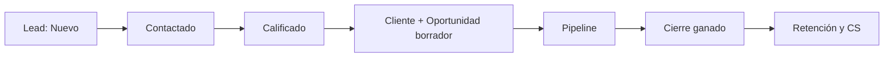
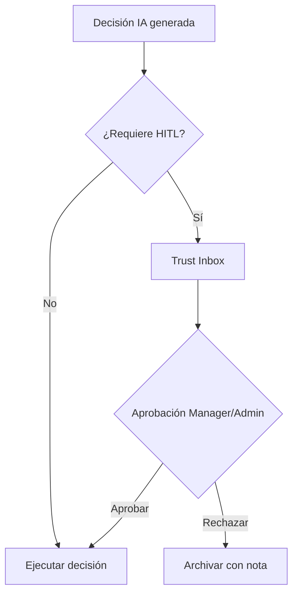
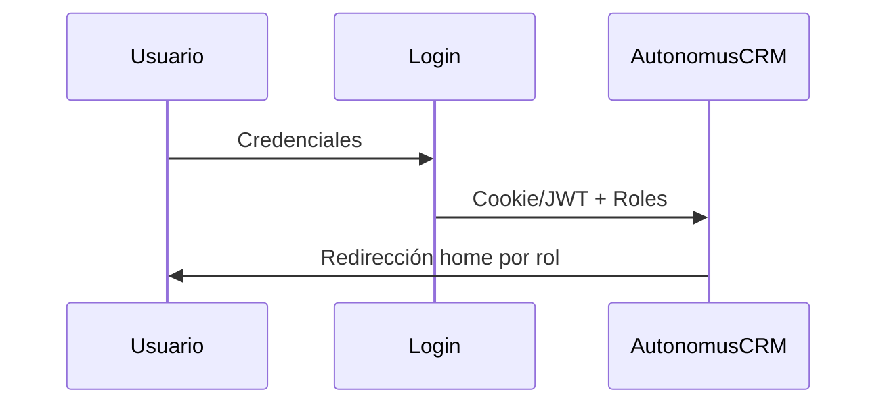

<div align="center">

# AutonomusCRM

## Manual de Usuario — Soporte y Customer Success

**Versión:** 2.0.0  
**Fecha de publicación:** 5 de junio de 2026  
**Autor:** AutonomusCRM Enterprise Documentation Team  
**Rol objetivo:** Support  
**Clasificación:** Confidencial — Uso interno y clientes autorizados

---

*Documentación corporativa — Estándar Salesforce / Microsoft Dynamics 365*

</div>

---

## Control de versiones

| Versión | Fecha | Autor | Descripción |
|---------|-------|-------|-------------|
| 1.0.0 | 2026-06-05 | Enterprise Documentation Team | Publicación inicial basada en código |
| 2.0.0 | 5 de junio de 2026 | Enterprise Documentation Team | Transformación corporativa: estructura, diagramas, callouts, glosario |

---

## Tabla de contenido

*Índice generado automáticamente — ver encabezados numerados del documento.*

1. Introducción
2. Cuerpo del documento (capítulos originales transformados)
3. Diagramas de referencia
4. Glosario corporativo
5. Apéndices

---

## 1. Introducción

### 1.1 Objetivo del documento

Customer 360, tickets CS, retención y lectura comercial

### 1.2 Audiencia

Equipo de soporte y éxito del cliente

### 1.3 Alcance

Este documento cubre **únicamente funcionalidades verificadas** en el código fuente de AutonomusCRM. No describe módulos inexistentes ni roles no implementados.

### 1.4 Prerrequisitos

| Requisito | Detalle |
|-----------|---------|
| Acceso | Cuenta activa en el tenant AutonomusCRM |
| Navegador | Chrome, Edge o Firefox actualizado |
| Rol | Según matriz en `ROLE_PERMISSION_MATRIX.md` |
| Conocimientos | Ninguno técnico requerido para roles operativos |

### 1.5 Definiciones clave

Consulte el **Glosario corporativo** al final del documento. Términos críticos: Lead, Customer, Deal, Pipeline, Tenant, Revenue OS.

> **NOTA:** La interfaz admite español (ES) e inglés (EN). Las rutas técnicas (`/Leads`, `/Deals`) se conservan por trazabilidad al producto.

[CAPTURA: Pantalla de inicio de sesión — /Account/Login]

---

## 2. Cuerpo del documento


## Capítulo 1 — ¿Qué es AutonomusCRM?

### 1.1 Definición para el rol Support
AutonomusCRM es una plataforma de operaciones de ingresos y relación con clientes. Como usuario **Support**, su misión es el **post-venta**: retener clientes, gestionar tickets y casos, ejecutar playbooks de rescate y colaborar con ventas cuando detecte oportunidades — **sin modificar datos comerciales** desde la UI de Leads, Customers o Deals.

### 1.2 Qué resuelve en su día a día
| Necesidad | Módulo |
|-----------|--------|
| ¿Quién está en riesgo? | `/customer-success`, `/Customer360` |
| ¿Historial completo del cliente? | `/customers/{id}/360` |
| ¿Tickets abiertos? | `/customer-success` |
| ¿Qué tareas debo completar? | `/Tasks` |
| ¿Duplicados de identidad? | `/Customer360` |

### 1.3 Customer Success no es un rol

[CAPTURA: Customer Success OS — /customer-success]
### 1.3 Customer Success no es un rol
**Customer Success** es un **módulo** (`/customer-success`), no un rol RBAC. El rol que lo opera típicamente es **Support**. No existe rol Marketing ni SuperAdmin en el sistema.

### 1.4 Su cuenta demo
| Campo | Valor |
|-------|-------|
| Email | `support@autonomuscrm.local` |
| Contraseña | `Support123!` |
| Tras login | Redirección automática a `/Customer360` |
| Alias | `/Support` redirige a `/customer-success` |

### 1.5 Principio de veracidad
Este manual documenta únicamente capacidades verificadas. Se incluye la **> **RIESGO** Brecha API** conocida: la UI bloquea escritura comercial a Support, pero ciertos `POST` REST solo exigen autenticación.

---

## Capítulo 2 — Conceptos fundamentales

[CAPTURA: Pantalla de inicio de sesión — /Account/Login]

### 2.1 Entidades que verá (mayormente lectura)
| Entidad | Su relación | Escritura UI Support |
|---------|-------------|----------------------|
| **Customer** | Foco principal | ❌ Create/Edit comercial |
| **Deal** | Contexto de compra | ❌ |
| **Lead** | Contexto pre-venta | ❌ |
| **Ticket / Case** | CS OS | ✅ en `/customer-success` |
| **Task** | Operativas CS | ✅ Completar; ⚠️ crear manual |

### 2.2 Estados del Customer relevantes para CS
`Prospect` → `Customer` → `VIP` | `Churned` | `Inactive`

Tras deal ganado o `CustomerCreatedEvent`, retención puede mover a estado **Customer** y ejecutar onboarding.

### 2.3 Salud de cuenta (Health)
`ICustomerHealthEngine` calcula puntuación y clasificación (incluida **Critical**). Visible en Customer Success OS y tablas de salud.

### 2.4 Riesgo y churn
- **RiskScore** en directorio de clientes (alerta > 70)  
- **Churn ML** (`IChurnPredictionV2`) en Customer 360: Alto ≥60%, Medio ≥35%  
- **Playbook Rescue** cuando RiskScore ≥ 70  

### 2.5 Playbooks de retención
| Playbook | Disparo típico |
|----------|----------------|
| Onboarding | CustomerCreated / deal ganado |
| Rescue | RiskScore ≥ 70 |
| ReEngagement | Sin contacto > 45 días |
| Renewal | Ventanas de renovación |
| Expansion | Oportunidades upsell |
| At Risk | Lista CS OS |

### 2.6 Tickets y casos
En `/customer-success`: tickets con prioridad Normal/High/Urgent, casos pendientes (`OpenCases`), cierre de tickets desde UI.

### 2.7 Tenant
Datos aislados por organización. Support solo ve su tenant.

---

## Capítulo 3 — Arquitectura funcional del negocio

### 3.1 Journey post-venta
```
Deal ClosedWon → Customer + LTV → RetentionAutomation
       ↓
Tareas onboarding D0/D7/D30 → Support en CS OS
       ↓
Health scan (15 min) → Rescue / Renewal / Expansion
```

### 3.2 Handoff desde Sales
Cuando Sales cierra un deal:
1. `DealClosedEvent` dispara retención  
2. Customer actualizado, LTV incrementado  
3. Tareas CS urgentes (Día 1) aparecen en `/Tasks`  
4. Email onboarding si Customer tiene email  
5. Support toma ownership en `/customer-success`  

### 3.3 RetentionAutomationEngine
En `CustomerCreatedEvent` y `DealClosedEvent`:
- Cambio estado Customer  
- Metadatos journey (`JourneyStage`, `OnboardingStarted`)  
- Playbook onboarding  
- Posible email plantilla Onboarding  

### 3.4 Scan de retención (cada 15 min)
`Worker.cs` por tenant:
- Persiste salud de todos los clientes  
- Ejecuta rescue en críticos  
- Emails de riesgo, ventanas renovación  
- Alertas churn, tareas expansión  
- WhatsApp re-engagement si hay teléfono (`IWhatsAppAutomationEngine`)  

### 3.5 Agentes CS en background
CustomerRiskAgent, CustomerHealthAgent, ChurnRiskAgent (RiskScore ≥ 60), RenewalEngine, ExpansionRevenueEngine.

### 3.6 Lo que Support no ejecuta
- Calificar leads (Sales)  
- Mover pipeline comercial (Sales)  
- Configurar tenant (`/Settings`)  
- Gestionar usuarios (`/Users`)  
- Aprobar Trust Studio (Manager/Admin)  

### 3.7 > **RIESGO** Brecha UI vs API (crítica)
| Capa | Support |
|------|---------|
| UI Razor Leads/Customers/Deals POST | **Bloqueado** (control de escritura comercial del sistema) |
| API **Registrar un nuevo prospecto** (API), `/customers`, `/deals` | **Autenticado sin filtro rol** ⚠️ |

**Política operativa:** Use solo la UI autorizada. Reporte a Admin cualquier uso indebido de API. No use la > **RIESGO** Brecha como workaround.

---

## Capítulo 4 — Roles del sistema

### 4.1 Los cinco roles reales
| Rol | Home | Escritura comercial UI |
|-----|------|------------------------|
| Admin | `/executive` | Sí + admin |
| Manager | `/executive` | Sí + Users/Settings |
| Sales | `/revenue` | Sí |
| **Support** | **`/Customer360`** | **No** |
| Viewer | `/` | No |

### 4.2 Permisos del rol Support
**Puede:**
- Leer Leads, Customers, Deals (listas y detalle GET)  
- Usar Customer 360 (`/Customer360`, `/customers/{id}/360`)  
- Operar Customer Success OS (`/customer-success`): tickets, playbooks, casos  
- Completar tareas en `/Tasks`  
- Consultar Command, Trust Studio, Workforce (lectura)  
- Revenue OS y Executive (lectura 👁)  

**No puede (UI):**
- Crear/editar Leads, Customers, Deals  
- Qualify, Convert, Close deals  
- `/Users`, `/Settings`  
- Aprobar Trust HITL (típico Manager/Admin)  
- Configurar integraciones OAuth  

### 4.3 Matriz módulo × Support
| Módulo | Ruta | Support |
|--------|------|---------|
| Customer 360 | `/Customer360` | ✅ |
| Customer Success | `/customer-success` | ✅ |
| Tasks | `/Tasks` | ✅ |
| Customers Directory | `/Customers` | 👁 |
| Pipeline / Deals | `/Deals` | 👁 |

[CAPTURA: Pipeline Kanban — /Deals]
| Leads | `/Leads` | 👁 |
| Revenue OS | `/revenue` | 👁 |

### 4.4 Escalamiento
| Situación | Escalar a |
|-----------|-----------|
| Nueva oportunidad comercial | Sales |
| Cambio en deal o lead | Sales |
| Usuario bloqueado / MFA | Admin / Manager |
| Failed Events / workers caídos | Admin |
| > **RIESGO** Brecha API explotada | Admin (seguridad) |

---

## Capítulo 5 — Navegación del sistema

### 5.1 Inicio de sesión
1. `/Account/Login`  
2. `support@autonomuscrm.local` / `Support123!`  
3. Home: **`/Customer360`**  
4. Trabajo principal: **`/customer-success`**

### 5.2 Menú lateral — ítems clave Support
| Sección | Ruta | Uso Support |
|---------|------|-------------|
| Customers | **`/Customer360`** | **Home — búsqueda 360** |
| Customers | **`/customer-success`** | **CS OS — tickets, playbooks** |
| Customers | `/Customers` | Directorio (lectura) |
| Operations | `/Tasks` | Tareas CS y onboarding |
| Revenue | `/Deals` | Contexto pipeline (lectura) |
| Commerce | `/Leads` | Contexto pre-venta (lectura) |
| Revenue | `/revenue` | Métricas ingresos (lectura) |
| Command | `/` | Panorama IA (consulta) |
| Admin | `/Users`, `/Settings` | ❌ > **ADVERTENCIA** Access Denied |

### 5.3 Atajos
- **Ctrl+K** — búsqueda global `/api/flow/search`  
- **`/Support`** — redirect a `/customer-success`  
- **`/customers/{id}/360`** — vista detalle desde tickets o listas  

### 5.4 Errores de navegación
| Error | Consecuencia | Solución |
|-------|--------------|----------|
| Intentar crear Lead | > **ADVERTENCIA** Access Denied | Escalar a Sales |
| Editar Customer comercial | Bloqueado | Solo lectura; use CS OS para tickets |
| Ignorar `/Tasks` | SLA onboarding incumplido | Revisar D0/D7/D30 |
| Confundir home con CS OS | Pierde foco operativo | Home = 360; trabajo = customer-success |

---

## Capítulo 6 — Operación diaria de Support

### 6.1 Inicio de jornada (25 min)
| Minutos | Acción | Ruta |
|---------|--------|------|
| 0–5 | Login → Customer 360 | `/Customer360` |
| 5–10 | Revisar duplicados email | Panel duplicates en 360 |
| 10–15 | CS OS — clientes en riesgo | `/customer-success` |
| 15–20 | Tickets abiertos / overdue | CS OS sección Tickets |
| 20–25 | Tareas vencidas propias | `/Tasks?overdueOnly=true` |

### 6.2 Durante el día
| Evento | Acción |
|--------|--------|
| Cliente en riesgo crítico | Ejecutar playbook Rescue / At Risk |
| Ticket nuevo | Crear en CS OS, vincular Customer |
| Renovación próxima | Playbook Renewal en ventana |
| Oportunidad expansión | Playbook Expansion; escalar Sales si procede |
| Deal ganado ayer | Completar tarea D0 onboarding |

### 6.3 Fin de jornada (15 min)
1. Cerrar o actualizar tickets abiertos  
2. Completar tareas D0 urgentes  
3. Revisar casos pendientes (`OpenCases`)  
4. Documentar escalamientos a Sales  

### 6.4 KPIs visibles en CS OS
- AvgHealthScore  
- CustomersAtRisk  
- OpenTicketCount / OpenCaseCount  
- RenewalRatePercent  
- Tabla HealthSummary (Health, Adoption, Engagement, Classification)  

### 6.5 Colaboración con Sales
Support **lee** pipeline; Sales **escribe**. Si detecta upsell, notifique a Sales con CustomerId y contexto desde Customer 360 — no cree deals en UI (bloqueado).

---

## Capítulo 7 — Customer 360

### 7.1 Pantalla de búsqueda
**Ruta:** `/Customer360`  
**Servicio:** `ICustomer360Service.SearchAsync`  
**Parámetro:** `Q` — búsqueda por texto (hasta 25 resultados)

### 7.2 Contenido típico de resultados
Perfil consolidado: deals asociados, salud, riesgo churn ML, comunicaciones, grafo de relaciones, enlace a CS OS.

### 7.3 Vista detalle individual
**Ruta:** `/customers/{id}/360`  
Incluye bloque Customer Success con enlace **Abrir CS OS** si hay datos CS.

### 7.4 Detección de duplicados
`IIdentityResolutionService.FindDuplicatesByEmailAsync` — panel de grupos duplicados en `/Customer360`.  
Escalar fusión a Admin/Manager (`IdentityMergeService`); Support no fusiona desde UI comercial bloqueada.

### 7.5 Churn en 360
Modelo ML puede devolver:
- **Alto** ≥ 60%  
- **Medio** ≥ 35%  
- **Bajo** o sin predicción si historial insuficiente  

### 7.6 Uso operativo
1. Busque cliente por nombre/email  
2. Abra vista 360  
3. Revise health, deals cerrados, riesgo  
4. Salte a CS OS o cree ticket si procede  

### 7.7 Diferencia 360 vs Directorio
| Pantalla | Propósito |
|----------|-----------|
| `/Customers` | Lista paginada, métricas agregadas LTV/riesgo |
| `/Customer360` | Búsqueda unificada y duplicados |
| `/customers/{id}/360` | Ficha completa una cuenta |

---

## Capítulo 8 — Gestión de Clientes (lectura)

### 8.1 Directorio en lectura
**Ruta:** `/Customers`  
Support ve TotalCount, AvgLtv, HighRiskCount (RiskScore > 70), filtros y detalle — **sin** botones Create/Edit funcionales (middleware bloquea POST).

### 8.2 Estados y segmentos
Comprenda estados para priorizar: clientes **Churned** en analítica, **VIP** por segmentación automática, **Inactive** por procesos de merge.

### 8.3 LTV y riesgo
- **LTV** — valor acumulado; contexto de valor para playbooks Expansion  
- **RiskScore > 70** — alerta en directorio; activa playbooks Rescue  

### 8.4 Qué no debe intentar
- `/Customers/Create` → > **ADVERTENCIA** Access Denied  
- `/Customers/Edit` POST → > **ADVERTENCIA** Access Denied  
- Pedir a Sales crear cuenta si falta registro comercial  

### 8.5 Metadatos journey
Tras onboarding automático puede ver en detalle (lectura): `JourneyStage=Customer`, `OnboardingStarted` UTC.

### 8.6 Enlace con tickets
Al crear ticket en CS OS, seleccione Customer de lista desplegable (`Model.Customers`). Enlace desde ticket a `/customers/{id}/360`.

---

## Capítulo 9 — Customer Success y retención

### 9.1 Customer Success OS
**Ruta:** `/customer-success`  
**Servicio:** `ICustomerSuccessOsService`  
**Redirect:** `/Support` → aquí

### 9.2 Secciones de la pantalla
| Sección | Contenido |
|---------|-----------|
| KPIs hero | Salud media, en riesgo, tickets, casos, renovación % |
| At Risk | Hasta 8 clientes; playbook At Risk |
| Renewals | Ventanas renovación; playbook Renewal |
| Tickets | Crear, listar, cerrar tickets |
| Expansion | Recomendaciones upsell; playbook Expansion |
| Playbooks | Renewal, Rescue, Expansion, At Risk (manual por cliente) |
| Open Cases | Casos pendientes por tipo |
| Health Summary | Tabla 15 clientes con scores |

### 9.3 Crear ticket
Formulario POST `CreateTicket`:
- Customer (obligatorio)  
- Subject (obligatorio)  
- Priority: Normal, High, Urgent  

### 9.4 Cerrar ticket
POST `CloseTicket` con `ticketId`.

### 9.5 Ejecutar playbook
POST `RunPlaybook` con `customerId` y `playbookType`:
- `PlaybookAtRisk`  
- `PlaybookRenewal`  
- `PlaybookRescue`  
- `PlaybookExpansion`  

### 9.6 Playbooks automáticos (retención)
| Playbook | Motor |
|----------|-------|
| Onboarding | RetentionAutomation tras CustomerCreated / ClosedWon |
| Rescue | RiskScore ≥ 70, health Critical |
| ReEngagement | > 45 días sin contacto |
| Renewal | `RenewalEngine.EnforceRenewalWindowsAsync` |
| Expansion | `ExpansionRevenueEngine.CreateExpansionTasksAsync` |

### 9.7 Comunicaciones automáticas
- Email onboarding tras deal ganado (si email configurado)  
- Email riesgo en scan retención  
- WhatsApp re-engagement si teléfono presente  

> **NOTA** Workflow `Communicate` en `/Workflows` solo log — no confundir con retención real.

### 9.8 Tareas CS tras deal ganado
Sales dispara; Support ejecuta:
- Día 1 — Urgent  
- Día 7 — Normal  
- Día 30 — Normal  

Visible y completable en `/Tasks`.

### 9.9 KPI retención
`CustomerKpiService` calcula retention rate entre retenidos y churned en periodo analizado.

---

## Capítulo 10 — Automatizaciones

### 10.1 Motores CS relevantes
| Motor | Evento / ciclo |
|-------|----------------|
| RetentionAutomation | CustomerCreated, DealClosed, RiskScore ≥ 70 |
| CustomerHealthAgent | CustomerCreated |
| ChurnRiskAgent | RiskScore ≥ 60 |
| RenewalEngine | Scan 15 min |
| ExpansionRevenueEngine | Scan 15 min |

### 10.2 Scan cada 15 minutos
Por tenant en `Worker.cs`:
- Persistir salud clientes  
- Rescue críticos  
- Emails riesgo, renovaciones, churn alerts  
- Tareas expansión  

### 10.3 BusinessMemoryConsolidationWorker
Cada **6 horas** — memoria semántica; Support lo percibe indirectamente en insights Command/Memory (lectura).

### 10.4 Workflows y Support
Support tiene lectura 👁 en workflows; escritura comercial de workflows limitada. Operación CS principal es CS OS + playbooks, no `/Workflows`.

### 10.5 Failed Events
Si playbook no ejecutó: revisar `/FailedEvents`, escalar Admin, verificar RabbitMQ/workers activos.

### 10.6 Limitaciones
- `Communicate` / `ActivateAgent` en WorkflowEngine: solo log  
- DataQualityGuardian registrado pero no invocado  
- ComplianceSecurityAgent no bloquea (TODO)  

### 10.7 API gap — recordatorio
La automatización de dominio corre en servidor con permisos de sistema. Support **no** debe replicar escritura comercial vía `POST /api/leads|customers|deals` — > **RIESGO** Brecha de seguridad, no función soportada.

---

## Capítulo 11 — Preguntas frecuentes (100)

**Audiencia:** Support (`support@autonomuscrm.local`)  
**Fuente:** funcionalidades reales + > **RIESGO** Brecha API documentada

---

### Categoría 1: Conceptos CS (1–10)

### 1. ¿Cuál es mi misión como Support?

**Pregunta:** ¿Cuál es mi misión como Support?

**Respuesta:** Retener clientes post-venta: tickets, casos, playbooks, tareas onboarding y monitoreo de salud — sin editar pipeline comercial en UI.

**Impacto:** Afecta la operación diaria y la calidad de datos del tenant.

**Acción recomendada:** Seguir el procedimiento descrito y escalar al Manager o Admin si persiste.

### 2. ¿Customer Success es mi rol?

**Pregunta:** ¿Customer Success es mi rol?

**Respuesta:** No. Es el **módulo** `/customer-success`. Su rol RBAC es **Support**.

**Impacto:** Afecta la operación diaria y la calidad de datos del tenant.

**Acción recomendada:** Seguir el procedimiento descrito y escalar al Manager o Admin si persiste.

### 3. ¿Credenciales demo?

**Pregunta:** ¿Credenciales demo?

**Respuesta:** support@autonomuscrm.local / Support123!

**Impacto:** Afecta la operación diaria y la calidad de datos del tenant.

**Acción recomendada:** Seguir el procedimiento descrito y escalar al Manager o Admin si persiste.

### 4. ¿A dónde voy tras login?

**Pregunta:** ¿A dónde voy tras login?

**Respuesta:** `/Customer360` según `RoleHomeRedirect.cs`.

**Impacto:** Afecta la operación diaria y la calidad de datos del tenant.

**Acción recomendada:** Seguir el procedimiento descrito y escalar al Manager o Admin si persiste.

### 5. ¿Cuál es mi pantalla de trabajo principal?

**Pregunta:** ¿Cuál es mi pantalla de trabajo principal?

**Respuesta:** `/customer-success` (Customer Success OS).

**Impacto:** Afecta la operación diaria y la calidad de datos del tenant.

**Acción recomendada:** Seguir el procedimiento descrito y escalar al Manager o Admin si persiste.

### 6. ¿Qué es post-venta en AutonomusCRM?

**Pregunta:** ¿Qué es post-venta en AutonomusCRM?

**Respuesta:** Todo lo posterior a ClosedWon o CustomerCreated: onboarding, salud, renovación, rescate, expansión.

**Impacto:** Afecta la operación diaria y la calidad de datos del tenant.

**Acción recomendada:** Seguir el procedimiento descrito y escalar al Manager o Admin si persiste.

### 7. ¿Debo gestionar Leads?

**Pregunta:** ¿Debo gestionar Leads?

**Respuesta:** No como escritura. Leads son responsabilidad Sales; usted puede **leer** contexto en `/Leads`.

**Impacto:** Restricción de permisos o alcance del rol.

**Acción recomendada:** Seguir el procedimiento descrito y escalar al Manager o Admin si persiste.

### 8. ¿Existen roles SuperAdmin o Marketing?

**Pregunta:** ¿Existen roles SuperAdmin o Marketing?

**Respuesta:** No. Cinco roles: Admin, Manager, Sales, Support, Viewer.

**Impacto:** Afecta la operación diaria y la calidad de datos del tenant.

**Acción recomendada:** Seguir el procedimiento descrito y escalar al Manager o Admin si persiste.

### 9. ¿Qué es un tenant?

**Pregunta:** ¿Qué es un tenant?

**Respuesta:** Su organización aislada; solo ve datos de su TenantId.

**Impacto:** Afecta la operación diaria y la calidad de datos del tenant.

**Acción recomendada:** Seguir el procedimiento descrito y escalar al Manager o Admin si persiste.

### 10. ¿Qué es salud de cuenta?

**Pregunta:** ¿Qué es salud de cuenta?

**Respuesta:** Puntuación de `ICustomerHealthEngine` con clasificación (incl. Critical) usada en CS OS y playbooks.

**Impacto:** Afecta la operación diaria y la calidad de datos del tenant.

**Acción recomendada:** Seguir el procedimiento descrito y escalar al Manager o Admin si persiste.

---

### Categoría 2: Customer 360 (11–25)

### 11. ¿Qué es Customer 360?

**Pregunta:** ¿Qué es Customer 360?

**Respuesta:** Vista integral: perfil, deals, salud, churn ML, comunicaciones y relaciones.

**Impacto:** Afecta la operación diaria y la calidad de datos del tenant.

**Acción recomendada:** Seguir el procedimiento descrito y escalar al Manager o Admin si persiste.

### 12. ¿Ruta de búsqueda?

**Pregunta:** ¿Ruta de búsqueda?

**Respuesta:** `/Customer360` con parámetro `Q`.

**Impacto:** Afecta la operación diaria y la calidad de datos del tenant.

**Acción recomendada:** Seguir el procedimiento descrito y escalar al Manager o Admin si persiste.

### 13. ¿Ruta detalle individual?

**Pregunta:** ¿Ruta detalle individual?

**Respuesta:** `/customers/{id}/360`.

**Impacto:** Afecta la operación diaria y la calidad de datos del tenant.

**Acción recomendada:** Seguir el procedimiento descrito y escalar al Manager o Admin si persiste.

### 14. ¿Cuántos resultados devuelve búsqueda?

**Pregunta:** ¿Cuántos resultados devuelve búsqueda?

**Respuesta:** Hasta 25 (`SearchAsync`).

**Impacto:** Afecta la operación diaria y la calidad de datos del tenant.

**Acción recomendada:** Seguir el procedimiento descrito y escalar al Manager o Admin si persiste.

### 15. ¿Dónde veo duplicados?

**Pregunta:** ¿Dónde veo duplicados?

**Respuesta:** Panel duplicates en `/Customer360` vía `FindDuplicatesByEmailAsync`.

**Impacto:** Afecta la operación diaria y la calidad de datos del tenant.

**Acción recomendada:** Seguir el procedimiento descrito y escalar al Manager o Admin si persiste.

### 16. ¿Puedo fusionar duplicados?

**Pregunta:** ¿Puedo fusionar duplicados?

**Respuesta:** No desde su rol típico; escalar Admin (`IdentityMergeService`).

**Impacto:** Restricción de permisos o alcance del rol.

**Acción recomendada:** Seguir el procedimiento descrito y escalar al Manager o Admin si persiste.

### 17. ¿Churn Alto/Medio/Bajo?

**Pregunta:** ¿Churn Alto/Medio/Bajo?

**Respuesta:** ML: Alto ≥60%, Medio ≥35%; bajo o N/A sin historial.

**Impacto:** Afecta la operación diaria y la calidad de datos del tenant.

**Acción recomendada:** Seguir el procedimiento descrito y escalar al Manager o Admin si persiste.

### 18. ¿Enlace desde 360 a CS?

**Pregunta:** ¿Enlace desde 360 a CS?

**Respuesta:** Detalle incluye botón **Abrir CS OS** si hay bloque CustomerSuccess.

**Impacto:** Afecta la operación diaria y la calidad de datos del tenant.

**Acción recomendada:** Seguir el procedimiento descrito y escalar al Manager o Admin si persiste.

### 19. ¿360 vs `/Customers`?

**Pregunta:** ¿360 vs `/Customers`?

**Respuesta:** 360 = búsqueda unificada y ficha rica; Customers = directorio paginado con métricas agregadas.

**Impacto:** Afecta la operación diaria y la calidad de datos del tenant.

**Acción recomendada:** Seguir el procedimiento descrito y escalar al Manager o Admin si persiste.

### 20. ¿Puedo editar datos en 360?

**Pregunta:** ¿Puedo editar datos en 360?

**Respuesta:** No campos comerciales POST; operación CS vía tickets/playbooks en CS OS.

**Impacto:** Restricción de permisos o alcance del rol.

**Acción recomendada:** Seguir el procedimiento descrito y escalar al Manager o Admin si persiste.

### 21. ¿Qué servicio alimenta 360?

**Pregunta:** ¿Qué servicio alimenta 360?

**Respuesta:** `ICustomer360Service` e identidad `IIdentityResolutionService`.

**Impacto:** Afecta la operación diaria y la calidad de datos del tenant.

**Acción recomendada:** Seguir el procedimiento descrito y escalar al Manager o Admin si persiste.

### 22. ¿Veo deals del cliente en 360?

**Pregunta:** ¿Veo deals del cliente en 360?

**Respuesta:** Sí, contexto de oportunidades en lectura.

**Impacto:** Afecta la operación diaria y la calidad de datos del tenant.

**Acción recomendada:** Seguir el procedimiento descrito y escalar al Manager o Admin si persiste.

### 23. ¿Veo LTV?

**Pregunta:** ¿Veo LTV?

**Respuesta:** Sí en contexto de perfil/directorio asociado.

**Impacto:** Afecta la operación diaria y la calidad de datos del tenant.

**Acción recomendada:** Seguir el procedimiento descrito y escalar al Manager o Admin si persiste.

### 24. ¿Uso 360 cada mañana?

**Pregunta:** ¿Uso 360 cada mañana?

**Respuesta:** Sí, es su home; búsqueda y duplicados antes de CS OS.

**Impacto:** Afecta la operación diaria y la calidad de datos del tenant.

**Acción recomendada:** Seguir el procedimiento descrito y escalar al Manager o Admin si persiste.

### 25. ¿Búsqueda global Ctrl+K?

**Pregunta:** ¿Búsqueda global Ctrl+K?

**Respuesta:** Sí, `/api/flow/search` incluye rutas Customer 360.

**Impacto:** Afecta la operación diaria y la calidad de datos del tenant.

**Acción recomendada:** Seguir el procedimiento descrito y escalar al Manager o Admin si persiste.

---

### Categoría 3: Customer Success OS (26–40)

### 26. ¿Ruta del CS OS?

**Pregunta:** ¿Ruta del CS OS?

**Respuesta:** `/customer-success`; `/Support` redirige aquí.

**Impacto:** Afecta la operación diaria y la calidad de datos del tenant.

**Acción recomendada:** Seguir el procedimiento descrito y escalar al Manager o Admin si persiste.

### 27. ¿KPIs en hero?

**Pregunta:** ¿KPIs en hero?

**Respuesta:** AvgHealthScore, CustomersAtRisk, OpenTickets, OpenCases, RenewalRatePercent.

**Impacto:** Afecta la operación diaria y la calidad de datos del tenant.

**Acción recomendada:** Seguir el procedimiento descrito y escalar al Manager o Admin si persiste.

### 28. ¿Sección At Risk?

**Pregunta:** ¿Sección At Risk?

**Respuesta:** Lista clientes en riesgo con severidad y playbook At Risk.

**Impacto:** Afecta la operación diaria y la calidad de datos del tenant.

**Acción recomendada:** Seguir el procedimiento descrito y escalar al Manager o Admin si persiste.

### 29. ¿Sección Renewals?

**Pregunta:** ¿Sección Renewals?

**Respuesta:** Clientes en ventana renovación (días, valor anual, window).

**Impacto:** Afecta la operación diaria y la calidad de datos del tenant.

**Acción recomendada:** Seguir el procedimiento descrito y escalar al Manager o Admin si persiste.

### 30. ¿Cómo creo ticket?

**Pregunta:** ¿Cómo creo ticket?

**Respuesta:** Formulario CreateTicket: Customer, Subject, Priority (Normal/High/Urgent).

**Impacto:** Afecta la operación diaria y la calidad de datos del tenant.

**Acción recomendada:** Seguir el procedimiento descrito y escalar al Manager o Admin si persiste.

### 31. ¿Cómo cierro ticket?

**Pregunta:** ¿Cómo cierro ticket?

**Respuesta:** Botón Close → POST CloseTicket con ticketId.

**Impacto:** Afecta la operación diaria y la calidad de datos del tenant.

**Acción recomendada:** Seguir el procedimiento descrito y escalar al Manager o Admin si persiste.

### 32. ¿Tickets overdue?

**Pregunta:** ¿Tickets overdue?

**Respuesta:** Filas warn (`flow-row-warn`) si vencidos.

**Impacto:** Afecta la operación diaria y la calidad de datos del tenant.

**Acción recomendada:** Seguir el procedimiento descrito y escalar al Manager o Admin si persiste.

### 33. ¿Sección Expansion?

**Pregunta:** ¿Sección Expansion?

**Respuesta:** Recomendaciones upsell con OpportunityType y playbook Expansion.

**Impacto:** Afecta la operación diaria y la calidad de datos del tenant.

**Acción recomendada:** Seguir el procedimiento descrito y escalar al Manager o Admin si persiste.

### 34. ¿Playbooks manuales disponibles?

**Pregunta:** ¿Playbooks manuales disponibles?

**Respuesta:** Renewal, Rescue (Protected), Expansion, At Risk — selector Customer + RunPlaybook.

**Impacto:** Afecta la operación diaria y la calidad de datos del tenant.

**Acción recomendada:** Seguir el procedimiento descrito y escalar al Manager o Admin si persiste.

### 35. ¿Qué son Open Cases?

**Pregunta:** ¿Qué son Open Cases?

**Respuesta:** Casos pendientes con CaseTypeLabel, Customer, Title, Priority.

**Impacto:** Afecta la operación diaria y la calidad de datos del tenant.

**Acción recomendada:** Seguir el procedimiento descrito y escalar al Manager o Admin si persiste.

### 36. ¿Tabla Health Summary?

**Pregunta:** ¿Tabla Health Summary?

**Respuesta:** Hasta 15 clientes: HealthScore, AdoptionScore, EngagementScore, Classification.

**Impacto:** Afecta la operación diaria y la calidad de datos del tenant.

**Acción recomendada:** Seguir el procedimiento descrito y escalar al Manager o Admin si persiste.

### 37. ¿Insight actions en filas?

**Pregunta:** ¿Insight actions en filas?

**Respuesta:** Partial `_FlowInsightActions` con returnUrl `/customer-success`.

**Impacto:** Afecta la operación diaria y la calidad de datos del tenant.

**Acción recomendada:** Seguir el procedimiento descrito y escalar al Manager o Admin si persiste.

### 38. ¿Historial tickets cerrados?

**Pregunta:** ¿Historial tickets cerrados?

**Respuesta:** Últimos 5 en sección History bajo tickets abiertos.

**Impacto:** Afecta la operación diaria y la calidad de datos del tenant.

**Acción recomendada:** Seguir el procedimiento descrito y escalar al Manager o Admin si persiste.

### 39. ¿Servicio backend?

**Pregunta:** ¿Servicio backend?

**Respuesta:** `ICustomerSuccessOsService.GetHomeAsync` (vía PageModel).

**Impacto:** Afecta la operación diaria y la calidad de datos del tenant.

**Acción recomendada:** Seguir el procedimiento descrito y escalar al Manager o Admin si persiste.

### 40. ¿Puedo operar CS OS sin 360?

**Pregunta:** ¿Puedo operar CS OS sin 360?

**Respuesta:** Sí, pero 360 es home ideal para contexto previo por cliente.

**Impacto:** Afecta la operación diaria y la calidad de datos del tenant.

**Acción recomendada:** Seguir el procedimiento descrito y escalar al Manager o Admin si persiste.

---

### Categoría 4: Clientes lectura (41–50)

### 41. ¿Puedo crear Customer en UI?

**Pregunta:** ¿Puedo crear Customer en UI?

**Respuesta:** No. POST bloqueado por middleware comercial.

**Impacto:** Afecta la operación diaria y la calidad de datos del tenant.

**Acción recomendada:** Seguir el procedimiento descrito y escalar al Manager o Admin si persiste.

### 42. ¿Puedo editar Customer?

**Pregunta:** ¿Puedo editar Customer?

**Respuesta:** No en UI comercial. Solo lectura en `/Customers` y 360.

**Impacto:** Restricción de permisos o alcance del rol.

**Acción recomendada:** Seguir el procedimiento descrito y escalar al Manager o Admin si persiste.

### 43. ¿Estados Customer relevantes?

**Pregunta:** ¿Estados Customer relevantes?

**Respuesta:** Prospect, Customer, VIP, Churned, Inactive.

**Impacto:** Afecta la operación diaria y la calidad de datos del tenant.

**Acción recomendada:** Seguir el procedimiento descrito y escalar al Manager o Admin si persiste.

### 44. ¿RiskScore > 70?

**Pregunta:** ¿RiskScore > 70?

**Respuesta:** Alerta en directorio; priorice playbook Rescue.

**Impacto:** Afecta la operación diaria y la calidad de datos del tenant.

**Acción recomendada:** Seguir el procedimiento descrito y escalar al Manager o Admin si persiste.

### 45. ¿Qué es VIP?

**Pregunta:** ¿Qué es VIP?

**Respuesta:** Segmentación automática alto valor — no cambio manual Support.

**Impacto:** Afecta la operación diaria y la calidad de datos del tenant.

**Acción recomendada:** Seguir el procedimiento descrito y escalar al Manager o Admin si persiste.

### 46. ¿Qué es Churned?

**Pregunta:** ¿Qué es Churned?

**Respuesta:** Cliente abandonado; usado en KPIs retención.

**Impacto:** Afecta la operación diaria y la calidad de datos del tenant.

**Acción recomendada:** Seguir el procedimiento descrito y escalar al Manager o Admin si persiste.

### 47. ¿Métricas en `/Customers`?

**Pregunta:** ¿Métricas en `/Customers`?

**Respuesta:** TotalCount, AvgLtv, HighLtvCount, HighRiskCount, AvgRisk.

**Impacto:** Afecta la operación diaria y la calidad de datos del tenant.

**Acción recomendada:** Seguir el procedimiento descrito y escalar al Manager o Admin si persiste.

### 48. ¿Cliente sin email?

**Pregunta:** ¿Cliente sin email?

**Respuesta:** Onboarding email automático no aplica; use teléfono/WhatsApp si disponible.

**Impacto:** Afecta la operación diaria y la calidad de datos del tenant.

**Acción recomendada:** Seguir el procedimiento descrito y escalar al Manager o Admin si persiste.

### 49. ¿Falta Customer comercial?

**Pregunta:** ¿Falta Customer comercial?

**Respuesta:** Escalar Sales para alta en CRM, no API workaround.

**Impacto:** Afecta la operación diaria y la calidad de datos del tenant.

**Acción recomendada:** Seguir el procedimiento descrito y escalar al Manager o Admin si persiste.

### 50. ¿Metadatos onboarding?

**Pregunta:** ¿Metadatos onboarding?

**Respuesta:** JourneyStage, OnboardingStarted tras eventos retención — lectura en detalle.

**Impacto:** Afecta la operación diaria y la calidad de datos del tenant.

**Acción recomendada:** Seguir el procedimiento descrito y escalar al Manager o Admin si persiste.

---

### Categoría 5: Tareas Support (51–60)

### 51. ¿Dónde veo tareas?

**Pregunta:** ¿Dónde veo tareas?

**Respuesta:** `/Tasks`.

**Impacto:** Afecta la operación diaria y la calidad de datos del tenant.

**Acción recomendada:** Seguir el procedimiento descrito y escalar al Manager o Admin si persiste.

### 52. ¿Puedo completar tareas?

**Pregunta:** ¿Puedo completar tareas?

**Respuesta:** Sí. Support tiene permiso Complete Task ✅.

**Impacto:** Afecta la operación diaria y la calidad de datos del tenant.

**Acción recomendada:** Seguir el procedimiento descrito y escalar al Manager o Admin si persiste.

### 53. ¿Tareas onboarding D0/D7/D30?

**Pregunta:** ¿Tareas onboarding D0/D7/D30?

**Respuesta:** Generadas al ClosedWon; Support las ejecuta.

**Impacto:** Afecta la operación diaria y la calidad de datos del tenant.

**Acción recomendada:** Seguir el procedimiento descrito y escalar al Manager o Admin si persiste.

### 54. ¿Puedo crear tarea manual?

**Pregunta:** ¿Puedo crear tarea manual?

**Respuesta:** ⚠️ Matriz indica posible > **RIESGO** Brecha; operación estándar: completar existentes y tickets CS OS.

**Impacto:** Afecta la operación diaria y la calidad de datos del tenant.

**Acción recomendada:** Seguir el procedimiento descrito y escalar al Manager o Admin si persiste.

### 55. ¿Tareas de expansión?

**Pregunta:** ¿Tareas de expansión?

**Respuesta:** `ExpansionRevenueEngine` puede crearlas en scan 15 min.

**Impacto:** Afecta la operación diaria y la calidad de datos del tenant.

**Acción recomendada:** Seguir el procedimiento descrito y escalar al Manager o Admin si persiste.

### 56. ¿Tareas rescue?

**Pregunta:** ¿Tareas rescue?

**Respuesta:** Generadas por retención/playbooks en clientes críticos.

**Impacto:** Afecta la operación diaria y la calidad de datos del tenant.

**Acción recomendada:** Seguir el procedimiento descrito y escalar al Manager o Admin si persiste.

### 57. ¿Filtro overdue?

**Pregunta:** ¿Filtro overdue?

**Respuesta:** `/Tasks?overdueOnly=true` al inicio del día.

**Impacto:** Afecta la operación diaria y la calidad de datos del tenant.

**Acción recomendada:** Seguir el procedimiento descrito y escalar al Manager o Admin si persiste.

### 58. ¿Estados tarea?

**Pregunta:** ¿Estados tarea?

**Respuesta:** Open y Completed.

**Impacto:** Afecta la operación diaria y la calidad de datos del tenant.

**Acción recomendada:** Seguir el procedimiento descrito y escalar al Manager o Admin si persiste.

### 59. ¿Vinculación entidad?

**Pregunta:** ¿Vinculación entidad?

**Respuesta:** Tipo Customer/Deal + entityId para contexto.

**Impacto:** Afecta la operación diaria y la calidad de datos del tenant.

**Acción recomendada:** Seguir el procedimiento descrito y escalar al Manager o Admin si persiste.

### 60. ¿Ignorar tareas onboarding?

**Pregunta:** ¿Ignorar tareas onboarding?

**Respuesta:** Incumple SLA CS; cliente sin contacto D0 aumenta riesgo churn.

**Impacto:** Afecta la operación diaria y la calidad de datos del tenant.

**Acción recomendada:** Seguir el procedimiento descrito y escalar al Manager o Admin si persiste.

---

### Categoría 6: Retención y playbooks (61–75)

### 61. ¿Playbook Onboarding cuándo?

**Pregunta:** ¿Playbook Onboarding cuándo?

**Respuesta:** CustomerCreatedEvent o post ClosedWon.

**Impacto:** Afecta la operación diaria y la calidad de datos del tenant.

**Acción recomendada:** Seguir el procedimiento descrito y escalar al Manager o Admin si persiste.

### 62. ¿Playbook Rescue cuándo?

**Pregunta:** ¿Playbook Rescue cuándo?

**Respuesta:** RiskScore ≥ 70 o health Critical.

**Impacto:** Afecta la operación diaria y la calidad de datos del tenant.

**Acción recomendada:** Seguir el procedimiento descrito y escalar al Manager o Admin si persiste.

### 63. ¿ReEngagement cuándo?

**Pregunta:** ¿ReEngagement cuándo?

**Respuesta:** Sin contacto > 45 días en scan retención.

**Impacto:** Afecta la operación diaria y la calidad de datos del tenant.

**Acción recomendada:** Seguir el procedimiento descrito y escalar al Manager o Admin si persiste.

### 64. ¿Playbook Renewal?

**Pregunta:** ¿Playbook Renewal?

**Respuesta:** `RenewalEngine` en ventanas de renovación.

**Impacto:** Afecta la operación diaria y la calidad de datos del tenant.

**Acción recomendada:** Seguir el procedimiento descrito y escalar al Manager o Admin si persiste.

### 65. ¿Playbook Expansion?

**Pregunta:** ¿Playbook Expansion?

**Respuesta:** Oportunidades upsell; coordinar Sales si cierra comercialmente.

**Impacto:** Afecta la operación diaria y la calidad de datos del tenant.

**Acción recomendada:** Seguir el procedimiento descrito y escalar al Manager o Admin si persiste.

### 66. ¿Email onboarding automático?

**Pregunta:** ¿Email onboarding automático?

**Respuesta:** Sí tras deal ganado si Customer tiene email.

**Impacto:** Afecta la operación diaria y la calidad de datos del tenant.

**Acción recomendada:** Seguir el procedimiento descrito y escalar al Manager o Admin si persiste.

### 67. ¿WhatsApp automático?

**Pregunta:** ¿WhatsApp automático?

**Respuesta:** Sí, plantillas re-engagement si teléfono en scan (`IWhatsAppAutomationEngine`).

**Impacto:** Afecta la operación diaria y la calidad de datos del tenant.

**Acción recomendada:** Seguir el procedimiento descrito y escalar al Manager o Admin si persiste.

### 68. ¿Scan retención frecuencia?

**Pregunta:** ¿Scan retención frecuencia?

**Respuesta:** Cada 15 minutos por tenant.

**Impacto:** Afecta la operación diaria y la calidad de datos del tenant.

**Acción recomendada:** Seguir el procedimiento descrito y escalar al Manager o Admin si persiste.

### 69. ¿Qué hace scan retención?

**Pregunta:** ¿Qué hace scan retención?

**Respuesta:** Salud, rescue, emails riesgo, renovaciones, churn alerts, expansión.

**Impacto:** Afecta la operación diaria y la calidad de datos del tenant.

**Acción recomendada:** Seguir el procedimiento descrito y escalar al Manager o Admin si persiste.

### 70. ¿RetentionAutomation en DealClosed?

**Pregunta:** ¿RetentionAutomation en DealClosed?

**Respuesta:** Actualiza Customer, LTV, metadata compra, posible contrato anual.

**Impacto:** Afecta la operación diaria y la calidad de datos del tenant.

**Acción recomendada:** Seguir el procedimiento descrito y escalar al Manager o Admin si persiste.

### 71. ¿CustomerRiskAgent?

**Pregunta:** ¿CustomerRiskAgent?

**Respuesta:** Calcula risk score en CustomerCreated.

**Impacto:** Afecta la operación diaria y la calidad de datos del tenant.

**Acción recomendada:** Seguir el procedimiento descrito y escalar al Manager o Admin si persiste.

### 72. ¿ChurnRiskAgent?

**Pregunta:** ¿ChurnRiskAgent?

**Respuesta:** Acciones cuando RiskScore ≥ 60.

**Impacto:** Afecta la operación diaria y la calidad de datos del tenant.

**Acción recomendada:** Seguir el procedimiento descrito y escalar al Manager o Admin si persiste.

### 73. ¿Ejecutar playbook desde CS OS?

**Pregunta:** ¿Ejecutar playbook desde CS OS?

**Respuesta:** POST RunPlaybook con customerId y playbookType.

**Impacto:** Afecta la operación diaria y la calidad de datos del tenant.

**Acción recomendada:** Seguir el procedimiento descrito y escalar al Manager o Admin si persiste.

### 74. ¿Playbooks en `/command/playbooks`?

**Pregunta:** ¿Playbooks en `/command/playbooks`?

**Respuesta:** Vista estados autónomos — consulta; operación diaria en CS OS.

**Impacto:** Afecta la operación diaria y la calidad de datos del tenant.

**Acción recomendada:** Seguir el procedimiento descrito y escalar al Manager o Admin si persiste.

### 75. ¿KPI retention rate?

**Pregunta:** ¿KPI retention rate?

**Respuesta:** `CustomerKpiService` en analítica CS.

**Impacto:** Afecta la operación diaria y la calidad de datos del tenant.

**Acción recomendada:** Seguir el procedimiento descrito y escalar al Manager o Admin si persiste.

---

### Categoría 7: Permisos y > **RIESGO** Brecha API (76–85)

**76. ¿Por qué > **ADVERTENCIA** Access Denied al crear Lead?**  
control de escritura comercial del sistema bloquea POST comercial UI para Support.

### 77. ¿Puedo calificar Lead?

**Pregunta:** ¿Puedo calificar Lead?

**Respuesta:** No en UI. Solo Admin, Manager, Sales.

**Impacto:** Restricción de permisos o alcance del rol.

**Acción recomendada:** Seguir el procedimiento descrito y escalar al Manager o Admin si persiste.

### 78. ¿Puedo mover deal de etapa?

**Pregunta:** ¿Puedo mover deal de etapa?

**Respuesta:** No en UI. Escalar Sales.

**Impacto:** Restricción de permisos o alcance del rol.

**Acción recomendada:** Seguir el procedimiento descrito y escalar al Manager o Admin si persiste.

### 79. ¿Puedo entrar `/Users`?

**Pregunta:** ¿Puedo entrar `/Users`?

**Respuesta:** No. Admin/Manager only.

**Impacto:** Afecta la operación diaria y la calidad de datos del tenant.

**Acción recomendada:** Seguir el procedimiento descrito y escalar al Manager o Admin si persiste.

### 80. ¿Puedo entrar `/Settings`?

**Pregunta:** ¿Puedo entrar `/Settings`?

**Respuesta:** No.

**Impacto:** Afecta la operación diaria y la calidad de datos del tenant.

**Acción recomendada:** Seguir el procedimiento descrito y escalar al Manager o Admin si persiste.

**81. ¿Qué es la > **RIESGO** Brecha API?**  
**Registrar un nuevo prospecto** (API), `/customers`, `/deals` exigen autenticación **sin** filtro rol — UI bloquea, API no.

### 82. ¿Debo usar API para escribir comercial?

**Pregunta:** ¿Debo usar API para escribir comercial?

**Respuesta:** **No.** Es riesgo de seguridad; reporte a Admin.

**Impacto:** Afecta la operación diaria y la calidad de datos del tenant.

**Acción recomendada:** Seguir el procedimiento descrito y escalar al Manager o Admin si persiste.

### 83. ¿Support vs Viewer en API?

**Pregunta:** ¿Support vs Viewer en API?

**Respuesta:** Ambos bloqueados en UI; ambos ⚠️ en API comercial POST.

**Impacto:** Afecta la operación diaria y la calidad de datos del tenant.

**Acción recomendada:** Seguir el procedimiento descrito y escalar al Manager o Admin si persiste.

### 84. ¿RequireSales aplicado en API?

**Pregunta:** ¿RequireSales aplicado en API?

**Respuesta:** Registrado pero no aplicado en controllers comerciales según inventario.

**Impacto:** Restricción de permisos o alcance del rol.

**Acción recomendada:** Seguir el procedimiento descrito y escalar al Manager o Admin si persiste.

### 85. ¿Qué reportar a Admin?

**Pregunta:** ¿Qué reportar a Admin?

**Respuesta:** Intentos de bypass API, Failed Events, integraciones rotas.

**Impacto:** Afecta la operación diaria y la calidad de datos del tenant.

**Acción recomendada:** Seguir el procedimiento descrito y escalar al Manager o Admin si persiste.

---

### Categoría 8: Navegación Support (86–93)

### 86. ¿Cuántos ítems menú lateral?

**Pregunta:** ¿Cuántos ítems menú lateral?

**Respuesta:** 19 — verá Users/Settings pero > **ADVERTENCIA** Access Denied al entrar.

**Impacto:** Restricción de permisos o alcance del rol.

**Acción recomendada:** Seguir el procedimiento descrito y escalar al Manager o Admin si persiste.

### 87. ¿Revenue OS para Support?

**Pregunta:** ¿Revenue OS para Support?

**Respuesta:** Lectura 👁 en `/revenue` — contexto ingresos, no edición.

**Impacto:** Afecta la operación diaria y la calidad de datos del tenant.

**Acción recomendada:** Seguir el procedimiento descrito y escalar al Manager o Admin si persiste.

### 88. ¿Deals lectura?

**Pregunta:** ¿Deals lectura?

**Respuesta:** Sí `/Deals` 👁 — contexto pipeline sin POST.

**Impacto:** Afecta la operación diaria y la calidad de datos del tenant.

**Acción recomendada:** Seguir el procedimiento descrito y escalar al Manager o Admin si persiste.

### 89. ¿Leads lectura?

**Pregunta:** ¿Leads lectura?

**Respuesta:** Sí `/Leads` 👁.

**Impacto:** Afecta la operación diaria y la calidad de datos del tenant.

**Acción recomendada:** Seguir el procedimiento descrito y escalar al Manager o Admin si persiste.

### 90. ¿Trust Studio?

**Pregunta:** ¿Trust Studio?

**Respuesta:** Lectura 👁; aprobación HITL Manager/Admin.

**Impacto:** Afecta la operación diaria y la calidad de datos del tenant.

**Acción recomendada:** Seguir el procedimiento descrito y escalar al Manager o Admin si persiste.

### 91. ¿Command Center?

**Pregunta:** ¿Command Center?

**Respuesta:** Consulta métricas IA 7/30 días en `/`.

**Impacto:** Afecta la operación diaria y la calidad de datos del tenant.

**Acción recomendada:** Seguir el procedimiento descrito y escalar al Manager o Admin si persiste.

### 92. ¿Integraciones `/Integrations`?

**Pregunta:** ¿Integraciones `/Integrations`?

**Respuesta:** Lectura 👁; OAuth típico Admin/Manager.

**Impacto:** Afecta la operación diaria y la calidad de datos del tenant.

**Acción recomendada:** Seguir el procedimiento descrito y escalar al Manager o Admin si persiste.

### 93. ¿Failed Events?

**Pregunta:** ¿Failed Events?

**Respuesta:** `/FailedEvents` lectura — escalar Admin si eventos CS fallan.

**Impacto:** Afecta la operación diaria y la calidad de datos del tenant.

**Acción recomendada:** Seguir el procedimiento descrito y escalar al Manager o Admin si persiste.

---

### Categoría 9: Automatizaciones y errores (94–100)

### 94. ¿Workflow Communicate envía email?

**Pregunta:** ¿Workflow Communicate envía email?

**Respuesta:** No — solo log. Retención real usa motores CS distintos.

**Impacto:** Restricción de permisos o alcance del rol.

**Acción recomendada:** Seguir el procedimiento descrito y escalar al Manager o Admin si persiste.

### 95. ¿Workers usan LLM?

**Pregunta:** ¿Workers usan LLM?

**Respuesta:** No en `AutonomusCRM.Workers`; ML enterprise sí para churn/expansión.

**Impacto:** Restricción de permisos o alcance del rol.

**Acción recomendada:** Seguir el procedimiento descrito y escalar al Manager o Admin si persiste.

### 96. ¿Playbook no ejecutó?

**Pregunta:** ¿Playbook no ejecutó?

**Respuesta:** Revise `/FailedEvents`, workers Docker, RabbitMQ; escale Admin.

**Impacto:** Afecta la operación diaria y la calidad de datos del tenant.

**Acción recomendada:** Seguir el procedimiento descrito y escalar al Manager o Admin si persiste.

### 97. ¿No veo churn en 360?

**Pregunta:** ¿No veo churn en 360?

**Respuesta:** ML sin historial suficiente — riesgo bajo o sin bullet.

**Impacto:** Afecta la operación diaria y la calidad de datos del tenant.

**Acción recomendada:** Seguir el procedimiento descrito y escalar al Manager o Admin si persiste.

### 98. ¿Cliente en riesgo pero sin ticket?

**Pregunta:** ¿Cliente en riesgo pero sin ticket?

**Respuesta:** Cree ticket Urgent en CS OS y ejecute playbook At Risk.

**Impacto:** Afecta la operación diaria y la calidad de datos del tenant.

**Acción recomendada:** Seguir el procedimiento descrito y escalar al Manager o Admin si persiste.

### 99. ¿Oportunidad expansión detectada?

**Pregunta:** ¿Oportunidad expansión detectada?

**Respuesta:** Playbook Expansion + notificar Sales con CustomerId — no crear deal usted.

**Impacto:** Afecta la operación diaria y la calidad de datos del tenant.

**Acción recomendada:** Seguir el procedimiento descrito y escalar al Manager o Admin si persiste.

### 100. ¿Práctica seguridad Support?

**Pregunta:** ¿Práctica seguridad Support?

**Respuesta:** Use solo UI autorizada; no explote > **RIESGO** Brecha API; escale oportunidades a Sales y incidentes a Admin; complete tareas D0/D7/D30 y cierre tickets abiertos diariamente.

**Impacto:** Afecta la operación diaria y la calidad de datos del tenant.

**Acción recomendada:** Seguir el procedimiento descrito y escalar al Manager o Admin si persiste.

---

*Fin del manual Support — 11 capítulos, 100 FAQ. Referencias: `Documentation/ROLE_PERMISSION_MATRIX.md`, `docs/enterprise-manual/05_AUTOMATION_CATALOG.md`, `AutonomusCRM.API/Pages/CustomerSuccess.cshtml`.*

---

## 3. Diagramas de referencia


### Diagramas de referencia

#### Ciclo de vida del Lead


#### Flujo de aprobación Trust Studio


#### Flujo de autenticación



---

## 4. Glosario corporativo


## Glosario corporativo

| Término | Definición |
|---------|------------|
| **CRM** | Customer Relationship Management — sistema para registrar y medir relaciones comerciales |
| **Lead** | Prospecto o contacto potencial; entidad inicial del embudo |
| **Customer** | Cuenta o cliente en el directorio del tenant |
| **Opportunity / Deal** | Oportunidad de venta con monto, etapa y probabilidad |
| **Pipeline** | Conjunto de oportunidades abiertas y sus etapas en `/Deals` |
| **Forecast** | Proyección ponderada: monto × probabilidad por ventana de cierre |
| **Workflow** | Automatización configurable: trigger + condiciones + acciones |
| **Tenant** | Organización aislada; todos los datos pertenecen a un TenantId |
| **Trust Studio** | Buzón HITL en `/TrustInbox` para aprobar decisiones de IA |
| **Revenue OS** | Módulo de ingresos en `/revenue` — priorización y fugas |
| **Executive OS** | Tablero ejecutivo en `/executive` |
| **MFA** | Autenticación multifactor configurable en Settings |
| **ABAC** | Attribute-Based Access Control — políticas en `/Policies` (no sustituye RBAC) |
| **Customer Success** | Módulo post-venta en `/customer-success` (no es un rol) |
| **Churn** | Abandono del cliente; predicción ML en Customer 360 |
| **LTV** | Lifetime Value — valor acumulado del cliente |
| **Upsell** | Venta adicional al mismo cliente (expansión) |
| **Cross-Sell** | Venta de productos complementarios |
| **Playbook** | Secuencia automatizada: onboarding, rescue, re-engagement |
| **AI Agent** | Agente autónomo en `/Agents` (LeadIntelligence, Communication, etc.) |
| **Semantic Memory** | Memoria empresarial en `/Memory` |
| **Outcome Fabric** | Atribución de resultados en `/command/outcomes` |
| **HITL** | Human-in-the-Loop — supervisión humana de decisiones IA |
| **SLA** | Acuerdo de nivel de servicio (ej. contacto lead en 24 h) |
| **DLQ** | Dead Letter Queue — eventos fallidos en `/FailedEvents` |


---

## 5. Apéndices

### 5.1 Referencias cruzadas

| Documento | Ubicación |
|-----------|-----------|
| Matriz de permisos | `Documentation/ROLE_PERMISSION_MATRIX.md` |
| Descubrimiento de roles | `Documentation/ROLE_DISCOVERY_REPORT.md` |
| Manual maestro | `docs/manual-empresarial-autonomuscrm/` |

### 5.2 Pie de documento

| Campo | Valor |
|-------|-------|
| Producto | AutonomusCRM |
| Versión documento | 2.0.0 |
| Clasificación | Confidencial — Uso interno y clientes autorizados |
| Fuente | Código verificado — sin funcionalidades inventadas |

---

*© AutonomusCRM — Documentación Enterprise. Listo para impresión PDF y capacitación corporativa.*

