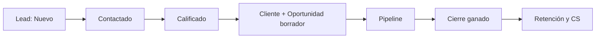
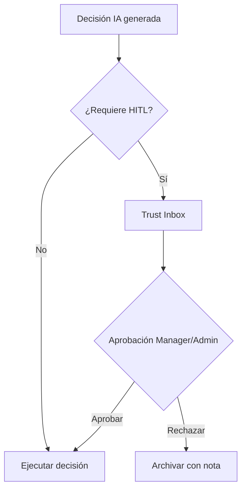
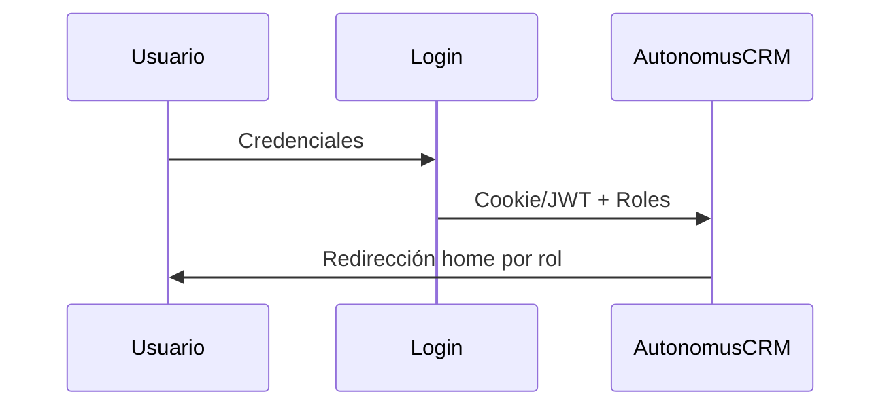

<div align="center">

# AutonomusCRM

## Manual de Usuario — Consulta

**Versión:** 2.0.0  
**Fecha de publicación:** 5 de junio de 2026  
**Autor:** AutonomusCRM Enterprise Documentation Team  
**Rol objetivo:** Viewer  
**Clasificación:** Confidencial — Uso interno y clientes autorizados

---

*Documentación corporativa — Estándar Salesforce / Microsoft Dynamics 365*

</div>

---

## Control de versiones

| Versión | Fecha | Autor | Descripción |
|---------|-------|-------|-------------|
| 1.0.0 | 2026-06-05 | Enterprise Documentation Team | Publicación inicial basada en código |
| 2.0.0 | 5 de junio de 2026 | Enterprise Documentation Team | Transformación corporativa: estructura, diagramas, callouts, glosario |

---

## Tabla de contenido

*Índice generado automáticamente — ver encabezados numerados del documento.*

1. Introducción
2. Cuerpo del documento (capítulos originales transformados)
3. Diagramas de referencia
4. Glosario corporativo
5. Apéndices

---

## 1. Introducción

### 1.1 Objetivo del documento

Consulta de métricas, Command y reportes

### 1.2 Audiencia

Stakeholders de solo lectura

### 1.3 Alcance

Este documento cubre **únicamente funcionalidades verificadas** en el código fuente de AutonomusCRM. No describe módulos inexistentes ni roles no implementados.

### 1.4 Prerrequisitos

| Requisito | Detalle |
|-----------|---------|
| Acceso | Cuenta activa en el tenant AutonomusCRM |
| Navegador | Chrome, Edge o Firefox actualizado |
| Rol | Según matriz en `ROLE_PERMISSION_MATRIX.md` |
| Conocimientos | Ninguno técnico requerido para roles operativos |

### 1.5 Definiciones clave

Consulte el **Glosario corporativo** al final del documento. Términos críticos: Lead, Customer, Deal, Pipeline, Tenant, Revenue OS.

> **NOTA:** La interfaz admite español (ES) e inglés (EN). Las rutas técnicas (`/Leads`, `/Deals`) se conservan por trazabilidad al producto.

[CAPTURA: Pantalla de inicio de sesión — /Account/Login]

---

## 2. Cuerpo del documento

## Capítulo 1 — Introducción al rol Viewer

### 1.1 Propósito
El rol **Viewer** está diseñado para stakeholders que necesitan **consultar** información comercial y operativa sin modificar datos. Ejemplos: dirección financiera, auditores internos, consultores externos, equipo de marketing en modo consulta.

### 1.2 Posición en la organización
| Aspecto | Detalle |
|---------|---------|
| Rol en sistema | `Viewer` (uno de cinco roles definidos) |
| Autenticación | Requerida — no es acceso anónimo |
| Escritura comercial UI | Bloqueada por control de escritura comercial del sistema |
| API comercial | Autenticado — sin filtro de rol en todos los endpoints* |

\*Riesgo documentado: la UI protege al Viewer, pero algunos endpoints API aceptan POST de cualquier usuario autenticado. Operación estándar es solo lectura vía UI.

### 1.3 Usuario demo
| Campo | Valor |
|-------|-------|
| Email | viewer@autonomuscrm.local |
| Contraseña | Viewer123! |
| Nombre | Laura Consulta |
| Tenant | AutonomusCRM Demo (seed local) |

---

## Capítulo 2 — Acceso e inicio de sesión

[CAPTURA: Pantalla de inicio de sesión — /Account/Login]

### 2.1 Primer acceso
1. Abrir el navegador en la URL de AutonomusCRM.
2. Ir a `/Account/Login`.
3. Ingresar email y contraseña.
4. Si MFA está habilitado (`MfaRequired` en Settings), ingresar código TOTP.
5. Tras login exitoso, el sistema redirige a `/` (Command).

### 2.2 Redirección por rol
`RoleHomeRedirect.cs` define el destino post-login:

| Rol | Destino |
|-----|---------|
| Admin | `/executive` |
| Manager | `/executive` |
| Sales | `/revenue` |
| Support | `/Customer360` |
| **Viewer** | **`/`** |

El Viewer **no** es redirigido a Revenue OS ni Customer 360 automáticamente.

### 2.3 Cerrar sesión
Ir a `/Account/Logout` o usar el menú de usuario en la barra superior.

### 2.4 Cambio de idioma
Selector ES/EN en la interfaz. Los recursos de localización están en `localization-es.json` y `localization-en.json`.

---

## Capítulo 3 — Navegación y menú lateral

### 3.1 Estructura del menú (19 ítems)
| # | Sección | Ruta | Acceso Viewer |
|---|---------|------|:-------------:|
| 1 | Command | `/` | ✅ Lectura |
| 2 | Trust Studio | `/TrustInbox` | ✅ Lectura* |
| 3 | Workforce | `/Agents` | ✅ Lectura |
| 4 | Revenue OS | `/revenue` | ✅ Lectura |
| 5 | Executive | `/executive` | ✅ Lectura |
| 6 | Pipeline | `/Deals` | ✅ Lectura |

[CAPTURA: Pipeline Kanban — /Deals]
| 7 | Directory | `/Customers` | ✅ Lectura |
| 8 | Customer 360 | `/Customer360` | ✅ Lectura |
| 9 | Customer Success | `/customer-success` | ✅ Lectura |
| 10 | Leads | `/Leads` | ✅ Lectura |
| 11 | Memory | `/Memory` | ✅ Lectura |
| 12 | Tasks | `/Tasks` | ✅ Lectura |
| 13 | Integrations | `/Integrations` | ✅ Lectura |
| 14 | Voice | `/VoiceCalls` | ✅ Lectura |
| 15 | Users | `/Users` | ❌ Admin/Manager |
| 16 | Policies | `/Policies` | ✅ Lectura** |
| 17 | Audit | `/Audit` | ✅ Lectura |
| 18 | Settings | `/Settings` | ❌ Admin/Manager |
| 19 | Billing | `/billing` | ✅ Lectura |

\*Aprobación de decisiones IA requiere Admin/Manager en operación normal.  
\*\*Escritura de políticas bloqueada por middleware comercial.

### 3.2 Búsqueda global
Atajo `Ctrl+K` abre búsqueda que consulta `/api/flow/search`. Útil para localizar clientes, deals y leads rápidamente.

### 3.3 Rutas comerciales (solo lectura)
| Ruta | Contenido visible |
|------|-------------------|
| `/Leads/Details/{id}` | ✅ Detalle del lead |
| `/Leads/Create` | ❌ > **ADVERTENCIA** Access Denied |
| `/Leads/Edit/{id}` | ❌ > **ADVERTENCIA** Access Denied |
| `/Customers/Details/{id}` | ✅ Detalle del cliente |
| `/Customers/Create` | ❌ > **ADVERTENCIA** Access Denied |
| `/Deals/Details/{id}` | ✅ Detalle del deal |
| `/Deals/Create` | ❌ > **ADVERTENCIA** Access Denied |
| `/customers/{id}/360` | ✅ Vista 360 individual |

---

## Capítulo 4 — Command Center

### 4.1 Pantalla principal (`/`)
Command es el centro operativo de AutonomusCRM. Para el Viewer muestra:

- Decisiones de IA y métricas de flujo.
- Cuentas en riesgo priorizadas.
- Snapshot del workforce autónomo.
- Next Best Actions (NBA) recomendadas.

### 4.2 Qué puede hacer el Viewer
- Consultar métricas y paneles.
- Revisar decisiones pendientes y ejecutadas.
- Identificar prioridades para comunicar al equipo operativo.

### 4.3 Qué no puede hacer
- Aprobar o rechazar decisiones en Trust Studio (operación típica de Manager/Admin).
- Ejecutar acciones que modifiquen entidades comerciales.

### 4.4 Rutas relacionadas
| Ruta | Propósito |
|------|-----------|
| `/command/decisions` | Historial de decisiones |
| `/command/outcomes` | Outcome Fabric |
| `/command/playbooks` | Playbooks autónomos |

---

## Capítulo 5 — Revenue OS y Executive

### 5.1 Revenue OS (`/revenue`)
Dashboard de ingresos vía `IRevenueOsService`:

- KPIs de ingresos y pipeline.
- Forecast predictivo (30/60/90 días).
- Fugas de revenue identificadas.
- Insights priorizados por score.

**Uso Viewer:** monitorear salud comercial, preparar reportes para dirección, validar forecast antes de reuniones.

### 5.2 Executive (`/executive`)
Vista ejecutiva consolidada:

- Métricas de cierre (won/lost).
- Performance por vendedor.
- Resumen de operaciones del tenant.

**Uso Viewer:** reportes de board, análisis trimestral, auditoría de resultados.

### 5.3 API de consulta (referencia)
```http
GET /api/revenue/forecast?tenantId={guid}
```

Disponible para usuarios autenticados. El Viewer puede consumirla si tiene herramientas de reporting externas (con precaución de no ejecutar POST).

---

## Capítulo 6 — Leads, Customers y Deals (solo lectura)

### 6.1 Leads (`/Leads`)
**Visible:**

- Listado paginado con filtros.
- Estados: New, Contacted, Qualified, Converted, Lost, Unqualified.
- Fuentes: Website, Referral, SocialMedia, EmailCampaign, ColdCall, Partner, Event, Other.
- Estadísticas por fuente (`LeadSourceStat`).

**Bloqueado:**

- Crear lead (`/Leads/Create`).
- Editar lead (`/Leads/Edit/{id}`).
- Calificar, convertir, eliminar (acciones POST).
- Importación masiva.

### 6.2 Customers (`/Customers`)
**Visible:**

- Directorio paginado de clientes.
- Detalle en `/Customers/Details/{id}`.
- Estados: Prospect, Lead, Qualified, Customer, VIP, Churned, Inactive.

**Bloqueado:**

- Crear, editar, importar clientes.

### 6.3 Deals / Pipeline (`/Deals`)
**Visible:**

- Kanban por etapa: Prospecting, Qualification, Proposal, Negotiation, ClosedWon, ClosedLost.
- Listado con montos y probabilidades.
- Detalle en `/Deals/Details/{id}`.

**Bloqueado:**

- Crear, editar, cerrar deals.
- Acciones masivas de etapa.

### 6.4 Comportamiento del middleware
control de escritura comercial del sistema intercepta:

- POST a `/Leads`, `/Customers`, `/Deals`, `/Workflows`, `/Policies`.
- GET a rutas con segmentos `/Create` o `/Edit`.

Resultado: redirect a `/Account/AccessDenied`.

---

## Capítulo 7 — Customer 360 y Customer Success

### 7.1 Customer 360 (`/Customer360`)
Búsqueda unificada de clientes:

- Campo de búsqueda `Q` (nombre, email).
- Hasta 25 resultados por consulta.
- Detección de duplicados por email.
- Vista individual: `/customers/{id}/360`.

**Uso Viewer:** investigar historial de un cliente, verificar estado de cuenta, preparar informes de retención.

### 7.2 Customer Success (`/customer-success`)
Panel operativo de post-venta (lectura para Viewer):

| Panel | Contenido |
|-------|-----------|
| KPIs CS | Métricas del portafolio |
| Señales churn | Clientes en riesgo |
| Renovaciones | Próximas a vencer |
| Tickets | Abiertos y cerrados |
| Casos | Renewal, Recovery, Expansion, AtRisk |
| Health scores | Healthy, Warning, Critical |

**Bloqueado para Viewer:** crear tickets, casos, ejecutar playbooks (acciones POST).

### 7.3 Diferencia Support vs Viewer
| Capacidad | Support | Viewer |
|-----------|:-------:|:------:|
| Ver Customer 360 | ✅ | ✅ |
| Crear ticket CS | ✅ | ❌ |
| Ejecutar playbook | ✅ | ❌ |
| Crear lead/deal | ❌ | ❌ |

---

## Capítulo 8 — Tasks, Workflows y operaciones

### 8.1 Tasks (`/Tasks`)
Cola de tareas operativas y SLA:

- Filtros por estado, prioridad, vencidas.
- Tipos: SLA comercial, playbooks CS, tareas de workflow.
- Tareas SLA relevantes: `SLA_LeadContact24h`, `SLA_QualifiedFollowUp`, `SLA_DealAtRisk`.

**Uso Viewer:** monitorear cumplimiento de SLAs, identificar cuellos de botella.

### 8.2 Workflows (`/Workflows`)
Automatizaciones configurables del tenant. Viewer puede consultar reglas activas pero no crear ni editar.

### 8.3 Voice Calls (`/VoiceCalls`)
Registro de llamadas del tenant. Consulta de historial telefónico.

### 8.4 Agents (`/Agents`)
Workforce autónomo: agentes IA y decisiones recientes. Consulta del estado del sistema autónomo.

### 8.5 Memory (`/Memory`)
Memoria empresarial semántica. Consulta de conocimiento acumulado del tenant.

---

## Capítulo 9 — Auditoría, integraciones y plataforma

### 9.1 Audit (`/Audit`)
Event sourcing del tenant:

- Eventos de dominio con filtros por tipo y fecha.
- Conteo total y del día.
- Distribución por tipo de evento.

**Uso Viewer:** trazabilidad de cambios, soporte a auditorías de cumplimiento.

### 9.2 Integrations (`/Integrations`)
Estado de conexiones:

- HubSpot, Salesforce, Gmail, Outlook, Stripe.
- Health center de integraciones.
- Viewer consulta estado; no conecta ni sincroniza.

### 9.3 Billing (`/billing`)
Dashboard de suscripción y facturación del tenant (vía `IBillingDashboardService`).

### 9.4 Failed Events (`/FailedEvents`)
Cola de eventos no procesados. Viewer puede consultar para reportar incidentes a Admin.

### 9.5 Secciones restringidas
| Ruta | Roles permitidos |
|------|------------------|
| `/Users` | Admin, Manager |
| `/Settings` | Admin, Manager |
| **Crear un nuevo usuario** (API administrativa) | Admin |
| **Provisionar un nuevo tenant** (API administrativa) | Admin |

---

## Capítulo 10 — Buenas prácticas y flujo de trabajo

### 10.1 Rutina diaria recomendada
| Hora | Acción | Ruta |
|------|--------|------|
| Inicio | Revisar Command y prioridades | `/` |
| 09:00 | Consultar Revenue y forecast | `/revenue` |
| 10:00 | Revisar pipeline activo | `/Deals` |
| 11:00 | Verificar SLAs vencidos | `/Tasks` |
| 14:00 | Customer 360 — clientes clave | `/Customer360` |
| 17:00 | Preparar resumen para stakeholders | — |

### 10.2 Cuándo escalar
| Situación | Escalar a |
|-----------|-----------|
| Necesita crear/editar dato comercial | Sales o Manager |
| Ticket de soporte al cliente | Support |
| Cambio de configuración | Admin |
| Aprobación de decisión IA | Manager/Admin |
| Incidente técnico | Admin + `/FailedEvents` |

### 10.3 Informes desde rol Viewer
El Viewer es ideal para generar:

- Reportes de pipeline (exportar datos visualmente o vía API GET).
- Análisis de conversión por fuente de lead.
- Estado de salud del portafolio de clientes.
- Cumplimiento de SLAs operativos.

### 10.4 Seguridad
- No compartir credenciales Viewer con usuarios que necesiten escribir.
- Cerrar sesión al terminar consultas en equipos compartidos.
- Reportar acceso > **ADVERTENCIA** Access Denied inesperado a Admin (puede indicar cambio de rol necesario).

### 10.5 Solicitar elevación de permisos
Si el Viewer necesita operar (no solo consultar), solicitar a Admin:

| Necesidad | Rol recomendado |
|-----------|-----------------|
| Gestionar ventas | Sales |
| Soporte post-venta | Support |
| Administrar usuarios | Manager o Admin |
| Solo consulta ampliada | Mantener Viewer |

---

## Capítulo 11 — Preguntas frecuentes (100)

### Categoría A: Rol y acceso (1–15)

### 1. ¿Qué es el rol Viewer?

**Pregunta:** ¿Qué es el rol Viewer?

**Respuesta:** Es un rol de solo lectura en la interfaz comercial de AutonomusCRM, diseñado para consulta sin modificación de leads, clientes ni deals.

**Impacto:** Afecta la operación diaria y la calidad de datos del tenant.

**Acción recomendada:** Seguir el procedimiento descrito y escalar al Manager o Admin si persiste.

### 2. ¿Cuál es mi email y contraseña demo?

**Pregunta:** ¿Cuál es mi email y contraseña demo?

**Respuesta:** `viewer@autonomuscrm.local` / `Viewer123!`

**Impacto:** Afecta la operación diaria y la calidad de datos del tenant.

**Acción recomendada:** Seguir el procedimiento descrito y escalar al Manager o Admin si persiste.

### 3. ¿A dónde me redirige el sistema al iniciar sesión?

**Pregunta:** ¿A dónde me redirige el sistema al iniciar sesión?

**Respuesta:** A `/` (Command Center). El Viewer no va automáticamente a `/revenue` ni `/Customer360`.

**Impacto:** Afecta la operación diaria y la calidad de datos del tenant.

**Acción recomendada:** Seguir el procedimiento descrito y escalar al Manager o Admin si persiste.

### 4. ¿Puedo cambiar mi contraseña?

**Pregunta:** ¿Puedo cambiar mi contraseña?

**Respuesta:** Debe solicitarlo al Admin del tenant; no hay auto-servicio documentado para Viewer.

**Impacto:** Afecta la operación diaria y la calidad de datos del tenant.

**Acción recomendada:** Seguir el procedimiento descrito y escalar al Manager o Admin si persiste.

### 5. ¿Necesito MFA?

**Pregunta:** ¿Necesito MFA?

**Respuesta:** Depende de la política del tenant (`MfaRequired` en `/Settings`). Si está activo, deberá configurar TOTP.

**Impacto:** Afecta la operación diaria y la calidad de datos del tenant.

**Acción recomendada:** Seguir el procedimiento descrito y escalar al Manager o Admin si persiste.

### 6. ¿Cuántos roles existen en el sistema?

**Pregunta:** ¿Cuántos roles existen en el sistema?

**Respuesta:** Cinco: Admin, Manager, Sales, Support, Viewer. No existe rol Marketing.

**Impacto:** Afecta la operación diaria y la calidad de datos del tenant.

**Acción recomendada:** Seguir el procedimiento descrito y escalar al Manager o Admin si persiste.

### 7. ¿El Viewer es lo mismo que acceso anónimo?

**Pregunta:** ¿El Viewer es lo mismo que acceso anónimo?

**Respuesta:** No. Las páginas públicas (`/landing`, `/demo`) son anónimas. Viewer requiere autenticación.

**Impacto:** Afecta la operación diaria y la calidad de datos del tenant.

**Acción recomendada:** Seguir el procedimiento descrito y escalar al Manager o Admin si persiste.

### 8. ¿Puedo ver datos de otro tenant?

**Pregunta:** ¿Puedo ver datos de otro tenant?

**Respuesta:** No. Todos los datos están aislados por `TenantId`.

**Impacto:** Afecta la operación diaria y la calidad de datos del tenant.

**Acción recomendada:** Seguir el procedimiento descrito y escalar al Manager o Admin si persiste.

### 9. ¿Puedo acceder a `/Users`?

**Pregunta:** ¿Puedo acceder a `/Users`?

**Respuesta:** No. Requiere rol Admin o Manager.

**Impacto:** Afecta la operación diaria y la calidad de datos del tenant.

**Acción recomendada:** Seguir el procedimiento descrito y escalar al Manager o Admin si persiste.

### 10. ¿Puedo acceder a `/Settings`?

**Pregunta:** ¿Puedo acceder a `/Settings`?

**Respuesta:** No. Requiere rol Admin o Manager.

**Impacto:** Afecta la operación diaria y la calidad de datos del tenant.

**Acción recomendada:** Seguir el procedimiento descrito y escalar al Manager o Admin si persiste.

### 11. ¿Qué pasa si intento crear un lead?

**Pregunta:** ¿Qué pasa si intento crear un lead?

**Respuesta:** Será redirigido a `/Account/AccessDenied` por el middleware comercial.

**Impacto:** Restricción de permisos o alcance del rol.

**Acción recomendada:** Seguir el procedimiento descrito y escalar al Manager o Admin si persiste.

### 12. ¿Puedo usar la API para crear datos?

**Pregunta:** ¿Puedo usar la API para crear datos?

**Respuesta:** Técnicamente algunos endpoints API aceptan POST de usuarios autenticados sin filtro de rol, pero la operación estándar del Viewer es solo lectura vía UI.

**Impacto:** Afecta la operación diaria y la calidad de datos del tenant.

**Acción recomendada:** Seguir el procedimiento descrito y escalar al Manager o Admin si persiste.

### 13. ¿Puedo tener otro rol además de Viewer?

**Pregunta:** ¿Puedo tener otro rol además de Viewer?

**Respuesta:** Un usuario puede tener múltiples roles. Si tiene Sales además de Viewer, heredará capacidades de escritura de Sales.

**Impacto:** Afecta la operación diaria y la calidad de datos del tenant.

**Acción recomendada:** Seguir el procedimiento descrito y escalar al Manager o Admin si persiste.

### 14. ¿Cómo sé qué roles tengo?

**Pregunta:** ¿Cómo sé qué roles tengo?

**Respuesta:** Consultar al Admin en `/Users` o revisar claims del token JWT tras login.

**Impacto:** Afecta la operación diaria y la calidad de datos del tenant.

**Acción recomendada:** Seguir el procedimiento descrito y escalar al Manager o Admin si persiste.

### 15. ¿El Viewer puede cerrar sesión de otros usuarios?

**Pregunta:** ¿El Viewer puede cerrar sesión de otros usuarios?

**Respuesta:** No. Esa es función de Admin/Manager.

**Impacto:** Afecta la operación diaria y la calidad de datos del tenant.

**Acción recomendada:** Seguir el procedimiento descrito y escalar al Manager o Admin si persiste.

### Categoría B: Navegación (16–30)

### 16. ¿Cuántos ítems tiene el menú lateral?

**Pregunta:** ¿Cuántos ítems tiene el menú lateral?

**Respuesta:** 19 ítems organizados en secciones: Command, Revenue, Customers, Commerce, Intelligence, Operations, Platform, Admin.

**Impacto:** Afecta la operación diaria y la calidad de datos del tenant.

**Acción recomendada:** Seguir el procedimiento descrito y escalar al Manager o Admin si persiste.

### 17. ¿Cómo busco un cliente rápidamente?

**Pregunta:** ¿Cómo busco un cliente rápidamente?

**Respuesta:** Use `Ctrl+K` para búsqueda global o `/Customer360` con el campo Q.

**Impacto:** Afecta la operación diaria y la calidad de datos del tenant.

**Acción recomendada:** Seguir el procedimiento descrito y escalar al Manager o Admin si persiste.

### 18. ¿Dónde veo el pipeline de ventas?

**Pregunta:** ¿Dónde veo el pipeline de ventas?

**Respuesta:** En `/Deals` — vista Kanban o listado.

**Impacto:** Afecta la operación diaria y la calidad de datos del tenant.

**Acción recomendada:** Seguir el procedimiento descrito y escalar al Manager o Admin si persiste.

### 19. ¿Dónde veo los prospectos?

**Pregunta:** ¿Dónde veo los prospectos?

**Respuesta:** En `/Leads`.

**Impacto:** Afecta la operación diaria y la calidad de datos del tenant.

**Acción recomendada:** Seguir el procedimiento descrito y escalar al Manager o Admin si persiste.

### 20. ¿Dónde veo el directorio de clientes?

**Pregunta:** ¿Dónde veo el directorio de clientes?

**Respuesta:** En `/Customers`.

**Impacto:** Afecta la operación diaria y la calidad de datos del tenant.

**Acción recomendada:** Seguir el procedimiento descrito y escalar al Manager o Admin si persiste.

### 21. ¿Qué es Command?

**Pregunta:** ¿Qué es Command?

**Respuesta:** La pantalla de inicio operativo en `/` con decisiones IA, métricas y prioridades.

**Impacto:** Afecta la operación diaria y la calidad de datos del tenant.

**Acción recomendada:** Seguir el procedimiento descrito y escalar al Manager o Admin si persiste.

### 22. ¿Puedo ver Revenue OS?

**Pregunta:** ¿Puedo ver Revenue OS?

**Respuesta:** Sí, en `/revenue` — modo consulta.

**Impacto:** Afecta la operación diaria y la calidad de datos del tenant.

**Acción recomendada:** Seguir el procedimiento descrito y escalar al Manager o Admin si persiste.

### 23. ¿Puedo ver la vista ejecutiva?

**Pregunta:** ¿Puedo ver la vista ejecutiva?

**Respuesta:** Sí, en `/executive`.

**Impacto:** Afecta la operación diaria y la calidad de datos del tenant.

**Acción recomendada:** Seguir el procedimiento descrito y escalar al Manager o Admin si persiste.

### 24. ¿Dónde están las tareas del equipo?

**Pregunta:** ¿Dónde están las tareas del equipo?

**Respuesta:** En `/Tasks` con filtros de estado, prioridad y vencidas.

**Impacto:** Afecta la operación diaria y la calidad de datos del tenant.

**Acción recomendada:** Seguir el procedimiento descrito y escalar al Manager o Admin si persiste.

### 25. ¿Dónde veo las integraciones activas?

**Pregunta:** ¿Dónde veo las integraciones activas?

**Respuesta:** En `/Integrations`.

**Impacto:** Afecta la operación diaria y la calidad de datos del tenant.

**Acción recomendada:** Seguir el procedimiento descrito y escalar al Manager o Admin si persiste.

### 26. ¿Dónde consulto la auditoría?

**Pregunta:** ¿Dónde consulto la auditoría?

**Respuesta:** En `/Audit`.

**Impacto:** Afecta la operación diaria y la calidad de datos del tenant.

**Acción recomendada:** Seguir el procedimiento descrito y escalar al Manager o Admin si persiste.

### 27. ¿Dónde veo la facturación del tenant?

**Pregunta:** ¿Dónde veo la facturación del tenant?

**Respuesta:** En `/billing`.

**Impacto:** Afecta la operación diaria y la calidad de datos del tenant.

**Acción recomendada:** Seguir el procedimiento descrito y escalar al Manager o Admin si persiste.

### 28. ¿La ruta `/Support` funciona?

**Pregunta:** ¿La ruta `/Support` funciona?

**Respuesta:** Redirige automáticamente a `/customer-success`.

**Impacto:** Afecta la operación diaria y la calidad de datos del tenant.

**Acción recomendada:** Seguir el procedimiento descrito y escalar al Manager o Admin si persiste.

### 29. ¿Puedo ver Trust Studio?

**Pregunta:** ¿Puedo ver Trust Studio?

**Respuesta:** Sí en lectura (`/TrustInbox`), pero aprobar/rechazar es para Admin/Manager.

**Impacto:** Afecta la operación diaria y la calidad de datos del tenant.

**Acción recomendada:** Seguir el procedimiento descrito y escalar al Manager o Admin si persiste.

### 30. ¿Cómo cambio el idioma?

**Pregunta:** ¿Cómo cambio el idioma?

**Respuesta:** Selector ES/EN en la interfaz de la aplicación.

**Impacto:** Afecta la operación diaria y la calidad de datos del tenant.

**Acción recomendada:** Seguir el procedimiento descrito y escalar al Manager o Admin si persiste.

### Categoría C: Leads (31–45)

### 31. ¿Qué es un Lead?

**Pregunta:** ¿Qué es un Lead?

**Respuesta:** Un contacto potencial que aún no es cliente consolidado.

**Impacto:** Afecta la operación diaria y la calidad de datos del tenant.

**Acción recomendada:** Seguir el procedimiento descrito y escalar al Manager o Admin si persiste.

### 32. ¿Puedo crear un lead?

**Pregunta:** ¿Puedo crear un lead?

**Respuesta:** No desde la UI. Solicite a Sales o Manager.

**Impacto:** Restricción de permisos o alcance del rol.

**Acción recomendada:** Seguir el procedimiento descrito y escalar al Manager o Admin si persiste.

### 33. ¿Cuáles son los estados de un lead?

**Pregunta:** ¿Cuáles son los estados de un lead?

**Respuesta:** New, Contacted, Qualified, Converted, Lost, Unqualified.

**Impacto:** Afecta la operación diaria y la calidad de datos del tenant.

**Acción recomendada:** Seguir el procedimiento descrito y escalar al Manager o Admin si persiste.

### 34. ¿Con qué estado nace un lead?

**Pregunta:** ¿Con qué estado nace un lead?

**Respuesta:** Siempre en `New`.

**Impacto:** Afecta la operación diaria y la calidad de datos del tenant.

**Acción recomendada:** Seguir el procedimiento descrito y escalar al Manager o Admin si persiste.

### 35. ¿Qué fuentes de origen existen?

**Pregunta:** ¿Qué fuentes de origen existen?

**Respuesta:** Unknown, Website, Referral, SocialMedia, EmailCampaign, ColdCall, Partner, Event, Other.

**Impacto:** Afecta la operación diaria y la calidad de datos del tenant.

**Acción recomendada:** Seguir el procedimiento descrito y escalar al Manager o Admin si persiste.

### 36. ¿Puedo calificar un lead?

**Pregunta:** ¿Puedo calificar un lead?

**Respuesta:** No. La acción Qualify es para Sales/Manager/Admin.

**Impacto:** Afecta la operación diaria y la calidad de datos del tenant.

**Acción recomendada:** Seguir el procedimiento descrito y escalar al Manager o Admin si persiste.

### 37. ¿Puedo ver el detalle de un lead?

**Pregunta:** ¿Puedo ver el detalle de un lead?

**Respuesta:** Sí, en `/Leads/Details/{id}`.

**Impacto:** Afecta la operación diaria y la calidad de datos del tenant.

**Acción recomendada:** Seguir el procedimiento descrito y escalar al Manager o Admin si persiste.

### 38. ¿Puedo importar leads?

**Pregunta:** ¿Puedo importar leads?

**Respuesta:** No. La importación en `/Leads/Import` requiere rol de escritura.

**Impacto:** Afecta la operación diaria y la calidad de datos del tenant.

**Acción recomendada:** Seguir el procedimiento descrito y escalar al Manager o Admin si persiste.

### 39. ¿Qué es el SLA de 24h para leads?

**Pregunta:** ¿Qué es el SLA de 24h para leads?

**Respuesta:** Tarea automática `SLA_LeadContact24h` que Sales debe completar en 24 horas.

**Impacto:** Afecta la operación diaria y la calidad de datos del tenant.

**Acción recomendada:** Seguir el procedimiento descrito y escalar al Manager o Admin si persiste.

### 40. ¿Dónde veo estadísticas por fuente?

**Pregunta:** ¿Dónde veo estadísticas por fuente?

**Respuesta:** En `/Leads` — métricas `LeadSourceStat` (conteo y calificados por fuente).

**Impacto:** Afecta la operación diaria y la calidad de datos del tenant.

**Acción recomendada:** Seguir el procedimiento descrito y escalar al Manager o Admin si persiste.

### 41. ¿Un lead calificado se convierte automáticamente en cliente?

**Pregunta:** ¿Un lead calificado se convierte automáticamente en cliente?

**Respuesta:** El evento de calificación puede disparar creación de cliente y deal borrador vía automatizaciones.

**Impacto:** Afecta la operación diaria y la calidad de datos del tenant.

**Acción recomendada:** Seguir el procedimiento descrito y escalar al Manager o Admin si persiste.

### 42. ¿Puedo ver leads perdidos?

**Pregunta:** ¿Puedo ver leads perdidos?

**Respuesta:** Sí, filtrar por estado `Lost` en el listado.

**Impacto:** Afecta la operación diaria y la calidad de datos del tenant.

**Acción recomendada:** Seguir el procedimiento descrito y escalar al Manager o Admin si persiste.

### 43. ¿Existe entidad "Prospecto" separada?

**Pregunta:** ¿Existe entidad "Prospecto" separada?

**Respuesta:** No. El prospecto inicial es un Lead con estado New.

**Impacto:** Afecta la operación diaria y la calidad de datos del tenant.

**Acción recomendada:** Seguir el procedimiento descrito y escalar al Manager o Admin si persiste.

### 44. ¿Puedo eliminar un lead?

**Pregunta:** ¿Puedo eliminar un lead?

**Respuesta:** No desde rol Viewer.

**Impacto:** Restricción de permisos o alcance del rol.

**Acción recomendada:** Seguir el procedimiento descrito y escalar al Manager o Admin si persiste.

### 45. ¿Los leads de la landing entran automáticamente?

**Pregunta:** ¿Los leads de la landing entran automáticamente?

**Respuesta:** No automáticamente documentado. Entran vía importación, API o creación manual por Sales.

**Impacto:** Restricción de permisos o alcance del rol.

**Acción recomendada:** Seguir el procedimiento descrito y escalar al Manager o Admin si persiste.

### Categoría D: Customers y Customer 360 (46–60)

### 46. ¿Qué es un Customer?

**Pregunta:** ¿Qué es un Customer?

**Respuesta:** La cuenta o cliente en el directorio del CRM.

**Impacto:** Afecta la operación diaria y la calidad de datos del tenant.

**Acción recomendada:** Seguir el procedimiento descrito y escalar al Manager o Admin si persiste.

### 47. ¿Puedo crear un cliente?

**Pregunta:** ¿Puedo crear un cliente?

**Respuesta:** No. Escritura bloqueada para Viewer.

**Impacto:** Afecta la operación diaria y la calidad de datos del tenant.

**Acción recomendada:** Seguir el procedimiento descrito y escalar al Manager o Admin si persiste.

### 48. ¿Cuáles son los estados de un Customer?

**Pregunta:** ¿Cuáles son los estados de un Customer?

**Respuesta:** Prospect, Lead, Qualified, Customer, VIP, Churned, Inactive.

**Impacto:** Afecta la operación diaria y la calidad de datos del tenant.

**Acción recomendada:** Seguir el procedimiento descrito y escalar al Manager o Admin si persiste.

### 49. ¿Qué es Customer 360?

**Pregunta:** ¿Qué es Customer 360?

**Respuesta:** Vista unificada de un cliente: datos, deals, tickets, health score.

**Impacto:** Afecta la operación diaria y la calidad de datos del tenant.

**Acción recomendada:** Seguir el procedimiento descrito y escalar al Manager o Admin si persiste.

### 50. ¿Cómo busco en Customer 360?

**Pregunta:** ¿Cómo busco en Customer 360?

**Respuesta:** Ir a `/Customer360` e ingresar nombre o email en el campo Q.

**Impacto:** Afecta la operación diaria y la calidad de datos del tenant.

**Acción recomendada:** Seguir el procedimiento descrito y escalar al Manager o Admin si persiste.

### 51. ¿Cuántos resultados muestra la búsqueda?

**Pregunta:** ¿Cuántos resultados muestra la búsqueda?

**Respuesta:** Hasta 25 por consulta.

**Impacto:** Afecta la operación diaria y la calidad de datos del tenant.

**Acción recomendada:** Seguir el procedimiento descrito y escalar al Manager o Admin si persiste.

### 52. ¿Puedo ver duplicados de clientes?

**Pregunta:** ¿Puedo ver duplicados de clientes?

**Respuesta:** Sí, el panel de duplicados por email aparece en `/Customer360`.

**Impacto:** Afecta la operación diaria y la calidad de datos del tenant.

**Acción recomendada:** Seguir el procedimiento descrito y escalar al Manager o Admin si persiste.

### 53. ¿Puedo fusionar duplicados?

**Pregunta:** ¿Puedo fusionar duplicados?

**Respuesta:** No. Escalar a Admin/Manager.

**Impacto:** Afecta la operación diaria y la calidad de datos del tenant.

**Acción recomendada:** Seguir el procedimiento descrito y escalar al Manager o Admin si persiste.

### 54. ¿Qué es el health score?

**Pregunta:** ¿Qué es el health score?

**Respuesta:** Indicador de salud del cliente: Healthy, Warning o Critical.

**Impacto:** Afecta la operación diaria y la calidad de datos del tenant.

**Acción recomendada:** Seguir el procedimiento descrito y escalar al Manager o Admin si persiste.

### 55. ¿Dónde veo el health de un cliente específico?

**Pregunta:** ¿Dónde veo el health de un cliente específico?

**Respuesta:** En `/customers/{id}/360` o en el panel de `/customer-success`.

**Impacto:** Afecta la operación diaria y la calidad de datos del tenant.

**Acción recomendada:** Seguir el procedimiento descrito y escalar al Manager o Admin si persiste.

### 56. ¿Puedo ver tickets de un cliente?

**Pregunta:** ¿Puedo ver tickets de un cliente?

**Respuesta:** Sí, en la vista 360 y en `/customer-success`.

**Impacto:** Afecta la operación diaria y la calidad de datos del tenant.

**Acción recomendada:** Seguir el procedimiento descrito y escalar al Manager o Admin si persiste.

### 57. ¿Qué es un ticket CS?

**Pregunta:** ¿Qué es un ticket CS?

**Respuesta:** Tarea con `TaskType = CS_Ticket`, vencimiento 3 días, prioridad configurable.

**Impacto:** Afecta la operación diaria y la calidad de datos del tenant.

**Acción recomendada:** Seguir el procedimiento descrito y escalar al Manager o Admin si persiste.

### 58. ¿Puedo crear un ticket?

**Pregunta:** ¿Puedo crear un ticket?

**Respuesta:** No. Esa acción es del rol Support.

**Impacto:** Afecta la operación diaria y la calidad de datos del tenant.

**Acción recomendada:** Seguir el procedimiento descrito y escalar al Manager o Admin si persiste.

### 59. ¿Qué son los casos CS?

**Pregunta:** ¿Qué son los casos CS?

**Respuesta:** Tareas `CS_Case_Renewal`, `CS_Case_Recovery`, `CS_Case_Expansion`, `CS_Case_AtRisk`.

**Impacto:** Afecta la operación diaria y la calidad de datos del tenant.

**Acción recomendada:** Seguir el procedimiento descrito y escalar al Manager o Admin si persiste.

### 60. ¿Puedo ejecutar playbooks de Customer Success?

**Pregunta:** ¿Puedo ejecutar playbooks de Customer Success?

**Respuesta:** No. Los playbooks (Onboarding, Rescue, ReEngagement, etc.) requieren acción POST de Support.

**Impacto:** Afecta la operación diaria y la calidad de datos del tenant.

**Acción recomendada:** Seguir el procedimiento descrito y escalar al Manager o Admin si persiste.

### Categoría E: Deals y pipeline (61–75)

### 61. ¿Qué es un Deal?

**Pregunta:** ¿Qué es un Deal?

**Respuesta:** Oportunidad de venta vinculada obligatoriamente a un Customer.

**Impacto:** Afecta la operación diaria y la calidad de datos del tenant.

**Acción recomendada:** Seguir el procedimiento descrito y escalar al Manager o Admin si persiste.

### 62. ¿Cuáles son las etapas del pipeline?

**Pregunta:** ¿Cuáles son las etapas del pipeline?

**Respuesta:** Prospecting, Qualification, Proposal, Negotiation, ClosedWon, ClosedLost.

**Impacto:** Afecta la operación diaria y la calidad de datos del tenant.

**Acción recomendada:** Seguir el procedimiento descrito y escalar al Manager o Admin si persiste.

### 63. ¿Puedo crear un deal?

**Pregunta:** ¿Puedo crear un deal?

**Respuesta:** No desde rol Viewer.

**Impacto:** Restricción de permisos o alcance del rol.

**Acción recomendada:** Seguir el procedimiento descrito y escalar al Manager o Admin si persiste.

### 64. ¿Puedo ver el Kanban de deals?

**Pregunta:** ¿Puedo ver el Kanban de deals?

**Respuesta:** Sí, en `/Deals`.

**Impacto:** Afecta la operación diaria y la calidad de datos del tenant.

**Acción recomendada:** Seguir el procedimiento descrito y escalar al Manager o Admin si persiste.

### 65. ¿Puedo ver el monto de un deal?

**Pregunta:** ¿Puedo ver el monto de un deal?

**Respuesta:** Sí, en detalle `/Deals/Details/{id}`.

**Impacto:** Afecta la operación diaria y la calidad de datos del tenant.

**Acción recomendada:** Seguir el procedimiento descrito y escalar al Manager o Admin si persiste.

### 66. ¿Qué es ClosedWon?

**Pregunta:** ¿Qué es ClosedWon?

**Respuesta:** Etapa de deal cerrado exitosamente.

**Impacto:** Afecta la operación diaria y la calidad de datos del tenant.

**Acción recomendada:** Seguir el procedimiento descrito y escalar al Manager o Admin si persiste.

### 67. ¿Qué pasa después de ClosedWon?

**Pregunta:** ¿Qué pasa después de ClosedWon?

**Respuesta:** Automatizaciones de retención pueden crear tareas de onboarding CS.

**Impacto:** Afecta la operación diaria y la calidad de datos del tenant.

**Acción recomendada:** Seguir el procedimiento descrito y escalar al Manager o Admin si persiste.

### 68. ¿Puedo cerrar un deal?

**Pregunta:** ¿Puedo cerrar un deal?

**Respuesta:** No. Requiere Sales/Manager/Admin.

**Impacto:** Afecta la operación diaria y la calidad de datos del tenant.

**Acción recomendada:** Seguir el procedimiento descrito y escalar al Manager o Admin si persiste.

### 69. ¿Qué es un deal estancado?

**Pregunta:** ¿Qué es un deal estancado?

**Respuesta:** Deal sin movimiento que dispara tarea `SLA_DealAtRisk`.

**Impacto:** Afecta la operación diaria y la calidad de datos del tenant.

**Acción recomendada:** Seguir el procedimiento descrito y escalar al Manager o Admin si persiste.

### 70. ¿Dónde veo deals ganados vs perdidos?

**Pregunta:** ¿Dónde veo deals ganados vs perdidos?

**Respuesta:** En `/Deals` filtrando por etapa, o en `/revenue` / `/executive`.

**Impacto:** Afecta la operación diaria y la calidad de datos del tenant.

**Acción recomendada:** Seguir el procedimiento descrito y escalar al Manager o Admin si persiste.

### 71. ¿Un deal puede existir sin cliente?

**Pregunta:** ¿Un deal puede existir sin cliente?

**Respuesta:** No. Customer es obligatorio en la creación.

**Impacto:** Afecta la operación diaria y la calidad de datos del tenant.

**Acción recomendada:** Seguir el procedimiento descrito y escalar al Manager o Admin si persiste.

### 72. ¿Puedo ver la probabilidad por etapa?

**Pregunta:** ¿Puedo ver la probabilidad por etapa?

**Respuesta:** Sí, implícita en la etapa: Prospecting ~10%, Qualification ~25%, Proposal ~50%, Negotiation ~75%.

**Impacto:** Afecta la operación diaria y la calidad de datos del tenant.

**Acción recomendada:** Seguir el procedimiento descrito y escalar al Manager o Admin si persiste.

### 73. ¿Puedo importar deals?

**Pregunta:** ¿Puedo importar deals?

**Respuesta:** No desde rol Viewer.

**Impacto:** Restricción de permisos o alcance del rol.

**Acción recomendada:** Seguir el procedimiento descrito y escalar al Manager o Admin si persiste.

### 74. ¿Puedo hacer acciones masivas en deals?

**Pregunta:** ¿Puedo hacer acciones masivas en deals?

**Respuesta:** No. `/Deals/BulkActions` requiere escritura.

**Impacto:** Afecta la operación diaria y la calidad de datos del tenant.

**Acción recomendada:** Seguir el procedimiento descrito y escalar al Manager o Admin si persiste.

### 75. ¿Cómo reporto un deal con datos incorrectos?

**Pregunta:** ¿Cómo reporto un deal con datos incorrectos?

**Respuesta:** Notificar al ejecutivo Sales asignado o al Manager.

**Impacto:** Afecta la operación diaria y la calidad de datos del tenant.

**Acción recomendada:** Seguir el procedimiento descrito y escalar al Manager o Admin si persiste.

### Categoría F: Revenue, forecast e IA (76–90)

### 76. ¿Qué es Revenue OS?

**Pregunta:** ¿Qué es Revenue OS?

**Respuesta:** Dashboard de ingresos en `/revenue` con KPIs, fugas y forecast.

**Impacto:** Afecta la operación diaria y la calidad de datos del tenant.

**Acción recomendada:** Seguir el procedimiento descrito y escalar al Manager o Admin si persiste.

### 77. ¿Puedo ver el forecast?

**Pregunta:** ¿Puedo ver el forecast?

**Respuesta:** Sí. Proyecciones a 30, 60 y 90 días.

**Impacto:** Afecta la operación diaria y la calidad de datos del tenant.

**Acción recomendada:** Seguir el procedimiento descrito y escalar al Manager o Admin si persiste.

### 78. ¿Qué es el forecast ponderado?

**Pregunta:** ¿Qué es el forecast ponderado?

**Respuesta:** Monto del pipeline ajustado por probabilidad de etapa.

**Impacto:** Afecta la operación diaria y la calidad de datos del tenant.

**Acción recomendada:** Seguir el procedimiento descrito y escalar al Manager o Admin si persiste.

### 79. ¿Qué son las fugas de revenue?

**Pregunta:** ¿Qué son las fugas de revenue?

**Respuesta:** Oportunidades o clientes identificados en riesgo de pérdida de ingreso.

**Impacto:** Afecta la operación diaria y la calidad de datos del tenant.

**Acción recomendada:** Seguir el procedimiento descrito y escalar al Manager o Admin si persiste.

### 80. ¿Qué es Trust Studio?

**Pregunta:** ¿Qué es Trust Studio?

**Respuesta:** Buzón HITL en `/TrustInbox` para aprobar decisiones autónomas de IA.

**Impacto:** Afecta la operación diaria y la calidad de datos del tenant.

**Acción recomendada:** Seguir el procedimiento descrito y escalar al Manager o Admin si persiste.

### 81. ¿Puedo aprobar decisiones IA?

**Pregunta:** ¿Puedo aprobar decisiones IA?

**Respuesta:** No en operación estándar. Es función de Admin/Manager.

**Impacto:** Restricción de permisos o alcance del rol.

**Acción recomendada:** Seguir el procedimiento descrito y escalar al Manager o Admin si persiste.

### 82. ¿Qué son los Agents?

**Pregunta:** ¿Qué son los Agents?

**Respuesta:** Workforce autónomo visible en `/Agents` — agentes IA y decisiones recientes.

**Impacto:** Afecta la operación diaria y la calidad de datos del tenant.

**Acción recomendada:** Seguir el procedimiento descrito y escalar al Manager o Admin si persiste.

### 83. ¿Qué es Memory?

**Pregunta:** ¿Qué es Memory?

**Respuesta:** Memoria empresarial semántica en `/Memory`.

**Impacto:** Afecta la operación diaria y la calidad de datos del tenant.

**Acción recomendada:** Seguir el procedimiento descrito y escalar al Manager o Admin si persiste.

### 84. ¿Qué es el Outcome Fabric?

**Pregunta:** ¿Qué es el Outcome Fabric?

**Respuesta:** Registro de resultados de acciones autónomas en `/command/outcomes`.

**Impacto:** Afecta la operación diaria y la calidad de datos del tenant.

**Acción recomendada:** Seguir el procedimiento descrito y escalar al Manager o Admin si persiste.

### 85. ¿Puedo ver playbooks autónomos?

**Pregunta:** ¿Puedo ver playbooks autónomos?

**Respuesta:** Sí en consulta en `/command/playbooks`.

**Impacto:** Afecta la operación diaria y la calidad de datos del tenant.

**Acción recomendada:** Seguir el procedimiento descrito y escalar al Manager o Admin si persiste.

### 86. ¿Qué es el kill-switch?

**Pregunta:** ¿Qué es el kill-switch?

**Respuesta:** Configuración en Settings que desactiva operaciones autónomas. Viewer no puede modificarla.

**Impacto:** Afecta la operación diaria y la calidad de datos del tenant.

**Acción recomendada:** Seguir el procedimiento descrito y escalar al Manager o Admin si persiste.

### 87. ¿Qué es el modo Supervised?

**Pregunta:** ¿Qué es el modo Supervised?

**Respuesta:** Modo de operación IA por defecto que requiere supervisión humana antes de impacto real.

**Impacto:** Afecta la operación diaria y la calidad de datos del tenant.

**Acción recomendada:** Seguir el procedimiento descrito y escalar al Manager o Admin si persiste.

### 88. ¿Dónde veo el win rate?

**Pregunta:** ¿Dónde veo el win rate?

**Respuesta:** En `/revenue` o `/executive`.

**Impacto:** Afecta la operación diaria y la calidad de datos del tenant.

**Acción recomendada:** Seguir el procedimiento descrito y escalar al Manager o Admin si persiste.

### 89. ¿Puedo ver performance por vendedor?

**Pregunta:** ¿Puedo ver performance por vendedor?

**Respuesta:** Sí, en `/executive` vía `SalesPerformanceEngine`.

**Impacto:** Afecta la operación diaria y la calidad de datos del tenant.

**Acción recomendada:** Seguir el procedimiento descrito y escalar al Manager o Admin si persiste.

### 90. ¿La IA puede crear tareas automáticamente?

**Pregunta:** ¿La IA puede crear tareas automáticamente?

**Respuesta:** Sí, vía automatizaciones de Revenue y Customer Success (SLA, playbooks, churn alerts).

**Impacto:** Afecta la operación diaria y la calidad de datos del tenant.

**Acción recomendada:** Seguir el procedimiento descrito y escalar al Manager o Admin si persiste.

### Categoría G: Operaciones, seguridad y escalamiento (91–100)

### 91. ¿Dónde veo tareas SLA vencidas?

**Pregunta:** ¿Dónde veo tareas SLA vencidas?

**Respuesta:** En `/Tasks` con filtro de overdue.

**Impacto:** Afecta la operación diaria y la calidad de datos del tenant.

**Acción recomendada:** Seguir el procedimiento descrito y escalar al Manager o Admin si persiste.

### 92. ¿Qué es Failed Events?

**Pregunta:** ¿Qué es Failed Events?

**Respuesta:** Cola DLQ de eventos no procesados en `/FailedEvents`.

**Impacto:** Afecta la operación diaria y la calidad de datos del tenant.

**Acción recomendada:** Seguir el procedimiento descrito y escalar al Manager o Admin si persiste.

### 93. ¿Puedo reprocesar un evento fallido?

**Pregunta:** ¿Puedo reprocesar un evento fallido?

**Respuesta:** La acción Replay está disponible autenticado; en la práctica es responsabilidad de Admin.

**Impacto:** Afecta la operación diaria y la calidad de datos del tenant.

**Acción recomendada:** Seguir el procedimiento descrito y escalar al Manager o Admin si persiste.

### 94. ¿Dónde veo el historial de cambios?

**Pregunta:** ¿Dónde veo el historial de cambios?

**Respuesta:** En `/Audit` — event sourcing del tenant.

**Impacto:** Afecta la operación diaria y la calidad de datos del tenant.

**Acción recomendada:** Seguir el procedimiento descrito y escalar al Manager o Admin si persiste.

### 95. ¿Qué integraciones soporta el sistema?

**Pregunta:** ¿Qué integraciones soporta el sistema?

**Respuesta:** HubSpot, Salesforce, Gmail, Outlook, Stripe.

**Impacto:** Afecta la operación diaria y la calidad de datos del tenant.

**Acción recomendada:** Seguir el procedimiento descrito y escalar al Manager o Admin si persiste.

### 96. ¿Puedo conectar una integración?

**Pregunta:** ¿Puedo conectar una integración?

**Respuesta:** No. Configuración de Admin/Manager en `/Integrations`.

**Impacto:** Afecta la operación diaria y la calidad de datos del tenant.

**Acción recomendada:** Seguir el procedimiento descrito y escalar al Manager o Admin si persiste.

### 97. ¿Cómo solicito permisos de escritura?

**Pregunta:** ¿Cómo solicito permisos de escritura?

**Respuesta:** Contactar al Admin para evaluación de rol Sales, Support o Manager según necesidad.

**Impacto:** Afecta la operación diaria y la calidad de datos del tenant.

**Acción recomendada:** Seguir el procedimiento descrito y escalar al Manager o Admin si persiste.

**98. ¿Debo preocuparme por la > **RIESGO** Brecha UI vs API?**  
Como Viewer, opere solo vía UI. No intente POST comerciales aunque esté autenticado.

**99. ¿A quién contacto si veo > **ADVERTENCIA** Access Denied?**  
Al Admin del tenant para verificar su rol asignado.

### 100. ¿Dónde encuentro más documentación?

**Pregunta:** ¿Dónde encuentro más documentación?

**Respuesta:** En `Documentation/`: guías por rol (Sales, Support, Admin), playbooks CS, onboarding y marketing.

**Impacto:** Afecta la operación diaria y la calidad de datos del tenant.

**Acción recomendada:** Seguir el procedimiento descrito y escalar al Manager o Admin si persiste.

---

*Manual basado en: `DemoRoleUsers.cs`, `RoleHomeRedirect.cs`, `CommercialWriteAuthorizationMiddleware.cs`, `Users/Roles.cshtml.cs`, `Lead.cs`, `Deal.cs`, `CustomerSuccessOsService.cs`.*

---

## 3. Diagramas de referencia


### Diagramas de referencia

#### Ciclo de vida del Lead


#### Flujo de aprobación Trust Studio


#### Flujo de autenticación



---

## 4. Glosario corporativo


## Glosario corporativo

| Término | Definición |
|---------|------------|
| **CRM** | Customer Relationship Management — sistema para registrar y medir relaciones comerciales |
| **Lead** | Prospecto o contacto potencial; entidad inicial del embudo |
| **Customer** | Cuenta o cliente en el directorio del tenant |
| **Opportunity / Deal** | Oportunidad de venta con monto, etapa y probabilidad |
| **Pipeline** | Conjunto de oportunidades abiertas y sus etapas en `/Deals` |
| **Forecast** | Proyección ponderada: monto × probabilidad por ventana de cierre |
| **Workflow** | Automatización configurable: trigger + condiciones + acciones |
| **Tenant** | Organización aislada; todos los datos pertenecen a un TenantId |
| **Trust Studio** | Buzón HITL en `/TrustInbox` para aprobar decisiones de IA |
| **Revenue OS** | Módulo de ingresos en `/revenue` — priorización y fugas |
| **Executive OS** | Tablero ejecutivo en `/executive` |
| **MFA** | Autenticación multifactor configurable en Settings |
| **ABAC** | Attribute-Based Access Control — políticas en `/Policies` (no sustituye RBAC) |
| **Customer Success** | Módulo post-venta en `/customer-success` (no es un rol) |
| **Churn** | Abandono del cliente; predicción ML en Customer 360 |
| **LTV** | Lifetime Value — valor acumulado del cliente |
| **Upsell** | Venta adicional al mismo cliente (expansión) |
| **Cross-Sell** | Venta de productos complementarios |
| **Playbook** | Secuencia automatizada: onboarding, rescue, re-engagement |
| **AI Agent** | Agente autónomo en `/Agents` (LeadIntelligence, Communication, etc.) |
| **Semantic Memory** | Memoria empresarial en `/Memory` |
| **Outcome Fabric** | Atribución de resultados en `/command/outcomes` |
| **HITL** | Human-in-the-Loop — supervisión humana de decisiones IA |
| **SLA** | Acuerdo de nivel de servicio (ej. contacto lead en 24 h) |
| **DLQ** | Dead Letter Queue — eventos fallidos en `/FailedEvents` |


---

## 5. Apéndices

### 5.1 Referencias cruzadas

| Documento | Ubicación |
|-----------|-----------|
| Matriz de permisos | `Documentation/ROLE_PERMISSION_MATRIX.md` |
| Descubrimiento de roles | `Documentation/ROLE_DISCOVERY_REPORT.md` |
| Manual maestro | `docs/manual-empresarial-autonomuscrm/` |

### 5.2 Pie de documento

| Campo | Valor |
|-------|-------|
| Producto | AutonomusCRM |
| Versión documento | 2.0.0 |
| Clasificación | Confidencial — Uso interno y clientes autorizados |
| Fuente | Código verificado — sin funcionalidades inventadas |

---

*© AutonomusCRM — Documentación Enterprise. Listo para impresión PDF y capacitación corporativa.*

