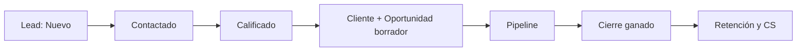
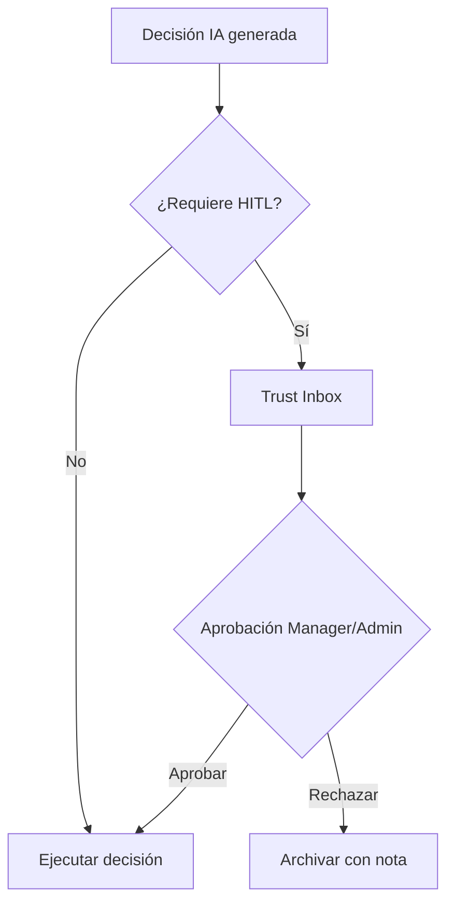
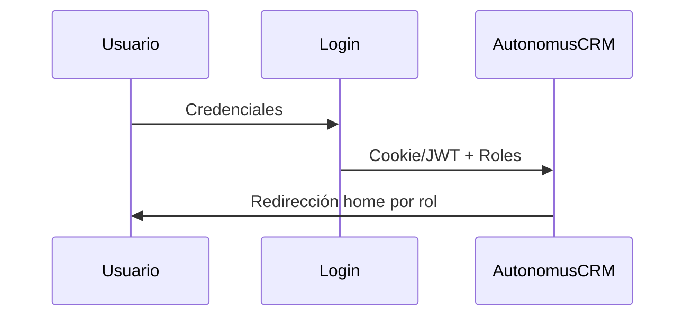

# AutonomusCRM

## Guía de Operaciones — Soporte

**Versión:** 2.0.0  
**Fecha de publicación:** 5 de junio de 2026  
**Autor:** AutonomusCRM Enterprise Documentation Team  
**Rol objetivo:** Support  
**Clasificación:** Confidencial — Uso interno y clientes autorizados

---

*Documentación corporativa — Estándar Salesforce / Microsoft Dynamics 365*

---

## Control de versiones

| Versión | Fecha | Autor | Descripción |
|---------|-------|-------|-------------|
| 1.0.0 | 2026-06-05 | Enterprise Documentation Team | Publicación inicial basada en código |
| 2.0.0 | 5 de junio de 2026 | Enterprise Documentation Team | Transformación corporativa: estructura, diagramas, callouts, glosario |

---

## Tabla de contenido

*Índice generado automáticamente — ver encabezados numerados del documento.*

1. Introducción
2. Cuerpo del documento (capítulos originales transformados)
3. Diagramas de referencia
4. Glosario corporativo
5. Apéndices

---

## 1. Introducción

### 1.1 Objetivo del documento

Casos, escalamiento, SLAs y Customer 360

### 1.2 Audiencia

Equipo de soporte

### 1.3 Alcance

Este documento cubre **únicamente funcionalidades verificadas** en el código fuente de AutonomusCRM. No describe módulos inexistentes ni roles no implementados.

### 1.4 Prerrequisitos

| Requisito | Detalle |
|-----------|---------|
| Acceso | Cuenta activa en el tenant AutonomusCRM |
| Navegador | Chrome, Edge o Firefox actualizado |
| Rol | Según matriz en `ROLE_PERMISSION_MATRIX.md` |
| Conocimientos | Ninguno técnico requerido para roles operativos |

### 1.5 Definiciones clave

Consulte el **Glosario corporativo** al final del documento. Términos críticos: Lead, Customer, Deal, Pipeline, Tenant, Revenue OS.

> **NOTA:** La interfaz admite español (ES) e inglés (EN). Las rutas técnicas (`/Leads`, `/Deals`) se conservan por trazabilidad al producto.

[CAPTURA: Pantalla de inicio de sesión — /Account/Login]

---

## 2. Cuerpo del documento

# Guía de Operaciones de Soporte — AutonomusCRM

**Audiencia:** Equipo de soporte al cliente (`Support`)  
**Perfil demo:** `support@autonomuscrm.local` / `Support123!`  
**Home post-login:** `/Customer360`  
**Módulo principal:** `/customer-success` (Customer Success OS)

[CAPTURA: Customer Success OS — /customer-success]

---

## 1. Rol Support en el sistema

**Support** es un rol de sistema con acceso autenticado completo de lectura y capacidades de post-venta. No puede escribir en módulos comerciales (Leads, Customers, Deals) vía UI — el middleware control de escritura comercial del sistema redirige a `/Account/AccessDenied` en intentos de POST o acceso a `/Create` y `/Edit` comerciales.

| Capacidad | Support |
|-----------|:-------:|
| Customer 360 (`/Customer360`) | ✅ |
| Customer Success (`/customer-success`) | ✅ |
| Directorio clientes (`/Customers`) lectura | ✅ |
| Leads / Deals lectura | ✅ |
| Crear/editar Leads, Customers, Deals | ❌ |
| Usuarios / Settings | ❌ |
| Trust Studio | ❌ (típico Admin/Manager) |

> > **NOTA** La ruta `/Support` redirige automáticamente a `/customer-success`.

---

## 2. Customer 360 — vista unificada

### 2.1 Búsqueda global
**Ruta:** `/Customer360`  
**Servicio:** `ICustomer360Service.SearchAsync`

1. Ingresar nombre, email o identificador en el campo de búsqueda (`Q`).
2. Resultados limitados a 25 registros por consulta.
3. Clic en cliente → `/customers/{id}/360` para vista detallada.

### 2.2 Vista 360 individual
**Ruta:** `/customers/{id}/360`  
**Servicio:** `Customer360EnterpriseService`

Paneles disponibles:

- Datos del cliente y historial comercial.
- Deals asociados y estado del pipeline.
- Panel CS (`Customer360CsPanelDto`): tickets abiertos, cerrados y casos activos.
- Señales de churn y health score.

### 2.3 Duplicados de identidad
`IIdentityResolutionService.FindDuplicatesByEmailAsync` detecta clientes con email duplicado. Escalar a Admin/Manager para consolidación — Support no puede fusionar registros vía UI.

---

## 3. Tickets de soporte (Customer Success OS)

### 3.1 Modelo de tickets
Los tickets son **WorkflowTasks** con `TaskType = CS_Ticket` (`CustomerSuccessOsConstants.Ticket`).

| Campo | Valor típico |
|-------|--------------|
| Vencimiento | 3 días desde creación |
| Prioridad | Normal (default), High, Urgent |
| Entidad relacionada | Customer (`RelatedEntityType = Customer`) |
| Estado | Open → Completed |

### 3.2 Crear ticket
**Ruta:** `/customer-success`

1. Seleccionar cliente del listado.
2. Ingresar asunto (obligatorio).
3. Seleccionar prioridad.
4. Enviar → `CreateTicketAsync` crea la tarea.

### 3.3 Cerrar ticket
1. Localizar ticket abierto en el panel de Customer Success.
2. Clic **Cerrar** → `CloseTicketAsync`.
3. La tarea pasa a estado `Completed`.

### 3.4 Prioridades operativas
| Prioridad | SLA interno recomendado | Ejemplos |
|-----------|-------------------------|----------|
| Urgent | 4 horas | Caída de servicio, churn inminente |
| High | 1 día hábil | Error funcional, health crítico |
| Normal | 3 días | Consulta general, capacitación |

> Los SLAs de tickets usan vencimiento de 3 días por defecto en código; las prioridades Urgent/High requieren gestión activa del agente.

---

## 4. Casos de Customer Success

### 4.1 Tipos de caso (`CS_Case_*`)
| Tipo | Código | Etiqueta |
|------|--------|----------|
| Renovación | `CS_Case_Renewal` | Renovación |
| Recuperación | `CS_Case_Recovery` | Recuperación |
| Expansión | `CS_Case_Expansion` | Expansión |
| Cliente en riesgo | `CS_Case_AtRisk` | Cliente en riesgo |

### 4.2 Crear caso
Desde `/customer-success` → `CreateCaseAsync`:

- Seleccionar cliente.
- Tipo de caso (Renewal, Recovery, Expansion, AtRisk).
- Título y prioridad (default: High).
- Vencimiento: 7 días.

### 4.3 Cuándo abrir cada tipo
| Situación | Tipo de caso |
|-----------|--------------|
| Contrato próximo a vencer | `CS_Case_Renewal` |
| Cliente inactivo o insatisfecho | `CS_Case_Recovery` |
| Oportunidad de upsell detectada | `CS_Case_Expansion` |
| Health `Critical` o señal de churn | `CS_Case_AtRisk` |

---

## 5. Escalamiento

### 5.1 Matriz de escalamiento
| Nivel | Condición | Escalar a | Acción |
|-------|-----------|-----------|--------|
| L1 | Consulta estándar, ticket Normal | Agente Support | Resolver en `/customer-success` |
| L2 | Health Warning, ticket High | Lead Support / Manager | Ejecutar playbook Rescue |
| L3 | Health Critical, churn confirmado | Manager + Sales | Caso AtRisk + notificación ejecutiva |
| L4 | Bug de plataforma, integración caída | Admin | Ticket interno + `/FailedEvents` |

### 5.2 Escalamiento a ventas
Cuando un caso `CS_Case_Expansion` identifica oportunidad comercial:

1. Documentar en el caso.
2. Notificar al ejecutivo Sales asignado al cliente.
3. Sales crea deal en `/Deals` (Support no puede).
4. Support monitorea health durante negociación.

### 5.3 Escalamiento técnico
| Síntoma | Ruta de diagnóstico |
|---------|---------------------|
| Sync HubSpot/Salesforce fallido | `/Integrations` → health |
| Eventos no procesados | `/FailedEvents` |
| Error de autenticación | Admin revisa `/Users` y MFA |
| Datos incorrectos en 360 | `/Audit` → filtrar por customerId |

---

## 6. SLAs del sistema

### 6.1 SLAs comerciales (referencia para Support)
Aunque Support no gestiona leads directamente, debe conocer los SLAs que afectan al cliente:

| SLA | Tarea | Plazo | Motor |
|-----|-------|-------|-------|
| Contacto lead | `SLA_LeadContact24h` | 24h | `CommercialSlaEngine` |
| Post-calificación | `SLA_QualifiedFollowUp` | Automático | `RevenueAutomationEngine` |
| Deal en riesgo | `SLA_DealAtRisk` | Automático | `CommercialSlaEngine` |

### 6.2 SLAs de Customer Success
| Elemento | Plazo en código | Gestión |
|----------|-----------------|---------|
| Ticket CS | 3 días | Agente Support |
| Caso CS | 7 días | Agente Support + playbook |
| Playbook Rescue — llamada | 1 día | Urgent |
| Renovación 90/60/30 días | Automático | `RenewalEngine` |

### 6.3 Tareas de renovación automáticas
`CustomerSuccessConstants` define tareas:

- `Renewal_90d` — alerta 90 días antes
- `Renewal_60d` — alerta 60 días
- `Renewal_30d` — alerta 30 días

Revisar en `/customer-success` panel de renovaciones próximas.

---

## 7. Paneles operativos de `/customer-success`

`CustomerSuccessHomeDto` consolida:

| Panel | Fuente | Uso Support |
|-------|--------|-------------|
| KPIs CS | `ICustomerKpiService` | Salud general del portafolio |
| Señales de churn | `IChurnRiskEngine` | Priorizar intervenciones |
| Renovaciones próximas | `IRenewalEngine` | Planificar contacto |
| Tickets abiertos/cerrados | WorkflowTasks CS_Ticket | Cola de trabajo diaria |
| Oportunidades expansión | `IExpansionRevenueEngine` | Coordinar con Sales |
| Casos abiertos | WorkflowTasks CS_Case_* | Seguimiento estructurado |
| Health scores | `ICustomerHealthEngine` | Healthy / Warning / Critical |

---

## 8. Rutina diaria Support

| Hora | Acción | Ruta |
|------|--------|------|
| Inicio | Revisar tickets abiertos y vencidos | `/customer-success` |
| 09:00 | Atender señales churn Critical | `/customer-success` |
| 10:00 | Revisar renovaciones 30/60/90 días | `/customer-success` |
| 11:00 | Customer 360 — clientes escalados | `/Customer360` |
| 14:00 | Cerrar tickets resueltos | `/customer-success` |
| 17:00 | Actualizar casos abiertos | `/customer-success` |

---

## 9. Comunicación multicanal

El módulo CS incluye motores de comunicación (no ejecutables directamente por Support desde UI principal, pero generan tareas):

| Canal | Constante | Motor |
|-------|-----------|-------|
| Email | `ChannelEmail` | `IEmailAutomationEngine` (SendGrid) |
| WhatsApp | `ChannelWhatsApp` | `IWhatsAppAutomationEngine` |

Las plantillas se disparan por eventos de retención (`RetentionAutomationEngine`). Support verifica resultado en tareas creadas.

---

## 10. Errores comunes

| Error | Causa | Solución |
|-------|-------|----------|
| > **ADVERTENCIA** Access Denied al crear lead | Rol Support, middleware comercial | Escalar a Sales |
| Ticket no se cierra | ID incorrecto o no es CS_Ticket | Verificar en `/customer-success` |
| Cliente no aparece en búsqueda 360 | Fuera de top 25 o sin datos | Refinar búsqueda en `/Customer360` |
| Health no actualizado | Cálculo batch pendiente | Ejecutar playbook o esperar worker |
| `/Support` página vacía | Redirect automático | Usar `/customer-success` directamente |

---

## 11. Coordinación con otros roles

| Rol | Interacción con Support |
|-----|-------------------------|
| Sales | Handoff post-cierre, casos Expansion |
| Manager | Escalamiento L2/L3, aprobaciones Trust |
| Admin | Integraciones, usuarios, eventos fallidos |
| Viewer | Solo lectura — Support es operativo |

---

*Documento basado en: `Support.cshtml.cs`, `CustomerSuccess.cshtml.cs`, `Customer360.cshtml.cs`, `CustomerSuccessOsService.cs`, `CommercialWriteAuthorizationMiddleware.cs`, `RoleHomeRedirect.cs`.*

---

## 3. Diagramas de referencia

### Diagramas de referencia

#### Ciclo de vida del Lead

#### Flujo de aprobación Trust Studio

#### Flujo de autenticación

---

## 4. Glosario corporativo

## Glosario corporativo

| Término | Definición |
|---------|------------|
| **CRM** | Customer Relationship Management — sistema para registrar y medir relaciones comerciales |
| **Lead** | Prospecto o contacto potencial; entidad inicial del embudo |
| **Customer** | Cuenta o cliente en el directorio del tenant |
| **Opportunity / Deal** | Oportunidad de venta con monto, etapa y probabilidad |
| **Pipeline** | Conjunto de oportunidades abiertas y sus etapas en `/Deals` |
| **Forecast** | Proyección ponderada: monto × probabilidad por ventana de cierre |
| **Workflow** | Automatización configurable: trigger + condiciones + acciones |
| **Tenant** | Organización aislada; todos los datos pertenecen a un TenantId |
| **Trust Studio** | Buzón HITL en `/TrustInbox` para aprobar decisiones de IA |
| **Revenue OS** | Módulo de ingresos en `/revenue` — priorización y fugas |
| **Executive OS** | Tablero ejecutivo en `/executive` |
| **MFA** | Autenticación multifactor configurable en Settings |
| **ABAC** | Attribute-Based Access Control — políticas en `/Policies` (no sustituye RBAC) |
| **Customer Success** | Módulo post-venta en `/customer-success` (no es un rol) |
| **Churn** | Abandono del cliente; predicción ML en Customer 360 |
| **LTV** | Lifetime Value — valor acumulado del cliente |
| **Upsell** | Venta adicional al mismo cliente (expansión) |
| **Cross-Sell** | Venta de productos complementarios |
| **Playbook** | Secuencia automatizada: onboarding, rescue, re-engagement |
| **AI Agent** | Agente autónomo en `/Agents` (LeadIntelligence, Communication, etc.) |
| **Semantic Memory** | Memoria empresarial en `/Memory` |
| **Outcome Fabric** | Atribución de resultados en `/command/outcomes` |
| **HITL** | Human-in-the-Loop — supervisión humana de decisiones IA |
| **SLA** | Acuerdo de nivel de servicio (ej. contacto lead en 24 h) |
| **DLQ** | Dead Letter Queue — eventos fallidos en `/FailedEvents` |

---

## 5. Apéndices

### 5.1 Referencias cruzadas

| Documento | Ubicación |
|-----------|-----------|
| Matriz de permisos | `Documentation/ROLE_PERMISSION_MATRIX.md` |
| Descubrimiento de roles | `Documentation/ROLE_DISCOVERY_REPORT.md` |
| Manual maestro | `docs/manual-empresarial-autonomuscrm/` |

### 5.2 Pie de documento

| Campo | Valor |
|-------|-------|
| Producto | AutonomusCRM |
| Versión documento | 2.0.0 |
| Clasificación | Confidencial — Uso interno y clientes autorizados |
| Fuente | Código verificado — sin funcionalidades inventadas |

---

*© AutonomusCRM — Documentación Enterprise. Listo para impresión PDF y capacitación corporativa.*

