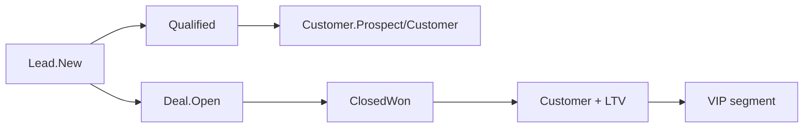
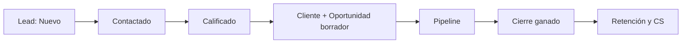
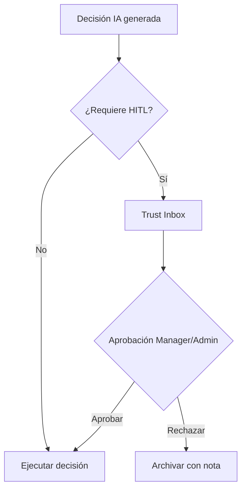
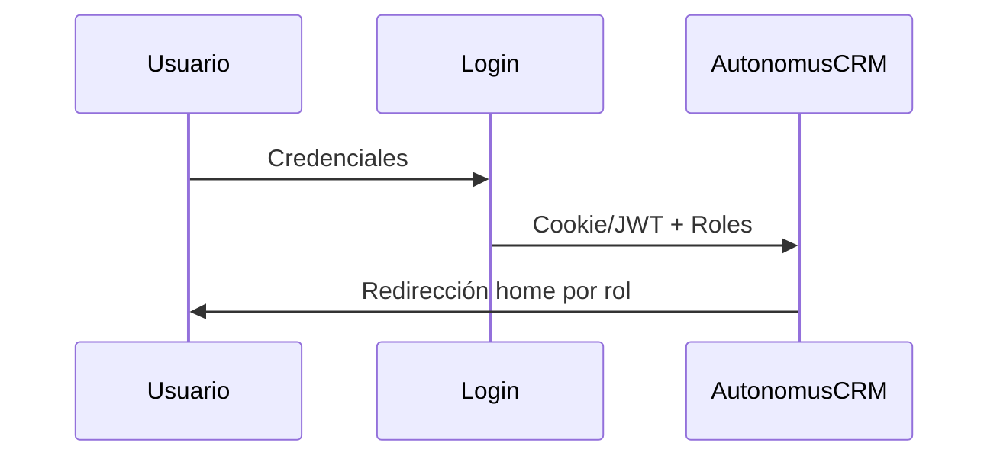

# AutonomusCRM

## Flujos de Negocio

**Versión:** 2.0.0  
**Fecha de publicación:** 5 de junio de 2026  
**Autor:** AutonomusCRM Enterprise Documentation Team  
**Rol objetivo:** Transversal  
**Clasificación:** Confidencial — Uso interno y clientes autorizados

---

*Documentación corporativa — Estándar Salesforce / Microsoft Dynamics 365*

---

## Control de versiones

| Versión | Fecha | Autor | Descripción |
|---------|-------|-------|-------------|
| 1.0.0 | 2026-06-05 | Enterprise Documentation Team | Publicación inicial basada en código |
| 2.0.0 | 5 de junio de 2026 | Enterprise Documentation Team | Transformación corporativa: estructura, diagramas, callouts, glosario |

---

## Tabla de contenido

*Índice generado automáticamente — ver encabezados numerados del documento.*

1. Introducción
2. Cuerpo del documento (capítulos originales transformados)
3. Diagramas de referencia
4. Glosario corporativo
5. Apéndices

---

## 1. Introducción

### 1.1 Objetivo del documento

Journey Lead → Customer → Deal

### 1.2 Audiencia

Todos los roles operativos

### 1.3 Alcance

Este documento cubre **únicamente funcionalidades verificadas** en el código fuente de AutonomusCRM. No describe módulos inexistentes ni roles no implementados.

### 1.4 Prerrequisitos

| Requisito | Detalle |
|-----------|---------|
| Acceso | Cuenta activa en el tenant AutonomusCRM |
| Navegador | Chrome, Edge o Firefox actualizado |
| Rol | Según matriz en `ROLE_PERMISSION_MATRIX.md` |
| Conocimientos | Ninguno técnico requerido para roles operativos |

### 1.5 Definiciones clave

Consulte el **Glosario corporativo** al final del documento. Términos críticos: Lead, Customer, Deal, Pipeline, Tenant, Revenue OS.

> **NOTA:** La interfaz admite español (ES) e inglés (EN). Las rutas técnicas (`/Leads`, `/Deals`) se conservan por trazabilidad al producto.

[CAPTURA: Pantalla de inicio de sesión — /Account/Login]

---

## 2. Cuerpo del documento

# 02 — Flujos de Negocio (código real)

## Journey implementado: Desconocido → Lead → Cliente → Deal → Cliente recurrente

> **NOTA** No existe entidad "Prospecto" separada. El prospecto es un **Lead** con `LeadStatus.New`. La **oportunidad** es un **Deal**. El **cliente** es **Customer**.

---

## 1. Creación de Lead

**Trigger:** UI `/Leads/Create`, API **Registrar un nuevo prospecto** (API), import CSV/JSON  
**Handler:** `CreateLeadCommandHandler`  
**Estado inicial:** `LeadStatus.New`  
**Evento:** `LeadCreatedEvent`

**Automatizaciones disparadas:**
- WorkflowEngine (si workflow activo con trigger `Lead.Created`)
- RevenueAutomation → SLA 24h (`CommercialSlaEngine`)
- Worker: `LeadIntelligenceAgent` → score → `LeadScoreUpdatedEvent`
- Worker: `CommunicationAgent` → email seguimiento (si configurado)

---

## 2. Calificación de Lead

**UI:** `/Leads/Details` → Qualify  
**Command:** acción **Calificar** en la ficha del lead → `lead.Qualify()`  
**Estado:** `LeadStatus.Qualified`

**OperationalAutomationService (automático):**
1. Crea Customer si no existe (por email)
2. Crea Deal borrador (`Amount=1`, metadata `IsDraft=true`)
3. Crea WorkflowTask de seguimiento alta prioridad

> **IMPORTANTE** El lead **no** pasa a `Converted` en este path.

---

## 3. Conversión manual Lead → Customer

**Solo UI:** `Leads/Details` → Convert to Customer (no hay command dedicado)

1. `CreateCustomerCommand` → Customer `Prospect`
2. `lead.ConvertToCustomer(customerId)` → Lead `Converted`
3. `CustomerCreatedEvent` → RetentionAutomation → Customer `Customer`

---

## 4. Crear Deal desde Lead

**UI:** `Leads/Details` → Create Deal

1. Busca Customer por email o crea uno
2. `CreateDealCommand` → Deal `Open` / `Prospecting`
3. Lead status **sin cambio**

---

## 5. Pipeline Deal

[CAPTURA: Pipeline Kanban — /Deals]

| Etapa | Probabilidad default |
|-------|---------------------|
| Prospecting | 10% |
| Qualification | 25% |
| Proposal | 50% |
| Negotiation | 75% |
| ClosedWon | 100% |
| ClosedLost | 0% |

**Cierre ganado:** `CloseDealCommand` → `DealClosedEvent`  
**Cierre perdido:** `LoseDealCommand` → `DealLostEvent`

**Post CloseWon:**
- Retention: Customer status, LTV, purchase metadata
- Operational: tareas onboarding D0, D7, D30
- OutcomeAttribution + ABOS learning

---

## 6. Customer lifecycle

| Estado | Cómo se alcanza |
|--------|-----------------|
| Prospect | `Customer.Create` |
| Customer | `CustomerCreatedEvent` o `DealClosedEvent` (retention) |
| VIP | `CustomerSegmentationEngine` |
| Inactive | `IdentityMergeService` (duplicados) |
| Churned | Enum existe; usado en analytics, sin transición automática única documentada |

---

## 7. Tareas (WorkflowTask)

**Estados:** `"Open"` → `"Completed"` (string, no enum)

**Origen:**
- WorkflowEngine action `CreateTask`
- OperationalAutomation / Revenue / Retention engines
- UI `/Tasks` para completar y asignar

---

## 8. Workflows configurables

Modelo: Triggers (DomainEvent) + Conditions + Actions (Assign, UpdateStatus, CreateTask, Communicate*, ActivateAgent*)

\*Communicate y ActivateAgent **solo registran log** en código actual — no envían mensajes ni activan agentes LLM.

---

## 9. Tres caminos paralelos (inconsistencia operativa)

| Path | Lead final | Customer | Deal |
|------|------------|----------|------|
| Qualify | Qualified | Auto-creado | Borrador auto |
| Convert | Converted | Creado | — |
| Create Deal | Sin cambio | Match/create | Creado |

**Buena práctica Sales:** Elegir **un** proceso estándar por equipo y documentarlo internamente.

---

## 3. Diagramas de referencia

### Diagramas de referencia

#### Ciclo de vida del Lead

#### Flujo de aprobación Trust Studio

#### Flujo de autenticación

---

## 4. Glosario corporativo

## Glosario corporativo

| Término | Definición |
|---------|------------|
| **CRM** | Customer Relationship Management — sistema para registrar y medir relaciones comerciales |
| **Lead** | Prospecto o contacto potencial; entidad inicial del embudo |
| **Customer** | Cuenta o cliente en el directorio del tenant |
| **Opportunity / Deal** | Oportunidad de venta con monto, etapa y probabilidad |
| **Pipeline** | Conjunto de oportunidades abiertas y sus etapas en `/Deals` |
| **Forecast** | Proyección ponderada: monto × probabilidad por ventana de cierre |
| **Workflow** | Automatización configurable: trigger + condiciones + acciones |
| **Tenant** | Organización aislada; todos los datos pertenecen a un TenantId |
| **Trust Studio** | Buzón HITL en `/TrustInbox` para aprobar decisiones de IA |
| **Revenue OS** | Módulo de ingresos en `/revenue` — priorización y fugas |
| **Executive OS** | Tablero ejecutivo en `/executive` |
| **MFA** | Autenticación multifactor configurable en Settings |
| **ABAC** | Attribute-Based Access Control — políticas en `/Policies` (no sustituye RBAC) |
| **Customer Success** | Módulo post-venta en `/customer-success` (no es un rol) |
| **Churn** | Abandono del cliente; predicción ML en Customer 360 |
| **LTV** | Lifetime Value — valor acumulado del cliente |
| **Upsell** | Venta adicional al mismo cliente (expansión) |
| **Cross-Sell** | Venta de productos complementarios |
| **Playbook** | Secuencia automatizada: onboarding, rescue, re-engagement |
| **AI Agent** | Agente autónomo en `/Agents` (LeadIntelligence, Communication, etc.) |
| **Semantic Memory** | Memoria empresarial en `/Memory` |
| **Outcome Fabric** | Atribución de resultados en `/command/outcomes` |
| **HITL** | Human-in-the-Loop — supervisión humana de decisiones IA |
| **SLA** | Acuerdo de nivel de servicio (ej. contacto lead en 24 h) |
| **DLQ** | Dead Letter Queue — eventos fallidos en `/FailedEvents` |

---

## 5. Apéndices

### 5.1 Referencias cruzadas

| Documento | Ubicación |
|-----------|-----------|
| Matriz de permisos | `Documentation/ROLE_PERMISSION_MATRIX.md` |
| Descubrimiento de roles | `Documentation/ROLE_DISCOVERY_REPORT.md` |
| Manual maestro | `docs/manual-empresarial-autonomuscrm/` |

### 5.2 Pie de documento

| Campo | Valor |
|-------|-------|
| Producto | AutonomusCRM |
| Versión documento | 2.0.0 |
| Clasificación | Confidencial — Uso interno y clientes autorizados |
| Fuente | Código verificado — sin funcionalidades inventadas |

---

*© AutonomusCRM — Documentación Enterprise. Listo para impresión PDF y capacitación corporativa.*

