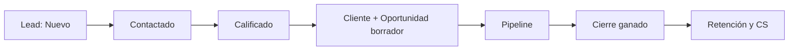
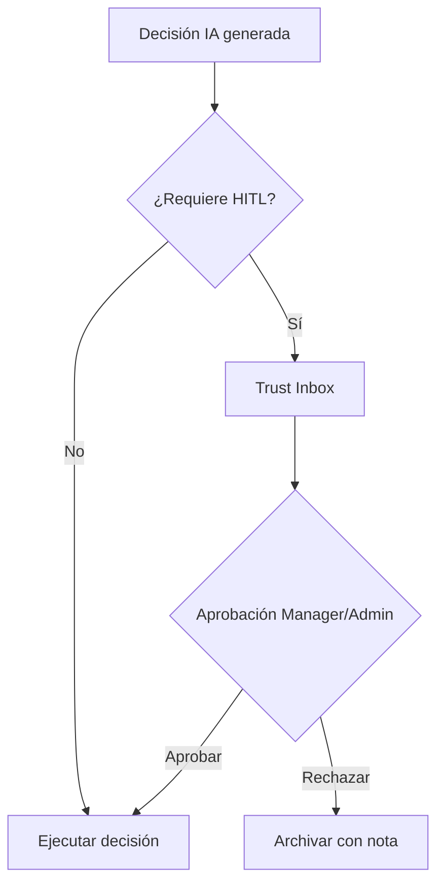
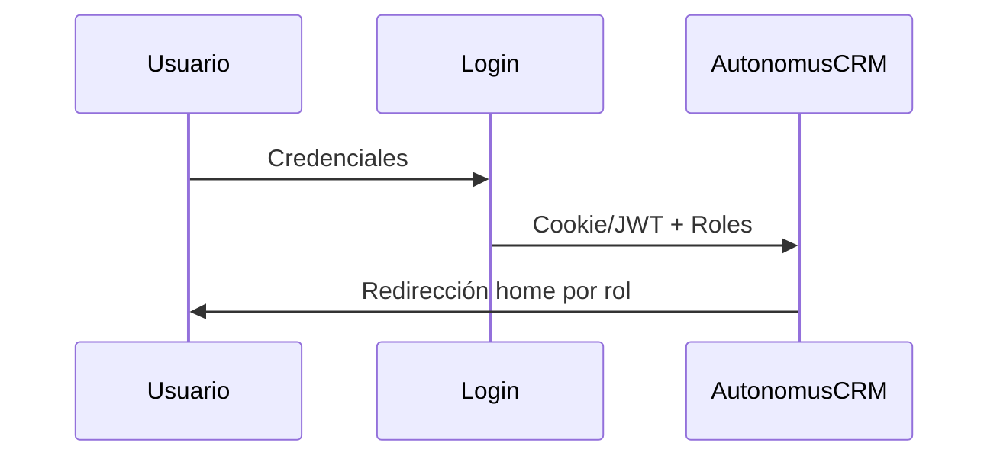

# AutonomusCRM

## FAQ Empresarial Global

**Versión:** 2.0.0  
**Fecha de publicación:** 5 de junio de 2026  
**Autor:** AutonomusCRM Enterprise Documentation Team  
**Rol objetivo:** Transversal  
**Clasificación:** Confidencial — Uso interno y clientes autorizados

---

*Documentación corporativa — Estándar Salesforce / Microsoft Dynamics 365*

---

## Control de versiones

| Versión | Fecha | Autor | Descripción |
|---------|-------|-------|-------------|
| 1.0.0 | 2026-06-05 | Enterprise Documentation Team | Publicación inicial basada en código |
| 2.0.0 | 5 de junio de 2026 | Enterprise Documentation Team | Transformación corporativa: estructura, diagramas, callouts, glosario |

---

## Tabla de contenido

*Índice generado automáticamente — ver encabezados numerados del documento.*

1. Introducción
2. Cuerpo del documento (capítulos originales transformados)
3. Diagramas de referencia
4. Glosario corporativo
5. Apéndices

---

## 1. Introducción

### 1.1 Objetivo del documento

150 preguntas transversales

### 1.2 Audiencia

Todos

### 1.3 Alcance

Este documento cubre **únicamente funcionalidades verificadas** en el código fuente de AutonomusCRM. No describe módulos inexistentes ni roles no implementados.

### 1.4 Prerrequisitos

| Requisito | Detalle |
|-----------|---------|
| Acceso | Cuenta activa en el tenant AutonomusCRM |
| Navegador | Chrome, Edge o Firefox actualizado |
| Rol | Según matriz en `ROLE_PERMISSION_MATRIX.md` |
| Conocimientos | Ninguno técnico requerido para roles operativos |

### 1.5 Definiciones clave

Consulte el **Glosario corporativo** al final del documento. Términos críticos: Lead, Customer, Deal, Pipeline, Tenant, Revenue OS.

> **NOTA:** La interfaz admite español (ES) e inglés (EN). Las rutas técnicas (`/Leads`, `/Deals`) se conservan por trazabilidad al producto.

[CAPTURA: Pantalla de inicio de sesión — /Account/Login]

---

## 2. Cuerpo del documento

# 08 — Preguntas Frecuentes (FAQ) AutonomusCRM

**Audiencia:** Ejecutivo de ventas sin experiencia previa en CRM  
**Fuente:** funcionalidades reales documentadas en el código y manuales enterprise de AutonomusCRM  
**Total:** 150 preguntas numeradas de forma continua (1–150)

---

## Categoría 1: Conceptos CRM

### 1. ¿Qué es AutonomusCRM?

### 2. ¿Qué significa CRM en la práctica diaria?

### 3. ¿Existe una entidad separada llamada "Prospecto"?

### 4. ¿Cuál es la diferencia entre Lead, Customer y Deal?

### 5. ¿Qué es un tenant en AutonomusCRM?

### 6. ¿Qué es el pipeline comercial?

### 7. ¿Qué son los estados de un Lead frente a los de un Customer?

### 8. ¿Qué es Revenue OS?

### 9. ¿Qué es Command en la interfaz?

### 10. ¿Qué es Trust Studio?

### 11. ¿AutonomusCRM reemplaza el correo electrónico o las llamadas?

### 12. ¿Necesito conocimientos técnicos para usar el CRM como vendedor?

---

## Categoría 2: Leads

### 13. ¿Dónde gestiono mis prospectos?

### 14. ¿Cuáles son los estados posibles de un Lead?

### 15. ¿Con qué estado nace un Lead al crearlo?

### 16. ¿Qué fuentes de origen puede tener un Lead?

### 17. ¿Qué es el score de un Lead?

### 18. ¿Cómo califico un Lead desde la interfaz?

### 19. ¿Qué ocurre automáticamente al calificar un Lead?

### 20. ¿Calificar un Lead lo convierte automáticamente en Converted?

### 21. ¿Cómo convierto un Lead en cliente?

### 22. ¿Puedo crear un Deal desde un Lead sin convertirlo?

### 23. ¿Cuál es la diferencia entre Qualify, Convert y Create Deal?

### 24. ¿Puedo asignar un Lead a un vendedor?

### 25. ¿Qué pasa si marco un Lead como Lost o Unqualified?

### 26. ¿Existen operaciones masivas sobre Leads?

---

## Categoría 3: Clientes

### 27. ¿Dónde veo el directorio de clientes?

### 28. ¿Cuáles son los estados de un Customer?

### 29. ¿Con qué estado se crea un Customer manualmente?

### 30. ¿Cuándo pasa un Customer a estado Customer?

### 31. ¿Qué es el estado VIP?

### 32. ¿Qué significa Churned e Inactive?

### 33. ¿Qué es Customer 360?

### 34. ¿Qué es LTV en AutonomusCRM?

### 35. ¿Puedo editar email y teléfono de un cliente?

### 36. ¿Se crea Customer automáticamente al calificar un Lead?

### 37. ¿Qué metadatos guarda el Customer en onboarding?

### 38. ¿Puedo eliminar un Customer?

---

## Categoría 4: Deals

### 39. ¿Dónde gestiono mis oportunidades de venta?

### 40. ¿Cuáles son las etapas (stages) de un Deal?

### 41. ¿Cuáles son los estados (status) de un Deal?

### 42. ¿Con qué etapa y estado nace un Deal nuevo?

### 43. ¿Cuál es la probabilidad automática por etapa?

### 44. ¿Un Deal puede existir sin Customer?

### 45. ¿Qué es un deal borrador (draft)?

### 46. ¿Cómo cierro un deal ganado?

### 47. ¿Cómo registro un deal perdido?

### 48. ¿Qué es el forecast 30/60/90 en Deals?

### 49. ¿Puedo importar deals masivamente?

### 50. ¿Puedo cambiar etapa en lote?

### 51. ¿Qué ocurre tras ClosedWon para el cliente?

### 52. ¿Puedo asignar un Deal a un vendedor?

---

## Categoría 5: Tareas

### 53. ¿Dónde veo mis tareas pendientes?

### 54. ¿Qué estados tiene una tarea?

### 55. ¿Quién crea las tareas automáticamente?

### 56. ¿Qué tarea se crea al calificar un Lead?

### 57. ¿Qué tareas se crean al ganar un deal?

### 58. ¿Puedo completar una tarea desde la UI?

### 59. ¿Puedo asignar una tarea a otro usuario?

### 60. ¿Qué pasa si ignoro las tareas?

### 61. ¿Las tareas están vinculadas a entidades?

### 62. ¿Puedo crear tareas manualmente?

---

## Categoría 6: IA

### 63. ¿AutonomusCRM usa inteligencia artificial?

### 64. ¿Qué muestra Command Center en `/`?

### 65. ¿Qué es Trust Inbox?

### 66. ¿Qué es predicción de churn?

### 67. ¿Qué es inteligencia de expansión?

### 68. ¿Los workers en background usan LLM?

### 69. ¿Dónde sí puede usarse LLM?

### 70. ¿Qué son los playbooks autónomos?

### 71. ¿Qué es Workforce en `/Agents`?

### 72. ¿Debo aprobar decisiones de IA manualmente?

### 73. ¿La IA crea deals o leads sola?

### 74. ¿Qué es Memory (`/Memory`)?

### 75. ¿Puedo desactivar la IA?

### 76. ¿Qué es Outcome Fabric?

---

## Categoría 7: Roles

### 77. ¿Qué roles existen en AutonomusCRM?

### 78. ¿Cuál es el usuario demo de ventas?

### 79. ¿Qué puede hacer un usuario Sales?

### 80. ¿Qué puede hacer un Manager?

### 81. ¿Qué puede hacer un Admin?

### 82. ¿Qué puede hacer Support?

### 83. ¿Qué puede hacer Viewer?

### 84. ¿Support o Viewer pueden escribir vía API comercial?

### 85. ¿Quién puede gestionar roles de usuario?

### 86. ¿Existen políticas RequireSales o RequireManager en endpoints?

### 87. ¿Puedo tener varios roles a la vez?

### 88. ¿Qué contraseña usan los demás usuarios demo?

---

## Categoría 8: Navegación

### 89. ¿A dónde me lleva el sistema tras iniciar sesión como Sales?

### 90. ¿Cuántos ítems tiene el menú lateral?

### 91. ¿Cómo busco una pantalla rápidamente?

### 92. ¿Dónde está el pipeline visual?

### 93. ¿Dónde configuro automatizaciones?

### 94. ¿Dónde veo auditoría de cambios?

### 95. ¿Dónde gestiono integraciones?

### 96. ¿Existe página de facturación?

### 97. ¿Qué rutas son públicas sin login?

### 98. ¿Dónde registro llamadas de voz?

### 99. ¿Confundí `/` con `/revenue`; cuál uso cada mañana?

### 100. ¿Dónde veo eventos fallidos del sistema?

---

## Categoría 9: Automatización

### 101. ¿Qué dispara un workflow configurable?

### 102. ¿Qué acciones puede ejecutar un workflow?

### 103. ¿La acción Communicate envía emails?

### 104. ¿Qué hace la retención al crearse un Customer?

### 105. ¿Con qué frecuencia escanea el worker en background?

### 106. ¿Qué ejecuta el scan periódico de 15 minutos?

### 107. ¿Qué agentes escuchan eventos en tiempo real?

### 108. ¿Qué SLA comercial existe para leads nuevos?

### 109. ¿Puedo duplicar un workflow?

### 110. ¿Qué es BusinessMemoryConsolidationWorker?

### 111. ¿La automatización de qualify crea siempre un nuevo deal?

### 112. ¿Qué optimiza AutomationOptimizerAgent?

---

## Categoría 10: Errores

### 113. ¿Por qué recibo "> **ADVERTENCIA** Access Denied" al crear un Lead?

### 114. ¿Por qué Sales no puede entrar a `/Users`?

### 115. ¿Califiqué un Lead pero no veo deal borrador?

### 116. ¿El deal borrador muestra monto $1; es un error?

### 117. ¿Por qué Support ve datos pero no puede guardar cambios?

### 118. ¿Qué hago si una automatización no corrió?

### 119. ¿Por qué no aparece churn en Customer 360?

### 120. ¿Puedo usar la API para evitar el bloqueo UI de Viewer?

---

## Categoría 11: Métricas

### 121. ¿Qué métricas veo en la lista de Leads?

### 122. ¿Qué es Win Rate en Deals?

### 123. ¿Qué es Revenue Closed?

### 124. ¿Qué es Pipeline Open?

[CAPTURA: Pipeline Kanban — /Deals]
### 124. ¿Qué es Pipeline Open?

### 125. ¿Qué métricas tiene el directorio de Customers?

### 126. ¿Qué muestra Revenue OS sobre fugas?

### 127. ¿Qué KPIs hay en Customer Success?

### 128. ¿Cómo filtro métricas de Command por periodo?

### 129. ¿Qué cuentan las tareas vencidas en `/Tasks`?

### 130. ¿Dónde exporto reporte ejecutivo?

---

## Categoría 12: CS (Customer Success)

### 131. ¿Dónde trabaja el equipo de Customer Success?

### 132. ¿Qué playbooks existen en retención?

### 133. ¿Qué hace el scan de retención cada 15 minutos?

### 134. ¿Se envían emails automáticos de onboarding?

### 135. ¿Se usa WhatsApp en automatizaciones?

### 136. ¿Qué es salud de cuenta (health)?

### 137. ¿Qué ocurre si un cliente está en riesgo crítico?

### 138. ¿Qué es renovación automática?

### 139. ¿Expansion genera tareas comerciales?

### 140. ¿Support debe usar Leads o Customer Success?

---

## Categoría 13: Integraciones

### 141. ¿Qué integraciones admite la plataforma?

### 142. ¿Las integraciones requieren rol Admin?

### 143. ¿Los leads importados disparan automatizaciones?

### 144. ¿Existe API REST para integraciones externas?

### 145. ¿Cómo valida la API el tenant en requests?

---

## Categoría 14: Seguridad

### 146. ¿Cómo inicio sesión?

### 147. ¿Qué es MFA en AutonomusCRM?

### 148. ¿Dónde reviso quién cambió qué?

### 149. ¿Qué es el middleware de límites de plan?

### 150. ¿Qué práctica de seguridad debo conocer como Sales?

---

*Fin del FAQ — 150 ítems. Carpeta: `docs/manual-empresarial-autonomuscrm/`. Para flujos ver `02_BUSINESS_FLOWS.md`; para permisos ver `03_ROLE_MATRIX.md`.*

---

## 3. Diagramas de referencia

### Diagramas de referencia

#### Ciclo de vida del Lead

#### Flujo de aprobación Trust Studio

#### Flujo de autenticación

---

## 4. Glosario corporativo

## Glosario corporativo

| Término | Definición |
|---------|------------|
| **CRM** | Customer Relationship Management — sistema para registrar y medir relaciones comerciales |
| **Lead** | Prospecto o contacto potencial; entidad inicial del embudo |
| **Customer** | Cuenta o cliente en el directorio del tenant |
| **Opportunity / Deal** | Oportunidad de venta con monto, etapa y probabilidad |
| **Pipeline** | Conjunto de oportunidades abiertas y sus etapas en `/Deals` |
| **Forecast** | Proyección ponderada: monto × probabilidad por ventana de cierre |
| **Workflow** | Automatización configurable: trigger + condiciones + acciones |
| **Tenant** | Organización aislada; todos los datos pertenecen a un TenantId |
| **Trust Studio** | Buzón HITL en `/TrustInbox` para aprobar decisiones de IA |
| **Revenue OS** | Módulo de ingresos en `/revenue` — priorización y fugas |
| **Executive OS** | Tablero ejecutivo en `/executive` |
| **MFA** | Autenticación multifactor configurable en Settings |
| **ABAC** | Attribute-Based Access Control — políticas en `/Policies` (no sustituye RBAC) |
| **Customer Success** | Módulo post-venta en `/customer-success` (no es un rol) |
| **Churn** | Abandono del cliente; predicción ML en Customer 360 |
| **LTV** | Lifetime Value — valor acumulado del cliente |
| **Upsell** | Venta adicional al mismo cliente (expansión) |
| **Cross-Sell** | Venta de productos complementarios |
| **Playbook** | Secuencia automatizada: onboarding, rescue, re-engagement |
| **AI Agent** | Agente autónomo en `/Agents` (LeadIntelligence, Communication, etc.) |
| **Semantic Memory** | Memoria empresarial en `/Memory` |
| **Outcome Fabric** | Atribución de resultados en `/command/outcomes` |
| **HITL** | Human-in-the-Loop — supervisión humana de decisiones IA |
| **SLA** | Acuerdo de nivel de servicio (ej. contacto lead en 24 h) |
| **DLQ** | Dead Letter Queue — eventos fallidos en `/FailedEvents` |

---

## 5. Apéndices

### 5.1 Referencias cruzadas

| Documento | Ubicación |
|-----------|-----------|
| Matriz de permisos | `Documentation/ROLE_PERMISSION_MATRIX.md` |
| Descubrimiento de roles | `Documentation/ROLE_DISCOVERY_REPORT.md` |
| Manual maestro | `docs/manual-empresarial-autonomuscrm/` |

### 5.2 Pie de documento

| Campo | Valor |
|-------|-------|
| Producto | AutonomusCRM |
| Versión documento | 2.0.0 |
| Clasificación | Confidencial — Uso interno y clientes autorizados |
| Fuente | Código verificado — sin funcionalidades inventadas |

---

*© AutonomusCRM — Documentación Enterprise. Listo para impresión PDF y capacitación corporativa.*

