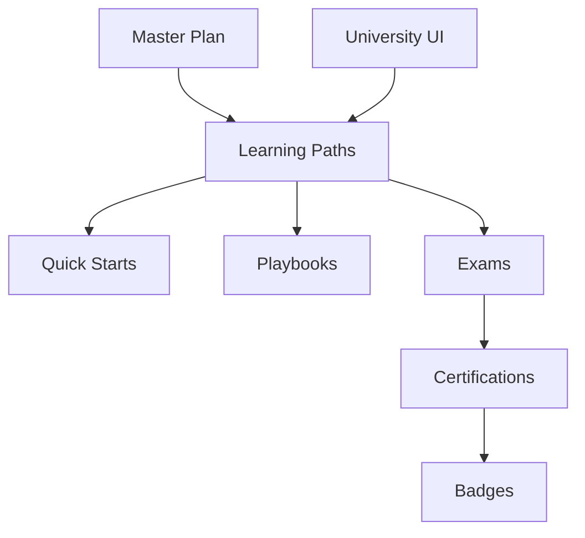

# AUTONOMUSCRM UNIVERSITY — Master Plan

> Trailhead interno · Productivo en 7 días · Certificado en 30 · Experto en 90

## Visión
Plataforma de aprendizaje **micro-lecciones** integrada en `http://164.68.99.83:8091/University` — no manuales largos.

## Principios (Salesforce Trailhead + HubSpot Academy)
| Principio | Implementación |
|-----------|----------------|
| Bite-sized | Unidades 10-30 min |
| Hands-on | Práctica en entorno QA |
| Gamificación | Puntos, badges, ranking |
| Certificación | 5 credenciales oficiales |
| En app | Módulo University en Flow UI |

## Arquitectura de contenido

## Objetivos de adopción
| Hito | Meta |
|------|------|
| Día 7 | Operativo en módulos de su rol |
| Día 30 | Certificación oficial |
| Día 90 | Experto + mentor interno |
| Día 30 adopción org | 90% usuarios activos University |
| Día 60 | 95% |
| Día 90 | 100% |

## Entregables
Ver índice en `README.md` — 12 documentos + catálogo JSON + UI `/University`.

## Punto de entrada Client First
**[QUICK_START_GUIDES.md](QUICK_START_GUIDES.md)** — 13 mini-cursos · 12 secciones por módulo · 20 errores + 20 buenas prácticas · ejercicios QA.

## Deprecación
Manuales largos en `Documentation/Academy/_archive/` — **no usar para capacitación**.
Quick Starts resumidos (pre-Client First) — **reemplazados** por la edición actual.