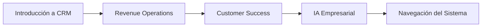
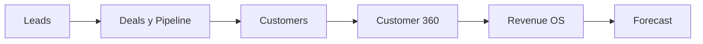
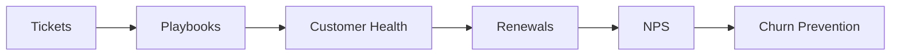
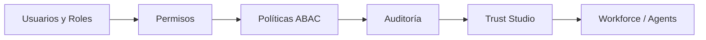
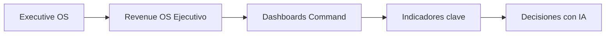

# LEARNING PATHS

> Rutas modulares — completa unidades para ganar puntos y badges.

## Fundamentos

Badge: **crm-explorer**

| Unidad | Duración | Puntos |
|--------|----------|--------|
| Introducción a CRM | 10 min | 100 |
| Revenue Operations | 15 min | 100 |
| Customer Success | 15 min | 100 |
| IA Empresarial | 15 min | 100 |
| Navegación del Sistema | 20 min | 150 |

---

## Ruta Comercial

Badge: **sales-expert**

| Unidad | Duración | Puntos |
|--------|----------|--------|
| Leads | 25 min | 200 |
| Deals y Pipeline | 30 min | 200 |
| Customers | 20 min | 150 |
| Customer 360 | 25 min | 200 |
| Revenue OS | 20 min | 200 |
| Forecast | 20 min | 200 |

---

## Ruta Customer Success

Badge: **cs-hero**

| Unidad | Duración | Puntos |
|--------|----------|--------|
| Tickets | 20 min | 200 |
| Playbooks | 25 min | 200 |
| Customer Health | 20 min | 150 |
| Renewals | 25 min | 200 |
| NPS | 15 min | 100 |
| Churn Prevention | 25 min | 200 |

---

## Ruta Administrativa

Badge: **trust-specialist**

| Unidad | Duración | Puntos |
|--------|----------|--------|
| Usuarios y Roles | 25 min | 200 |
| Permisos | 20 min | 150 |
| Políticas ABAC | 20 min | 200 |
| Auditoría | 15 min | 150 |
| Trust Studio | 25 min | 250 |
| Workforce / Agents | 20 min | 200 |

---

## Ruta Ejecutiva

Badge: **executive-analyst**

| Unidad | Duración | Puntos |
|--------|----------|--------|
| Executive OS | 20 min | 200 |
| Revenue OS Ejecutivo | 20 min | 200 |
| Dashboards Command | 15 min | 150 |
| Indicadores clave | 20 min | 200 |
| Decisiones con IA | 25 min | 250 |

---

