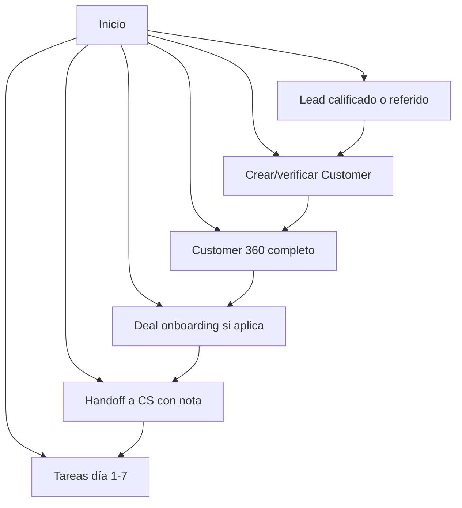
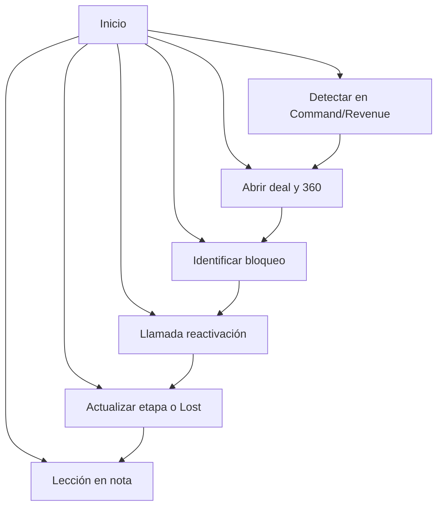
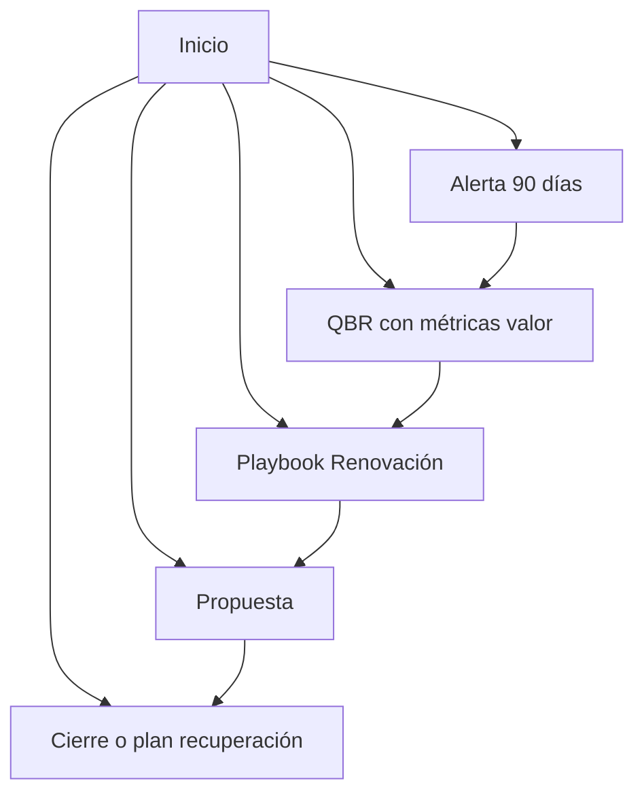
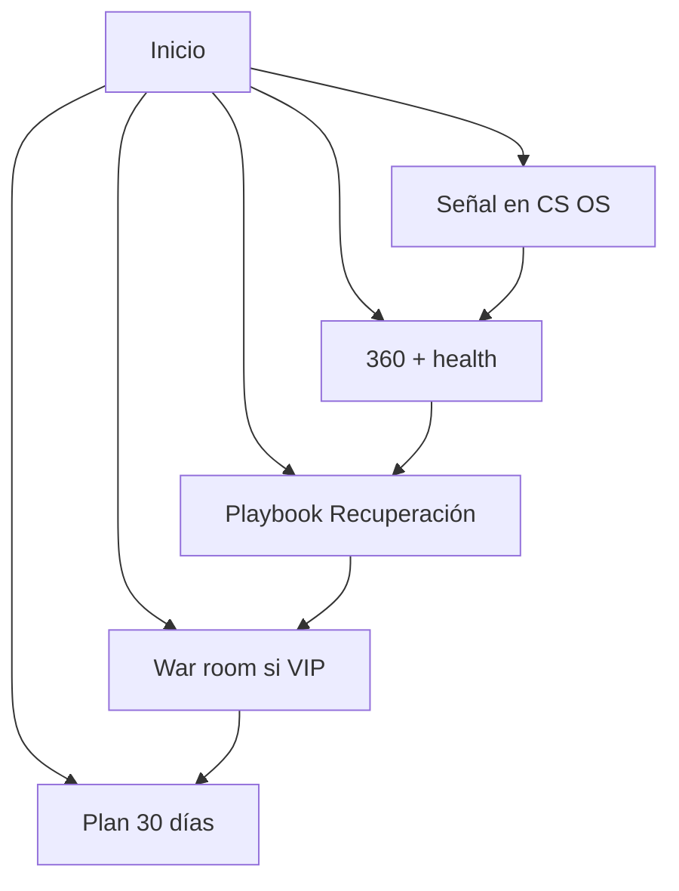
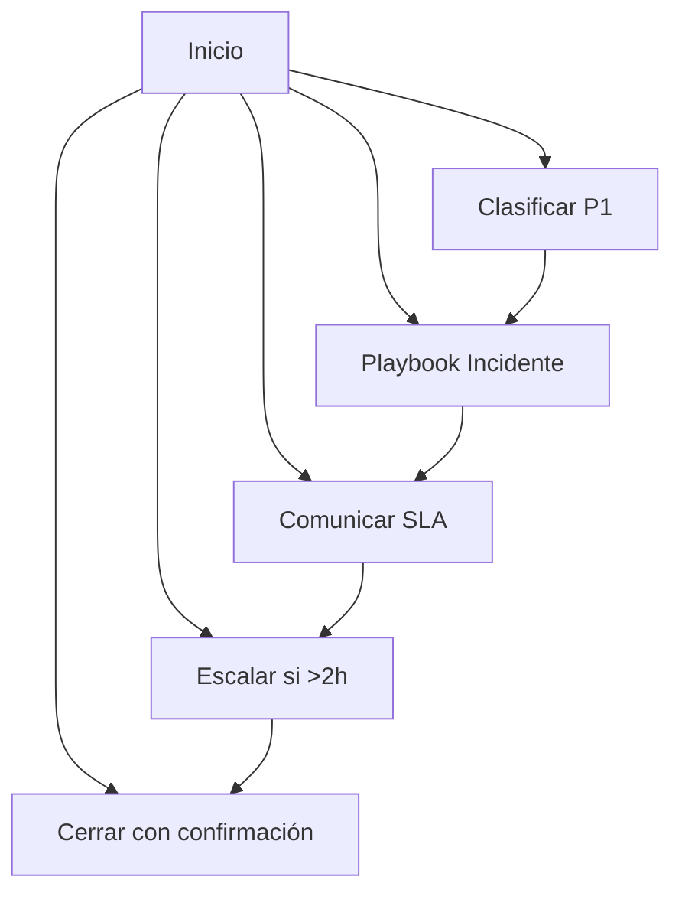
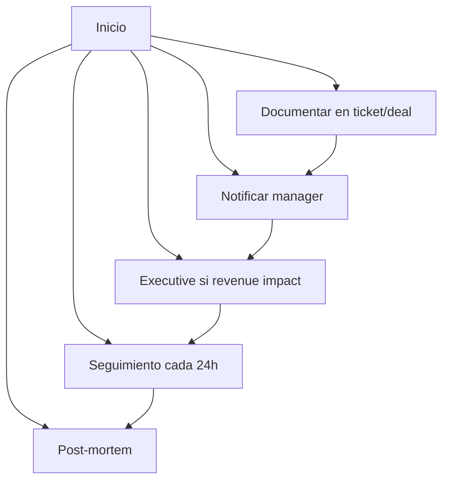
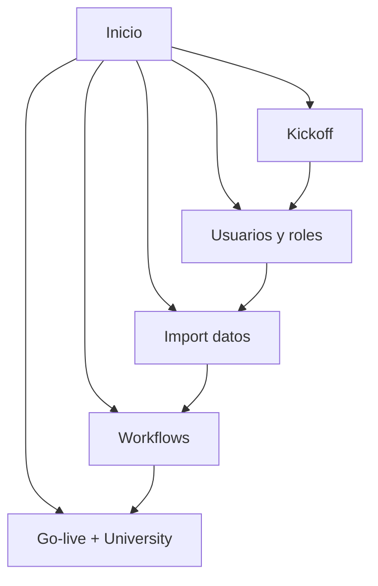
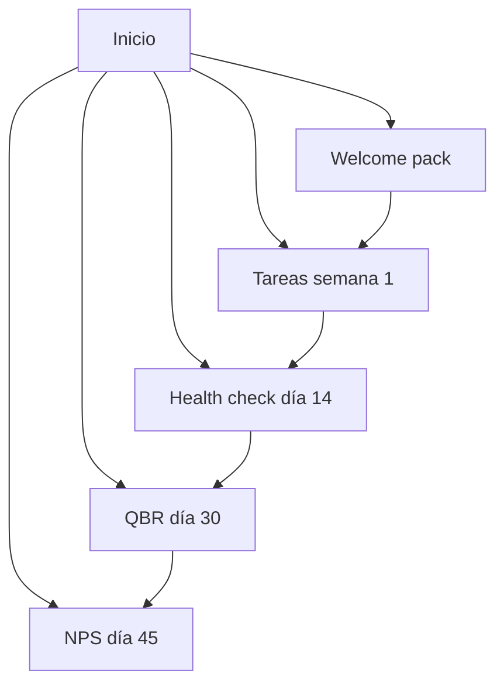

# PLAYBOOK LIBRARY

> Procedimientos paso a paso — ejecutar en orden

## Cliente Nuevo

1. Lead calificado o referido
2. Crear/verificar Customer
3. Customer 360 completo
4. Deal onboarding si aplica
5. Handoff a CS con nota
6. Tareas día 1-7

---

## Deal Estancado

1. Detectar en Command/Revenue
2. Abrir deal y 360
3. Identificar bloqueo
4. Llamada reactivación
5. Actualizar etapa o Lost
6. Lección en nota

---

## Renovación

1. Alerta 90 días
2. QBR con métricas valor
3. Playbook Renovación
4. Propuesta
5. Cierre o plan recuperación

---

## Cliente en Riesgo

1. Señal en CS OS
2. 360 + health
3. Playbook Recuperación
4. War room si VIP
5. Plan 30 días

---

## Ticket Crítico

1. Clasificar P1
2. Playbook Incidente
3. Comunicar SLA
4. Escalar si >2h
5. Cerrar con confirmación

---

## Escalación

1. Documentar en ticket/deal
2. Notificar manager
3. Executive si revenue impact
4. Seguimiento cada 24h
5. Post-mortem

---

## Implementación

1. Kickoff
2. Usuarios y roles
3. Import datos
4. Workflows
5. Go-live + University

---

## Onboarding Cliente

1. Welcome pack
2. Tareas semana 1
3. Health check día 14
4. QBR día 30
5. NPS día 45

---

