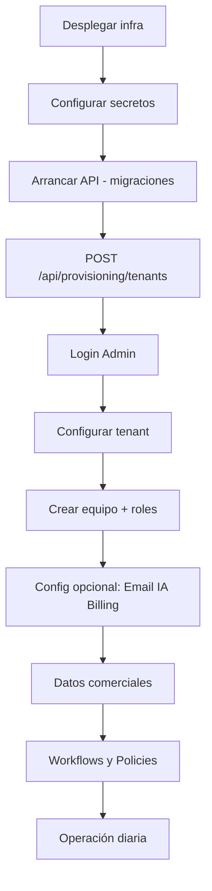

# FIRST CUSTOMER BOOTSTRAP GUIDE

**Cliente ejemplo:** TechSolutions Panamá  
**Fecha:** 2026-05-28  
**Prerrequisito:** BD vacía, `Seed:Enabled=false`, infra desplegada

> **Nota importante:** No existe rol **SuperAdmin** en el código. El máximo privilegio es **Admin**. En este guide, "SuperAdmin" del escenario de negocio se implementa como **Admin de plataforma** (primera cuenta provisionada) o como operador con `Provisioning:ApiKey`.

---

## Vista general del flujo



---

## Fase 0 — Infraestructura (antes del primer tenant)

### Paso 0.1 — Servicios

| Servicio | Acción |
|----------|--------|
| PostgreSQL 16 | Crear BD `autonomuscrm` |
| Redis 7 | Disponible en Production |
| RabbitMQ 3 | Usuario/contraseña configurados |
| API | Build `Dockerfile.api` o `dotnet publish` |
| Workers | Opcional día 1; recomendado si se prometen agentes |

### Paso 0.2 — Secretos obligatorios

```env
ConnectionStrings__DefaultConnection=Host=postgres;Port=5432;Database=autonomuscrm;Username=postgres;Password=***
ConnectionStrings__Redis=redis:6379
Jwt__Key=<minimo-32-caracteres-aleatorios>
IntegrationEncryption__Key=<base64-32-bytes>
RabbitMQ__HostName=rabbitmq
RabbitMQ__UserName=autonomus
RabbitMQ__Password=***
Provisioning__ApiKey=<secret-bootstrap-solo-ops>
Seed__Enabled=false
Database__AutoMigrate=true
EventBus__Provider=RabbitMQ
ASPNETCORE_ENVIRONMENT=Production
```

### Paso 0.3 — Verificar arranque

```bash
curl http://<host>/health
curl http://<host>/health/ready
```

Esperado: `200` con PostgreSQL, Redis, RabbitMQ healthy.

---

## Fase 1 — Crear Tenant + Admin (bootstrap)

### Paso 1 — Crear Tenant TechSolutions Panamá

**Endpoint:** `POST /api/provisioning/tenants`  
**Auth:** Header `X-Platform-Key: <Provisioning:ApiKey>`

```http
POST /api/provisioning/tenants HTTP/1.1
Host: <api-host>
Content-Type: application/json
X-Platform-Key: <secret>

{
  "name": "TechSolutions Panamá",
  "description": "Primer cliente producción — CRM comercial",
  "adminEmail": "admin@techsolutions.pa",
  "adminPassword": "<password-seguro-12+-chars>"
}
```

**Respuesta esperada:** `201 Created`

```json
{
  "tenantId": "<guid>",
  "name": "TechSolutions Panamá"
}
```

**Crea automáticamente:**
- Tenant activo
- Usuario Admin con rol `Admin`
- Trial 14 días (`SaaS:DefaultTrialDays`)

**NO usar:** `POST /api/tenants` — no crea usuario.

---

## Fase 2 — Primer login

### Paso 2 — Login Admin

1. Navegar a `/Account/Login`
2. Email: `admin@techsolutions.pa`
3. Password: el definido en provisioning
4. En Production: sin selector de tenant, sin panel demo

**Redirect esperado:** `/executive` (`RoleHomeRedirect.cs`)

### Paso 3 — Verificar sesión

- Navbar muestra usuario autenticado
- Acceso a `/Users`, `/Settings`, `/billing`, `/Policies`, `/Workflows`

---

## Fase 3 — Configuración del tenant

### Paso 4 — Datos del tenant

| Ruta | Acción | Persistencia |
|------|--------|--------------|
| `/Settings` | Nombre empresa, región, timezone | ⚠️ System settings no persisten en DB |
| Tenant update (si disponible en UI) | Nombre, email contacto | ✅ vía `UpdateTenantCommand` |

**Gap conocido:** `UpdateSystemSettingsCommandHandler` solo loguea — no guarda en BD.

### Paso 5 — Configurar Email (opcional día 1)

| Opción | Config |
|--------|--------|
| Simulación (dev/staging) | `Communications:AllowSimulation=true`, `EmailProvider=Log` |
| Producción real | `SendGridApiKey` o SMTP + `AllowSimulation=false` |

Sin email real: comunicaciones workflow `Communicate` igualmente solo loguean.

### Paso 6 — Configurar IA (opcional)

| Opción | Config |
|--------|--------|
| Desactivada | `AI:Enabled=false` — CRM manual completo |
| OpenAI | `AI:OpenAI:ApiKey`, modelo en config |
| Azure | `AI:AzureOpenAI:Endpoint`, `ApiKey`, deployment |

Sin IA: Trust Studio y Command Center funcionan con empty/degraded state.

### Paso 7 — Configurar Facturación (opcional)

1. Ir a `/billing`
2. Verificar plan `free` auto-creado (`StripeBillingService.GetOrCreateAccountAsync`)
3. Para cobro real: configurar `Stripe:SecretKey` + webhook
4. Mantener `SaaS:EnforceSubscription=false` hasta Stripe validado

### Paso 8 — Configurar Integraciones (opcional)

| Integración | Requisito |
|-------------|-----------|
| HubSpot / Salesforce | OAuth ClientId/Secret + `IntegrationEncryption:Key` |
| Google / Microsoft calendar | OAuth |
| WhatsApp | Token + PhoneNumberId |

Ruta UI: `/Integrations` (o equivalente en menú).

---

## Fase 4 — Equipo TechSolutions Panamá

### Paso 9 — Crear usuarios

**Escenario objetivo (7 usuarios):**

| # | Rol negocio | Rol sistema | Email sugerido |
|---|-------------|-------------|----------------|
| 1 | SuperAdmin* | Admin | `admin@techsolutions.pa` (ya existe) |
| 2 | Admin | Admin | `ops@techsolutions.pa` |
| 3 | Manager | Manager | `manager@techsolutions.pa` |
| 4 | Sales 1 | Sales | `sales1@techsolutions.pa` |
| 5 | Sales 2 | Sales | `sales2@techsolutions.pa` |
| 6 | Support | Support | `support@techsolutions.pa` |
| 7 | Viewer | Viewer | `viewer@techsolutions.pa` |

\*SuperAdmin = Admin en código.

**Procedimiento por usuario:**

1. `/Users/Create` — Admin o Manager crea email + password
2. `/Users/Edit` → **Asignar rol** (obligatorio — Create no asigna rol)
3. Verificar redirect home por rol

**Alternativa API** (requiere JWT Admin):

```http
POST /api/users
Authorization: Bearer <token>

{
  "tenantId": "<tenant-guid>",
  "email": "sales1@techsolutions.pa",
  "password": "<password>",
  "firstName": "Ana",
  "lastName": "Rodríguez"
}
```

Luego asignar rol vía UI o comando `AssignRoleCommand`.

### Paso 10 — Activar Automatizaciones

1. `/Workflows/Create` — definir trigger (DomainEvent) + acciones
2. Acciones soportadas: `Assign`, `UpdateStatus`, `CreateTask`
3. **No disponibles:** `Communicate`, `ActivateAgent` (bloqueados en UI handler; solo log en engine)
4. Activar workflow
5. Desplegar Workers si se esperan agentes background

### Paso 11 — Policies ABAC (recomendado antes de autonomía)

1. `/Policies/Create` o Import
2. Sin policies → `PolicyEngine` permite todo (permissivo)
3. Definir reglas antes de `Autonomous:Enabled=true`

---

## Fase 5 — Operación comercial

### Paso 12 — Primer lead

1. Login como Sales (`sales1@techsolutions.pa`)
2. Redirect → `/revenue`
3. `/Leads/Create` — crear lead
4. Verificar en lista `/Leads`

### Paso 13 — Lead → Cliente

1. Calificar lead (`Qualified`)
2. Convertir a customer (flujo UI o comando convert)
3. Verificar en `/Customers`

### Paso 14 — Cliente → Oportunidad → Venta

1. `/Deals/Create` vinculado al customer
2. Avanzar stages hasta `Closed Won`
3. Verificar Revenue OS y Executive metrics (población gradual)

### Paso 15 — Trust Studio

1. Generar actividad que produzca `AiDecisionAudits` (requiere IA/agents)
2. Decisiones con score ≥ 70 → cola HITL en `/TrustInbox`
3. Admin/Manager aprueba o rechaza

### Paso 16 — Operación diaria

| Rol | Home | Actividades |
|-----|------|-------------|
| Admin | `/executive` | Config, usuarios, trust, billing |
| Manager | `/executive` | Pipeline, equipo, workflows |
| Sales | `/revenue` | Leads, deals, clientes |
| Support | `/Customer360` | Tickets, clientes (lectura) |
| Viewer | `/` | Dashboards lectura |

---

## Checklist de bootstrap completado

- [ ] Provisioning API ejecutado
- [ ] Admin login OK → `/executive`
- [ ] 7 usuarios creados con roles asignados
- [ ] Al menos 1 lead, 1 customer, 1 deal creados manualmente
- [ ] Workflows definidos (si se usan automatizaciones)
- [ ] Policies definidas (si se usa ABAC restrictivo)
- [ ] Decisión documentada: IA on/off
- [ ] Decisión documentada: Email real vs simulación
- [ ] Workers running (si autonomía prometida)
- [ ] `Provisioning:ApiKey` rotado o restringido por firewall post-bootstrap

---

## Errores comunes

| Error | Causa | Solución |
|-------|-------|----------|
| 401 provisioning | API key incorrecta o ausente | Verificar `X-Platform-Key` |
| Login falla post-provision | Email typo / tenant mismatch multi-tenant | Verificar email; en multi-tenant revisar lógica primer tenant |
| Usuario sin permisos | Creado sin rol | Asignar rol en `/Users/Edit` |
| AccessDenied en Leads | Rol Support/Viewer | Esperado — solo lectura |
| IA no responde | Sin API key | Configurar o desactivar `AI:Enabled` |
| Workflows no disparan | Sin trigger match o workflow inactive | Revisar triggers DomainEvent |
| Executive vacío | Sin datos comerciales | Normal día 1 — crear pipeline |

---

## Referencias de código

| Paso | Archivo |
|------|---------|
| Provisioning | `Controllers/ProvisioningController.cs` |
| Tenant + Admin | `Tenancy/TenantProvisioningService.cs` |
| Login redirect | `Infrastructure/RoleHomeRedirect.cs` |
| User create (sin rol) | `Users/Commands/CreateUserCommandHandler.cs` |
| Role assign | `Pages/Users/Edit.cshtml.cs` OnPostAssignRoleAsync |
| Commercial write guard | `Middleware/CommercialWriteAuthorizationMiddleware.cs` |
