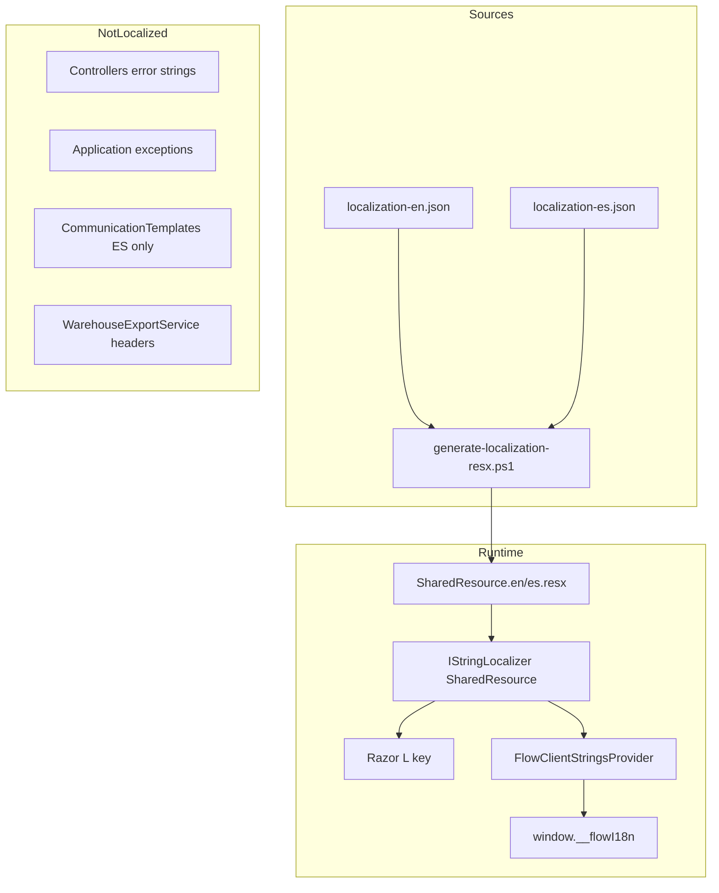

# LOCALIZATION ARCHITECTURE — AutonomusCRM

**Audit date:** 2026-05-28  
**Method:** Code inspection (no assumptions)

---

## 1. Primary mechanism

AutonomusCRM uses **ASP.NET Core localization** with a single marker type:

| Component | Location | Role |
|-----------|----------|------|
| Marker class | `AutonomusCRM.API/Resources/SharedResource.cs` | `IStringLocalizer<SharedResource>` anchor |
| Source of truth | `AutonomusCRM.API/Resources/localization-en.json` | English strings (~1,069 keys) |
| Source of truth | `AutonomusCRM.API/Resources/localization-es.json` | Spanish strings (~1,069 keys) |
| Generated output | `SharedResource.en.resx`, `SharedResource.es.resx` | Built via `scripts/generate-localization-resx.ps1` |
| Validation | `ValidationMessages.{en,es}.resx` | DataAnnotations (4 keys each) |
| Registration | `AutonomusCRM.API/Extensions/LocalizationExtensions.cs` | `AddAppLocalization`, `AddAppViewLocalization` |

---

## 2. Supported cultures

```csharp
public static readonly string[] SupportedCultures = ["es", "en"];
public const string DefaultCulture = "es";
```

| Culture | Status |
|---------|--------|
| `es` | Supported (default) |
| `en` | Supported |
| `es-PA` | **Not registered** — no resource file, no fallback chain |

Culture resolution order:
1. Cookie (`CookieRequestCultureProvider`)
2. `Accept-Language` header

UI switcher: `Pages/Shared/_LanguageSelector.cshtml` — links to `CultureController` with `es` or `en`.

---

## 3. Consumption patterns (current state)

### 3.1 Razor Pages (primary UI)

- Global injection: `Pages/_ViewImports.cshtml` → `@inject IStringLocalizer<SharedResource> L`
- Usage: `@L["Key"]` in `.cshtml` files
- PageModels: many inject `_localizer` for `TempData` / flash messages

**Coverage:** 71 of 94 `.cshtml` files use `L[` at least once (75.5%). Several files mix `L[]` with hardcoded literals.

### 3.2 Client-side JavaScript

- `Pages/Shared/_FlowI18nScript.cshtml` injects `window.__flowI18n`
- Provider: `FlowClientStringsProvider` in `LocalizationExtensions.cs` (~25 keys + route palette)
- Consumers: `wwwroot/js/flow-shell.js`, `site.js` via `flowI18n(key, fallback)`
- **Gap:** JS fallbacks are Spanish-only when `__flowI18n` is missing

### 3.3 API Controllers

- **35 controllers** under `AutonomusCRM.API/Controllers/`
- **None** inject `IStringLocalizer`
- Errors returned as `{ error: "hardcoded string" }` or `ex.Message` from Application layer

### 3.4 Application / Domain layer

- Command handlers throw `InvalidOperationException("Spanish text")` — not culture-aware
- Domain validation: mixed Spanish (`Deal.cs`, `Customer.cs`) and English (`CustomerContract.cs`, `IntelligenceEntities.cs`)
- No FluentValidation custom messages found
- No `[Display]` attributes in Application layer

### 3.5 Emails and notifications

- `AutonomusCRM.Infrastructure/CustomerSuccess/CommunicationTemplates.cs` — **Spanish-only** static templates (6 email + 5 WhatsApp)
- `EmailAutomationEngine.cs` — Spanish fallback subject/body
- No culture parameter in template selection

### 3.6 Exports

- **No PDF engine** found in codebase
- CSV: `WarehouseExportService.cs` — English column headers (`id,name,email,status,lifetime_value,created_at`)

---

## 4. Architecture diagram



---

## 5. Standardization recommendation (FASE 3)

**Target:** single strategy end-to-end.

| Layer | Standard |
|-------|----------|
| UI (Razor) | `IStringLocalizer<SharedResource>` only — zero literals in markup |
| PageModels | `_localizer["Flash_*"]` — no string literals in TempData/ModelState |
| JS | All strings via `__flowI18n` — remove Spanish fallbacks or mirror en/es |
| API | Inject `IStringLocalizer<SharedResource>` + `Accept-Language` / culture cookie |
| Application | `IErrorMessageLocalizer` or error codes mapped in API layer |
| Email | Template keys per culture (`welcome.en`, `welcome.es`) or resource-driven |
| Exports | Localized headers via `IStringLocalizer` at export time |
| Cultures | Add `es-PA` as optional: `SupportedCultures = ["es-PA", "es", "en"]` with fallback `es` → `es-PA` |

**Do not mix:** inline JSON strings, hardcoded exceptions to users, and `.resx` for the same concept.

---

## 6. Build pipeline

```powershell
# After editing JSON:
.\scripts\generate-localization-resx.ps1
dotnet build AutonomusCRM.API
```

Validation messages are partially hand-maintained in `ValidationMessages.*.resx` (not generated from JSON).

---

## 7. Files reference

| Path | Purpose |
|------|---------|
| `AutonomusCRM.API/Extensions/LocalizationExtensions.cs` | Culture config + client strings |
| `AutonomusCRM.API/Controllers/CultureController.cs` | Language switch |
| `AutonomusCRM.API/Resources/Views/ModuleViewResources.cs` | View-specific helpers (legacy/auxiliary) |
| `AutonomusCRM.API/Resources/Controllers/ControllerResources.cs` | Controller resource stub (underused) |
| `scripts/audit-localization.ps1` | Metrics script for audits |
| `scripts/generate-localization-resx.ps1` | JSON → RESX generator |
