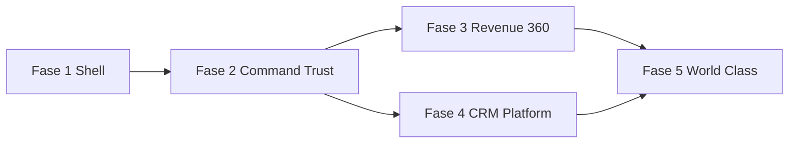

# UI REBUILD MASTERPLAN — AutonomusFlow

**Versión:** 1.3 · **Estado:** Fase 1 ✅ · Fase 2 ✅ · Fase 3 ✅ (código en repo)  
**Baseline UI/UX:** 52 / 58 · **Post Fase 3:** UI ~88 · UX ~90  
**Target UI/UX:** 90+ / 90+  
**Backend baseline:** ~90/100 (AUTONOMUSFLOW_MASTER_CONTEXT.md v0.9)  
**Restricción:** Cada fase debe **eliminar** anti-patrones auditados antes de añadir features.

---

## Resumen de fases

| Fase | Nombre | Semanas | UI Δ | UX Δ | ROI |
|------|--------|---------|------|------|-----|
| **1** | Truth & Shell | 3–4 | +18 | +12 | Máximo |
| **2** | Command & Trust | 4–5 | +22 | +20 | Máximo |
| **3** | Revenue & 360 | 4–5 | +15 | +14 | Alto |
| **4** | CRM Polish & Platform | 3–4 | +10 | +10 | Medio |
| **5** | World Class & ABOS | 4–6 | +8 | +8 | Largo plazo |

**Total estimado:** 18–24 semanas · 2 diseñadores + 2 frontend + 1 design systems engineer (parcial backend para wiring datos).

---

## FASE 1 — Truth & Shell

### Objetivo

Eliminar todo lo que destruye confianza CEO en 30 segundos. Establecer **un solo shell** Flow.

### Entregables

| # | Entregable | Detalle |
|---|------------|---------|
| 1.1 | `flow-tokens.css` + Inter/JetBrains | WORLD_CLASS_DESIGN_SYSTEM tokens |
| 1.2 | `FlowShell` layout partial | Reemplaza AdminLTE wrapper |
| 1.3 | Sidebar + nav nueva IA | Ver ABOS_EXPERIENCE_VISION §2 |
| 1.4 | `FlowPageHeader` único | Elimina content-header, topbar |
| 1.5 | Login enterprise | SSO-first; demo solo Development; sin Tenant ID prod |
| 1.6 | Eliminar `/Dashboard` mock | Redirect 301 → `/` |
| 1.7 | Marca AutonomusFlow | Layout, title, footer valor negocio |
| 1.8 | Eliminar AdminLTE CDN | Solo flow.css + utilities mínimas |
| 1.9 | Command palette ⌘K v1 | Búsqueda rutas + entidades básicas |
| 1.10 | Focus-visible + skip link | A11y baseline |

### Esfuerzo

| Rol | Persona-semanas |
|-----|-----------------|
| Design | 2.5 |
| Frontend | 4 |
| QA | 0.5 |

**Total:** ~7 persona-semanas

### Impacto

| Dimensión | Impacto |
|-----------|---------|
| Percepción precio | $49–$199 → **$299–$799** credible |
| Confianza | Elimina #1–#8 top problemas auditoría |
| Consistencia | 42 → **75** |

### ROI

**Muy alto** — menor costo, mayor lift en percepción. Sin esto, fases 2–5 fallan.

### Riesgo

| Riesgo | Prob. | Mitigación |
|--------|-------|------------|
| Regresión funcional nav | Media | Checklist rutas; tests smoke Playwright |
| Resistencia interna «se ve diferente» | Baja | Documentar CEO_FIRST_30_SECONDS |
| Tiempo subestimado migrate 60 cshtml | Media | Fase 1 solo shell + 5 páginas piloto |

### Páginas piloto fase 1

Login, Layout, Index (shell only), Trust (header only), Settings (header only).

### Criterio de done

- [x] Cero AdminLTE en layout (CDN eliminado; Bootstrap 4.6 mínimo para cards legacy)
- [x] Cero mock data en prod build (`/Dashboard` → `/`)
- [x] Un header pattern en piloto (`Flow/_FlowPageHeader`)
- [ ] CEO test 5 usuarios: reconocen «no es CRM template» (pendiente validación humana)

---

## FASE 2 — Command & Trust

### Objetivo

**Home = Flow Command.** Trust Studio. Workforce con datos reales. Esto es el 60% del lift a $5k perception.

### Entregables

| # | Entregable |
|---|------------|
| 2.1 | Flow Command home (fusiona Index + AiCommandCenter) |
| 2.2 | Hero revenue impact + pending CTA |
| 2.3 | Workforce panel (datos `AiDecisionAudits`, agent names) |
| 2.4 | Live decision feed component |
| 2.5 | Trust Studio 3-column layout |
| 2.6 | Trust: simulate / approve / reject / rollback UX |
| 2.7 | SLA queue sort (`ITrustSlaService`) |
| 2.8 | Policy threshold side panel |
| 2.9 | Outcome fabric incomplete widget |
| 2.10 | Charts: sparklines (Chart.js o lightweight) |

### Esfuerzo

| Rol | Persona-semanas |
|-----|-----------------|
| Design | 4 |
| Frontend | 6 |
| Backend wiring | 1 |
| QA | 1 |

**Total:** ~12 persona-semanas

### Impacto

| Dimensión | Impacto |
|-----------|---------|
| UI | +22 (small-box eliminados, charts) |
| UX | +20 (narrativa ABOS clara) |
| Percepción | **$799–$2,500** tier credible |

### ROI

**Máximo** — diferenciador categoría vs Salesforce/HubSpot CRM UI.

### Riesgo

| Riesgo | Mitigación |
|--------|------------|
| Datos vacíos en demo tenant | Empty states premium + seed script |
| Performance feed | Paginación 20; virtual scroll fase 5 |
| Trust 3-col mobile | Bottom sheet pattern |

### Criterio de done

- [x] Post-login landing = Command
- [x] Agents page sin números hardcodeados
- [x] Trust Studio 3-column + SLA sort
- [x] Revenue IA hero con datos API real (o empty state)

### Iteración UI v2 — Command & Trust (implementado)

| Entregable | Archivo / ruta |
|------------|----------------|
| Flow Command home | `Pages/Index.cshtml` |
| Trust Studio | `Pages/TrustInbox.cshtml` |
| Workforce | `Pages/Agents.cshtml` |
| Decisiones | `/command/decisions` |
| Outcomes | `/command/outcomes` |
| Playbooks | `/command/playbooks` |
| CSS Fase 2 | `wwwroot/css/flow-command.css` |
| Servicio datos | `AiCommandCenterService.GetFlowCommandAsync` |

**Build:** 0 errores · **Tests:** 45/45 unit

---

## FASE 3 — Revenue & Customer 360

### Iteración UI v3 — implementado (2026-05-28)

| Entregable | Ruta / servicio |
|------------|-----------------|
| Revenue OS | `/revenue` · `IRevenueOsService` |
| Executive | `/executive` · `IExecutiveAiDashboardService` |
| Billing | `/billing` · `IBillingDashboardService` |
| C360 Enterprise | `/customers/{id}/360` · `ICustomer360EnterpriseService` |
| CRM headers Flow | Leads, Deals, Customers |
| E2E smoke | `FlowPhase3UiE2ETests` (skip sin PG) |

**Criterio done Fase 3:**

- [x] Revenue OS con datos reales / empty
- [x] Forecast 30–365d vía `IPredictiveRevenueEngine`
- [x] Win/Loss desde `IWinLossAnalyticsService`
- [x] C360 timeline + journey + comms/voice reales
- [x] Billing plan/uso/límites
- [x] Leads/Customers Flow metrics + tablas
- [x] Customers: datos fake sidebar eliminados
- [x] E2E smoke HTTP (skip sin PG)
- [ ] Playwright browser E2E (Fase 4 + CI PG)
- [ ] Deals kanban Flow completo (Fase 4)

---

### Objetivo

Módulos que hoy **no existen** o son MVP texto — visualización enterprise de datos ya en backend.

### Entregables

| # | Entregable |
|---|------------|
| 3.1 | Revenue OS `/revenue` overview + charts |
| 3.2 | Win/loss + Outcome attribution view |
| 3.3 | Customer 360 detail page (timeline, tabs) |
| 3.4 | CDP stream timeline UI |
| 3.5 | Identity merge UX |
| 3.6 | Customer Success `/success` overview |
| 3.7 | Health rings + churn distribution |

### Esfuerzo

| Rol | Persona-semanas |
|-----|-----------------|
| Design | 3.5 |
| Frontend | 5 |
| Backend | 1.5 |
| QA | 1 |

**Total:** ~11 persona-semanas

### Impacto

| Dimensión | Impacto |
|-----------|---------|
| UI | +15 |
| UX | +14 |
| vs Attio | Paridad visual relacional |
| Percepción | **$2,500–$5,000** con Billing |

### ROI

**Alto** — cierra gap «solo CRM» (auditoría Revenue 45, 360 45).

### Riesgo

| Riesgo | Mitigación |
|--------|------------|
| ML churn no disponible (<25 samples) | Empty state educativo |
| Scope creep grafo | MVP timeline primero, grafo fase 5 |

---

## FASE 4 — CRM Polish & Platform

### Objetivo

CRM sigue siendo necesario pero **no lidera**. Integrations, Voice, Billing, Admin al estándar Flow.

### Entregables

| # | Entregable |
|---|------------|
| 4.1 | Leads/Deals/Customers → FlowDataTable + drawers |
| 4.2 | Pipeline kanban unificado |
| 4.3 | Integrations Hub redesign |
| 4.4 | Voice entity pickers + call drawer |
| 4.5 | **Billing page** Stripe-like |
| 4.6 | Settings sections reales |
| 4.7 | Audit/Users/Policies polish |
| 4.8 | Comms status en Settings (no solo banner) |

### Esfuerzo

| Rol | Persona-semanas |
|-----|-----------------|
| Design | 3 |
| Frontend | 5 |
| Backend (Stripe UI) | 1 |
| QA | 1 |

**Total:** ~10 persona-semanas

### Impacto

| Dimensión | Impacto |
|-----------|---------|
| UI | +10 |
| UX | +10 |
| Billing ausente (18 UI) → **85** |

### ROI

**Medio-alto** — Billing es requisito $5k (CEO_FIRST_30_SECONDS).

### Riesgo

| Riesgo | Mitigación |
|--------|------------|
| 60 páginas Razor | Priorizar 80/20 tráfico |
| Stripe keys ausentes | UI con estados disconnected |

---

## FASE 5 — World Class & ABOS

### Objetivo

Pulir a 90+ UI/UX: dark mode, motion, command palette v2, mobile Trust, marketing site parity.

### Entregables

| # | Entregable |
|---|------------|
| 5.1 | Dark mode completo |
| 5.2 | Motion system implementado |
| 5.3 | ⌘K v2: acciones + entidades + «approve trust» |
| 5.4 | Mobile Trust approve flow |
| 5.5 | Customer 360 relationship graph |
| 5.6 | Illustration system empty states |
| 5.7 | Visual regression CI (Percy/Chromatic) |
| 5.8 | i18n EN/ES |
| 5.9 | Design system docs site (Storybook) |
| 5.10 | ABOS category launch assets |

### Esfuerzo

| Rol | Persona-semanas |
|-----|-----------------|
| Design | 4 |
| Frontend | 6 |
| QA/A11y | 2 |

**Total:** ~12 persona-semanas

### Impacto

| Dimensión | Impacto |
|-----------|---------|
| UI/UX | +8 cada uno → **90–92** |
| vs Linear/Stripe | Paridad en polish |
| Percepción | **$5,000+** sostenido |

### ROI

**Largo plazo** — marca mundial; no bloquea MVP enterprise venta.

### Riesgo

| Riesgo | Mitigación |
|--------|------------|
| Dark mode duplica QA | Token dual desde fase 1 |
| Scope infinito | Freeze features post fase 4 |

---

## Dependencias entre fases

**Paralelizable:** Fase 3 y Fase 4 tras Fase 2 (equipos distintos).

---

## Alineación con EXECUTION_PLAN backend v0.9

| Backend v0.10 | UI fase |
|---------------|---------|
| SendGrid/OAuth prod | Fase 4 Integrations + Comms settings |
| SAML ACS | Fase 1 Login |
| HubSpot E2E | Fase 4 Integrations cards live |
| VPS 7d | No UI — pero Trust/Command deben mostrar uptime en Support |

**Regla:** No esperar backend perfecto para Fase 1–2; sí para Billing live.

---

## Métricas de seguimiento

| Semana | Métrica | Target |
|--------|---------|--------|
| 4 | UI audit score | 65 |
| 8 | UI audit score | 78 |
| 12 | UX audit score | 82 |
| 18 | UI/UX audit | 88 |
| 24 | UI/UX audit | 90+ |
| Continuo | Mock data screens | 0 |
| Continuo | CEO 30s test pass rate | 80% |

---

## Inversión estimada (orden de magnitud)

| Concepto | Rango USD |
|----------|-----------|
| Diseño (Figma + research) | $80k–$120k |
| Frontend implementation | $150k–$220k |
| QA + A11y | $30k–$50k |
| **Total** | **$260k–$390k** |

**ROI comercial:** Si ACV sube de $199 → $2,500 por percepción, **2 clientes enterprise** pagan el rebuild.

---

## Decisiones que requieren aprobación fundador

1. **Command como home** — implica reentrenar usuarios CRM-first.
2. **Deprecar AdminLTE** — no hay vuelta atrás ligera.
3. **Eliminar mock pages** — aunque «se veían bien en demo».
4. **Billing visible** — expone monetización antes de pricing final.
5. **Marca AutonomusFlow only** — drop «CRM» del product name UI.

---

*Fases 1–2 implementadas en API Razor. Fases 3–5 pendientes.*
