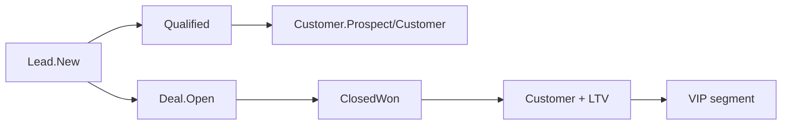

# 02 — Flujos de Negocio (código real)

## Journey implementado: Desconocido → Lead → Cliente → Deal → Cliente recurrente

**Nota:** No existe entidad "Prospecto" separada. El prospecto es un **Lead** con `LeadStatus.New`. La **oportunidad** es un **Deal**. El **cliente** es **Customer**.

---

## 1. Creación de Lead

**Trigger:** UI `/Leads/Create`, API `POST /api/leads`, import CSV/JSON  
**Handler:** `CreateLeadCommandHandler`  
**Estado inicial:** `LeadStatus.New`  
**Evento:** `LeadCreatedEvent`

**Automatizaciones disparadas:**
- WorkflowEngine (si workflow activo con trigger `Lead.Created`)
- RevenueAutomation → SLA 24h (`CommercialSlaEngine`)
- Worker: `LeadIntelligenceAgent` → score → `LeadScoreUpdatedEvent`
- Worker: `CommunicationAgent` → email seguimiento (si configurado)

---

## 2. Calificación de Lead

**UI:** `/Leads/Details` → Qualify  
**Command:** `QualifyLeadCommand` → `lead.Qualify()`  
**Estado:** `LeadStatus.Qualified`

**OperationalAutomationService (automático):**
1. Crea Customer si no existe (por email)
2. Crea Deal borrador (`Amount=1`, metadata `IsDraft=true`)
3. Crea WorkflowTask de seguimiento alta prioridad

**Importante:** El lead **no** pasa a `Converted` en este path.

---

## 3. Conversión manual Lead → Customer

**Solo UI:** `Leads/Details` → Convert to Customer (no hay command dedicado)

1. `CreateCustomerCommand` → Customer `Prospect`
2. `lead.ConvertToCustomer(customerId)` → Lead `Converted`
3. `CustomerCreatedEvent` → RetentionAutomation → Customer `Customer`

---

## 4. Crear Deal desde Lead

**UI:** `Leads/Details` → Create Deal

1. Busca Customer por email o crea uno
2. `CreateDealCommand` → Deal `Open` / `Prospecting`
3. Lead status **sin cambio**

---

## 5. Pipeline Deal

| Etapa | Probabilidad default |
|-------|---------------------|
| Prospecting | 10% |
| Qualification | 25% |
| Proposal | 50% |
| Negotiation | 75% |
| ClosedWon | 100% |
| ClosedLost | 0% |

**Cierre ganado:** `CloseDealCommand` → `DealClosedEvent`  
**Cierre perdido:** `LoseDealCommand` → `DealLostEvent`

**Post CloseWon:**
- Retention: Customer status, LTV, purchase metadata
- Operational: tareas onboarding D0, D7, D30
- OutcomeAttribution + ABOS learning

---

## 6. Customer lifecycle

| Estado | Cómo se alcanza |
|--------|-----------------|
| Prospect | `Customer.Create` |
| Customer | `CustomerCreatedEvent` o `DealClosedEvent` (retention) |
| VIP | `CustomerSegmentationEngine` |
| Inactive | `IdentityMergeService` (duplicados) |
| Churned | Enum existe; usado en analytics, sin transición automática única documentada |

---

## 7. Tareas (WorkflowTask)

**Estados:** `"Open"` → `"Completed"` (string, no enum)

**Origen:**
- WorkflowEngine action `CreateTask`
- OperationalAutomation / Revenue / Retention engines
- UI `/Tasks` para completar y asignar

---

## 8. Workflows configurables

Modelo: Triggers (DomainEvent) + Conditions + Actions (Assign, UpdateStatus, CreateTask, Communicate*, ActivateAgent*)

\*Communicate y ActivateAgent **solo registran log** en código actual — no envían mensajes ni activan agentes LLM.

---

## 9. Tres caminos paralelos (inconsistencia operativa)

| Path | Lead final | Customer | Deal |
|------|------------|----------|------|
| Qualify | Qualified | Auto-creado | Borrador auto |
| Convert | Converted | Creado | — |
| Create Deal | Sin cambio | Match/create | Creado |

**Buena práctica Sales:** Elegir **un** proceso estándar por equipo y documentarlo internamente.
